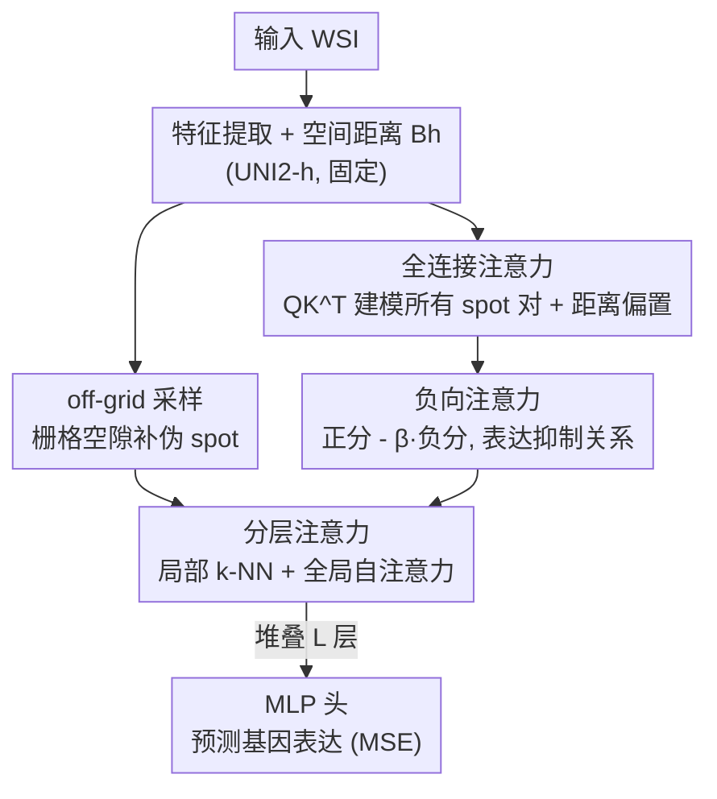

# FEAST: Fully Connected Expressive Attention for Spatial Transcriptomics

**会议**: CVPR 2026  
**论文**: [CVF Open Access](https://openaccess.thecvf.com/content/CVPR2026/html/Jeong_FEAST_Fully_Connected_Expressive_Attention_for_Spatial_Transcriptomics_CVPR_2026_paper.html)  
**代码**: https://github.com/starforTJ/FEAST  
**领域**: 计算生物 / 医学图像  
**关键词**: 空间转录组学, 基因表达预测, 注意力机制, 全连接图, 负向注意力

## 一句话总结
FEAST 把"从 H&E 病理大图预测空间基因表达"这件事从依赖预定义稀疏图的 GNN 范式，改造成一个全连接注意力框架——用自注意力天然建模所有 spot 两两交互，再补上能表达"抑制关系"的负向注意力和补全栅格空隙信息的 off-grid 采样，在三个公开 ST 数据集上 9 个指标里拿下 7 个 SOTA。

## 研究背景与动机
**领域现状**：空间转录组学（Spatial Transcriptomics, ST）能在保留组织空间结构的同时量化 mRNA 表达，但采集成本极高，难以普及。于是主流做法是从廉价易得的 H&E 染色全切片图像（WSI）反推基因表达：把组织切成一个个 spot（位置 + 表达量），用每个 spot 的图像 patch 去预测它对应的基因表达谱。由于组织微环境来自复杂的 spot 间相互作用，主流方法（Hist2ST、MERGE 等）普遍用 GNN，把 spot 当节点、按"空间邻近"或"形态相似"预先连边。

**现有痛点**：这类方法的根都扎在一张**预定义的稀疏图**上。稀疏图只连有限几个邻居，绝大多数 spot 对天然不相连，那么这些 spot 之间任何潜在的生物交互在设计上就被直接忽略了。问题是——你事先根本不知道哪两个 spot 会相互作用，强行用"邻近 / 相似"两条先验去剪枝，本质上是结构性地放弃了对组织级全局交互的建模能力。

**核心矛盾**：组织微环境是"每个 spot 都可能影响任意另一个 spot"的全局交互，而稀疏图建模能力的上限被人为剪死在了几个邻居之内。此外还有两个被长期忽略的细节：①标准注意力/相似度只能表达"正相关或无关"，但生物系统里明确存在**抑制（负向）关系**（如肿瘤微环境里 PD-L1/PD-1 通路会压制周围细胞的免疫相关基因表达）；②固定尺寸 patch 切图会把 spot 之间的空隙和被栅格边界截断的形态结构整段丢掉。

**本文目标**：① 不再剪枝，建模全部 spot 对的交互；② 让模型能表达"抑制"这种负向关系；③ 把 patch 之间丢失的形态学上下文补回来——且这三件事都不能把计算成本撑爆。

**核心 idea**：把组织建模成**全连接图**，而这个全连接结构恰好可以由自注意力的 $QK^T$ 内积天然实现——于是用注意力替代 GNN 的稀疏图，再在注意力上动两处手术（负向注意力 + off-grid 伪 spot），用分层注意力把成本压回可接受范围。

## 方法详解

### 整体框架
FEAST 的输入是一张 WSI，输出是每个原始 spot 的目标基因表达量。流水线是：先用一个固定的特征提取器（UNI2-h）从 WSI 抽出 spot 特征，同时算出 spot 间的空间距离矩阵 $B_h$；特征随后过 $L$ 层堆叠的**分层注意力层**，每一层内部分两阶段——先对"原始 spot + 伪 spot"的局部 k 近邻做一次 FEAST Block 吸收空间上下文，再对"仅原始 spot"做一次全局自注意力 FEAST Block；最后把原始 spot 的表示送进 MLP 头预测基因表达，整个框架用 MSE 损失训练。

这里的关键是两层嵌套：①**全连接注意力**是地基（替代稀疏图）；②**FEAST Block** 是把每一次注意力都升级成能表达正负关系的负向注意力；③**off-grid 采样 + 分层注意力**则解决"补信息"和"补信息带来的 $O(N^2)$ 成本爆炸"这对矛盾。

### 关键设计

**1. 全连接注意力：用 $QK^T$ 取代预定义稀疏图，让每对 spot 都能交互**

针对"稀疏图剪掉绝大多数 spot 对"这个根本痛点，FEAST 直接放弃显式建图，转而用自注意力建模全连接图。给定 WSI 里 $N$ 个 spot，先算原始注意力分数并归一化：$\mathbf{S} = \frac{\mathbf{Q}\mathbf{K}^T}{\sqrt{d_k}}$，$\mathbf{A} = \mathrm{softmax}(\mathbf{S})$。这里 $\mathbf{A}$ 就是一张动态加权的全连接图——$QK^T$ 内积本身就是 GNN 里"形态相似度建边"准则的可学习、动态版本，但不再需要人手设阈值剪边。

但标准注意力是置换不变的，会无视 spot 的空间排布与距离，这违背了"空间越近越相关"的基本假设。FEAST 借鉴 ALiBi/TITAN，给第 $h$ 个注意力头加一个**静态、不可学习的位置偏置**，在 softmax 之前把它加到原始分数上：$\mathbf{B}_h(i,j) = m_h \cdot \sqrt{(i_x-j_x)^2+(i_y-j_y)^2}$，即两 spot 欧氏距离乘上一个头专属的固定负标量 $m_h$。$|m_h|$ 大的头会强烈惩罚远距离 spot、专攻局部交互，$m_h$ 接近 0 的头则能自由学习组织级的长程关系——这样**单个注意力块就能同时建模局部与全局**，相当于把 GNN 里"空间邻近"先验软性地、按头分工地注入了进来，而不是硬剪枝。

**2. 负向注意力：让注意力权重能取负值，显式建模"抑制"关系**

标准 softmax 把注意力权重锁在 $[0,1]$，高权重=强正相关，低权重只代表"无关"，根本没法表达"A 主动压制 B"这种生物系统里真实存在的抑制关系。FEAST 基于一个假设——一对 spot 不会同时既正又负——在每个 FEAST Block 里并行算两套分数：正向分用原始分数 $\mathbf{S}_{\text{pos},h} = \mathbf{S}_h + \mathbf{B}_h$，负向分则把特征点积**符号翻转**再加同一个位置偏置 $\mathbf{S}_{\text{neg},h} = -\mathbf{S}_h + \mathbf{B}_h$。这样原本在正向分里得低分的 spot 对，在负向分里反而得高分，正好对应"被强烈抑制"的那些关系。

两套分数各过 softmax，其中负向权重额外引入温度 $\tau_{\text{neg}}$：$\mathbf{A}_{\text{neg},h} = \mathrm{softmax}\!\left(\frac{\mathbf{S}_{\text{neg},h}}{\tau_{\text{neg}}}\right)$，论文取 $\tau_{\text{neg}}<1$（实验用 0.6）来锐化分布、只聚焦最强的负向关系。最终权重把负向部分按系数 $\beta$ 减掉：

$$\mathbf{A}_{\text{final},h} = \mathbf{A}_{\text{pos},h} - \beta \cdot \mathbf{A}_{\text{neg},h}$$

于是 $\mathbf{A}_{\text{final},h}$ 可以取负值，模型得以区分"正相关 / 无关 / 负相关"三种状态而非两种。这个改动几乎零额外计算开销（只是把同一份 $QK^T$ 取反复用一次），却既提了精度又让注意力图可解释——能在图上直接读出哪些区域是兴奋性、哪些是抑制性。

**3. off-grid 采样 + 分层注意力：补回栅格空隙丢失的形态学信息，又不让成本爆炸**

固定尺寸方形 patch 按栅格中心切图，会留下两类信息损失：相邻 spot 之间的空隙被整段忽略（有时 spot 间距甚至大于 patch 尺寸），以及一个完整形态结构被栅格边界生生截断。直接上更高分辨率（如 Visium HD）太贵，用大 patch 再缩放又会抹掉形态细节。FEAST 的做法是**从原始 spot 之间的中间位置额外采样"伪 spot"（pseudo-spot）**，专门捞回这些被遗漏、信息丰富的区域，让模型拥有更连续的上下文。

但伪 spot 会让总数 $N$ 暴涨，注意力的 $O(N^2)$ 成本变得不可承受。为此 FEAST 把每个注意力块拆成两阶段：**局部 k-NN 注意力**让原始 spot 和伪 spot 都只对各自的 $k$ 近邻做注意力，既建模空间邻近交互，又让原始 spot 高效"吸收"邻近伪 spot 的丰富上下文；**全局自注意力**随后只在已经被局部上下文充实过的原始 spot 之间做，复杂度只随原始 spot 数（远小于含伪 spot 的总数）增长。两阶段用的都是上面的负向注意力 + 位置偏置，唯一区别是参与注意力的 spot 集合不同。这样既把空隙信息补了回来，又把成本控制在原始 spot 规模上。

### 损失函数 / 训练策略
堆叠 $L$ 层分层注意力块后，原始 spot 的最终表示送入 MLP 头预测目标基因表达，整体用均方误差 $\mathcal{L}_{\text{MSE}}$ 训练。特征提取器 UNI2-h 固定不微调；超参 $k=32$、$\tau_{\text{neg}}=0.6$、$\beta=1.5$，单卡 NVIDIA RTX A6000 训练。

## 实验关键数据

### 主实验
三个公开 ST 数据集做 8 折交叉验证：两个乳腺癌数据集 ST-Net、Her2ST 和一个皮肤癌数据集 SCC，每样本平均约 450/378/723 个组织内 spot；patch 取 256×256（×20 放大），每数据集选 top 250 高表达基因，标签用 SPCS 平滑；指标为 MSE↓ / MAE↓ / PCC↑。baseline 数值直接引自 MERGE 论文。FEAST 在 9 个指标里拿下 7 个 SOTA。

| 数据集 | 指标 | FEAST | 之前最佳 | 提升 |
|--------|------|-------|----------|------|
| ST-Net | MSE↓ / PCC↑ | 0.1177 / 0.7155 | 0.1347 / 0.6795 (MERGE) | MSE -0.017，PCC +0.036 |
| Her2ST | MSE↓ / PCC↑ | 0.5761 / 0.5524 | 0.6422 / 0.5037 (MERGE) | MSE -0.066，PCC +0.049 |
| SCC | PCC↑ | 0.5811 | 0.5512 (MERGE) | +0.030（MSE/MAE 上 HisToGene 更优） |

在乳腺癌两个数据集上全指标超过所有 baseline，Her2ST 提升最显著；SCC 上 MSE/MAE 不及 HisToGene，但 PCC 仍最高，说明预测值与真值的线性相关最强。

### 消融实验
在 Her2ST 上验证两大核心组件（负向注意力、off-grid 伪 spot）的贡献：

| 负向注意力 | off-grid | MSE↓ | MAE↓ | PCC↑ |
|:---:|:---:|------|------|------|
| ✗ | ✗ | 0.5878 | 0.5875 | 0.5396 |
| ✓ | ✗ | 0.5778 | 0.5829 | 0.5464 |
| ✗ | ✓ | 0.5829 | 0.5831 | 0.5458 |
| ✓ | ✓ | **0.5761** | **0.5782** | **0.5524** |

单独加任一组件 PCC 都有小幅提升（0.5464 / 0.5458），两者同用才达到最佳 0.5524，说明二者互补、缺一不可。

| $k$（局部 k-NN 邻居数） | MSE↓ | MAE↓ | PCC↑ |
|:---:|------|------|------|
| 8 | 0.5821 | 0.5819 | 0.5453 |
| 16 | 0.5796 | 0.5784 | 0.5504 |
| **32** | **0.5761** | 0.5782 | **0.5524** |
| 64 | 0.5793 | 0.5818 | 0.5481 |
| 100 | 0.5768 | 0.5807 | 0.5484 |

$k$ 增大到 32 时各指标达峰，再大反而下降，因此取 $k=32$ 兼顾精度与计算效率。

### 关键发现
- 两个核心组件单独用收益有限，**组合使用才出现明显增益**——负向注意力和 off-grid 采样解决的是不同维度的问题（关系表达 vs 信息完整性），所以互补。
- $k$ 存在最优值（32）：太小局部上下文不足，太大引入过多无关 spot 反而干扰，是个典型的"邻域大小 trade-off"。
- 定性上，伪 spot 在"目标 spot 周围原始 spot 稀疏 / 形态结构被截断"的困难场景下提升最大（如 PCC 0.6284→0.7203、0.5131→0.6172、0.7694→0.8349），印证它专治"信息丢失"这一痛点。
- 负向注意力让注意力图能把"空间上很近但基因表达模式截然不同"的 spot（如脂肪组织）正确标成负向，而标准注意力会忽略或误判这类强负相关的互补信息。

## 亮点与洞察
- **"全连接图 = 注意力"这个观察是全文支点**：把 ST 领域"如何设计更聪明的稀疏图"这条卷了多年的主线，直接换成"根本不需要建图，注意力天生就是全连接图"，是一次范式层面的重新 framing，既优雅又一针见血。
- **负向注意力几乎零成本却一举两得**：只是把同一份 $QK^T$ 符号翻转再 softmax，复用现成计算，就同时拿到了精度提升和可解释性（正/负注意力图能对应兴奋/抑制生物关系）——这种"小改动撬动大收益"的设计很值得借鉴。
- **用位置偏置 $m_h$ 按头分工建模局部/全局**，是把 GNN 的空间先验软性注入注意力的巧办法，不靠剪枝也能保留"近者更相关"的归纳偏置。
- **off-grid 伪 spot + 分层注意力**这套"先补信息、再用两阶段注意力控成本"的组合拳，可迁移到任何"想加更密采样但怕 $O(N^2)$ 爆炸"的密集预测任务。

## 局限与展望
- 负向注意力建立在"一对 spot 不会同时既正又负"这个简化假设上⚠️——真实生物系统里同一对细胞在不同通路/不同时刻完全可能既有兴奋又有抑制，这个二选一假设可能丢失更复杂的双向关系。
- off-grid 伪 spot 是从原始 spot 中间位置"采样"出来的图像，本身**没有真值基因表达**，只作为上下文输入；其形态学信息质量依赖特征提取器，论文未深入分析伪 spot 采样位置/密度的敏感性（仅给了 k 的消融）。
- 评测全部沿用 MERGE 的协议、baseline 数值也直接引用，三个数据集规模都不大（最多 68 样本）；SCC 上 MSE/MAE 不及 HisToGene，说明在某些组织类型上优势并非全面。
- 计算开销虽用分层注意力压住，但相比纯 GNN 仍引入了伪 spot 这一额外采样与两阶段注意力，论文正文未给出与 baseline 的显式效率对比⚠️（训练细节在补充材料）。

## 相关工作与启发
- **vs GNN 系（Hist2ST / MERGE）**：他们的主线是"如何设计更聪明的稀疏图"——从 4 近邻到层次图、超图、多模态拓扑；FEAST 则釜底抽薪不建图，用注意力直接全连接，区别在于把"事先决定谁和谁相连"换成"让模型动态学每对的交互强度"，避免了先验剪枝的结构性信息丢失。
- **vs ViT 系（HisToGene）**：HisToGene 把 ViT 朴素套到 ST 上，没深究 ST 数据的生物有效交互且受数据稀缺/异质性所限；FEAST 在注意力里专门注入了距离偏置和负向关系建模，更贴合 ST 的生物先验。
- **vs TRIPLEX**：TRIPLEX 用固定三分辨率视图（目标 patch / 邻居 / 全片）融合，先验僵硬、难以发现远距离但形态相似 spot 的灵活交互；FEAST 的全连接注意力天然支持数据驱动的长程交互发现。
- **借鉴 ALiBi / TITAN**：位置偏置 $B_h$ 的"距离 × 头专属负标量"思路直接来自 ALiBi，FEAST 把它从 NLP 的序列位置迁移到了 2D 空间坐标。

## 评分
- 新颖性: ⭐⭐⭐⭐⭐ "全连接图=注意力"的重新 framing + 几乎零成本的负向注意力，在 ST 领域是范式级切换
- 实验充分度: ⭐⭐⭐⭐ 三数据集 8 折交叉 + 组件/超参消融 + 丰富定性分析，但数据集规模偏小、缺显式效率对比
- 写作质量: ⭐⭐⭐⭐⭐ 痛点→机制→公式推导层层递进，图示（稀疏图/正负关系/伪 spot）把动机讲得很清楚
- 价值: ⭐⭐⭐⭐ 低成本推断 ST 是有真实临床意义的任务，方法可解释性（正负注意力图）对生物分析额外加分

<!-- RELATED:START -->

## 相关论文

- [\[CVPR 2026\] Predicting Spatial Transcriptomics from Histology Images via High-Order Multi-Cell Interaction Modeling](predicting_spatial_transcriptomics_from_histology_images_via_high-order_multi-ce.md)
- [\[CVPR 2026\] HyperST: Hierarchical Hyperbolic Learning for Spatial Transcriptomics Prediction](hyperst_hierarchical_hyperbolic_learning_for_spatial_transcriptomics_prediction.md)
- [\[CVPR 2026\] Bulk RNA-seq Guided Multi-modal Detection of Anomalous Regions in Human Cancer via Spatial Transcriptomics](bulk_rna-seq_guided_multi-modal_detection_of_anomalous_regions_in_human_cancer_v.md)
- [\[NeurIPS 2025\] Modeling Microenvironment Trajectories on Spatial Transcriptomics with NicheFlow](../../NeurIPS2025/computational_biology/modeling_microenvironment_trajectories_on_spatial_transcriptomics_with_nicheflow.md)
- [\[CVPR 2026\] Cross-Slice Knowledge Transfer via Masked Multi-Modal Heterogeneous Graph Contrastive Learning for Spatial Gene Expression Inference](cross-slice_knowledge_transfer_via_masked_multi-modal_heterogeneous_graph_contra.md)

<!-- RELATED:END -->
