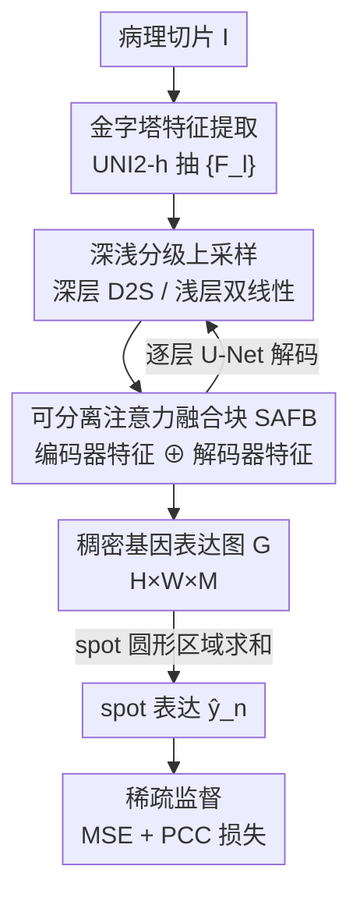

# From Spots to Pixels: Dense Spatial Gene Expression Prediction from Histology Images

**会议**: CVPR 2026  
**论文**: [CVF Open Access](https://openaccess.thecvf.com/content/CVPR2026/html/Zhang_From_Spots_to_Pixels_Dense_Spatial_Gene_Expression_Prediction_from_CVPR_2026_paper.html)  
**代码**: https://github.com/wangzrk/From-Spots-to-Pixels  
**领域**: 计算生物 / 医学图像  
**关键词**: 空间转录组, 基因表达预测, 稠密预测, 病理切片, 多尺度解码

## 一句话总结
本文把"从病理切片预测空间基因表达"从逐 spot 回归任务改写成稠密预测任务，提出 PixNet：先用病理基础模型抽金字塔特征，再 U-Net 式逐层解码出一张全图的稠密基因表达图，最后对任意位置/任意半径的 spot 做圆形区域聚合得到表达值，从而在多个空间尺度（2µm 单细胞级到 100µm）上都超过现有 SOTA。

## 研究背景与动机
**领域现状**：空间转录组（ST）能在切片上测出每个空间位置的基因表达，但实验昂贵、通量低。于是大量工作转向从更易获取的病理切片图（H&E 染色 WSI）直接预测基因表达，主流做法是把任务建模成回归：从切片上裁出一个个 spot（圆形小块），训练网络把每个 spot 映射到它对应的基因表达向量（ST-Net、HisToGene、TRIPLEX、SGN 等）。

**现有痛点**：这种"逐 spot 回归"范式有两个根本缺陷。其一，**空间分辨率被裁没了**——为了让 spot 内有足够视觉/空间上下文，裁块尺寸通常 >100µm，一个 spot 里其实混了多个细胞、每个细胞表达谱不同，模型却把整块压成单一表达向量，丢失了细胞级的空间分辨率。其二，**尺度被钉死**——模型在固定 spot 尺寸上训练，换个尺度就垮：在 100µm 上训练的模型迁移到 2µm（约单细胞级、图像空间里只有 ~20 像素）几乎完全失效，而 Visium HD 这类新技术恰恰提供 2µm 的高分辨率表达，旧方法吃不下。

**核心矛盾**：旧范式把"预测的最小单元"和"spot 的物理尺寸"绑死了——你只能预测训练时见过的那种尺寸的 spot，且预测粒度永远不可能比 spot 更细。空间分辨率和模型可用性都被这个绑定卡住。

**本文目标**：让一套模型能在任意空间分辨率、任意 spot 尺寸下都准确预测基因表达。

**切入角度**：作者的关键观察是——既然 spot 只是切片上的一个圆形区域，那不如先把整张切片映射成一张**逐像素的稠密基因表达图**，任何 spot 的表达都可以由它覆盖区域内的像素值聚合而来。这样"预测单元"就从 spot 解耦成了像素，spot 尺寸只在最后聚合时才出现，自然支持任意尺度。

**核心 idea**：把逐 spot 回归改写成稠密预测——"切片 → 稠密表达图 → 按 spot 圆形区域聚合"，用一张连续表达图替代一堆离散 spot 映射。同时用稀疏监督解决"只有少数 spot 有真值"的训练难题。

## 方法详解

### 整体框架
给定一张切片图 $I \in \mathbb{R}^{H\times W\times 3}$ 以及 $N$ 个 spot $\{(x_n,y_n,r_n),\,y_n\}_{n=1}^N$（中心坐标、圆半径、$M$ 个基因的真值表达向量 $y_n\in\mathbb{R}^M$），PixNet 分三步走：① 用病理基础模型编码器抽出 $L$ 层金字塔特征 $\{F_l\}_{l=1}^L$；② U-Net 式逐层解码，把金字塔特征渐进融合上采样成一张与原图同分辨率的稠密基因表达图 $G\in\mathbb{R}^{H\times W\times M}$；③ 对每个 spot，在 $G$ 上以 $(x_n,y_n)$ 为圆心、$r_n$ 为半径的圆内对像素求和，得到该 spot 的预测表达 $\hat y_n$。训练时只在有真值的 spot 上算损失（稀疏监督）；测试时 spot 的位置和半径可任意改变，因此同一模型能跨尺度预测。

解码阶段的关键在于"深浅两种上采样 + 注意力融合块"的搭配：深层走 depth-to-space 上采样（DSUB）尽量不丢信息，浅层走双线性插值保细节，每层再用可分离注意力融合块（SAFB）把编码器侧的金字塔特征和解码器侧的上采样特征对齐融合。

### 关键设计

**1. 稠密预测重构：把逐 spot 回归改成一张全图表达图**

这是全文的范式转换，直击"空间分辨率被裁没、尺度被钉死"两个痛点。旧方法学的是函数 $f:\text{spot}\mapsto \mathbb{R}^M$，预测粒度永远不细于 spot；本文改学 $f:I\mapsto G$，即整张切片到逐像素表达图 $G\in\mathbb{R}^{H\times W\times M}$。任意 spot 的表达不再单独预测，而是从 $G$ 中对应区域聚合：

$$\hat y_n = \sum_{(\Delta x,\Delta y)} G(\Delta x,\Delta y),\quad (\Delta x-x_n)^2+(\Delta y-y_n)^2 \le r_n^2$$

即在以 spot 为圆心、$r_n$ 为半径的圆盘内对像素表达求和。这个聚合是无参数的，关键好处是 spot 的尺寸/位置只在推理聚合时才介入、不参与训练，所以训练好的 $G$ 可以被任意尺寸的圆盘"采样"——同一模型天然支持 2µm/8µm/16µm/100µm。和 iStar 这类超分思路相比，本文不做病理切片的 ill-posed 上采样（从粗数据猜细节，容易产生与真实组织形态不符的伪结构），而是直接在原图分辨率上预测，避开了超分的病态性。

**2. 金字塔特征提取：用病理基础模型抓多尺度形态**

切片图天然是多尺度的（细胞核、腺体、组织区域跨越很大尺度），单一尺度特征不足以支撑从单细胞到组织级的预测。本文用在大规模 WSI 上预训练的 UNI2-h 编码器：先把 $I$ 投影成 token 嵌入 $Z_0$，经 $L$ 组 ViT 渐进加深语义抽象，$Z_L = \text{ViT}_L\circ\cdots\circ\text{ViT}_1(Z_0)$；再从中间若干组（如第 2/4/6 组）取出 token、reshape 回 2D 并下采样，得到金字塔特征 $F_l = \text{Downsample}(R(Z_l))$。浅层 $F_l$ 保留更多空间细节，深层保留更多语义——这正是后面解码"深浅分治"的依据。消融显示病理专用基础模型（UNI2）显著优于 ResNet-18 等通用编码器。

**3. 深浅分级上采样：深层防丢信息、浅层保空间细节**

把金字塔特征逐层还原到原图分辨率时，"怎么上采样"直接决定空间保真度——而基因表达预测对空间信息保留极其敏感。本文按特征深浅用两套策略。深层（$L\ge l>3$）用 **depth-to-space 上采样块（DSUB）**：先卷积，再把通道维 reshape 成更高空间分辨率（D2S 操作），所需滤波器数 $K = C_{F_l}\times 2^d$（$d=2$ 为下采样因子）。D2S 只是搬运通道到空间、不改变内容，因此几乎不丢信息：

$$U_{l-1} = \text{CB}\big(\text{ReLU}(\text{Conv}(\text{D2S}(\text{ReLU}(\text{Conv}(F_l))),K))\big)$$

浅层（$3\ge l>1$）则改用**双线性插值**：浅层本就富含空间细节，需要的是平滑的分辨率恢复而非复杂语义变换，插值前后各加一个复合卷积块（CB）去噪和精修：$\hat U_{l-1}=\text{CB}(\text{BlIntp}(\text{CB}(F_l)))$。这种"深层重内容保真、浅层重平滑细节"的分治，使重建既不丢编码器学到的空间信息又保持空间连贯。

**4. 可分离注意力融合块 SAFB：对齐编码器细节与解码器上下文**

每一层都要把编码器侧的金字塔特征 $F_{l-1}$ 和解码器侧上采样来的特征 $U_{l-1}/\hat U_{l-1}$ 融合，但两者一个偏高分辨率细节、一个偏上下文语义，直接相加会冲突。SAFB 先用一个可分离残差块精修金字塔特征（深度卷积 DWC + 逐点卷积 + 归一化）：

$$\hat F_{mid}=\text{LN}(\text{Conv}_{1\times1}(\text{SiLU}(\text{DWC}(F_{l-1})))),\quad \hat F_{l-1}=\text{BN}(\text{SiLU}(\text{DWC}(F_{l-1})+\hat F_{mid}))$$

再把精修后的 $\hat F_{l-1}$ 与上采样特征拼接成 $F_u$，做轻量注意力增强：$\text{Attention}=\text{softmax}(QK^T/\beta)V$，最后残差输出 $D_{l-1}=F_u+\text{Attention}(\text{Conv}_{1\times1}(F_u))$，$\beta$ 取隐维度开方做归一化。深度可分离卷积 + 轻量注意力让 SAFB 既能 relation-aware 地聚合特征又保持低复杂度；消融里它把 PCC@M 从 plain Conv 的 0.169 / ResNet18 的 0.213 / ViT 的 0.188 直接拉到 0.325，是解码端贡献最大的模块。

**5. 稀疏监督损失：只在有真值的 spot 上回传梯度**

ST 数据天生稀疏——一张切片上绝大多数像素没有测到的表达真值，无法对整张 $G$ 做稠密监督。本文用稀疏损失模块：只对有真值的 $N$ 个 spot 聚合出的 $\{\hat y_n\}$ 与真值 $\{y_n\}$ 算损失，组合均方误差 $L_{mse}$（逐值保真）和批内皮尔逊相关系数损失 $L_{pcc}$（鼓励预测与真值在基因维度上的相关趋势一致）：

$$L = L_{mse} + \lambda L_{pcc},\quad \lambda=0.5$$

PCC 项尤为关键，因为基因表达预测更看重"能否抓住表达的相对高低变化"而非绝对值；消融里只用 MSE 时 PCC@M 为 0.293、只用 PCC 时 0.319、两者结合 0.325，组合取得保真与相关的最佳平衡。

### 损失函数 / 训练策略
从零训练（不做端到端微调编码器外的额外预训练），AdamW 优化器，200 epoch，学习率 $5\times10^{-4}$，权重衰减 $1\times10^{-4}$，$\lambda=0.5$，固定随机种子 42。解码器滤波器配置 [64,128,256,512,512,512]。按 ST 惯例取数据集中平均表达最高的 250 个基因为预测目标；表达值先除以每个 spot 的总表达再做 log 变换。每个实验重复 5 次取均值。单张 RTX A6000 训练。

## 实验关键数据

### 主实验
四个 ST 数据集：STNet（68 张切片、30K spot、100µm）、Her2ST（36 张、13K spot、100µm）、乳腺癌 Visium HD 和脑癌 Visium HD（提供 2µm/8µm/16µm 多尺度、百万到千万级 spot）。指标含 MSE↓、MAE↓ 与三种 PCC↑（PCC@F 一四分位、PCC@S 中位、PCC@M 均值，逐基因跨所有 spot 计算）。

Visium HD（高分辨率多尺度）上对比 13 个 SOTA：

| 数据集 | 指标 | 本文 | 之前最佳 | 提升 |
|--------|------|------|----------|------|
| 乳腺癌 Visium HD | PCC@M ↑ | **0.325** | 0.226 (SGN) | +43.8% |
| 乳腺癌 Visium HD | MSE ↓ | **0.153** | 0.229 (ScstGCN) | -33% |
| 脑癌 Visium HD | PCC@M ↑ | **0.304** | 0.195 (SGN) | +56% |
| STNet (100µm) | PCC@M ↑ | **0.409** | 0.357 (BG-TRIPLEX) | +14.6% |
| Her2ST (100µm) | PCC@M ↑ | **0.453** | 0.404 (TRIPLEX) | +12.1% |

四个数据集全部 SOTA，尤其是 PCC 系列指标领先明显，说明模型更好地抓住了表达的相对变化趋势。

### 跨尺度泛化（核心卖点）
所有模型在 STNet（100µm）上训练，迁移到乳腺癌 Visium HD 的 2µm/8µm/16µm 测试（Tab.5）。旧方法在固定 spot 上训练，换尺度严重退化；本文因为是稠密预测，可任意聚合：

| 测试尺度 | 指标 | 本文 | 次优 SGN |
|----------|------|------|----------|
| 2µm | PCC@M ↑ | **0.198** | 0.118 |
| 8µm | PCC@M ↑ | **0.219** | 0.136 |
| 16µm | PCC@M ↑ | **0.226** | 0.123 |

在最难的 2µm 单细胞级上，PCC@M 几乎是次优方法的 1.7 倍，验证了"解耦 spot 尺寸"的泛化优势。

### 消融实验
| 配置 | MSE↓ | MAE↓ | PCC@M↑ | 说明 |
|------|------|------|--------|------|
| 解码器 = Conv | 0.368 | 0.470 | 0.169 | 朴素卷积解码 |
| 解码器 = ResNet18 | 0.226 | 0.374 | 0.213 | 残差解码 |
| 解码器 = ViT | 0.297 | 0.435 | 0.188 | 纯 Transformer 解码 |
| 解码器 = **SAFB** | **0.153** | **0.274** | **0.325** | 本文完整 |
| 仅 $L_{mse}$ | 0.170 | 0.286 | 0.293 | 缺相关约束 |
| 仅 $L_{pcc}$ | 0.192 | 0.305 | 0.319 | 缺保真约束 |
| $L_{mse}+L_{pcc}$ | **0.153** | **0.274** | **0.325** | 完整损失 |

训练 spot 尺寸消融（Tab.6）：单用 16µm/8µm/2µm 训练 PCC@M 分别 0.244/0.288/0.299，混合 16+8+2µm 三尺度训练升至 0.325——多尺度联合训练显著互补。

### 关键发现
- **SAFB 是解码端贡献最大的模块**：换成 plain Conv，PCC@M 从 0.325 暴跌到 0.169（−48%），说明"可分离注意力对齐编码器细节与解码器上下文"是稠密表达图质量的关键。
- **稠密重构是泛化的根**：2µm 这种单细胞级、图像空间仅 ~20 像素的极端尺度上，旧方法基本失效（PCC@M ~0.1），本文仍有 0.198，正因为预测单元是像素而非 spot。
- **PCC 损失项不可省**：基因表达评估更看重相对高低，去掉 PCC 项 PCC@M 掉 0.032；两损失互补。
- **病理基础编码器重要**：UNI2 优于 ResNet-18 及其他病理基础模型（Virchow2、UNI、H-Optimus-0），多尺度形态先验对密集预测有实质帮助。

## 亮点与洞察
- **范式级重构**：把"逐 spot 回归"翻译成"稠密预测 + 区域聚合"，一个简单的视角转换同时解决了空间分辨率丢失和尺度固定两大顽疾——这是最"啊哈"的地方，且聚合是无参数的、零额外学习成本。
- **spot 尺寸延迟到推理才出现**：训练只学 $G$、不绑定 spot 几何，这个解耦让"一模型多尺度"几乎免费，是跨尺度泛化的根源，可迁移到任何"离散标注但需连续输出"的预测任务（如稀疏点云回归、稀疏深度补全）。
- **深浅分治上采样**是个可复用 trick：深层用 D2S 保内容、浅层用双线性保平滑，比一刀切上采样更尊重不同层特征的性质。
- **稀疏监督**优雅处理 ST 数据"绝大多数像素无真值"的现实，把稠密输出和稀疏标注用区域聚合自然桥接，思路可借给其它稀疏标注稠密预测场景。

## 局限与展望
- 稀疏监督下，没有任何 spot 覆盖到的区域 $G$ 是完全无监督的，其预测质量缺乏直接约束，文中只能间接靠聚合区域评估，未覆盖区域的可靠性存疑 ⚠️。
- 聚合用的是圆盘内**直接求和**而非平均/加权，spot 半径越大求和值越大，需要依赖归一化处理，对不规则形状或重叠 spot 的适配未充分讨论。
- 预测目标固定为平均表达最高的 250 个基因，低表达但生物学重要的基因（如部分标志物）不在评估内，长尾基因表现未知。
- 仍依赖大规模病理基础模型（UNI2）做编码器，迁移到缺乏专用基础模型的其他模态/染色时效果可能打折。

## 相关工作与启发
- **vs 逐 spot 回归（ST-Net / HisToGene / TRIPLEX / SGN / MERGE）**：它们把每个固定尺寸 spot 映射到一个表达向量，预测粒度被 spot 钉死、换尺度即失效；本文学整图稠密表达图再聚合，预测单元是像素，天然跨尺度——这是与所有逐 spot 方法的本质区别。
- **vs iStar（超分式像素映射）**：iStar 同样追求像素级表达，但走的是超分路线（从粗数据推断细节），属于 ill-posed 问题，易产生与真实组织形态不符的伪结构；本文直接在原图分辨率预测、不做病态上采样，预测与形态更一致。
- **vs 医学图像稠密预测（U-Netmer / SelfReg-UNet / Deform-Mamba）**：本文借鉴了分割/超分里成熟的 U-Net 式稠密解码架构，但把输出从分割掩码/高分辨图换成多通道基因表达图，并配上稀疏监督，是把稠密预测技术迁移到 ST 领域的桥接工作。

## 评分
- 新颖性: ⭐⭐⭐⭐⭐ 把逐 spot 回归重构为稠密预测 + 区域聚合，视角转换简洁且彻底解决尺度绑定问题。
- 实验充分度: ⭐⭐⭐⭐⭐ 四数据集、多尺度、13 个 SOTA 对比、跨尺度泛化 + 4 项消融，证据链完整。
- 写作质量: ⭐⭐⭐⭐ 方法与动机清晰，公式略有笔误（如个别 typo），整体易读。
- 价值: ⭐⭐⭐⭐⭐ 直接服务 Visium HD 等高分辨率 ST 新技术，单细胞级基因表达预测有实际临床意义。

<!-- RELATED:START -->

## 相关论文

- [\[CVPR 2026\] HINGE: Adapting a Pre-trained Single-Cell Foundation Model to Spatial Gene Expression Generation from Histology Images](adapting_a_pre-trained_single-cell_foundation_model_to_spatial_gene_expression_g.md)
- [\[CVPR 2026\] Predicting Spatial Transcriptomics from Histology Images via High-Order Multi-Cell Interaction Modeling](predicting_spatial_transcriptomics_from_histology_images_via_high-order_multi-ce.md)
- [\[CVPR 2026\] HyperST: Hierarchical Hyperbolic Learning for Spatial Transcriptomics Prediction](hyperst_hierarchical_hyperbolic_learning_for_spatial_transcriptomics_prediction.md)
- [\[CVPR 2026\] Cross-Slice Knowledge Transfer via Masked Multi-Modal Heterogeneous Graph Contrastive Learning for Spatial Gene Expression Inference](cross-slice_knowledge_transfer_via_masked_multi-modal_heterogeneous_graph_contra.md)
- [\[CVPR 2026\] Cell-Type Prototype-Informed Neural Network for Gene Expression Estimation from Pathology Images](cell-type_prototype-informed_neural_network_for_gene_expression_estimation_from_.md)

<!-- RELATED:END -->
