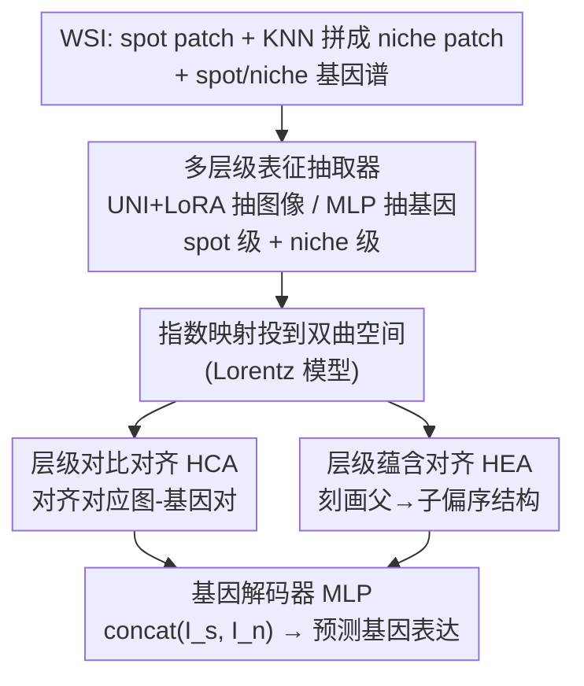

# HyperST: Hierarchical Hyperbolic Learning for Spatial Transcriptomics Prediction

**会议**: CVPR 2026  
**论文**: [CVF Open Access](https://openaccess.thecvf.com/content/CVPR2026/html/Zhang_HyperST_Hierarchical_Hyperbolic_Learning_for_Spatial_Transcriptomics_Prediction_CVPR_2026_paper.html)  
**代码**: https://github.com/liesgame/HyperST  
**领域**: 计算生物学 / 病理图像 / 空间转录组  
**关键词**: 空间转录组、基因表达预测、双曲几何、层级对齐、多模态  

## 一句话总结
从 H&E 病理图像直接预测空间转录组（ST）的基因表达时，已有方法只做 spot 级的图-基因匹配、忽略 ST 数据本身的层级结构，本文提出 HyperST：用多层级表征抽取器同时捕捉 spot 级与 niche 级的图像/基因特征，并在**双曲空间**里做层级对齐（对比对齐 HCA + 蕴含对齐 HEA），把分子语义注入图像表征，在四个组织数据集上全面刷新 SOTA。

## 研究背景与动机
**领域现状**：空间转录组（Spatial Transcriptomics, ST）能在微米级同时拿到组织形态（病理图像）和基因表达，把分子谱与组织结构对齐，对疾病诊断和靶点发现极有价值。但 ST 实验昂贵、流程繁琐，难以临床普及，于是「直接从 H&E 病理图像用深度学习预测空间分辨的基因表达」成为高性价比替代方案。

**现有痛点**：已有方法（StNet 直接回归、TRIPLEX 多尺度融合、BLEEP 对比对齐、Stem 生成式）大多只盯着 **spot 级**的图像→基因匹配，**没有利用 ST 数据完整的层级结构**——尤其是基因表达一侧本身就跨越细胞级、组织级多个尺度。它们要么假设形态↔转录是单射映射（忽略生物异质性），要么虽用多尺度视觉特征但缺少显式约束去保住这种内在层级。

**核心矛盾**：存在固有的**信息不对称**——基因表达谱携带的分子细节，在病理图像里往往没有明显的视觉对应物（视觉上很像的两个 patch 可能基因表达截然不同）。这种「视觉相似 ↔ 分子异质」的鸿沟，让标准图像编码器抓不到预测分子变化所需的细微形态线索。作者两个核心追问：(1) 引入更广的病理/基因上下文能否改善 spot 级预测？(2) 在视觉相似与分子异质并存时，如何让图像编码更多分子信息？

**本文目标**：不是把问题当成"一对多映射"硬建模，而是学一个**更强、被分子信息浸润的图像表征**；并显式建模 ST 数据的层级关系。

**切入角度**：作者按**信息特异性**定义层级——概念 A "蕴含" 概念 B，当 B 是 A 语义更丰富、更具体的实例（如"沙滩上的狗"是"狗"的子概念）。据此立两条层级：(1) spot 级特征蕴含其上下文更丰富的 niche 级特征；(2) 形态图像蕴含其对应的基因表达谱（基因谱比图像更细粒度、更具体）。

**核心 idea**：层级数据天然适合**双曲空间**（负曲率、体积随半径指数增长，像树）。把图-基因表征投到双曲空间，用对比对齐 + 蕴含对齐两类损失结构性地正则化隐空间，让模型学到层级感知、分子浸润的表征，再解码出基因表达。

## 方法详解

### 整体框架
HyperST 的流程是：从 WSI 上对每个 spot 切出 spot 级 patch，并把它与近邻拼成更大的 niche 级 patch；图像侧用 UNI（病理基础模型，LoRA 微调）抽 spot/niche 两级图像特征，基因侧用可训练 MLP 抽 spot/niche 两级基因特征。然后用指数映射把这四组欧氏特征投到双曲（Lorentz 模型）空间，做两类层级对齐——对比对齐（HCA）拉近对应的图-基因对、蕴含对齐（HEA）把"父概念→子概念"的偏序结构刻进隐空间。最终只用对齐后、被分子语义浸润的图像表征（spot+niche 拼接）喂给基因解码器（MLP）预测 spot 级基因表达。HEA 在这里是**结构正则器**而非生成模型，给隐空间施加一个有意义的归纳偏置。

### 关键设计

**1. 多层级表征抽取器：同时拿 spot 级与 niche 级、两个模态的层级特征**

针对"只做 spot 级匹配、忽略层级"的痛点。图像侧：对每个 spot 切中心对齐的 spot 级 patch $X_s$，再用 KNN 把中心 spot 和它在 Visium 六边形布局里的近邻拼成更大的 niche 级 patch $X_n$，提供更广的组织微环境上下文；用病理基础模型 UNI 抽特征，但因 UNI 不适配大尺寸 niche patch，作者用 **LoRA**（$W_{new}=W_{origin}+BA$，$B\in\mathbb{R}^{d\times r}, A\in\mathbb{R}^{r\times d}, r\ll d$）低秩微调，得到 $I_s, I_n\in\mathbb{R}^d$。基因侧：spot 级谱 $Y_s\in\mathbb{R}^N$ 直接对应，niche 级谱取中心与近邻谱的均值 $Y_n=\frac{1}{|S|}\sum_{z\in S}z$，再过可训练 MLP 得 $G_s, G_n$。这样四路特征 $\{I_s, I_n, G_s, G_n\}$ 同时覆盖两个尺度、两个模态，为后续层级对齐提供完整素材。

**2. 层级对比对齐 HCA：在双曲空间里按层级关系拉近图-基因对**

针对"BLEEP 等在欧氏空间直接拉近距离、不适合层级数据"的痛点。先用指数映射 $\exp^c_O(\cdot)$ 把四路欧氏特征投到曲率 $-c<0$ 的双曲空间得到 $\hat I_s,\hat I_n,\hat G_s,\hat G_n$。然后用**改造的 InfoNCE**——把余弦相似度换成负的 Lorentz 距离 $-d_{\mathbb{L}}(\cdot,\cdot)$：$\mathcal{L}_{align}(\hat I_s,\hat G_s)=-\frac{1}{B}\sum_i\log\frac{\exp(-d_{\mathbb{L}}(\hat I_s^i,\hat G_s^i)/\tau)}{\sum_j\exp(-d_{\mathbb{L}}(\hat I_s^i,\hat G_s^j)/\tau)}$，$\tau$ 为可学温度。HCA 同时做四个方向：spot 图↔spot 基因双向，以及 niche→spot 的跨级对齐 $\mathcal{L}_{align}(\hat G_n,\hat I_s)$、$\mathcal{L}_{align}(\hat I_n,\hat G_s)$（**只做 niche→spot 单向**，因为一个 spot 级通用特征可能对应 batch 内多个 niche，反向会引入错误负样本）：$\mathcal{L}_{HCA}=\frac{1}{4}(\mathcal{L}_{align}(\hat I_s,\hat G_s)+\mathcal{L}_{align}(\hat G_s,\hat I_s)+\mathcal{L}_{align}(\hat G_n,\hat I_s)+\mathcal{L}_{align}(\hat I_n,\hat G_s))$。

**3. 层级蕴含对齐 HEA：把"父概念蕴含子概念"的偏序刻进隐空间**

针对"图像与基因信息不对称、需要显式结构约束"的痛点。基于「基因比图像更细粒度，是图像的子概念」，作者用**双曲蕴含损失**约束偏序。每个父点 $y$ 张开一个蕴含锥 $R_y$，半角 $\mathrm{aper}(y)=\sin^{-1}\!\big(\frac{2Q}{\sqrt{c}\,\|y_{space}\|}\big)$（$Q=0.1$）；若子点 $x$ 落在锥外就惩罚 $\mathcal{L}_{entail}(y,x)=\max(0,\,\mathrm{ext}(y,x)-\mathrm{aper}(y))$，其中 $\mathrm{ext}(y,x)$ 是 $x$ 相对 $y$ 的外角。HEA 约束四条蕴含：spot 图蕴含 niche 图、spot 基因蕴含 niche 基因、spot 图蕴含 spot 基因、niche 图蕴含 niche 基因：$\mathcal{L}_{HEA}=\frac{1}{4}(\mathcal{L}_{entail}(\hat I_s,\hat I_n)+\mathcal{L}_{entail}(\hat G_s,\hat G_n)+\mathcal{L}_{entail}(\hat I_s,\hat G_s)+\mathcal{L}_{entail}(\hat I_n,\hat G_n))$。它把"通用→具体"的方向显式压进双曲几何，是 HyperST 性能的关键来源（消融里去掉 HEA 掉点明显）。

### 损失函数 / 训练策略
基因解码器把对齐后的图像表征拼接喂入 MLP：$Y^{pred}=\mathrm{Decoder}_{gene}(\mathrm{concat}(I_s, I_n))$，用 MSE 预测损失 $\mathcal{L}_{pred}=\|Y^{pred}-Y_s\|_2^2$。总目标把预测损失与双曲层级对齐损失加权合并：$\mathcal{L}=\mathcal{L}_{pred}+\alpha(\mathcal{L}_{HCA}+\beta\,\mathcal{L}_{HEA})$，其中 $\alpha$ 平衡对齐与预测、$\beta$ 控制蕴含损失强度。数据上每个 spot 取 top-200 高均值高变基因（HMHVG）、表达计数做 log 变换；patch 按物理直径（55 µm）做"物理感知"裁剪后统一缩放到 224×224；UNI 的曲率 $c$ 可训练，LoRA 调最后若干注意力层。

## 实验关键数据

### 主实验
在 HEST-1K 派生的四个组织数据集（Kidney / Colorectum / Skin / Lung）上评测，指标为 top-k 平均皮尔逊相关 PCC@k（越高越好）、MSE / MAE（越低越好）。五次随机划分（80/10/10）取均值。

| 数据集 | 模型 | PCC@10↑ | PCC@200↑ | MSE↓ | MAE↓ |
|------|------|------|------|------|------|
| Kidney | TRIPLEX (次优) | 0.579 | 0.351 | 1.122 | 0.855 |
| Kidney | **HyperST** | **0.617** | **0.390** | **1.077** | **0.817** |
| Colorectum | TRIPLEX | 0.701 | 0.462 | 1.869 | 1.056 |
| Colorectum | **HyperST** | **0.721** | **0.477** | **1.498** | **0.958** |
| Skin | TRIPLEX | 0.831 | 0.740 | 0.981 | 0.685 |
| Skin | **HyperST** | **0.839** | **0.758** | **0.932** | **0.657** |
| Lung | TRIPLEX | 0.567 | 0.393 | 1.537 | 0.849 |
| Lung | **HyperST** | **0.637** | **0.459** | **1.182** | **0.757** |

HyperST 在全部四个数据集所有指标上超过次优的 TRIPLEX；在 PCC@200 上相对提升约 10.95%（Kidney）、3.24%（Colorectum）、2.52%（Skin）、16.7%（Lung）。

### 临床下游验证（零样本 MSI 状态分类）
把在 Colorectum 上训练的模型对外部数据集 TCGA-COADREAD 做零样本推理，对每张切片把所有 spot 预测的基因表达平均成 slide 级伪 bulk 谱，再训随机森林预测微卫星不稳定（MSI）状态（AUROC，越高越好）：

| 模型 | MSI-H↑ | MSS↑ |
|------|------|------|
| TRIPLEX | 0.630 | 0.567 |
| **HyperST** | **0.719** | **0.601** |

HyperST 在零样本设定下把 MSI-H / MSS 的 AUROC 提到 0.719 / 0.601，比最强基线 TRIPLEX 高约 14% / 6%，说明预测的基因谱抓到了更多临床相关信号。

### 消融实验（Kidney 数据集）
| 配置 | PCC@200↑ | 说明 |
|------|------|------|
| 完整 HyperST | 0.390 | — |
| w/o G-I HEA | 0.378 | 去掉基因-图像蕴含正则，−3.24% |
| w/o HEA | 0.368 | 去掉整个蕴含损失，−6.01% |
| w/o HEA + HCA (整个 HHA) | 0.344 | 去掉整个层级对齐，−13.26%（掉点最多） |
| Euclidean counterpart | 0.369 | 同架构换回欧氏空间 |
| MERU 变体 | 0.355 | 双曲但无多层级 |
| CLIP 变体 | 0.321 | 欧氏 + 无层级 |
| only spot（解码输入） | 0.353 | 只用 spot 图像 |
| only niche | 0.356 | 只用 niche 图像 |
| spot+niche | 0.390 | 两级拼接最优 |

### 关键发现
- **层级对齐模块（HHA）贡献最大**：完全去掉 HCA+HEA 掉 13.26% PCC@200，是最关键组件；其中 HEA（蕴含损失）单独去掉就掉 6.01%，说明显式偏序约束很重要。
- **双曲几何确实更合适**：换回欧氏空间或用 CLIP（欧氏+无层级）显著掉点，CLIP 最差（0.321），印证负曲率空间天然适配 ST 的树状层级。
- **层级方向不能反**：反转 spot–niche 或 image–gene 的蕴含方向都掉点，支持"通用→具体"的设计。
- **多层级输入有效**：解码器同时用 spot + niche 优于任一单级；LoRA 微调 UNI 最后若干注意力层（0→11 层）总体提升，但 5→7 层时 MSE/MAE 有轻微回退。

## 亮点与洞察
- **把"信息特异性"映射成几何层级**：用"父概念蕴含更具体的子概念"统一刻画 spot→niche、图像→基因两条层级，再交给双曲空间承载，是个很自洽且可迁移的抽象。
- **HEA 作为结构正则器而非生成器**：不去硬建模一对多映射，而是用蕴含锥给隐空间施加偏置，思路优雅，且消融证明它是性能主力。
- **零样本临床下游迁移**：在外部 TCGA 数据上零样本预测基因谱再做 MSI 分类就能涨点，说明学到的表征带可迁移的临床信号，这种验证比单纯的 PCC 更有说服力。

## 局限与展望
- 仅在四个 HEST-1K 派生数据集、Visium 六边形布局上验证；对其它 ST 平台（如更高分辨率的成像式 ST）是否适配未知。
- 双曲空间的曲率 $c$、$\alpha/\beta$、蕴含锥参数 $Q$ 等超参较多，且双曲运算（指数映射、Lorentz 距离）数值稳定性是已知难点，论文未深入讨论训练成本/稳定性代价。⚠️ 此为自己发现的潜在局限。
- niche 仅用 KNN/六邻域定义的固定上下文，未必能自适应不同组织的微环境尺度。
- 基因侧只取 top-200 HMHVG，对低表达但临床关键的基因覆盖有限。

## 相关工作与启发
- **vs BLEEP**: BLEEP 在欧氏空间对比对齐 spot 图-基因；HyperST 把对齐搬到双曲空间并加多层级 + 蕴含约束，区别在于显式利用 ST 的层级结构，消融中欧氏对应物明显更差。
- **vs TRIPLEX（次优）**: TRIPLEX 融合多尺度视觉特征但缺显式层级约束；HyperST 在两个模态都建 spot↔niche 的父子层级，PCC@200 全面领先。
- **vs MERU / HyCoCLIP**: MERU 把图文嵌入双曲空间做层级，HyCoCLIP 靠预训练目标检测抽 box 建模态内层级（依赖外部检测器、可能不准）；HyperST 直接利用 ST 数据本身的 spot→niche 结构，避开外部特征抽取的不确定性。

## 评分
- 新颖性: ⭐⭐⭐⭐⭐ 首次把双曲层级学习用于 ST 基因表达预测，且层级定义自洽、双向对齐设计巧妙
- 实验充分度: ⭐⭐⭐⭐ 四数据集 + 零样本临床下游 + 细致消融，但数据集均来自 HEST-1K/Visium 单一来源
- 写作质量: ⭐⭐⭐⭐ 两问题→两组件的逻辑清晰，双曲几何 preliminary 铺垫完整
- 价值: ⭐⭐⭐⭐ 低成本从病理图预测 ST 有明确临床价值，零样本 MSI 验证增强说服力

<!-- RELATED:START -->

## 相关论文

- [\[CVPR 2026\] From Spots to Pixels: Dense Spatial Gene Expression Prediction from Histology Images](from_spots_to_pixels_dense_spatial_gene_expression_prediction_from_histology_ima.md)
- [\[CVPR 2026\] FEAST: Fully Connected Expressive Attention for Spatial Transcriptomics](feast_fully_connected_expressive_attention_for_spatial_transcriptomics.md)
- [\[AAAI 2026\] HiFusion: Hierarchical Intra-Spot Alignment and Regional Context Fusion for Spatial Gene Expression Prediction from Histopathology](../../AAAI2026/computational_biology/hifusion_hierarchical_intra-spot_alignment_and_regional_context_fusion_for_spati.md)
- [\[CVPR 2026\] Predicting Spatial Transcriptomics from Histology Images via High-Order Multi-Cell Interaction Modeling](predicting_spatial_transcriptomics_from_histology_images_via_high-order_multi-ce.md)
- [\[CVPR 2026\] Hyperbolic Busemann Neural Networks](hyperbolic_busemann_neural_networks.md)

<!-- RELATED:END -->
