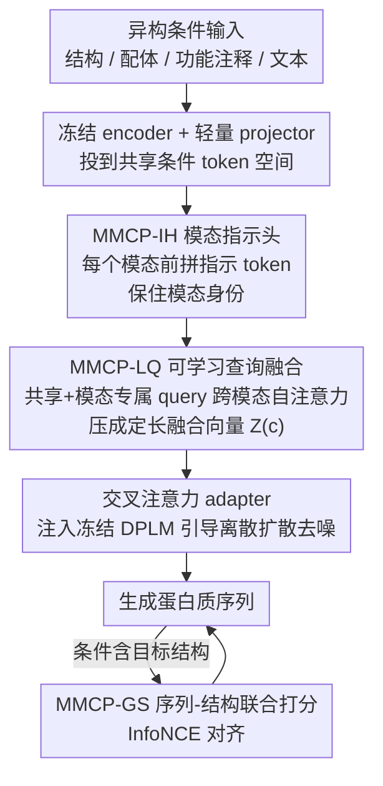

# MMCP-GEN: A Modality-Extensible Diffusion Language Model for Conditional Protein Sequence Generation

**会议**: CVPR 2026  
**论文**: [CVF Open Access](https://openaccess.thecvf.com/content/CVPR2026/html/An_MMCP-GEN_A_Modality-Extensible_Diffusion_Language_Model_for_Conditional_Protein_Sequence_CVPR_2026_paper.html)  
**代码**: https://github.com/WanyuGroup （论文称公开，⚠️ 仓库地址较泛，以原文为准）  
**领域**: 计算生物学 / 扩散语言模型 / 多模态条件生成  
**关键词**: 蛋白质设计, 扩散语言模型, 多模态条件, 可学习查询, 模态可扩展

## 一句话总结
MMCP-GEN 在离散扩散蛋白质语言模型 DPLM 之上，设计了一套「模态指示头 + 可学习查询融合」的可组合条件机制，把结构、配体、功能注释、自由文本等异构生物条件统一融合进一个共享条件空间，新增模态时无需重训骨干，并配合序列-结构联合打分目标，在功能生成、逆折叠、多目标设计三类任务上同时刷新 SOTA（序列恢复率最高提升约 5%）。

## 研究背景与动机

**领域现状**：用扩散模型做可控蛋白质设计是近年的热点。这类方法把氨基酸序列当作离散 token，通过迭代去噪（denoising）生成序列，相比传统蛋白质语言模型（PLM）在可控性、结构保真度、序列多样性上都更强。代表工作如 EvoDiff、RFdiffusion、DPLM 等。

**现有痛点**：真实的蛋白质设计往往要同时满足多种模态的生物条件——既要折叠成指定 3D 结构、又要结合特定配体、还要具备某个 GO/EC 功能。但现有方法要么只支持单一条件（如 ZymCTRL 只控 EC、ProteoGAN 只控 GO），要么给每个模态各配一套独立的 encoder + adapter（如 DPLM-2、CFP-GEN）。后者把不同模态切成互不通气的并行模块，导致跨模态交互很弱，而且每加一个新模态都要新设计、甚至重训骨干网络。

**核心矛盾**：蛋白质的序列、结构、功能本身是内在耦合的，孤立优化任何单一模态都不充分；但现有架构在「模态隔离」和「跨模态融合」之间没有好的折中——融合做得好就不可扩展，做得可扩展就融合很浅。

**本文目标**：构造一个既能跨模态深度融合、又能即插即用扩展新模态的可控蛋白质生成框架，且扩展新模态时不动骨干、只做轻量微调。

**切入角度**：与其给每个模态配专用通道，不如把所有模态投到同一个共享条件 token 空间里，靠一组可学习查询（learnable query）去跨模态地抽取、聚合信息，再用模态指示 token 保证不同模态语义不被混淆。

**核心 idea**：用「模态指示头（MMCP-IH）+ 可学习查询融合（MMCP-LQ）」把异构条件压成一组定长的融合 token，经交叉注意力 adapter 注入冻结的 DPLM 骨干；新增模态只需挂一个 encoder + projector + indicator + 几个模态专属 query。

## 方法详解

### 整体框架
MMCP-GEN 建立在 DPLM 的吸收态（absorbing）离散扩散范式上：前向过程把序列里的残基逐步替换成 MASK，反向过程在多模态条件 $c$ 引导下从全 MASK 状态逐步重建出序列。整个 pipeline 是：每个模态先过一个**冻结**的预训练 encoder 拿到 embedding，经轻量 projector 投到统一的 $d_{\text{cond}}$ 维 token 空间；然后给每个模态的 token 序列前面拼一个**模态指示 token**（MMCP-IH），保证融合时模态身份不丢；接着把所有模态 token 和一组**可学习查询**（MMCP-LQ）拼在一起送进一个小 Transformer 做跨模态自注意力，输出一组定长融合向量 $Z(c)$；最后这组融合向量经交叉注意力 adapter 注入冻结的 DPLM 各层，引导去噪。当条件里含目标结构时，再叠一个序列-结构联合打分目标（MMCP-GS）。整个框架里只有 projector、indicator、query、adapter 是可训练的，骨干和所有模态 encoder 全部冻结——这正是「可扩展、不重训」的来源。

### 关键设计

**1. MMCP-IH 模态指示头：用一个专属 token 守住模态身份**

痛点是：把所有模态投到同一个 token 空间后，Transformer 很容易把不同模态的语义混成一锅粥，分不清这个 token 来自结构还是来自文本。MMCP-IH 的做法很直接——给第 $m$ 个模态引入一个可训练向量 $t^{(m)} \in \mathbb{R}^{d_{\text{cond}}}$，拼在该模态投影后的 token 序列最前面：$\tilde{z}_m = [t^{(m)}; z^{(m)}_1, \dots, z^{(m)}_{n_m}]$。这个指示 token 相当于给每个模态贴了张身份标签，让后面的注意力能「按模态」差异化地处理 token，避免跨模态语义的意外混淆。它的妙处在于代价极小（每模态一个向量），却为可扩展性打了地基：加新模态时只要再造一个 $t^{(m_{\text{new}})}$ 即可。

**2. MMCP-LQ 可学习查询融合：定长 query 跨模态抽取，天然支持缺失模态**

把全部模态 token 拼成一条全局流 $C=[\tilde{z}_1; \dots; \tilde{z}_M]$ 后，长度随模态数和条件数变化，没法直接喂给固定结构的骨干。MMCP-LQ 维护一组可学习查询，分两类：共享 query $Q_s$（不偏向任何模态，可关注所有模态）和模态专属 query $Q_m$（每模态 0–4 个，受指示 token 引导主要关注本模态 token）。把 $T_0=[C;Q]$ 一起送进一个 Transformer 栈做自注意力 $T_{\text{LQ}}=\text{Transformer}_{\text{LQ}}(T_0)$，取出更新后的 query $Q'$，再经线性投影 $W$ 映射到 DPLM embedding 空间，得到定长融合集合 $Z(c)\in\mathbb{R}^{K\times d_{\text{DPLM}}}$。关键巧思有二：一是**定长输出**让条件注入与具体模态数解耦；二是处理**缺失模态**——若缺某模态，就插入一个可学习的 missing-modality token $z^{(m)}_{\text{miss}}$，使对应的 $Q_m$ 仍然活跃、能显式「意识到」该模态缺席，而不是直接失效。注入骨干时，在 DPLM 选定层插轻量交叉注意力 adapter：$\hat{H}=\text{XAttn}(H,S),\ H\leftarrow H+\gamma\cdot\hat{H}$，$\gamma$ 控制条件强度，反向扩散各时间步复用同一个 $S$，并可做 classifier-free 风格的条件 dropout 以在推理时调节引导强度。

**3. 模态可扩展机制：加新模态只挂四件小东西、不动骨干**

这是论文的核心卖点。要引入一个全新条件模态，只需：①一个预训练冻结 encoder $E(m_{\text{new}})$；②一个轻量 projector $P_{m_{\text{new}}}$；③一个模态指示 token $t^{(m_{\text{new}})}$；④在 MMCP-LQ 里实例化一组该模态专属 query $Q_{m_{\text{new}}}$。这四样和已有 adapter、projector 一起轻量微调，而 DPLM 骨干和所有现有 encoder 全程冻结。相比 DPLM-2/CFP-GEN「每个新模态都要专用 encoder–adapter 对、甚至重训骨干」，MMCP-GEN 把扩展成本压到了只调几个小模块，这才是「modality-extensible」名副其实的地方。

**4. MMCP-GS 序列-结构联合打分：用对比对齐把结构保真做成可微目标**

当条件里给了目标结构 $s$ 时，理想目标是同时优化结构预测 $P_\theta(s|x)$ 和序列生成 $P_\phi(x|s)$ 两个方向（公式 15），但直接联合优化计算量太大。论文改用一个代理：把结构 embedding $z_{\text{str}}=f_{\text{str}}(s)$ 和序列 embedding 经投影头 $g(\cdot)$ 拉到同一空间，用 InfoNCE 对比损失对齐正配对、推开 batch 内负样本：$L_{\text{GS}}=-\log \frac{\exp(\text{sim}(g(h(x)),z_{\text{str}})/\tau)}{\sum_{s'}\exp(\text{sim}(g(h(x)),z'_{\text{str}})/\tau)}$。这样无需额外训练生成模型就能可微地对齐序列与结构。最终训练目标把扩散去噪交叉熵和结构对齐项加权合并：$L=L_{\text{CE}}+\zeta L_{\text{GS}}$（实验取 $\zeta=0.3$），让模型既忠于扩散训练，又在有结构条件时捕获序列-结构耦合。

### 损失函数 / 训练策略
去噪主损失是对 MASK 位置的加权交叉熵 $L_{\text{CE},t}=\mathbb{E}_{x^{(0)},c}[\lambda(t)\sum_i b_i(t)(-\log p_\theta(x^{(0)}_i|x^{(t)},c))]$，其中 $b_i(t)$ 标记被 MASK 的位置、$\lambda(t)$ 是依赖噪声调度的权重。骨干用预训练 DPLM-650M；adapter 插在 Transformer 最后三分之一（33 层中的第 24/28/33 层）的 FFN 子层之后，既能注入条件又保护早层表征；共享/模态专属 query 数均设 $k_s=k_m=4$；GS 损失权重 $\zeta=0.3$、条件强度 $\gamma=0.6$，均经网格搜索调得。

## 实验关键数据

作者自建了一个大规模多模态数据集：从 UniProtKB 取序列与功能标签（GO/IPR/EC），从 PDB 取分辨率 ≤3.5 Å 的结构，从 BioLiP 取配体结合信息，质控去冗后保留 127,342 条带配对多模态属性的蛋白（353 个 GO 词、1,092 个 IPR 域、419 个 EC 号、5.6 万+ 唯一配体）。评测指标：序列相似度用 MMD / MMD-G（最大均值差异，越低越好）和 MRR（平均倒数排名，越高越好）；功能一致性用 micro/macro F1、AUPR、AUC（分别由 DeepGO-SE / InterProScan / CLEAN 打分）。

### 主实验

功能条件下的序列相似度与功能注释评测（节选 GO / EC 两组，加粗为最优）：

| 任务 | 模型 | MRR↑ | MMD↓ | mic.F1↑ | mac.F1↑ | AUC↑ |
|------|------|------|------|---------|---------|------|
| GO | CFP-GEN | 0.824 | 0.042 | 0.511 | 0.527 | 0.744 |
| GO | MMCP-GEN (w/ ALL) | **0.873** | **0.038** | **0.536** | **0.553** | **0.799** |
| EC | CFP-GEN | 0.902 | 0.045 | 0.931 | 0.915 | 0.944 |
| EC | MMCP-GEN (w/ ALL) | **0.927** | **0.043** | **0.945** | **0.928** | **0.954** |

可见用上全部模态时，MMCP-GEN 在 GO/IPR/EC 三种功能空间都拿下最优；而只给单一功能条件（如 w/ GO、w/ EC）时反而不敌 CFP-GEN，说明增益主要来自跨模态联合融合，而非单纯堆条件。

逆折叠（结构条件）任务，refold 用 ESMFold，指标为氨基酸恢复率 AAR、自洽 TM-score（scTM）、置信度 pLDDT：

| 模型 | AAR(%) | scTM | pLDDT |
|------|--------|------|-------|
| ProteinMPNN | 45.76 | 0.905 | 85.11 |
| DPLM | 67.24 | 0.876 | 84.99 |
| CFP-GEN | 77.01 | 0.887 | 84.56 |
| MMCP-GEN (Zero-shot, w/o Struct) | 73.88 | 0.885 | 84.34 |
| MMCP-GEN (SFT, w/ Struct) | 77.49 | 0.905 | 85.38 |
| MMCP-GEN (SFT, ALL) | 78.17 | 0.906 | 86.25 |
| MMCP-GEN (SFT, ALL + GS) | **78.66** | **0.912** | **86.88** |

### 消融实验

逆折叠的逐步消融清晰显示各组件的边际贡献：

| 配置 | AAR(%) | scTM | pLDDT | 说明 |
|------|--------|------|-------|------|
| Zero-shot（无微调） | 73.88 | 0.885 | 84.34 | 异构条件本身已是有用先验 |
| + SFT（结构条件） | 77.49 | 0.905 | 85.38 | 结构监督显著提升恢复率 |
| + 全模态 | 78.17 | 0.906 | 86.25 | 多模态协同而非冗余 |
| + GS 联合打分 | 78.66 | 0.912 | 86.88 | 进一步增强可折叠性与稳定性 |

### 关键发现
- **跨模态融合 > 堆条件**：单功能条件下 MMCP-GEN 不如 CFP-GEN，但用全模态后全面反超，证明价值在「融合方式」而非「条件数量」——CFP-GEN 的模态模块基本并行、跨模态交互弱，而 MMCP-LQ 让各模态在统一空间里相互影响。
- **三层协同**：消融表明结构监督、多模态条件、GS 对齐分别带来正贡献且不互相抵消，GS loss 在已经很高的基线上仍把 scTM 从 0.906 推到 0.912。
- **zero-shot 即有竞争力**：不微调任何 adapter/融合模块时已达 73.88% AAR / 0.885 scTM，说明冻结编码器提供的异构先验本身就很强。

## 亮点与洞察
- **指示 token + 可学习 query 的组合拳**：前者用极小代价守住模态身份（防混淆），后者用定长 query 把任意模态数压成固定接口（防爆长），两者配合既深融合又可扩展，是很值得迁移到其他多模态条件生成（图像、分子等）的范式。
- **missing-modality token 的巧思**：缺模态时不是简单丢弃，而是塞一个可学习占位 token 让对应 query 显式感知「这里缺信息」，把缺失也当成一种可建模信号——这让同一模型能灵活吃任意条件子集。
- **把昂贵的双向联合目标降成对比对齐**：序列-结构互相预测本应很贵，作者用 InfoNCE 在共享空间对齐 embedding 做可微代理，免去再训一个生成模型，是工程上务实又有效的近似。

## 局限与展望
- 作者承认完整双向联合优化 $P_\theta(s|x)$ 与 $P_\phi(x|s)$ 计算量过大，只能用对比对齐代理，结构保真的提升可能受代理近似上限制约。
- ⚠️ 评测主要在自建多模态数据集上、并沿用 CFP-GEN 协议，跨数据集/跨分布的泛化性、以及与更新骨干（如 ESM3 全量）公平对比的充分性，需更多外部验证。
- 模态专属 query 数固定为 4、按模态复杂度在 0–4 间取，这个容量分配较启发式；新增非常复杂的模态时是否够用值得探究。
- 代码链接较泛（仅给到课题组主页），复现细节、训练步数等部分放在 Appendix，开放程度待确认。

## 相关工作与启发
- **vs DPLM / DPLM-2**：MMCP-GEN 直接以 DPLM 为骨干，但 DPLM-2 给每个新模态配专用 encoder–adapter 对、扩展性受限；本文用统一共享空间 + 可学习 query，扩展只需挂四个小模块、不重训骨干。
- **vs CFP-GEN**：两者都做多条件融合，但 CFP-GEN 的结构/功能/motif 模块基本并行、跨模态交互弱；MMCP-GEN 让各模态在 MMCP-LQ 里相互注意，实验中全模态设置全面反超 CFP-GEN。
- **vs ESM3 / ProGen2**：这些 PLM 靠残基 prompt 或单标签控制，难以同时满足多个交互条件；MMCP-GEN 把异构条件融进单一生成过程，在 IPR/EC 上取得更高 F1 与 AUC。

## 评分
- 新颖性: ⭐⭐⭐⭐ 「指示头 + 可学习 query + 不重训扩展」的组合在蛋白质多模态条件生成里是清晰的新范式，但单个组件（query 融合、指示 token）在多模态领域已有先例。
- 实验充分度: ⭐⭐⭐⭐ 覆盖功能生成/逆折叠/多目标三类任务、含逐步消融与可视化，但主要在自建数据集、外部基准对比偏少。
- 写作质量: ⭐⭐⭐⭐ 动机-方法-实验逻辑顺畅，公式与组件命名清晰；部分关键细节（训练步数、扩展实操）推到 Appendix。
- 价值: ⭐⭐⭐⭐ 「可扩展不重训」的条件机制对真实蛋白质设计（要同时满足多约束）有实际意义，范式也可迁移到其他多模态可控生成。

<!-- RELATED:START -->

## 相关论文

- [\[ICML 2025\] CFP-Gen: Combinatorial Functional Protein Generation via Diffusion Language Models](../../ICML2025/computational_biology/cfp-gen_combinatorial_functional_protein_generation_via_diffusion_language_model.md)
- [\[CVPR 2026\] Multimodal Protein Language Models for Enzyme Kinetic Parameters: From Substrate Recognition to Conformational Adaptation](multimodal_protein_language_models_for_enzyme_kinetic_parameters_from_substrate_.md)
- [\[CVPR 2026\] HINGE: Adapting a Pre-trained Single-Cell Foundation Model to Spatial Gene Expression Generation from Histology Images](adapting_a_pre-trained_single-cell_foundation_model_to_spatial_gene_expression_g.md)
- [\[ICLR 2026\] Reverse Distillation: Consistently Scaling Protein Language Model Representations](../../ICLR2026/computational_biology/reverse_distillation_consistently_scaling_protein_language_model_representations.md)
- [\[ICLR 2026\] Protein as a Second Language for LLMs](../../ICLR2026/computational_biology/protein_as_a_second_language_for_llms.md)

<!-- RELATED:END -->
