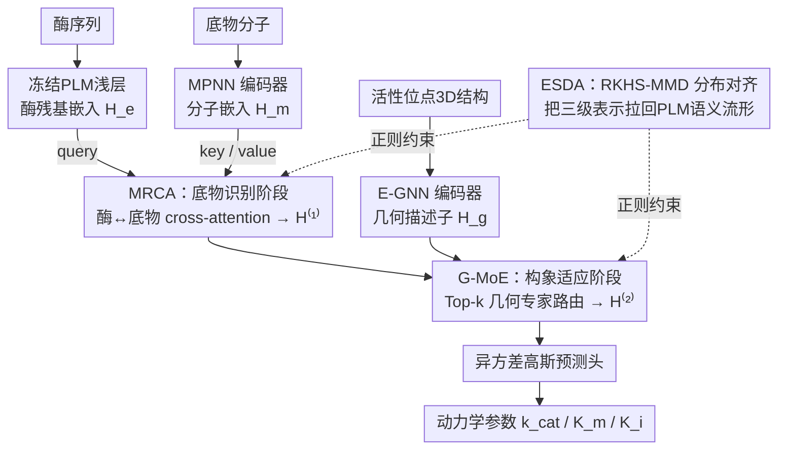

# Multimodal Protein Language Models for Enzyme Kinetic Parameters: From Substrate Recognition to Conformational Adaptation

**会议**: CVPR 2026  
**arXiv**: [2603.12845](https://arxiv.org/abs/2603.12845)  
**代码**: 无  
**领域**: Medical Imaging / 生物信息学  
**关键词**: 酶动力学预测, 蛋白质语言模型, 多模态融合, 混合专家, 跨模态适配器  

## 一句话总结

提出**ERBA(Enzyme-Reaction Bridging Adapter)**，将酶动力学参数预测重新建模为**分阶段多模态条件生成问题**——先通过MRCA注入底物信息捕获底物识别特异性，再通过G-MoE整合活性位点3D结构捕获构象适应，配合ESDA分布对齐保持PLM语义先验。

## 研究背景与动机

**领域现状**：高通量蛋白质设计和合成生物学越来越依赖酶动力学参数（$k_\text{cat}$、$K_m$、$K_i$）的计算预测，以在湿实验前筛选候选分子。现有方法从序列-only发展到多模态（序列+底物+结构）管线。

**现有痛点**：大多数管线将酶和底物独立编码后通过**浅层融合**（拼接+单层cross-attention）回归，隐式将催化过程视为**静态兼容性问题**：$\hat{y} = \psi(S_e \oplus S_m \oplus S_g)$。

**核心矛盾**：真实催化过程是阶段性的——酶首先**识别并定位底物**（substrate recognition），然后**适应性调整活性口袋几何构型**（conformational adaptation）以稳定过渡态。浅层融合忽略了这一阶段性本质，且盲目注入3D信息可能**破坏PLM预训练的生化语义先验**。

**本文目标**：构建一个与酶学机制对齐的分阶段条件化框架，在保持PLM先验的同时分层注入底物化学和口袋几何信息。

**切入角度**：将动力学预测重新建模为 $\hat{y} = f_\theta^{(2)}(f_\theta^{(1)}(S_e, S_m), S_g)$，其中 $f^{(1)}$ 捕获底物条件化的分子识别，$f^{(2)}$ 通过几何感知进行构象适应。

**核心idea**：ERBA = MRCA（底物识别cross-attention）+ G-MoE（几何感知混合专家路由）+ ESDA（分布对齐正则化）。

## 方法详解

### 整体框架

ERBA要解决的是同一件事：现有管线把酶和底物各编各的、最后浅层一拼就回归，等于把催化当成"静态兼容性"问题，而真实催化是先识别底物、再调整口袋构型的两个阶段。ERBA不重训PLM，而是作为一个**适配器**插进冻结的预训练PLM里，把这两个阶段显式拆开依次注入：

$$\hat{y} = \mathcal{G}^{(2)}(\underbrace{\mathcal{M}^{(1)}(S_e, S_m)}_{\text{底物识别}}, S_g)$$

具体到数据流：PLM浅层先给出酶残基嵌入 $\mathbf{H}_e \in \mathbb{R}^{L_e \times D}$；底物分子另走一个MPNN编码器得到 $\mathbf{H}_m \in \mathbb{R}^{L_m \times D}$；活性位点的3D结构由E-GNN编码成几何描述子 $\mathbf{H}_g \in \mathbb{R}^{L_g \times D}$。第一阶段（MRCA）让酶吸收底物信息变成 $\mathbf{H}^{(1)}$，第二阶段（G-MoE）再把口袋几何注进去得到 $\mathbf{H}^{(2)}$，整个过程由ESDA从分布层面兜底，保证注入的化学和几何信息不会冲垮PLM原有的生化语义。

### 关键设计

**1. MRCA：先让酶"看见"底物，模拟识别阶段**

催化的第一步是酶识别并定位底物，所以这一阶段只做一件事——把底物语义注入酶表示。MRCA用一层cross-attention，以酶token作query、底物token作key/value，让每个酶残基去"查询"它和哪些底物原子相关：

$$\mathbf{A}_{em} = \text{Softmax}\left(\frac{(\mathbf{H}_e \mathbf{W}_Q)(\mathbf{H}_m \mathbf{W}_K)^\top}{\sqrt{d_k}}\right), \quad \mathbf{Z}_{em} = \mathbf{A}_{em}(\mathbf{H}_m \mathbf{W}_V)$$

再经残差连接和LayerNorm得到底物感知表示 $\mathbf{H}^{(1)}$。关键在于注意力矩阵 $\mathbf{A}_{em}$ 本身就是一张酶残基↔底物原子的对齐表，那些真正参与结合的残基会被自然地凸显出来——这比把两边特征直接拼起来更接近"识别"的物理含义。

**2. G-MoE：用稀疏专家路由捕捉不同口袋的构象适应**

识别之后是构象适应：酶要根据底物微调活性口袋的几何形状去稳定过渡态。难点在于不同酶的口袋拓扑、残基排布差异巨大，形成一堆异质的几何regime，单一适配器很难把它们都拟合好。G-MoE的思路是让多个专家各管一类几何模式，再用稀疏门控按需调用。它先把口袋区域 $\mathcal{P}$ 的识别特征和几何描述子池化后拼成路由向量 $\mathbf{v}_{emg} = [\text{Pool}(\mathbf{H}^{(1)}[\mathcal{P}]) \oplus \text{Pool}(\mathbf{H}_g)]$，再用Top-$k$ 门控只激活 $k$ 个最相关的专家：$\tilde{\boldsymbol{\alpha}} = \text{Top-}k(\text{softmax}(\mathbf{W}_\text{gate} \mathbf{v}_{emg}))$。每个被选中的专家在口袋局部做一次几何调制的低秩适配（$r \ll D$，GELU激活）：

$$E_n(\mathbf{H}^{(1)}, \mathbf{H}_g) = \mathbf{H}^{(1)} + \mathbf{V}_n \sigma(\mathbf{U}_n \mathbf{H}^{(1)}[\mathcal{P}] + \mathbf{B}_n \Gamma(\mathbf{H}_g))$$

最后把激活专家的输出按门控权重加权汇总并过一层MLP：$\mathbf{H}^{(2)} = \text{MLP}(\sum_{n \in \text{Top}k} \tilde{\alpha} E_n)$。稀疏路由的好处是每类几何模式都有专门的参数去拟合，而非让一个适配器去平均所有口袋。

**3. ESDA：在分布层面给注入"上保险"，别冲垮PLM先验**

往PLM里硬塞3D结构有个隐患——几何信号往往很强势，训练时容易主导梯度，把PLM预训练时学到的进化约束、催化模式这些生化语义先验给侵蚀掉。ESDA的做法是在再生核Hilbert空间（RKHS）里用RBF核最大均值差异（MMD）做正则：把"序列-only""序列+底物""序列+底物+结构"三种表示的分布都对齐回PLM原本的流形上。这样新模态信息是被"拉进"PLM的语义空间里融合，而不是另起炉灶把它顶替掉——比起简单的KL散度或L2正则，RKHS-MMD能更柔和地约束整条分布而非逐点。

### 损失函数

使用**异方差高斯**预测头在 $\log_{10}$ 空间建模动力学常数的正性和乘性噪声，加上G-MoE的平衡正则化：
$$\mathcal{L}_{\text{G-MoE}} = \|\bar{\boldsymbol{\alpha}} - \frac{1}{n}\mathbf{1}\|_2^2 + \|\bar{\mathbf{n}} - \frac{k}{n}\mathbf{1}\|_2^2$$

## 实验关键数据

### 主实验：与现有SOTA对比 (Exp I)

| 方法 | $k_\text{cat}$ R²↑ | $k_\text{cat}$ RMSE↓ | $K_m$ R²↑ | $K_i$ R²↑ |
|------|-----|------|-----|-----|
| DLKcat (2022) | 0.01 | 1.78 | - | - |
| CatPred (2025) | 0.40 | 1.30 | 0.49 | 0.45 |
| CataPro (2025) | 0.41 | 1.33 | 0.41 | - |
| **ERBA (Ours)** | **0.54** | **1.13** | **0.61** | **0.61** |

### PLM骨干消融 (Exp II)

| PLM骨干 | 无ERBA $k_\text{cat}$ R² | +ERBA $k_\text{cat}$ R² | 提升 |
|---------|-----------|-----------|------|
| Ankh3-1.8B | 0.41 | **0.50** | +0.09 |
| Ankh3-5.7B | 0.43 | **0.52** | +0.09 |
| ProtT5-3B | 0.39 | **0.47** | +0.08 |
| ESM2-150M | 0.30 | **0.38** | +0.08 |

### 关键发现

1. **三个端点全面领先**：在 $k_\text{cat}$、$K_m$、$K_i$ 上均超越所有现有SOTA，$k_\text{cat}$ R²从0.41提升到0.54
2. **跨骨干一致性**：ERBA在所有测试的PLM骨干（ESM2-8M/35M/150M、ProtT5-3B、Ankh3-1.8B/5.7B）上都带来稳定提升
3. **几何信息的价值**：对比CatPred（唯一同样使用3D结构的方法），ERBA在各端点上全面超越，说明分阶段注入比浅层拼接更有效
4. 更大的PLM骨干带来更好的基础性能，ERBA的提升幅度在不同规模间相对一致

## 亮点与洞察

1. **机制对齐的建模范式**：将计算生物学问题的建模方式从"静态兼容性"重构为"分阶段条件化"，与酶催化机制（识别→适应→反应）完美对应——这种物理/化学机制驱动的模型设计值得在其他科学ML问题中推广
2. **MoE用于异质几何regime**：不同酶的活性口袋拓扑差异巨大，用稀疏MoE路由让不同专家专精不同几何模式是非常自然的设计
3. **ESDA分布保护**：在RKHS中做分布对齐，比简单的KL散度或L2正则更优雅地保护PLM语义

## 局限与展望

1. **未考虑动态信息**：目前是静态结构条件化，未引入分子动力学轨迹或时间分辨结构线索
2. **辅因子(cofactor)和突变效应**：当前仅考虑酶序列+底物+口袋结构，辅因子对很多酶反应至关重要但尚未纳入
3. **数据集规模限制**：酶动力学实验数据仍然稀缺，虽然跨数据集测试显示OOD泛化有提升，但更大规模的验证仍需进行
4. 口袋结构依赖预测/实验结构的可用性

## 相关工作与启发

- **适配器范式(Adapter)**：ERBA的设计理念类似于NLP/CV中的Adapter/LoRA——在冻结的大模型上插入轻量模块注入新模态信息
- **MoE在科学ML中的应用**：几何感知的稀疏路由机制可推广到材料科学、药物发现等需要处理异质结构输入的场景
- **分布对齐正则化**：ESDA的RKHS-MMD方法可用于任何需要在微调时保持预训练语义的场景
- **酶动力学预测方法演进**：DLKcat (CNN+GNN) → TurNup (ESM-1b + boosting) → UniKP/CataPro (ProtT5 + SMILES) → CatPred (序列+底物+结构浅融合) → ERBA (机制对齐分阶段深度融合)
- **PLM骨干对比**：ESM2系列 (8M-3B) 展示规模效益，ProtT5-3B 编解码器路线稳健，Ankh3 多任务预训练在残基级先验上更强

## 实现细节备忘

- PLM 隐维度 $D=1024$，序列最大长度 $L_e=1024$
- G-MoE：$n=4$ 专家，Top-$k=2$ 路由，适配器秩 $r \ll D$
- LoRA：秩 8，缩放因子 16，dropout 0.1，仅施加在 PLM 顶层
- 优化器：AdamW，学习率 $1\times10^{-4}$
- 3D 结构来源：OpenFold/ESMFold 预测

## 评分

⭐⭐⭐⭐ — 机制驱动的建模范式设计精妙，跨骨干一致提升令人信服，但论文标题有点误导（不太像传统CV/medical imaging论文）

<!-- RELATED:START -->

## 相关论文

- [\[CVPR 2026\] BiGMINT: Biologically-guided Hierarchical Multimodal Integration for Modeling Multiple Compound Activities in Drug Discovery](bigmint_biologically-guided_hierarchical_multimodal_integration_for_modeling_mul.md)
- [\[CVPR 2026\] Bulk RNA-seq Guided Multi-modal Detection of Anomalous Regions in Human Cancer via Spatial Transcriptomics](bulk_rna-seq_guided_multi-modal_detection_of_anomalous_regions_in_human_cancer_v.md)
- [\[CVPR 2026\] MMCP-GEN: A Modality-Extensible Diffusion Language Model for Conditional Protein Sequence Generation](mmcp-gen_a_modality-extensible_diffusion_language_model_for_conditional_protein_.md)
- [\[ICLR 2026\] Controlling Repetition in Protein Language Models](../../ICLR2026/computational_biology/controlling_repetition_in_protein_language_models.md)
- [\[CVPR 2026\] cryoSENSE: Compressive Sensing Enables High-throughput Microscopy with Sparse and Generative Priors on the Protein Cryo-EM Image Manifold](cryosense_compressive_sensing_enables_high-throughput_microscopy_with_sparse_and.md)

<!-- RELATED:END -->
