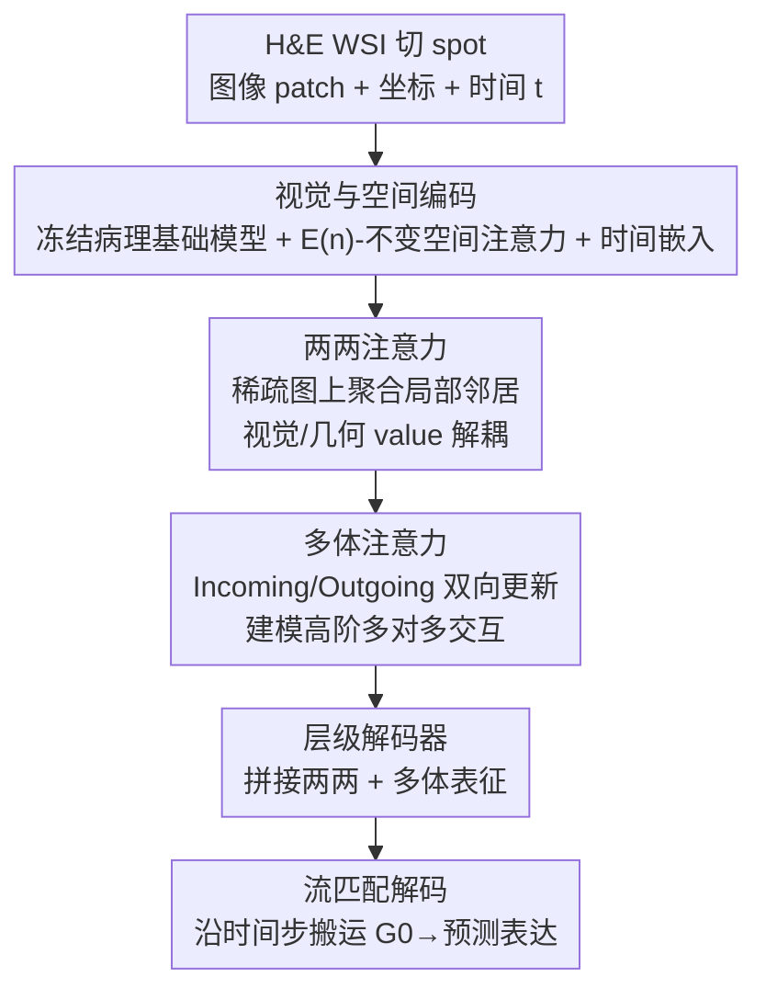

# Predicting Spatial Transcriptomics from Histology Images via High-Order Multi-Cell Interaction Modeling

**会议**: CVPR 2026  
**论文**: [CVF Open Access](https://openaccess.thecvf.com/content/CVPR2026/html/Sun_Predicting_Spatial_Transcriptomics_from_Histology_Images_via_High-Order_Multi-Cell_Interaction_CVPR_2026_paper.html)  
**代码**: 无（原文未提供）  
**领域**: 计算生物学 / 空间转录组学 / 病理图像  
**关键词**: 空间转录组学, 多细胞交互, 多体注意力, 流匹配, 基因表达预测

## 一句话总结
MCToGene 针对「从 H&E 病理图预测空间基因表达」时现有方法只建模单 spot 或两两邻居、抓不住多细胞间多对多协同/拮抗的痛点，提出用**多体注意力（many-body attention）**显式建模高阶跨细胞交互，并用**层级耦合模块**把两两注意力与多体注意力串起来控制组合爆炸，在 HEST-1k 与 STImage-1K4M 上相对最强基线提升约 7.85%。

## 研究背景与动机

**领域现状**：空间转录组学（spatial transcriptomics, ST）能在保留组织空间结构的同时量化基因表达，揭示细胞-细胞通讯和微环境组织。但 ST 采集成本高、通量低、需要专门仪器；而 H&E 染色全切片图像（WSI）廉价易得。于是「从 WSI 反推空间基因表达」成了热门方向：把组织切成一个个 spot（带坐标的图像 patch），预测每个 spot 的基因表达谱。

**现有痛点**：现有方法分两类。**spot-based**（如 STNet、UNI）独立编码每个局部 patch 回归表达，把 spot 当成条件独立、严重低估了空间依赖。**slide-based**（如 HisToGene、TRIPLEX、STFlow）会聚合更广上下文，但大多依赖**两两消息传递**或只对最近邻做注意力，靠堆深度近似高阶效应，仍抓不住多对多、多细胞的依赖。

**核心矛盾**：真实组织微环境里，一个细胞的表达是被周围**多个**邻居细胞**联合**调控的，存在协同（synergistic）与拮抗（antagonistic）这类多体效应；但把两两机制朴素地扩到高阶会带来组合爆炸——边数和注意力 token 随交互阶数 $k$ 超线性增长，全局多体注意力在 WSI 尺度上算不动、装不下。所以既要多体表达力、又要可计算，二者难以兼得。

**本文目标**：设计一个既保留多体建模表达力、又在 WSI 尺度上可行（控住计算与显存）的高阶多细胞交互框架。

**切入角度**：先用距离先验构造稀疏化空间图，把多体注意力只施加在选定的邻居集合上；再用层级耦合把「两两筛选」和「多体聚合」分工串联，避免对全部 spot 做全局多体注意力。

**核心 idea**：用多体注意力把多对多跨细胞依赖建成一等公民，配合 pairwise→many-body 的层级耦合控制组合代价，并整体放进流匹配（flow matching）生成框架里平滑地从噪声生成表达。

## 方法详解

### 整体框架
MCToGene 把 ST 预测建模成一个**流匹配生成**问题：组织虽是单帧快照，但底层细胞状态在空间上平滑变化，于是学一个连续概率流，把简单基分布（从零膨胀负二项分布 ZINB 采的稀疏先验 $G_0$）平滑搬运到目标基因表达 $G_1$。给定 spot 坐标 $C$ 和图像 patch $I$，模型学一个时间相关的速度场 $f_\theta$，优化标准流匹配目标 $\min_\theta \mathbb{E}\|f_\theta(G_t,I,C,t)-G_1\|^2$，中间态 $G_t=(1-t)G_0+tG_1$。具体流程是：图像 patch 先过冻结的病理基础模型（UNI）拿视觉特征，坐标过 E(n)-不变的空间注意力编码，再注入正弦时间嵌入；然后在稀疏化空间图上，**先**用两两注意力聚合局部邻居、Readout 汇总局部上下文，**再**用多体注意力建模三元/高阶跨细胞交互；最后层级解码器把两两表征和多体表征拼接、解码出每个 spot 的基因表达。训练用真值 $G$ 学轨迹与向量场，推理时只给 $C,I$、从 $G_0$ 迭代搬运到目标。

### 关键设计

**1. 流匹配生成框架：把表达预测当成噪声到数据的平滑搬运**

痛点是：ST 只在单一时刻采样，但底层细胞状态在空间上是连续变化的，直接回归容易丢掉这种平滑结构。MCToGene 改用流匹配——学一个速度场把基分布搬到表达分布。基分布 $G_0$ 特意从零膨胀负二项分布（ZINB）采样以反映基因表达的稀疏性，目标 $G_1$ 是真值表达，中间态线性插值 $G_t=(1-t)G_0+tG_1$。训练时模型同时学概率轨迹与向量场；推理时把 $t$ 固定为 0、从 $G_0$ 出发迭代搬运到目标。配合时间条件嵌入（公式 5–8 的正弦频率 $\omega_k$），模型能在不同噪声阶段切换关注点：高噪声早期靠全局语义和粗空间布局稳住方向，中期转向关系/结构细节保证空间一致，低噪声后期才抠细粒度线索做高质量合成。

**2. 两两注意力：解耦视觉与几何 value，打好高阶建模的地基**

准确建好两两依赖是高阶交互的基础。MCToGene 用一个 MLP 增强的两两注意力建模每个 spot 与邻居的局部交互：把图像特征投成 query $Z_{Q,i}$ 和 key $Z_{K,j}$，注意力权重由 $A_{ij}=\text{Softmax}_i(\text{MLP}(Z_{Q,i}\|Z_{K,j}\|C_{i\to j}\|\Delta Y_{t,ij}))$ 算得，其中 $C_{i\to j}$ 编码两 spot 的相对空间关系、$\Delta Y_{t,ij}=Y_{t,i}-Y_{t,j}$ 是它们在时刻 $t$ 的表达差。关键巧思是把 value **解耦**成视觉分量 $V_{\text{image}}$（图像内容）和几何分量 $V_{\text{spatial}}$（空间结构），让语义信号和几何信号能选择性融合：$Z^{\text{pair}}_i=\text{MLP}(\sum_{j\in N(i)}A_{ij}Z_{V,j}\|\sum_{j\in N(i)}A_{ij}C_{i\to j})+p_i$。相比标准注意力只融单一 value，这种解耦能更精细地兼顾视觉语义与几何上下文。

**3. 多体注意力：用 Incoming/Outgoing 双向更新显式建模多对多交互**

这是论文的核心。两两注意力只能描述 spot 到 spot 的直接依赖，表达不了「多个邻居如何**联合**调控一个目标」的高阶关系。多体注意力以两两输出 $Z^{\text{pair}}$ 为输入，先做一个 Readout 把每个节点的局部邻域池化进社区上下文，再把两两特征抬升到三元（triplet）级交互。它用两条对称路径：**Incoming Update** 把节点对 $(i,j)$ 关联到所有其他节点 $k$，$o^{\text{in}}_{ij}=\sum_k a^{\text{in}}_{ijk}v^{\text{in}}_{jk}$，注意力权重 $a^{\text{in}}_{ijk}=\text{softmax}_k(\frac{1}{\sqrt d}q^{\text{in}}_{ij}\cdot p^{\text{in}}_{jk}+b^{\text{in}}_{ik})\times\sigma(g^{\text{in}}_{ik})$，其中偏置 $b^{\text{in}}_{ik}$ 和门控 $g^{\text{in}}_{ik}$ 来自第三条关系 $e_{ik}$ 的 embedding，引入结构先验与非线性调制；**Outgoing Update** 走反方向，把 $(i,j)$ 关联到 $(i,k)$ 以强制关系对称、补全高阶表征。多头下把 inner/outer 输出拼接投影成多体表征 $Z^{\text{many}}_i=\text{MLP}(\frac{1}{|N(i)|}\sum_{j\in N(i)}(o^{\text{in}}_{ij}\|o^{\text{out}}_{ij}))$。双向更新让网络学到前向/反向的双向多细胞依赖，更贴合生物结构里协同/竞争的本质。

**4. 层级耦合与解码器：两两筛选 + 多体聚合，控住组合爆炸**

朴素地把两两机制扩到高阶会让边数和 token 随阶数 $k$ 超线性增长，WSI 尺度上算不动。层级交互模块的思路是分工：两两注意力先在稀疏图上做局部「筛选」，把范围收窄后再交给多体注意力做多对多「聚合」，从而在保留多体表达力的同时大幅压低计算与显存。解码端先用轻量 MLP 对齐两路通道维度 $\tilde Z^{\text{pair}}=\text{MLP}(Z^{\text{pair}})$、$\tilde Z^{\text{many}}=\text{MLP}(Z^{\text{many}})$，再拼接解码出表达 $Y'=\text{Decoder}(\tilde Z^{\text{pair}}\|\tilde Z^{\text{many}})$。这种「两两 + 多体」层级耦合正是 MCToGene 能在高分辨率 WSI 上兼顾精度与可扩展的关键。

### 损失函数 / 训练策略
训练用标准流匹配目标 $\min_\theta \mathbb{E}_{t,G_0,G_1}\|f_\theta(G_t,I,C,t)-G_1\|^2$，时间 $t\sim U[0,1]$，中间态线性插值，$G_0$ 取自 ZINB 先验以匹配表达稀疏性。图像编码器用冻结的病理基础模型（UNI），空间编码沿用 STFlow 的 E(n)-不变注意力以抵抗切片制备带来的旋转/平移/反射等批次效应。所有实验跑三个随机种子、报均值±标准差。

## 实验关键数据

评测两类任务：基因表达预测与 biomarker 预测。数据集为 HEST-1k（10 个官方 benchmark、患者级分层、k 折交叉验证）和 STImage-1K4M（按器官选癌种、slide/患者 8:1:1 划分、无跨片/跨患者重叠）。指标：对每个 spot 的 top-50 高变基因算预测与实测表达的 Pearson 相关（PCC），按基因平均再取均值。

### 主实验

基因表达预测（PCC，节选若干癌种 + 平均，加粗为最优）：

| 数据集/癌种 | BLEEP | TRIPLEX | STFlow | MCToGene |
|------|-------|---------|--------|----------|
| HEST·COAD | 0.303 | 0.319 | 0.326 | **0.410** |
| HEST·LUNG | 0.588 | 0.601 | 0.610 | **0.636** |
| HEST·Average | 0.368 | 0.395 | 0.415 | **0.435** |
| STImage·Prostate | 0.167 | 0.148 | 0.210 | **0.283** |
| STImage·Average | 0.232 | 0.252 | 0.293 | **0.316** |

MCToGene 在两数据集平均上分别相对最强基线提升约 4.82% 与 7.85%；在 spot 密集的难癌种（如 COAD，>4000 spots）增益尤其大（0.326→0.410，+25.8%），印证「显式多细胞建模在高空间复杂度下更有用」。对比之下，全局 all-to-all 注意力（GigaPath-slide）在大 slide 上频繁 OOM，证明可扩展性是真问题。

Biomarker 预测（4 个标志物的平均相关）：

| 模型 | GATA3 | ERBB2 | UBE2C | VWF | Average |
|------|-------|-------|-------|-----|---------|
| TRIPLEX | 0.853 | 0.832 | 0.749 | 0.612 | 0.762 |
| STFlow | 0.860 | 0.844 | 0.772 | 0.666 | 0.786 |
| MCToGene | **0.871** | **0.867** | **0.793** | **0.692** | **0.806** |

### 消融实验

组件消融（HEST 部分癌种 PCC）与开销对比：

| 配置 | SKCM | READ | HCC | LUNG | LYMPH | 说明 |
|------|------|------|-----|------|-------|------|
| Pair only | 0.697 | 0.240 | 0.116 | 0.608 | 0.302 | 只两两注意力 |
| MB only | 0.678 | 0.253 | 0.123 | 0.624 | 0.302 | 只多体注意力 |
| Pair+MB, w/o coupled | 0.703 | 0.240 | 0.120 | 0.617 | 0.303 | 两路不耦合 |
| Pair+MB, hierarchical | **0.711** | **0.255** | **0.133** | **0.636** | **0.316** | 层级耦合（完整） |

开销方面：MCToGene（Pair only）显存约 6166 MB、1.21 s/epoch，与 STFlow（6164 MB / 1.35 s）相当，而 TRIPLEX 高达 16368 MB / 9.13 s；加上多体模块后显存升到约 8071 MB，仍远低于全局注意力方法。

### 关键发现
- **层级耦合是增益主因**：单独 Pair 或单独 MB 都不如两者层级耦合；且「Pair+MB 不耦合」几乎等同 Pair only，说明把两两筛选与多体聚合**有机串联**才是关键，而非简单相加两个模块。
- **越密越赚**：spot 密度越高（IDC/COAD）增益越大，正好对应高阶多细胞协同最丰富的场景，反向佐证多体建模抓到了真实生物信号。
- **可扩展性是硬约束**：全局 all-to-all 注意力在大 slide 上 OOM，而 MCToGene 靠稀疏图 + 层级耦合把显存压到与两两方法同级，使 WSI 尺度多体建模真正可行。

## 亮点与洞察
- **把「多细胞多对多」做成一等公民**：用 Incoming/Outgoing 双向多体注意力显式建三元及以上交互，配合来自第三关系的偏置与门控注入结构先验，是对「只会两两消息传递」的 GNN/注意力的实质性升级，思路可迁移到任何需要高阶关系的图建模（社交、分子、交通）。
- **value 解耦的小巧思**：把两两注意力的 value 拆成视觉分量和几何分量分别聚合，让语义与几何信号能选择性融合，是低成本提精度的可复用 trick。
- **流匹配 + ZINB 先验的搭配**：用 ZINB 基分布匹配基因表达的稀疏性、再用流匹配平滑搬运，把生成式视角自然引入 ST 预测，比纯回归更契合数据特性。

## 局限与展望
- 多体注意力即使在稀疏图上仍比纯两两方法多约 30% 显存（8071 vs 6166 MB），交互阶数进一步提高（四体及以上）时的可扩展性论文未充分探讨。
- ⚠️ 多体注意力的具体公式（Incoming/Outgoing 的 query/key 推导、门控项）部分依赖图示，细节以原文与 Appendix 为准。
- 依赖冻结的病理基础模型（UNI）作图像编码器，最终性能受其表征质量制约；换更强/更弱骨干的敏感性未系统报告。
- 稀疏图由距离先验构造，邻居集合的选择（半径/kNN 阈值）对高阶交互覆盖面的影响值得更细的分析。

## 相关工作与启发
- **vs STFlow**：两者都用流匹配且共享 E(n)-不变空间编码，但 STFlow 只做两两交互，在邻域结构复杂的癌种上吃亏；MCToGene 加多体注意力后在 COAD 等难癌种增益明显（平均 0.415→0.435）。
- **vs TRIPLEX**：TRIPLEX 用多分辨率编码器 + 特征融合，但仍是局部/两两范式，且显存开销大（16368 MB）；MCToGene 以更低开销取得更高 PCC 与 biomarker 相关。
- **vs scTensor / scHyper**：这些工作也建模高阶细胞通讯（张量/超图），但 scHyper 来自非空间 scRNA-seq、缺空间约束；MCToGene 把高阶建模放进空间组织上下文并控住组合爆炸，更贴合 WSI 尺度的 ST 预测。

## 评分
- 新颖性: ⭐⭐⭐⭐ 把多体（many-body）注意力 + 层级耦合显式引入 ST 预测，思路清晰且对症，但多体/高阶建模在图学习里已有先例。
- 实验充分度: ⭐⭐⭐⭐⭐ 两大数据集多癌种、含基因表达与 biomarker 两任务、组件消融 + 开销对比 + 可视化齐全，三种子报均值±方差。
- 写作质量: ⭐⭐⭐⭐ 动机到方法递进清楚，多体注意力部分公式较密、对图依赖较重，初读略吃力。
- 价值: ⭐⭐⭐⭐ 用廉价 H&E 反推空间表达本身有强应用价值，多体建模 + 可扩展设计对真实 WSI 尺度部署有现实意义。

<!-- RELATED:START -->

## 相关论文

- [\[CVPR 2026\] HINGE: Adapting a Pre-trained Single-Cell Foundation Model to Spatial Gene Expression Generation from Histology Images](adapting_a_pre-trained_single-cell_foundation_model_to_spatial_gene_expression_g.md)
- [\[CVPR 2026\] From Spots to Pixels: Dense Spatial Gene Expression Prediction from Histology Images](from_spots_to_pixels_dense_spatial_gene_expression_prediction_from_histology_ima.md)
- [\[CVPR 2026\] FEAST: Fully Connected Expressive Attention for Spatial Transcriptomics](feast_fully_connected_expressive_attention_for_spatial_transcriptomics.md)
- [\[CVPR 2026\] Cross-Slice Knowledge Transfer via Masked Multi-Modal Heterogeneous Graph Contrastive Learning for Spatial Gene Expression Inference](cross-slice_knowledge_transfer_via_masked_multi-modal_heterogeneous_graph_contra.md)
- [\[CVPR 2026\] HyperST: Hierarchical Hyperbolic Learning for Spatial Transcriptomics Prediction](hyperst_hierarchical_hyperbolic_learning_for_spatial_transcriptomics_prediction.md)

<!-- RELATED:END -->
