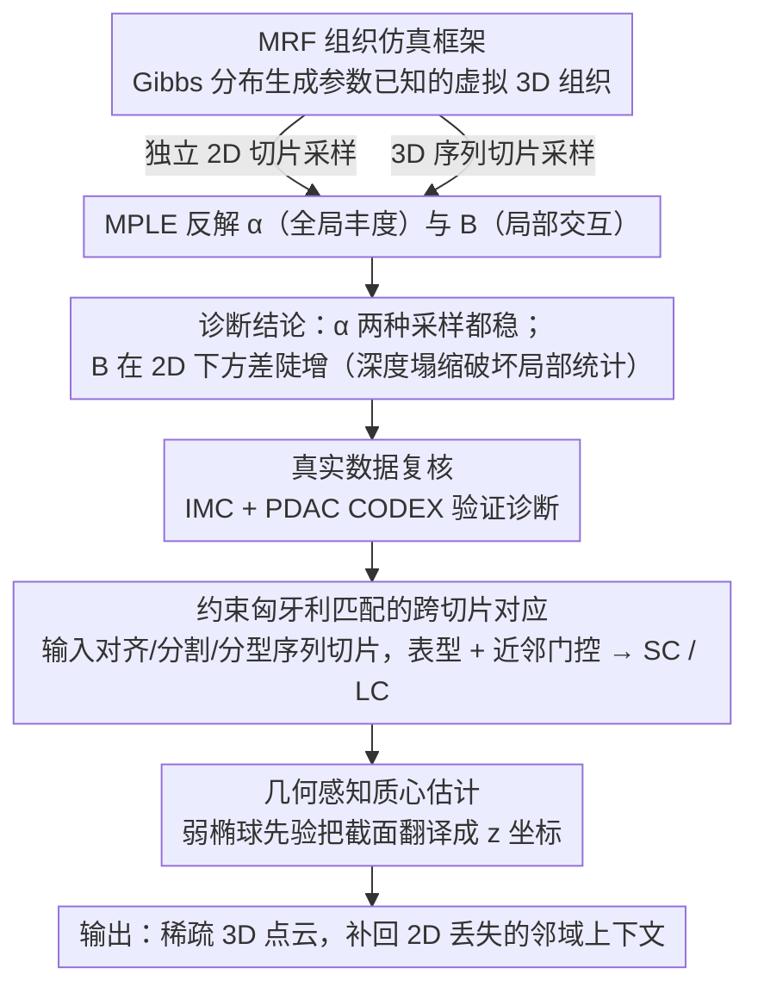

# Sampling-Aware 3D Spatial Analysis in Multiplexed Imaging

**会议**: CVPR 2026  
**arXiv**: [2604.07890](https://arxiv.org/abs/2604.07890)  
**代码**: 无  
**领域**: 计算生物
**关键词**: 空间蛋白质组学, 3D重建, 采样几何, 多重成像, 空间统计

## 一句话总结

本文系统研究了多重成像中采样几何（2D切片 vs 3D序列切片）对空间统计量恢复精度的影响，并提出了一种几何感知的稀疏3D重建模块，在有限的成像预算下实现可靠的深度感知空间分析。

## 研究背景与动机

1. **领域现状**：高度多重化显微成像技术（如CODEX、IMC）可以在单细胞分辨率下进行数十种分子标记的空间分析，但大多数分析仍依赖于二维切片。
2. **现有痛点**：密集的体积数据采集在空间蛋白质组学中成本高且技术难度大。实践者通常在固定成像预算下需要在2D切片（最大化覆盖）和3D序列切片（保留部分深度连续性）之间做选择。
3. **核心矛盾**：2D采样会导致"深度塌缩"（depth collapse）——沿z轴的邻域上下文丢失，使得局部空间统计量（如细胞聚类和细胞-细胞相互作用）出现高方差，但全局统计量（如细胞类型丰度）则相对稳定。这种差异性此前并未被系统量化。
4. **本文目标** (1) 量化采样几何对全局 vs 局部空间统计恢复的影响；(2) 设计一种轻量级重建模块支持稀疏3D分析。
5. **切入角度**：作者从视觉采样理论出发，将空间蛋白质组学建模为马尔可夫随机场（MRF）上的结构化子采样问题。
6. **核心 idea**：采样几何决定了哪些空间关系可被观测，因此应根据目标统计量选择采集策略，并通过稀疏3D重建弥补2D采样的不足。

## 方法详解

### 整体框架

这篇工作要回答两个问题：在固定的成像预算下，2D 切片和 3D 序列切片到底各损失了哪类空间信息？以及当只能拿到稀疏序列切片时，能不能廉价地把深度维度补回来？围绕这两点，全文由三块串成一条逻辑链。第一块是**仿真控制实验**：用一个参数已知的马尔可夫随机场（MRF）生成 3D 组织，再用不同采样几何去"切"它，看哪些统计量被恢复、哪些被破坏——因为只有仿真才有 ground truth，能干净地隔离采样几何这一个变量。第二块是**真实数据验证**，把仿真结论拿到密集采样的 IMC 和 PDAC CODEX 数据上复核。第三块是**稀疏 3D 重建模块**：输入是已经对齐、分割、分型好的序列切片，通过跨切片细胞对应加几何先验，输出一份稀疏 3D 点云，把 2D 采样丢掉的邻域上下文部分补回。

### 关键设计

**1. MRF 组织仿真框架：用参数已知的虚拟组织来隔离采样几何的影响**

真实组织拿不到"真值"参数，于是无法判断一个统计量恢复得差到底是采样害的还是别的因素。这里在 3D 晶格图上定义一个 Gibbs 分布来造虚拟组织，

$$p(\mathbf{x}\mid\boldsymbol{\alpha}, \mathbf{B}) \propto \exp\Big(\sum_i \alpha_{x_i} + \sum_{(i,j)} B_{x_i, x_j}\Big),$$

其中 $\boldsymbol{\alpha}$ 是单点势、控制各细胞类型的**全局丰度**，$\mathbf{B}$ 是成对势、控制相邻细胞之间的**局部交互**。组织生成后，分别用独立 2D 切片和 3D 序列切片去采样，再用最大伪似然估计（MPLE）从采样数据里反解 $\boldsymbol{\alpha}$ 和 $\mathbf{B}$，比较恢复误差。关键在于这套设置把"全局"和"局部"两类参数显式拆开，于是能直接看到二者对采样几何的敏感度差异：实验里 $\boldsymbol{\alpha}$ 在两种采样下都稳，而 $\mathbf{B}$ 在独立 2D 采样下误差陡增——这正是后文"深度塌缩破坏局部统计量"的量化证据。

**2. 约束匈牙利匹配的跨切片对应：把相邻切片里的同一个细胞认出来**

对稀疏序列切片做像素级配准既不可行也没必要，真正需要的只是知道"上一张切片里这个点和下一张里那个点是不是同一个细胞"。做法是先算相邻切片间细胞质心的面内欧氏距离矩阵 $D_{ij}$，再往上加两道约束把不可能的配对掐掉：一是**表型一致性**，类型不同的细胞对直接把距离设成 $\infty$；二是**细胞类型特异的近邻门控**，根据该类型经验尺寸分布给一个合理的最大跨切片位移，超出就不许配。约束后的 $D_{ij}$ 交给匈牙利算法求一对一最优匹配，匹配上的细胞标为共享细胞（SC，跨切片出现），没匹配上的标为孤立细胞（LC，只在单张切片出现）。比如一个直径约 8 μm 的细胞在 4 μm 间距下大概率被切到两张相邻切片、配成一个 SC；而一个恰好夹在切片缝里只露一面的小细胞则留作 LC。这样的表型加距离约束既轻量，又对密集区域的歧义配对有鲁棒性。

**3. 几何感知质心估计：用弱椭球先验把匹配关系翻译成 3D 坐标**

光有"谁和谁是同一个细胞"还定位不了深度，得有个形状假设把截面信息变成 z 坐标。这里把细胞近似成椭球，它的截面面积会随切割面偏离质心而变小，于是从经验面积分布里就能估出每类细胞的尺寸参数。这个尺寸参数一处两用：既给设计 2 的匹配定下距离容忍度，又用来正则化深度推断。对 SC，多个切片截面提供了多个约束，可以联立估出质心的 z 坐标；对 LC，则保留其面内坐标、把深度约束在它所在切片的相邻区间内。椭球先验虽弱，但目标本就不是精确体积重建，而是恢复到邻域级别的空间关系够用即可——后文实验里 4 μm 间距下平均定位误差仅 2.99 μm，约为细胞直径的 37%，印证了这个"够用就好"的取舍是成立的。

### 损失函数 / 训练策略

整套方法不含深度学习训练：跨切片对应是匈牙利算法精确求解的组合优化；MRF 参数则用 MPLE 优化，并加 $\lambda\,\|\mathbf{B}\|_F^2$ 正则项抑制成对势的过拟合。

## 实验关键数据

### 主实验

在密集采样IMC数据集（2μm间距，Kuett et al.）上验证重建模块：

| 轴向间距 Δz | 唯一细胞覆盖率 | 共享细胞比例 | 平均定位误差 |
|-------------|---------------|-------------|-------------|
| 2 μm (参考) | 100% | 高（大量重叠） | - |
| 4 μm | 92.6% | 中等 | 2.99 μm (std 3.86) |
| 6 μm | 降低 | 较低 | 增大 |
| 10 μm | 显著降低 | 很低 | 显著增大 |

定位误差远小于典型细胞直径（如中性粒细胞 ~8 μm），说明稀疏重建保留了邻域级几何关系。

### 消融实验

| 分析类型 | 2D采样风险 | 推荐采集策略 |
|---------|-----------|-------------|
| 丰度/组成 | 低 | 2D切片（最大化覆盖） |
| 罕见群体检测 | 中等（依赖聚类） | 混合策略 |
| 细胞-细胞交互 | 高（深度塌缩混淆邻域） | 稀疏序列+重建 |
| 空间聚类/微环境 | 高 | 稀疏序列+重建 |
| 结构级分析 | 极高（碎片化） | 稀疏序列+重建 |

### 关键发现

- 全局丰度在独立2D和序列采样下都能稳定恢复，但交互结构（邻域富集）在2D采样下方差极高——同一组织体积中，切片选择可改变特定交互是否被判定为"存在"
- 在PDAC CODEX数据集上，2D距离测量系统性地大于3D距离（如导管-血管和上皮-中性粒细胞对），说明平面测量因忽略面外近邻而产生偏差
- 4 μm间距是实用的折中点：保留92.6%的唯一细胞，定位误差仅为细胞直径的约37%

## 亮点与洞察

- **采样几何-统计量匹配原则**：首次系统量化了"全局统计量对采样鲁棒、局部统计量对采样敏感"的规律，并凝练为实用决策表，直接指导实验设计
- **轻量级重建设计**：不做密集体积重建，而是用约束匹配+弱形状先验从稀疏切片恢复3D点云，这种"够用就好"的思路可迁移到其他稀疏采样场景
- **从碎片到连通结构**：3D重建将2D中不连通的导管截面复原为连通对象，使结构级坐标系和沿结构梯度分析成为可能

## 局限与展望

- 重建模块依赖准确的切片对齐和可靠的细胞分型，在严重拥挤或表型模糊时对应关系会退化
- 椭球先验过于简单，不能捕捉复杂细胞形态（如树突状细胞的长突起）
- 未量化重建不确定性如何传播到下游空间统计量
- 可改进方向：引入学习式对应模型替代匈牙利匹配；集成3D感知的细胞分型；联合优化重建与统计估计

## 相关工作与启发

- **vs Kuett et al. (密集3D IMC)**：他们展示密集3D重建的生物价值，但假设昂贵的采集条件；本文关注采样受限设置，提供何时需要3D的诊断工具
- **vs CODA（端到端重建管线）**：CODA做全流程密集重建；本文的模块化设计仅处理跨切片对应，更轻量且与已有预处理工具兼容
- 本文的采样分析框架可启发其他"采样受限的空间推断"问题，如遥感中的稀疏观测融合

## 评分

- 新颖性: ⭐⭐⭐⭐ 将采样几何对空间统计的影响系统形式化为MRF子采样问题，视角独特
- 实验充分度: ⭐⭐⭐⭐ 仿真+真实IMC+CODEX三级验证，定量分析扎实
- 写作质量: ⭐⭐⭐⭐⭐ 逻辑链清晰，图表设计精良，决策表实用
- 价值: ⭐⭐⭐⭐ 对空间蛋白质组学实验设计有直接指导意义，但受众相对较窄

<!-- RELATED:START -->

## 相关论文

- [\[AAAI 2026\] Apo2Mol: 3D Molecule Generation via Dynamic Pocket-Aware Diffusion Models](../../AAAI2026/computational_biology/apo2mol_3d_molecule_generation_via_dynamic_pocket-aware_diff.md)
- [\[CVPR 2026\] Advancing Cancer Prognosis with Hierarchical Fusion of Genomic, Proteomic and Pathology Imaging Data from a Systems Biology Perspective](advancing_cancer_prognosis_with_hierarchical_fusion_of_genomic_proteomic_and_pat.md)
- [\[CVPR 2026\] FEAST: Fully Connected Expressive Attention for Spatial Transcriptomics](feast_fully_connected_expressive_attention_for_spatial_transcriptomics.md)
- [\[CVPR 2026\] HyperST: Hierarchical Hyperbolic Learning for Spatial Transcriptomics Prediction](hyperst_hierarchical_hyperbolic_learning_for_spatial_transcriptomics_prediction.md)
- [\[ICLR 2026\] Thompson Sampling via Fine-Tuning of LLMs](../../ICLR2026/computational_biology/thompson_sampling_via_fine-tuning_of_llms.md)

<!-- RELATED:END -->
