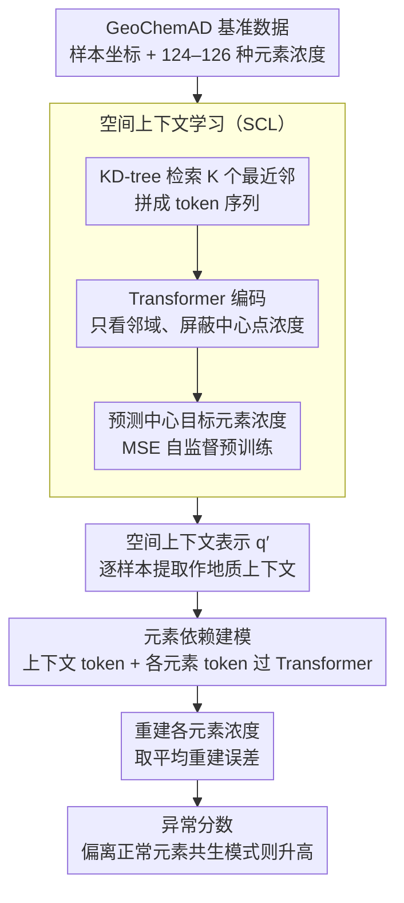

# GeoChemAD: Benchmarking Unsupervised Geochemical Anomaly Detection for Mineral Exploration

**会议**: CVPR 2026  
**arXiv**: [2603.13068](https://arxiv.org/abs/2603.13068)  
**代码**: [https://github.com/yihaoding/geochemad](https://github.com/yihaoding/geochemad)  
**领域**:科学计算
**关键词**: 地球化学异常检测, 无监督学习, Transformer, 基准数据集, 矿产勘探

## 一句话总结

提出 GeoChemAD 开源基准数据集和 GeoChemFormer 框架，通过空间上下文学习与元素依赖建模实现无监督地球化学异常检测，在8个子集上平均 AUC 达到 0.7712。

## 研究背景与动机

地球化学异常检测（GAD）在矿产勘探中至关重要——通过发现元素浓度偏离区域基线的异常来指示矿化区域。表层地球化学分布是原始就位和次生散布过程(风化、侵蚀)的产物，采集的数据可能反映多阶段、多来源的成矿过程，导致高度空间不连续性、不确定性和随机性。现有研究存在三个关键问题：

**数据不可复现**：大多数研究使用私有数据集（主要来自中国地质调查局），无法进行公平对比和结果复现。部分论文甚至遗漏关键元数据

**场景单一**：通常只关注单一区域、单一采样源（沉积物）和单一目标元素（金），模型在不同空间尺度、采样密度和元素类型下的泛化能力未知

**异常与目标脱节**：无监督方法检测到的异常可能与实际矿化无关或与目标元素不相关——这是实际勘探中的核心痛点

传统统计方法(PCA、因子分析)难以捕获复杂非线性模式。深度学习方法如AE/VAE能建模成分关系但忽略空间依赖。CNN受限于固定感受野，Graph模型受限于深度和表征能力。Transformer在GAD中的应用尚处初期，缺乏对自监督预训练的系统研究。

## 方法详解

### 整体框架

这篇论文一手做基准、一手做方法。基准 GeoChemAD 把地球化学异常检测从私有数据、单区域单元素的混乱状态里拉出来，提供首个标准化的多场景开源数据集；方法 GeoChemFormer 则用两阶段把"空间"和"成分"两件事拆开学——先用空间上下文学习（SCL）从邻域样本学到地质空间表示，再在第二阶段做元素依赖建模、用重建误差当异常分数。这样异常检测既吃得到空间不连续性，又能关联到目标矿化元素。

### 关键设计

**1. GeoChemAD 基准：把 GAD 评测从"各说各话"变成可复现**

领域长期卡在数据不公开、场景单一上——大多数研究用私有数据（主要来自中国地质调查局），连关键元数据都常缺失，没法公平对比和复现。GeoChemAD 改用西澳大利亚地质调查局（GSWA）加速地球科学计划的公开数据，含 8 个子集、覆盖 3 种采样源（沉积物 2、岩屑 3、土壤 3）、4 种目标元素（Au、Cu、W、Ni），空间尺度从 6 km² 到 8500 km²。每个子集给出地球化学样本 CSV（元数据 + 空间坐标 + 124–126 种元素浓度）和已知矿化位点 CSV，刻意保留 -9999、-0.5 这类异常值以维护数据完整性、统一用 GDA2020 坐标系。相比多为单区域、单元素、数据不公开的已有研究，这是首个标准化、多场景的开源 GAD 基准，未来方法终于能在同一把尺子上比。

**2. 空间上下文学习（SCL）：用"从邻域猜中心"逼模型学空间规律**

表层地球化学分布是原始就位加风化侵蚀的产物，空间高度不连续，直接建模容易记住噪声而非学到地质结构。SCL 的做法是对查询位置 $p_i$ 用 KD-tree 检索 $K$ 个最近邻，拼成 token 序列 $\mathcal{S} = [\mathbf{e}, \mathbf{q}_i, \mathbf{t}_1, \ldots, \mathbf{t}_K]$，其中 $\mathbf{e}$ 是目标元素 token、$\mathbf{q}_i$ 是查询位置编码、$\mathbf{t}_j = [\Delta x_j, \Delta y_j, \mathbf{f}_j]$ 带相对空间偏移和浓度向量；Transformer 编码后得到空间上下文表示 $\mathbf{q}_i'$，训练目标是预测查询点的目标元素浓度 $\mathcal{L}_{\text{sc}} = \frac{1}{N}\sum_{i=1}^{N}(\hat{y}_i - y_i)^2$。关键在于模型只能看邻域、看不到中心点自身浓度，于是被逼着去学"周边地质上下文如何决定中心"而不是简单记忆——和 masked 预测是同一套逼学习的思路。

**3. 元素依赖建模：偏离正常元素共生模式的就是异常**

矿化往往体现为多个元素的反常共生，单看一个元素抓不准。第二阶段把 SCL 学到的空间表示当作地质上下文 token，和各元素 token 拼接后过 Transformer 学元素间依赖，异常分数取所有元素的平均重建误差 $s_i = \frac{1}{C}\sum_{c=1}^{C}(x_{i,c} - \hat{x}_{i,c})^2$。在正常样本上学到的元素依赖模式，遇到偏离该模式的样本就重建不好、分数升高，从而把"和目标矿化相关的反常"挑出来，而不只是统计意义上的离群。

### 损失函数 / 训练策略

两阶段训练：第一阶段用 MSE 损失预训练 SCL（20–60 epochs），第二阶段用重建误差进行异常检测。评估指标为 AUC（20 次重复随机采样背景样本取平均）。数据预处理包括 CLR/ILR 变换处理成分封闭问题、PCA/因果发现/LLM 辅助特征选择、IDW/Kriging 空间插值。

## 实验关键数据

### 主实验

| 数据集 | GeoChemFormer (T2) | Vanilla Transformer (T1) | AE | VAE-GAN | 最佳基线 |
|--------|-------------------|--------------------------|------|---------|---------|
| sed1 | **0.7228** | 0.7111 | 0.5851 | 0.6843 | T1: 0.7111 |
| rock1 | **0.7844** | 0.7031 | 0.5516 | 0.6953 | T1: 0.7031 |
| soil1 | **0.8704** | 0.7242 | 0.5934 | 0.7124 | T1: 0.7242 |
| soil3 | **0.8334** | 0.6101 | 0.5544 | 0.6160 | VAE-CG: 0.6509 |
| **平均** | **0.7712** | 0.7147 | 0.7046 | 0.7279 | VAE-G: 0.7279 |

### 消融实验

| 配置 | 关键指标 | 说明 |
|------|---------|------|
| SCL预训练 20 epochs | rock2 AUC=0.919 | 小数据集快速收敛 |
| SCL预训练 40 epochs | sed1 AUC=0.743 | 沉积物数据需更多训练 |
| K=16 (邻域大小) | soil2最优 | 土壤样本适合紧凑邻域 |
| K=256 (邻域大小) | sed1最优=0.720 | 沉积物需更大空间上下文 |
| ILR变换 | 平均0.6788 | Transformer类模型最佳预处理 |
| LLM特征选择 | 平均0.7412 | 自动化特征选择优于人工 |

### 关键发现

- GeoChemFormer 在8个子集中5个取得最佳成绩，且方差最低（0.0039），稳定性强
- 空间上下文学习对性能提升至关重要，尤其在沉积物和土壤数据集上
- 数据预处理策略（特征选择、变换方式）对不同模型影响差异显著

## 亮点与洞察

- **填补领域空白**：提供首个公开、多区域、多元素、多采样源的GAD基准数据集
- **目标元素感知**：通过target-element token设计，使异常检测与目标矿化元素关联
- 两阶段设计解耦空间上下文和元素依赖，预训练策略自然且有效

## 局限与展望

- 数据仅来自**西澳单一地理区域**，其他大陆/地质背景(如热带风化环境、冰川地貌)的泛化性未验证
- 正样本（矿化位点）数量有限（7-32个），评估的统计稳健性受限，AUC可能波动较大
- 未考虑**时间维度**（不同时期采样的变化以及风化/侵蚀的动态影响）
- 部分子集上深度生成模型（AE）仍优于GeoChemFormer（如rock2 AUC 0.9185 vs T2 0.8050, rock3 AUC 0.8446 vs T2 0.7302），说明Transformer在小样本/高对比度场景不一定最优
- GeoChemFormer的空间上下文学习依赖KD-tree检索K近邻，在大规模数据集(>10万样本)上的可扩展性未讨论
- 特征选择策略(PCA/CD/LLM)的选择对结果影响大，但论文未给出自动选择最优策略的指导

## 相关工作与启发

- **vs 传统统计方法(Z-score, Mahalanobis)**：平均AUC仅0.50-0.53，无法捕获地球化学数据中的复杂非线性模式
- **vs AE/VAE系列**：AE在某些子集上表现优异(rock2达0.9185)，但跨数据集方差大(0.0220)，稳定性差。GeoChemFormer通过空间上下文学习实现更稳定的跨场景性能
- **vs VAE-GAN**：VAE-GAN平均AUC 0.7279且方差低(0.0041)，是非Transformer方法中最稳定的，但GeoChemFormer仍高出0.0433
- **vs 已有GAD深度学习研究(Yang2023, Yu2024等)**：这些工作用私有数据+单区域评估，无法公平对比。GeoChemAD的标准化数据集使未来对比成为可能
- 启发：SCL的"从邻域预测中心"策略类似masked预测范式，可迁移到其他地理空间异常检测(环境监测、城市热岛效应)。目标元素感知的设计理念——让模型关注"与什么相关的异常"而非"是否异常"——对任何领域的异常检测都有借鉴价值

## 评分

- 新颖性: ⭐⭐⭐ 方法设计合理但不算突破性，主要贡献在数据集
- 实验充分度: ⭐⭐⭐⭐⭐ 12种基线对比+多维度预处理分析+消融+案例分析，非常全面
- 写作质量: ⭐⭐⭐⭐ 结构清晰，数据集描述详尽
- 价值: ⭐⭐⭐⭐ 开源数据集对地球科学+AI交叉领域有重要推动作用

<!-- RELATED:START -->

## 相关论文

- [\[ICML 2026\] (Sparse) Attention to the Details: Preserving Spectral Fidelity in ML-based Weather Forecasting Models](../../ICML2026/earth_science/sparse_attention_to_the_details_preserving_spectral_fidelity_in_ml-based_weather.md)
- [\[AAAI 2026\] MdaIF: Robust One-Stop Multi-Degradation-Aware Image Fusion with Language-Driven Semantics](../../AAAI2026/earth_science/mdaif_robust_one-stop_multi-degradation-aware_image_fusion_with_language-driven_.md)
- [\[AAAI 2026\] RENEW: Risk- and Energy-Aware Navigation in Dynamic Waterways](../../AAAI2026/earth_science/renew_risk-_and_energy-aware_navigation_in_dynamic_waterways.md)
- [\[NeurIPS 2025\] Predicting Public Health Impacts of Electricity Usage](../../NeurIPS2025/earth_science/predicting_public_health_impacts_of_electricity_usage.md)
- [\[NeurIPS 2025\] A Probabilistic U-Net Approach to Downscaling Climate Simulations](../../NeurIPS2025/earth_science/a_probabilistic_unet_approach_to_downscaling_climate_simulat.md)

<!-- RELATED:END -->
