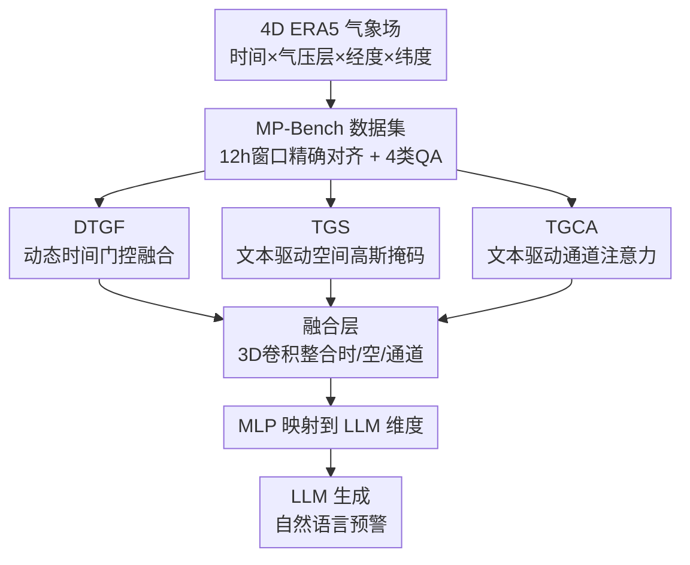

# MeteorPred: A Meteorological Multimodal Large Model and Dataset for Severe Weather Event Prediction

**会议**: CVPR 2026  
**论文**: [CVF Open Access](https://openaccess.thecvf.com/content/CVPR2026/html/Tang_MeteorPred_A_Meteorological_Multimodal_Large_Model_and_Dataset_for_Severe_CVPR_2026_paper.html)  
**代码**: https://github.com/tsluvjk/MeteorPred  
**领域**: 多模态VLM / 气象遥感  
**关键词**: 灾害天气预警, 多模态大模型, 4D气象数据, 即插即用融合模块, 文本驱动注意力

## 一句话总结
本文构建了首个大规模灾害天气预警多模态数据集 MP-Bench（42 万对 ERA5 气象场+预警文本），并提出能直接吃 4D 气象张量的多模态大模型 MMLM——通过三个分别作用于时间、空间、垂直气压层的即插即用融合模块，把高维气象数据对齐到 LLM 生成自然语言预警。

## 研究背景与动机
**领域现状**：当前灾害天气（暴雨、暴雪、冰雹、大风、寒潮、热浪、霜冻等）的预警仍高度依赖人工——数值天气预报（NWP）和 AI 气象模型先给出格点预报，再由预报员综合判读、起草、复核后对外发布。学界正在尝试端到端的"AI 气象站"系统，把最新 NWP 输出直接转成可发布的预警结论。

**现有痛点**：作者指出三个卡点。其一，现有灾害天气数据集规模小、事件单一、地理/时间覆盖窄，难以训练有泛化能力的模型；其二，高维气象数据与文本预警之间对齐不充分，很多工作把气象场压成日均值，时间分辨率被严重稀释，捕捉不到短时剧烈变化；其三，没有现成的多模态大模型能直接处理原始气象数据——主流做法是手动挑几个气压层、把 4D 格点拍扁或投影成 RGB 图喂给视觉编码器，这种过度简化丢掉了垂直结构、时间动态和变量间的物理关系。

**核心矛盾**：气象数据本质是 4D 张量（时间 × 气压层 × 经度 × 纬度），而现成 MLLM 的输入接口是为 2D 图像/视频设计的。强行把 4D 压成 2D，与"保留完整时空物理依赖"之间存在根本冲突。

**本文目标**：拆成两个子问题——(1) 造一个时间对齐精确、类别覆盖全、规模大的数据集；(2) 设计一个能原生吃 4D 气象输入、且能按文本查询动态聚焦关键时空通道的模型。

**切入角度**：作者不再"压缩适配编码器"，而是反过来给 LLM 加三个分别管时间、空间、垂直气压层的轻量融合模块，让模型自己在三个维度上做自适应特征筛选。

**核心 idea**：用三个即插即用的"文本/时间驱动"门控模块，把原始 4D 气象张量自适应融合成统一表示再喂给 LLM，从而绕开"压成 2D 图"的信息损失。

## 方法详解

### 整体框架
MMLM 的输入是某条预警发布时刻 $t$ 起未来 12 小时的全国多变量 ERA5 气象场（温度、湿度、降水、风速、气压，每个变量含 37 个气压层，共 185 个通道），输出是自然语言的灾害天气预警文本。原始 4D 张量并行送入三个即插即用模块——DTGF（时间门控）、TGS（文本驱动空间高斯掩码）、TGCA（文本驱动通道注意力），三路输出拼接后进入一个可学习的融合层（3D 卷积自适应整合时/空/通道特征），再经 MLP 映射到 LLM 的输入维度，最后由 LLM 生成预警句子。三个模块分别针对前面三个痛点：时间分辨率被稀释 → DTGF 抓关键时窗；空间定位不准 → TGS 按文本坐标聚焦；垂直通道冗余 → TGCA 按文本筛通道。

### 关键设计

**1. MP-Bench：用 12 小时窗口精确对齐气象场与预警文本**

针对"现有数据集小、且把气象场压成日均值丢时间分辨率"的痛点，作者基于中国气象局（CMA）2023–2024 两年、全国 2412 个站点的预警记录，配上欧洲中期天气预报中心的 ERA5 再分析场（0.25° 分辨率、37 个气压层），构建了 421,363 对数据，覆盖暴雨、暴雪、大风、寒潮、热浪、霜冻、冰雹七类灾害天气。关键在对齐策略：以每条预警发布时刻 $t$ 为参考点，抽取 $[t, t+11]$ 小时的完整气象场，**不做时间平均**，从而在时间轴上精确对齐——这是与 CLLMate（日均）、WeatherQA（1h）等数据集最大的区别（见表 1，MP-Bench 是唯一同时具备 42 万级文本、七类灾害、12h@1h 间隔对齐的）。清洗时把同站同类型、2 小时内发布的预警按最高级别合并，并按区域季节均匀采样 49,660 条"正常天气"负样本以缓解类别不均衡。配套设计了四类 QA：选择题（MC，七大类 A–G + 正常天气 H，每类再按蓝/红等级细分）、判断题（T/F）、区域灾害题（RSW）、全国灾害题（NSW，要求按 `[地名][天气类型][级别]` 结构化输出）。

**2. DTGF：用相邻时刻差分门控抓住灾害演变的关键时窗**

灾害天气的剧烈变化往往集中在某几个小时（如红色暴雨预警后前三小时最关键），均匀对待所有时刻会淹没信号。DTGF（Dynamic Time-Gated Fusion）先算相邻小时数据在通道维上的 L2 差分 $\Delta x_t = \lVert x_t - x_{t-1} \rVert_2$（$t=2,\dots,T$，首帧补零），再用 MLP+Sigmoid 把差分映射成门控权重 $g_t = \mathrm{Sigmoid}(\mathrm{MLP}(\Delta x_t)) \in [0,1]$，最后对时间 token 加权 $\tilde{x}_t = g_t \cdot x_t$。差分越大说明气象场变化越剧烈，门控权重越高，模型就把注意力放到突变时窗上。实验可视化显示，对红色暴雨预警，模块确实给发布后前三小时分配了更高权重，与气象场的物理演变一致。

**3. TGS：把文本里的地名映射成空间高斯掩码引导聚焦**

预警文本里通常点名具体地理位置，但模型无从知道该看气象场的哪一块。TGS（Text-Driven Gaussian Spatial Masking）从文本事件中抽出地理坐标 $(\phi_i, \lambda_i)$，用最近格点匹配映射到栅格索引 $(h_i, w_i)$，在每个点周围生成 2D 高斯权重 $G_i(h,w) = \exp\!\big(-\frac{(h-h_i)^2+(w-w_i)^2}{2\sigma^2}\big)$，再把 $N$ 个坐标的高斯叠加成总掩码 $M(h,w) = \sum_{i=1}^{N} G_i(h,w)$，对每个通道、每个时刻的空间特征加权。$\sigma$ 控制高斯宽度，决定聚焦范围。这样模型就被"拉"到文本指定的地理区域上，可视化显示掩码确实精准落在查询区域。

**4. TGCA：按文本-通道相似度筛掉冗余气压层通道**

五个气象要素各含 37 个气压层，堆叠成 185 个输入通道，存在大量冗余。TGCA（Text-Driven Channel Attention）让文本来决定哪些通道重要：先把文本嵌入 $y$ 经线性层投影到通道维 $P = \mathrm{Linear}(y)$，对 ERA5 张量做时空平均得到通道描述子 $V = \mathrm{Mean}(X)$，算文本-通道注意力 $\mathrm{Softmax}(VP^\top)$，再经 sigmoid 门控加权回原始特征 $Y = X \cdot \mathrm{Sigmoid}\big(\mathrm{Softmax}(VP^\top)\,P\big)$。本质是一种文本条件下的通道特征选择，让模型按当前查询动态强调相关气压层、抑制无关通道。

### 损失函数 / 训练策略
四个开源 backbone（Qwen2.5-VL-7B-Instruct、LLaVA-NeXT-Video-7B、Video-LLaVA-7B、InternVL3-8B）用 LoRA 在所有线性层微调，DTGF、TGCA 与融合层设为可学习组件。学习率 $5\times10^{-5}$，batch size 2，梯度累积 8 步，bf16 精度，8×A800（40GB）训练。2023 年数据作训练集、2024 年作测试集。

## 实验关键数据

### 主实验
Baseline 指用 3 个气压层数据微调的开源模型；MMLM 指用全部 185 通道 + 三个即插即用模块微调。前四项指标 0–100，NSW 的 Score 为 0–5（GPT-4o 按专家评分细则做 LLM-as-a-judge）。

| 模型配置 | MC-main Acc↑ | MC-main F1↑ | T/F Acc↑ | RSW Acc↑ | NSW Score↑ |
|----------|------|------|------|------|------|
| GPT-4o（闭源零样本） | 11.92 | 2.92 | 0.19 | 14.03 | 0.1 |
| Qwen2.5-VL Baseline（3通道） | 56.26 | 26.88 | 68.33 | 61.82 | 1.7 |
| Qwen2.5-VL **MMLM**（185通道+3模块） | **72.37** | **50.88** | **87.13** | **71.23** | **2.1** |

闭源 GPT-4o 几乎不具备理解原始气象数据的能力（T/F 仅 0.19%，远低于随机猜测）。换成 Qwen2.5-VL 的 MMLM 后，MC-main 精度比其 Baseline 提升 16+ 个百分点，Macro-F1 接近翻倍。所有四个 backbone 的 MMLM 版本在每个任务上都稳定超过对应 Baseline。⚠️ NSW 绝对分仍很低（最高 2.1/5），说明全国级结构化预警生成仍是极具挑战的开放任务。

### 消融实验
在 5000 个样本上消融三个模块（基于 Qwen2.5-VL）。✓ 表示启用该模块。

| DTGF | TGS | TGCA | MC-main Acc↑ | T/F Acc↑ | RSW Acc↑ | NSW Score↑ |
|------|-----|------|------|------|------|------|
| ✗ | ✗ | ✗ | 42.73 | 58.47 | 41.25 | 1.1 |
| ✓ | ✗ | ✗ | 53.28 | 57.23 | 47.30 | 1.2 |
| ✗ | ✗ | ✓ | 50.91 | 60.35 | 50.29 | 1.4 |
| ✓ | ✓ | ✗ | 53.81 | 56.63 | 54.02 | 1.4 |
| ✓ | ✓ | ✓ | **58.27** | **79.21** | **58.63** | **1.7** |

### 关键发现
- 三模块单独启用均有增益：DTGF 主要拉高 MC（时间特征对类型/级别识别贡献大），TGCA 主要拉高 T/F 和 RSW（通道筛选提升判别），TGS 单独时增益有限但与 DTGF 组合后显著提升 MC-main 与 RSW，体现时空特征互补。
- 三模块全开时收益最大，尤其 T/F 从单模块的约 57–60% 跃升到 79.21%，说明三者协同效应明显，而非简单叠加。
- Baseline（3 通道）相比闭源模型已有质变（T/F 从 0.19% 到 69%+），但 Macro-F1 普遍偏低——类别不均衡叠加冰雹等天气依赖高分辨率输入，3 通道难以捕捉，印证了需要更自适应的高维融合机制。

## 亮点与洞察
- **反向思路：不压数据迁就模型，而是给模型加模块吃原始 4D 数据**。三个模块分别对应时间/空间/垂直三个维度，结构清晰且即插即用，可挂到任意视频 MLLM backbone 上——这种"按物理维度拆模块"的设计很容易迁移到其他时空科学数据（海洋、空气质量、遥感时序）。
- **文本驱动的空间/通道聚焦很巧妙**：TGS 把文本地名变成高斯掩码、TGCA 用文本-通道相似度选气压层，等于让自然语言查询直接调制高维物理张量的注意力，而不是靠模型自己盲学。
- **12h@1h 不做时间平均的对齐策略**是数据集层面的关键贡献，直接决定了能否捕捉短时剧烈演变，是与既有日均数据集的本质差异。

## 局限与展望
- 作者承认 NSW（全国结构化预警生成）绝对分很低（最高 2.1/5），仍有巨大提升空间。
- 评测依赖 GPT-4o 做 LLM-as-a-judge，评分一致性与对气象专业表述的判别力存疑 ⚠️（虽配了专家评分细则，但仍是自动近似）。
- 数据仅来自中国（CMA + 中国区 ERA5），跨区域泛化仅用 NOAA Storm Events 子集做了验证，全球普适性尚待检验。
- 三个模块均为相对轻量的门控/注意力，对真正罕见的极端事件（小样本类别）是否还会受类别不均衡拖累，消融里 Macro-F1 仍偏低这点没有完全解决。

## 相关工作与启发
- **vs 格点基础模型（如 NWP/AI 气象预报）**：它们直接预测下一时刻气象变量的空间分布，缺乏对离散灾害现象的高层语义表征，给不出可直接发布的自然语言预警；本文用 LLM 把气象场翻译成预警句子，补上语义层。
- **vs LLM+RAG 类方法**：那类工作把高维气象压成日均值再抽结构化语义，忽略气象场演变的物理规律、易幻觉；MMLM 保留 12h@1h 原始时间分辨率并用 DTGF 显式抓时窗。
- **vs 现有 MLLM 灾害预测（CLLMate / WeatherQA / ClimateIQA）**：它们把气象数据编码成三通道 RGB 图喂 MLLM，只选少数气压层且做时间平均，丢失时空信息；本文原生处理 185 通道 4D 张量，且数据集在规模与类别覆盖上更全（表 1）。

## 评分
- 新颖性: ⭐⭐⭐⭐ 首个原生吃 4D 气象张量的多模态大模型 + 首个 42 万级七类灾害预警数据集，三模块设计清晰但本质是门控/注意力的工程组合。
- 实验充分度: ⭐⭐⭐⭐ 四个 backbone × 多任务对比 + 三模块完整消融 + 跨区域泛化验证，较扎实；NSW 评测依赖 LLM-as-judge 略弱。
- 写作质量: ⭐⭐⭐⭐ 痛点—数据—模块对应关系清楚，公式与可视化到位。
- 价值: ⭐⭐⭐⭐ 数据集与即插即用模块对气象 AI 社区有较强复用价值，向自动化灾害预警迈了一步。

<!-- RELATED:START -->

## 相关论文

- [\[NeurIPS 2025\] Power Ensemble Aggregation for Improved Extreme Event AI Prediction](../../NeurIPS2025/earth_science/power_ensemble_aggregation_for_improved_extreme_event_ai_prediction.md)
- [\[ICML 2026\] (Sparse) Attention to the Details: Preserving Spectral Fidelity in ML-based Weather Forecasting Models](../../ICML2026/earth_science/sparse_attention_to_the_details_preserving_spectral_fidelity_in_ml-based_weather.md)
- [\[NeurIPS 2025\] Reasoning With a Star: A Heliophysics Dataset and Benchmark for Agentic Scientific Reasoning](../../NeurIPS2025/earth_science/reasoning_with_a_star_a_heliophysics_dataset_and_benchmark_for_agentic_scientifi.md)
- [\[CVPR 2026\] GeoChemAD: Benchmarking Unsupervised Geochemical Anomaly Detection for Mineral Exploration](geochemad_benchmarking_unsupervised_geochemical_anomaly_detection_for_mineral_ex.md)
- [\[CVPR 2026\] SIGMA: A Physics-Based Benchmark for Gas Chimney Understanding in Seismic Images](sigma_a_physics-based_benchmark_for_gas_chimney_understanding_in_seismic_images.md)

<!-- RELATED:END -->
