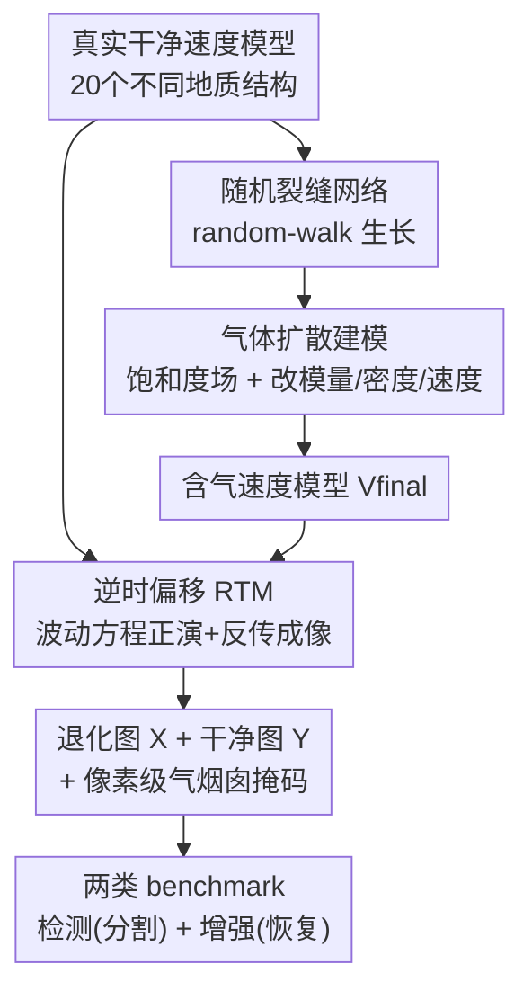

# SIGMA: A Physics-Based Benchmark for Gas Chimney Understanding in Seismic Images

**会议**: CVPR 2026  
**论文**: [CVF Open Access](https://openaccess.thecvf.com/content/CVPR2026/html/Truong_SIGMA_A_Physics-Based_Benchmark_for_Gas_Chimney_Understanding_in_Seismic_CVPR_2026_paper.html)  
**代码**: https://airvlab.github.io/sigma  
**领域**: 地球科学 / 图像恢复  
**关键词**: 地震图像理解, 气烟囱检测, 物理合成数据集, 逆时偏移, 图像增强

## 一句话总结
本文提出首个带真值标注的物理合成地震图像数据集 SIGMA——用波动方程正演+逆时偏移把含气烟囱的速度模型转成地震图像，同时给出像素级气烟囱掩码（用于检测）和"退化—干净"配对图（用于增强），并在两类任务上 benchmark 多个基线，揭示现有方法在该数据上集体吃力。

## 研究背景与动机
**领域现状**：地震成像通过在地表激发可控声波、记录其在地下界面的反射来重建地下结构，速度模型（描述地震波在地下各点的传播速度）是把地震数据转成可解释图像的关键，通常由全波形反演估计。气烟囱（gas chimney）是地下流体（气体）向上迁移形成的垂直异常带，在地震图像里表现为垂直紊乱、低振幅、低相干的混沌区，是判断油气藏潜力、封盖完整性、钻井风险乃至碳封存泄漏通道的关键指标。

**现有痛点**：准确成像气烟囱极难——它们的地震信号微弱、空间不相干，且被强烈的衰减与散射进一步破坏。传统物理方法（如 Q 补偿偏移）能部分恢复衰减区，但涉及昂贵的波动方程计算、需精细调参，且跨工区泛化差。更致命的是，真实数据几乎没有气烟囱的真值标注——公开领域没有任何被实钻采样验证过的气烟囱记录，人工标注又极其繁琐主观。深度学习方法虽高效，却缺乏带标注的训练数据。

**核心矛盾**：深度学习需要大量带真值的"退化图—干净图"配对和像素级标注，而真实地震数据**根本拿不到**这种真值（要靠昂贵钻井才能验证地下），二者之间存在不可调和的数据缺口。

**本文目标**：造一个物理上可信、可复现、带完整真值的合成数据集，同时支撑两件事——(i) 气烟囱检测（像素级分割）；(ii) 气烟囱区域的地震图像增强/恢复。

**切入角度**：作者不去碰"标注真实数据"这条死路，而是用物理正演直接合成——既然干净速度模型与含气速度模型都由自己控制，那么"干净图""退化图""气烟囱掩码"全都天然已知。

**核心 idea**：用物理建模把"气体扩散→改变岩石模量/密度/速度→逆时偏移成像"整条链路走通，从而批量生成带真值的含气烟囱地震图像配对数据。

## 方法详解

### 整体框架
SIGMA 的核心是一条物理合成管线：从真实采集的干净速度模型出发，先随机生成裂缝网络并模拟气体扩散得到气饱和度场，据此修改岩石的体模量、密度，算出含气速度模型；再用波动方程正演+逆时偏移（RTM）分别把"背景速度模型"和"含气速度模型"成像成"干净地震图 $Y$"和"含气退化地震图 $X$"。每个样本同时产出原始速度模型、含气速度模型、气饱和度图、退化图、干净图，因此像素级气烟囱掩码和"退化—干净"配对全都自动对齐、无需人工标注。最终在此数据上 benchmark 检测与增强两类任务。

### 关键设计

**1. 物理驱动的气烟囱合成：从随机裂缝到气饱和速度场**

要造出物理可信的含气烟囱图，关键是把"气体怎么改变岩石物性"建模对。作者先在干净速度模型上随机撒起点，从每点用 random-walk 生长裂缝（限制最大长度和相对竖直方向的角度范围），得到裂缝指示函数 $s(x)$（在裂缝内为 1、否则为 0）。气体从裂缝向周围岩石扩散，位置 $x$、时刻 $t$ 的气体体积分数由扩散积分给出 $S(x,t) = \int dx'\, s(x')\,\frac{H_0}{8\pi D R}\big(1-\mathrm{erf}(\frac{R}{4Dt})\big)$，其中 $R$ 是到裂缝点的距离、$H_0$ 是注气率、$D$ 是扩散系数、$\mathrm{erf}$ 是误差函数。气体改变页岩的有效体模量 $\frac{1}{K(x,t)} = \frac{1-S(x,t)}{K_s} + \frac{S(x,t)}{K_g}$ 和密度 $\rho(x,t) = (1-S)\rho_s + S\rho_g$，进而算出含气纵波速度 $V_p(x,t) = \sqrt{\frac{K + \frac{4}{3}G}{\rho}}$（$G$ 是剪切模量，与流体无关），最终含气速度模型 $V_{final} = V_p * V_{background}$。这条物理链路保证了合成的速度异常符合气体扩散的真实物理规律，而非随手 P 图。

**2. 波动方程正演 + 逆时偏移成像：把速度模型转成地震图像**

有了速度模型还需把它"成像"成地震图。作者用标量波动方程 $\frac{1}{V^2(x)}\frac{\partial^2 p}{\partial \tau^2} - \nabla^2 p = s(x,\tau)$ 正演传播波场。成像走逆时偏移（RTM）：在 Born 近似下把慢度平方写成背景项+扰动 $m(x) = m_0(x) + \delta m(x)$，散射波场满足 $\frac{1}{V_0^2}\frac{\partial^2 \delta p}{\partial \tau^2} - \nabla^2 \delta p = -\delta m \frac{\partial^2 p_s}{\partial \tau^2}$；接收波场 $p_r$ 由记录道反传求解，反射率图像用零延迟互相关成像条件 $I(x) = \int_0^T p_s(x,\tau)\,p_r(x,\tau)\,d\tau$ 形成。实现上用 Deepwave 框架同时对"原始速度模型"和"含气速度模型"成像，分别得到干净图 $Y$ 和退化图 $X$。RTM 本质是 Born 算子的伴随而非真逆，图像质量主要取决于背景速度模型 $V_0$ 的准确性——这也解释了为何含气区会出现模糊、低相干。

**3. 双真值配对 + 像素级掩码：天然对齐、无需人工标注**

合成的最大红利在标注。由于干净与含气两条成像支路共享同一几何与采集配置，每个样本 $S = \{X, Y, V_{background}, V_{final}, V_p\}$ 天然给出三种真值：退化图 $X$ 与干净图 $Y$ 直接配对（支撑图像增强），气烟囱区域由裂缝/气饱和场圈定为像素级掩码（支撑检测分割）。这彻底绕开"真实地震数据无气烟囱真值"的死结。数据规模上，作者收集 20 个不同分辨率、地质结构各异的真实速度模型，每个生成 20 个随机裂缝网络，每个 $512\times512$ 样本在 RTX 8000（约 30GB 显存）上要跑 30–45 分钟全模拟，凸显该领域计算成本极高；最终 400 对地震图，覆盖 1600+ km²。

### 损失函数 / 训练策略
数据集本身不训练模型，但作者为 benchmark 统一了训练协议：检测任务用 Dice 损失 + Adam（动量 0.98、初始学习率 0.001、余弦退火），3×RTX 8000 训练；增强任务中 GAN 类用 WGAN-GP 目标，扩散类用标准 DDPM 的 MSE 噪声重建损失，学习型增强模型同检测任务用 MSE。数据按速度模型不重叠地划分——测试集由 5 个速度模型（100 对图）生成，训练集由其余 15 个（300 对图）生成。

## 实验关键数据

### 数据集真实性验证
作者做了感知用户研究：80 名 AI 研究者/地质学家，每人看 10 张打乱的无标注图（5 真 5 合成），判断每张是否像真实地震图，共收 800 份回答。

| 评估项 | 结果 | 说明 |
|--------|------|------|
| 合成图被判"像真实"比例 | 82% | 共 400 份合成图回答 |
| 95% Wilson 置信区间 | [0.78, 0.86] | 误差幅度约 ±4.0%（已做聚类方差校正，有效样本约 286） |
| 18% 否定回答来源 | 集中于个别样本 | 多为纹理模糊/坍缩的典型失败样本，非普遍低真实感 |

### 主实验：两类任务 benchmark
**气烟囱检测**（像素级分割，IoU/Dice 越高越好）：

| 模型 | 年份 | IoU↑ | Dice↑ |
|------|------|------|------|
| FaultSeg | 2019 | 0.76 | 0.86 |
| DualUnet | 2023 | **0.84** | **0.91** |
| FaultFormer | 2025 | 0.80 | 0.87 |
| FaultViT | 2025 | 0.75 | 0.86 |

**气烟囱增强**（图像恢复，SSIM/PSNR/Corr/SNR 越高越好）：

| 模型 | 年份 | SSIM↑ | PSNR↑ | Corr↑ | SNR↑ |
|------|------|------|------|------|------|
| ConditionGAN | 2022 | 0.52 | **20.02** | **0.81** | 3.33 |
| SeisDDPM | 2023 | 0.41 | 16.14 | 0.61 | 0.68 |
| SeisGAN | 2023 | 0.30 | 15.66 | 0.46 | 2.08 |
| SeisResoDiff | 2024 | 0.30 | 16.05 | 0.70 | 0.59 |
| SIST | 2024 | **0.65** | 19.00 | 0.77 | **3.51** |

### 关键发现
- 检测任务现有方法虽有"看起来不错"的 IoU/Dice（DualUnet 达 0.84/0.91），但作者强调气烟囱形状不规则、边界不清、与周围层对比度低，且检测是后续增强的前置步骤，精度仍远未到实用级。
- 增强任务五个方法表现非常接近且 SSIM/SNR 普遍偏低（最高 SSIM 0.65、SNR 3.51），定性结果显示所有方法都难以重建气烟囱区域内部及下方的地震特征——而这恰是地质解释最需要的信息。这表明气烟囱增强是一个尚未被解决的开放难题。
- 物理建模中调高扩散时间或注气率会让地震纹理变化更明显，验证了合成对物理参数的敏感性是可控、可解释的。

## 亮点与洞察
- **用物理正演把"真值不可得"变成"真值天然已知"**：这是整篇最巧的地方——既然干净/含气速度模型都自己造，干净图、退化图、掩码就全部免费且像素级对齐，彻底绕开真实地震数据无法标注的死结。这种"合成换标注"的思路可迁移到任何真值需昂贵物理实验才能获取的领域（医学、材料无损检测等）。
- **物理链路完整可信**：从裂缝 random-walk → 气扩散饱和度 → 改模量/密度 → 含气速度 → RTM 成像，每一步都有物理方程支撑，而非简单加噪声 P 图，用户研究 82% 通过率也佐证了真实感。
- **benchmark 诚实地暴露难度**：作者没有自己提增强方法刷分，而是 benchmark 一堆现成方法集体吃力，把"气烟囱增强尚未解决"这个 open challenge 摆出来，对社区更有价值。

## 局限与展望
- **纯合成、缺真实数据闭环**：所有标注来自物理模拟，作者也承认现有基线在真实地震数据上泛化差；合成与真实之间的 domain gap 仍是悬而未决的问题。
- **计算成本极高**：单个 $512\times512$ 样本要 30–45 分钟 GPU 模拟，整个数据集仅 400 对图、规模偏小，难以支撑大模型预训练 ⚠️。
- **物理建模有简化**：气扩散用各向同性扩散积分、速度模型用乘性合成 $V_{final}=V_p * V_{background}$，可能与真实地下复杂各向异性介质有差距。
- 增强任务所有方法 SSIM/SNR 都低，说明 benchmark 本身极难，但也意味着该数据集对现有方法可能过于苛刻，缺一个明确的"可达上界"参考。

## 相关工作与启发
- **vs 传统物理基线（Q 补偿偏移 / 地震属性分析）**：传统方法靠波动方程计算和人工属性选择来高亮低相干气烟囱区，计算昂贵、跨工区泛化差且无真值验证；SIGMA 用合成提供真值，让数据驱动方法有了训练与评测基础。
- **vs 现有合成地震数据集（如 Arntsen 等的气饱和建模、F3 Block 真实数据）**：以往合成数据没有对应的"无气烟囱干净图"真值，真实数据（如 F3）规模又小；SIGMA 是首个同时提供退化图、干净图、像素级掩码三种真值的物理合成集。
- **vs 混合 physics+ML 气烟囱检测**：那类两阶段方法先抽物理属性再喂经典 ML 分类器，重度依赖人工属性工程、换新数据就耗时；SIGMA 把任务规整为端到端的分割/增强，并提供标准训练-测试划分。

## 评分
- 新颖性: ⭐⭐⭐⭐ 首个带真值标注的物理合成气烟囱数据集，"合成换标注"思路在地震领域是实质突破。
- 实验充分度: ⭐⭐⭐⭐ 两类任务各 benchmark 4–5 个基线 + 80 人用户研究做真实性验证，较完整；但仅 400 对图、无真实数据定量评测。
- 写作质量: ⭐⭐⭐⭐ 物理建模链路与成像公式交代清楚，痛点—方案对应明确。
- 价值: ⭐⭐⭐⭐ 填补了地震图像理解缺真值数据的空白，并诚实暴露增强这一 open challenge，对地球物理 AI 社区有较强基础设施价值。

<!-- RELATED:START -->

## 相关论文

- [\[NeurIPS 2025\] Reasoning With a Star: A Heliophysics Dataset and Benchmark for Agentic Scientific Reasoning](../../NeurIPS2025/earth_science/reasoning_with_a_star_a_heliophysics_dataset_and_benchmark_for_agentic_scientifi.md)
- [\[CVPR 2026\] MeteorPred: A Meteorological Multimodal Large Model and Dataset for Severe Weather Event Prediction](meteorpred_a_meteorological_multimodal_large_model_and_dataset_for_severe_weathe.md)
- [\[CVPR 2026\] GeoChemAD: Benchmarking Unsupervised Geochemical Anomaly Detection for Mineral Exploration](geochemad_benchmarking_unsupervised_geochemical_anomaly_detection_for_mineral_ex.md)
- [\[AAAI 2026\] MdaIF: Robust One-Stop Multi-Degradation-Aware Image Fusion with Language-Driven Semantics](../../AAAI2026/earth_science/mdaif_robust_one-stop_multi-degradation-aware_image_fusion_with_language-driven_.md)
- [\[ICML 2026\] (Sparse) Attention to the Details: Preserving Spectral Fidelity in ML-based Weather Forecasting Models](../../ICML2026/earth_science/sparse_attention_to_the_details_preserving_spectral_fidelity_in_ml-based_weather.md)

<!-- RELATED:END -->
