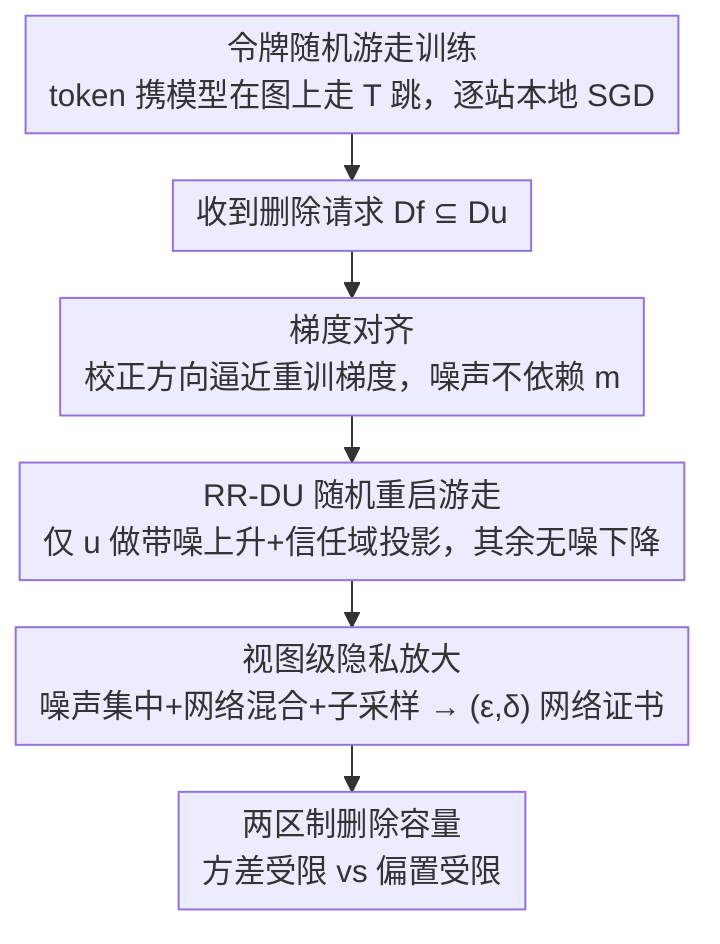

# Fully Decentralized Certified Unlearning

**会议**: CVPR 2026  
**论文**: [CVF Open Access](https://openaccess.thecvf.com/content/CVPR2026/html/Lamri_Fully_Decentralized_Certified_Unlearning_CVPR_2026_paper.html)  
**代码**: 待确认（论文称已开源）  
**领域**: 联邦学习  
**关键词**: 机器遗忘, 认证遗忘, 去中心化, 差分隐私, 删除容量  

## 一句话总结
针对"无中心协调者的去中心化网络"这一被忽视的场景，本文提出 RR-DU——一个随机游走式的认证遗忘算法：只在发起删除的客户端上对遗忘集做带噪投影梯度上升、其余客户端继续做无噪下降，配合子采样高斯噪声和信任域投影，证明了 $(\varepsilon,\delta)$ 网络遗忘证书、收敛性与删除容量边界，且噪声不随遗忘集大小 $m$ 增长，在图像分类上把后门攻击成功率压到随机猜测水平同时保住干净精度。

## 研究背景与动机
**领域现状**：机器遗忘（Machine Unlearning, MU）要在不重训的前提下，从已训练模型里抹掉指定数据的影响（响应隐私请求或清除数据投毒）。它被扩展到联邦学习后成为联邦遗忘（FU）。**认证遗忘**（certified unlearning，给出类似差分隐私的可证明保证）此前主要在中心化、以及"有服务器编排"的联邦场景里被分析过。

**现有痛点**：**去中心化场景——客户端之间无协调者、只能沿网络图的边点对点通信——几乎没人碰**。已有去中心化 FU 工作大多是启发式、缺理论保证；少数有保证的也只在（强）凸假设下成立。Zhang 等给的是服务器编排 FL 的 DP 遗忘保证，要求所有客户端和服务器协作，计算很贵；Qiao 等（PDUDT）给了首个动态拓扑下的去中心化认证遗忘，但它要**牵涉所有客户端或所有邻居、还要存历史梯度**，导致高存储/计算开销，且遗忘期间测试精度会暂时掉。

**核心矛盾**：① 在固定拓扑、每个客户端只有网络"局部视图"的去中心化设定下，认证遗忘的定义本身就没人理清（每个客户端看到的 transcript 不同，certificate 该怎么定义？）；② 去中心化（路由、混合、信任域）对"效用-隐私权衡"和"删除容量"的影响没人量化；③ 去中心化差分隐私（DDP）虽理论上能蕴含认证遗忘，但它**靠 group privacy，噪声会随删除数 $m$ 线性增长**，是不是好的遗忘认证器存疑。

**本文目标**：在固定拓扑上，让遗忘能**自主进行、不牵涉所有客户端**；量化去中心化各因素对权衡和删除容量的影响；并厘清 DDP 到底适不适合做遗忘认证器。

**切入角度**：作者抓住一个关键观察——在随机游走里，遗忘集 $D_f\subseteq D_u$ **只在游走者位于发起删除的客户端 $u$ 时才影响计算**；其余客户端的更新与 $D_f$ 无关，因而对 $D_f$ 而言构成"后处理"。利用隐私的去中心化放大和子采样放大，就能把噪声集中在 $u$ 处、其余无噪，靠网络混合让任意观察者只看到一小部分敏感事件。

**核心 idea**：把噪声**只加在删除客户端**、用**梯度对齐**让校正方向逼近重训方向，使所需噪声**不依赖遗忘集大小 $m$**，从而比全网加噪的 DDP 用小得多的噪声拿到更强保证。

## 方法详解

### 整体框架
设固定无向图 $G=(V,E)$，$N$ 个客户端各持私有数据 $D_u$。训练算法 $\mathcal{A}$ 用一个**令牌（token）**携带当前模型 $\theta$ 在图上随机游走 $T$ 跳：令牌到谁那里，谁就用本地数据跑几步 SGD，再把更新后的令牌转发给均匀随机的邻居。某轮收到对 $D_f\subseteq D_u$ 的删除请求后，启动遗忘算法 RR-DU（randomized-restart decentralized unlearning）：令牌以概率 $p$ 跳回删除客户端 $u$、否则按图的转移矩阵 $P$ 走；**只有 $u$ 做带噪的校正上升步（对遗忘集做投影梯度上升 + 高斯噪声 + 信任域投影），其余客户端继续做无噪投影下降**。整套机制给出三类保证：凸情形的收敛 / 非凸情形的平稳性；基于子采样高斯 Rényi-DP 的 $(\varepsilon,\delta)$ 网络遗忘证书（视图级）；以及随"遗忘集-本地数据比"缩放的删除容量边界。

### 关键设计

**1. 视图式去中心化认证遗忘的形式化：把"删除证书"建在每个客户端只能看到的局部视图上**

痛点是中心化的认证遗忘定义直接搬不过来——去中心化里没人见到完整 transcript，客户端 $u$ 只观察到与自己相关的消息视图 $O_u(\mathcal{A}(D))=\{(v,m,v')\in\mathcal{A}(D): v=u \text{ 或 } v'=u\}$。作者借 Cyffers-Bellet 的网络差分隐私（network-DP），把认证遗忘改写成**视图式**：称 $(\mathcal{A},\mathcal{U})$ 达到 $(\varepsilon,\delta)$ 去中心化认证遗忘，当存在认证器 $\mathcal{C}$，对任意非删除客户端 $v\neq u$、任意 $\theta\subseteq\Theta_v$ 有 $P(O_v(\mathcal{U}(D_f,\mathcal{A}(D)))\in\theta)\le e^\varepsilon P(O_v(\mathcal{C}(D\setminus D_f))\in\theta)+\delta$ 且对称。为什么这么定义才对：去中心化里"删除是否干净"只对**观察者视图**有意义，而且这个保证是**删除后（post-deletion）**的——它认证删除请求之后观察者视图的分布，但无法回溯抹掉预删除训练 transcript 里已泄露的信息。作者还把 Sekhari 等的删除容量（deletion capacity，在 $L(U)-L^\star\le\gamma$ 容差下能删的最大 $m$）适配到去中心化，显式刻画路由概率、网络混合、信任域投影的作用。

**2. 梯度对齐：让校正方向等于重训方向，使噪声不再随删除数 $m$ 增长**

这是全文的数学核心。删除 $D_f$ 后重训目标 $L_{\setminus f}$ 的梯度可拆为 $\nabla L_{\setminus f}(\theta,V)=\nabla L(\theta,V)-\tfrac1N[\nabla\ell_u(\theta)-\nabla\ell_{u\setminus f}(\theta)]+\Delta_{\text{norm}}(\theta)$，其中 $\|\Delta_{\text{norm}}\|_2=O(Lm/n_u)$。这说明"朝重训最优走"可以靠**其余客户端的标准下降 + $u$ 处一个只依赖本地信息的校正步**实现。当游走在 $u$ 时，用精确对齐 $-\nabla\ell_{u\setminus f}(\theta)$ 或轻量对齐 $\tfrac{m}{n_u}\nabla\ell_f(\theta)$；取重启概率 $p=1/N$，则条件期望更新恰好复现重训方向 $\mathbb{E}[\Delta\theta_t|\theta_t]/\eta_t=-\nabla L_{\setminus f}(\theta_t,V)$（精确对齐），轻量对齐则有受控偏置 $O(Lm/n_u)$。为什么有效：DDP 靠 group privacy 认证 $m$ 个删除，校准噪声被迫随 $m$ 线性增长；RR-DU 把 $m$ 的依赖从噪声尺度里彻底移走，只留在一个**可控的对齐偏置项**里——这就是它在同样 $(\varepsilon,\delta)$ 视图预算下能用小得多噪声的根因。

**3. RR-DU 随机重启游走 + 集中噪声 + 信任域投影：把隐私开销压到最小**

算法上（Algorithm 1）：每跳以概率 $p$ 回到 $u$、否则按 $P$ 走；在 $u$ 抽 $Z_t\sim\mathcal{N}(0,\sigma^2 I_d)$，做 $\theta\leftarrow\Pi_{B(\theta_{\text{ref}},\varrho)}(\theta+\eta_t(g_u+Z_t))$（带噪上升 + 信任域投影）；在其余节点抽 $s\ge1$ 个 mini-batch 平均后做无噪 $\Pi_\Theta(\theta-\eta_t g_v)$。**只有比例 $p$ 的跳加噪**，所以每跳二阶矩 $G^2\le L^2+\tfrac{p}{s}d\sigma^2$，而全网 DDP 每跳都加 $d\sigma^2$。视图级放大来自：对任意观察者 $v\neq u$，敏感更新的首次观测延迟服从 $\text{Geom}(q),\ q=\tfrac{1-p}{N-1}$（令牌须先离开 $u$ 再落到 $v$），这种几何混合带来 $\sqrt{\ln N/N}$ 的放大。信任域投影 $\Pi_{B(\theta_{\text{ref}},\varrho)}$ 则把带噪步限制在原模型附近、稳住噪声上升。为什么有效：噪声集中 + 局部平均 + 网络混合三者叠加，让"同样隐私预算下的有效方差"远小于全网加噪，直接转化成更高的干净精度。

**4. 两区制删除容量：厘清何时 RR-DU 真正赢过 DDP**

把"非偏置项 $A$（优化项 + 隐私项，与 $m$ 无关）+ 对齐偏置 $CLm/n_u$ $\le\gamma$"合起来解，得到删除容量是**两区制**的：$m^\star=\Omega((\gamma-A)n_u/L)$ 当 $\gamma>A$，否则为 $0$。直观说：当通过增大 $T_u$、增大局部平均 $s$、选适中 $p$、并享受 $\sqrt{\ln N/N}$ 网络放大把 $A$ 压到 $\gamma$ 以下后，容量变成 $\Theta(\gamma n_u/L)$——**线性于本地数据量 $n_u$、不再随 $N$ 改善**（早期公式里看似的 $N$ 增益来自方差受限区制 $A$ 主导时）。对比之下，DDP 的容量被 group privacy 根本性限制（噪声随 $m$ 增长，即便混合再好也吃不满大 $n_u$）。实践规则：$m/n_u$ 小时用轻量对齐，$m/n_u$ 大或数据强非 i.i.d. 时切精确对齐。

### 损失函数 / 训练策略
训练用单令牌随机游走 + 本地 SGD；遗忘用 RR-DU（Algorithm 1），关键超参为重启概率 $p\approx1/N$、信任域半径 $\varrho$、噪声尺度 $\sigma$、局部平均 $s$、遗忘跳数 $T_u$。噪声校准（Cor. 5.2）给出 $\sigma=\Theta\big(\tfrac{L}{\varepsilon}\sqrt{\tfrac{pT_u\ln(1/\delta)\ln N}{N}}\big)$，对应视图级 $(\varepsilon,\delta)$；对凸/强凸/光滑非凸三类目标分别给出末迭代 / 平稳性保证。

## 实验关键数据

### 主实验
两个图像分类基准 + BadNets 后门设定评估遗忘：CIFAR-10 + ResNet-18、MNIST + FLNet。注入 $m=1000$ 投毒样本到单个目标客户端，训练 $T=100$ 跳后遗忘 $T_u=100$ 跳。完全图 $N=10$、i.i.d. 均匀划分、$\varepsilon=1,\delta=10^{-5}$、Adam $\eta=0.005$、$s=4$。理想权衡是把后门精度（ASR）压到 ≈10%（随机猜测）同时保住干净精度。对比 DDP、DP-SGD、Finetuning。

| 数据集 | 方法 | 后门精度 ASR ↓（目标≈10%） | 干净精度 ↑ |
|--------|------|------|------|
| MNIST | 重训基线 | ≈10% | ≈99.5% |
| MNIST | **RR-DU** | **≈10%** | **≈99.1–99.2%** |
| MNIST | Finetuning | ≈18% | ≈99% |
| MNIST | DDP | ≈35% | ≈96.7% |
| MNIST | DP-SGD | ≈60% | — |
| CIFAR-10 | 重训基线 | ≈10% | ≈88–89% |
| CIFAR-10 | **RR-DU** | **≈10%** | **≈88–89%** |
| CIFAR-10 | Finetuning | ≈25–30% | 较好但弱于RR-DU |
| CIFAR-10 | DDP / DP-SGD | 残留更多后门 | ≈50–55%（饱和，到不了基线） |

ASR（Attack Success Rate / 后门精度）指带触发器的样本被分到攻击目标类的比例，越接近 10% 随机猜测越说明后门被抹干净。

### 理论对比（DDP vs RR-DU，凸情形）
| 方法 | 噪声尺度 | 删除容量（缩放） |
|------|---------|------|
| DDP（group privacy） | $\Theta\big(\tfrac{mL}{\varepsilon}\sqrt{\tfrac{T\ln(1/\delta)\ln N}{N}}\big)$，**随 $m$ 线性增长** | 被 group privacy 根本限制 |
| **RR-DU** | $\Theta\big(\tfrac{L}{\varepsilon}\sqrt{\tfrac{pT_u\ln(1/\delta)\ln N}{N}}\big)$，**不依赖 $m$** | $\gamma>A:\ \Omega\big(\tfrac{(\gamma-A)n_u}{L}\big)$；否则 $0$ |

### 关键发现
- **RR-DU 在两个数据集上都拿到最佳权衡**：后门几乎像重训一样被抹掉，同时干净精度逼近重训基线；DP 类认证器（DPSGD、DDP）则残留大量后门信号、还常牺牲干净效用。
- **DDP 抹不掉后门**：MNIST 上 DDP 后门停在 ≈35%、DP-SGD ≈60%，CIFAR-10 上两者干净精度饱和在 50–55% 到不了基线——印证"噪声随 $m$ 增长"在实践中真的拖垮 DDP。
- **删除容量两区制**：只有把非偏置项 $A$ 压到容差 $\gamma$ 以下，容量才线性于本地数据量 $n_u$；此后增大 $N$ 不再带来容量增益。
- **轻量 vs 精确对齐的实用切换**：$m/n_u$ 小用轻量（省算/存），大或非 i.i.d. 用精确（避免偏置主导）。增大 $s$ 减方差但不影响隐私（噪声只在 $u$ 加）。

## 亮点与洞察
- **"后处理"观察点子很漂亮**：意识到遗忘集只在游走者位于 $u$ 时才进入计算、其余更新对 $D_f$ 是后处理，于是把噪声集中在一个节点、其余全程无噪——这是噪声不随 $m$ 增长的物理直觉来源，比"全网均匀加噪"省得多。
- **把 $m$ 的依赖从噪声尺度搬到一个可控偏置项**，是 RR-DU 相对 DDP 的本质优势：DDP 靠 group privacy 必然让噪声随删除数线性涨，RR-DU 用梯度对齐绕开，换来同隐私预算下高得多的效用。
- **视图式（observer-view）认证**比"逐客户端认证"更贴合去中心化真实威胁模型，且明确是 post-deletion 保证、不夸大能回溯抹掉历史泄露——诚实地划清了能力边界。
- **两区制删除容量**给出清晰工程指引：什么时候该调 $T_u/s/p$、什么时候增大 $N$ 已无用，可迁移到其他去中心化隐私机制的容量分析。

## 局限与展望
- **理论与主实验聚焦完全图**：路由用均匀转移、$N=10$ 小规模；非完全连通图、动态拓扑下的表现只在附录/有限设定里提及，大规模稀疏拓扑的鲁棒性待验证。
- **post-deletion 保证的固有局限**：无法抹掉预删除训练 transcript 里已泄露的信息——若攻击者早已记录历史消息，本方法管不了。
- **轻量对齐引入近似偏置**，随删除比 $m/n_u$、光滑度、异质性增长，强非 i.i.d. 场景下可能落入偏置主导区制而失效，必须切精确对齐（代价更高）。
- **超参依赖网格搜索**：信任域半径 $\varrho$ 和有效梯度界 $L$ 对每个"数据集-模型"对都靠 grid search 选（MNIST 取 $(10.82,0.5)$、CIFAR-10 取 $(56.30,0.2)$），自动化/自适应选取是改进方向。
- **与 PDUDT 非完全对等比较**：两者协议根本不同（PDUDT 靠动态拓扑+gossip、RR-DU 靠固定图随机游走），头对头对比只在受限匹配设定下给出。

## 相关工作与启发
- **vs Qiao 等 PDUDT（首个去中心化认证遗忘）**：PDUDT 用高斯机制但**牵涉所有用户/邻居、要存历史梯度**，开销大、遗忘期精度暂掉，且只逐客户端认证、不扩展到网络级视图；RR-DU 只在删除客户端加噪、其余继续标准训练，随机下一跳选择 + 每跳步数当后处理放大隐私，噪声不依赖 $m$、无需存历史梯度。
- **vs 去中心化差分隐私 DDP（Cyffers-Bellet）**：DDP 理论上能蕴含认证遗忘，但作者明确论证它**不是理想的遗忘认证器**——group privacy 让噪声随删除数 $m$ 增长；本文把 DDP 与去中心化认证遗忘（DCU）干净分离。
- **vs 中心化认证遗忘（Sekhari / Guo / Ginart 等）**：那些工作的删除容量关键驱动量是总数据量 $n$；本文适配到去中心化后，驱动量变成节点数 $N$（方差受限区）或本地数据量 $n_u$（偏置受限区），显式纳入路由、混合、信任域投影。
- **vs 服务器编排 FL 的 DP 遗忘（Zhang 等）**：那套要全员 + 服务器协作、计算昂贵；RR-DU 完全去中心化、无协调者、低通信存储开销。

## 评分
- 新颖性: ⭐⭐⭐⭐⭐ 首个固定拓扑、视图式的去中心化认证遗忘形式化，"集中噪声 + 梯度对齐使噪声不随 $m$ 增长"是有原创性的核心贡献。
- 实验充分度: ⭐⭐⭐ 主实验只在 MNIST/CIFAR-10 两个小基准 + 完全图 $N=10$，更大规模、稀疏/动态拓扑、与 PDUDT 的对比都放附录或受限设定，主文证据偏弱。
- 写作质量: ⭐⭐⭐⭐ 理论推导（梯度对齐、视图放大、两区制容量）层次清晰，但符号密集、定义繁多，对非隐私背景读者门槛高。
- 价值: ⭐⭐⭐⭐ 把认证遗忘补全到去中心化这一空白场景，理论框架与 DDP 的清晰分离对后续工作有指导意义，实际落地受小规模实验与超参敏感性制约。

<!-- RELATED:START -->

## 相关论文

- [\[CVPR 2026\] GDFA: Geometry-Driven Federated Unlearning with Directional Task Vector Alignment](gdfa_geometry-driven_federated_unlearning_with_directional_task_vector_alignment.md)
- [\[CVPR 2026\] Personalized Federated Training of Diffusion Models with Privacy Guarantees](personalized_federated_training_of_diffusion_models_with_privacy_guarantees.md)
- [\[CVPR 2026\] HiLoRA: Hierarchical Low-Rank Adaptation for Personalized Federated Learning](hilora_hierarchical_low-rank_adaptation_for_personalized_federated_learning.md)

<!-- RELATED:END -->
