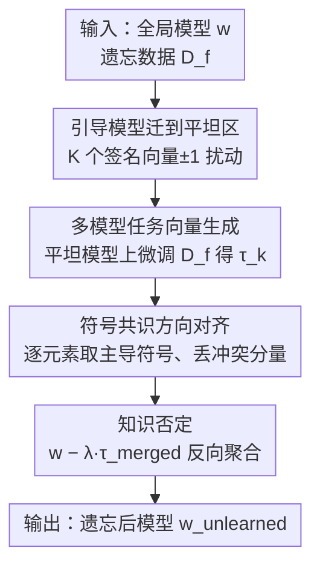

# GDFA: Geometry-Driven Federated Unlearning with Directional Task Vector Alignment

**会议**: CVPR 2026  
**论文**: [CVF Open Access](https://openaccess.thecvf.com/content/CVPR2026/html/Weng_GDFA_Geometry-Driven_Federated_Unlearning_with_Directional_Task_Vector_Alignment_CVPR_2026_paper.html)  
**代码**: 未公开  
**领域**: 联邦学习 / 机器遗忘 / 隐私保护  
**关键词**: 联邦遗忘、平坦极小值、任务向量、方向对齐、Non-IID

## 一句话总结
GDFA 把"联邦遗忘"重新理解成一个**损失曲面几何**问题：先用扰动把全局模型迁到平坦极小值区，再让相关客户端在遗忘数据上生成任务向量、只保留**方向一致（符号共识）**的分量做反向聚合，从而在 Non-IID 场景下精确擦除目标客户端知识，同时几乎不损失保留任务精度。

## 研究背景与动机

**领域现状**：联邦学习（FL）在不共享原始数据的前提下协同训练模型，但要满足"被遗忘权"，就必须能在不访问客户端本地数据的情况下，抹掉某个目标客户端对全局模型的贡献。现有联邦遗忘大致分两类——重训练类（从头训，代价极高、不实用）和参数操作类（任务向量相减 / 历史更新回放 / 梯度校正），后者更高效但精度损失大。

**现有痛点**：在 Non-IID（各客户端数据分布异构）下，客户端之间的优化方向天然冲突，梯度互相打架。作者观察到一个关键现象：**冲突的更新会产生彼此错位（misaligned）的任务向量**，这些向量没法干净地"隔离"出要删的目标知识。更糟的是，数据不可访问 + Non-IID 会把优化后的参数推进**尖锐（sharp）的损失盆地**，模型在这种高曲率区域对参数扰动极度敏感——遗忘时一改参数，保留知识就被连带"灾难性遗忘"掉了。

**核心矛盾**：遗忘要求"改动参数去删知识"，但尖锐极小值下"改动参数"≈"破坏保留知识"。即遗忘有效性与保留知识稳定性之间的 trade-off，根源在于**模型所处的损失曲面几何太差**，以及 Non-IID 造成的**任务向量方向不一致**。

**本文目标**：（1）让遗忘操作对参数扰动鲁棒，不波及保留知识；（2）在不访问原始数据、客户端方向冲突的前提下，精确隔离并删除目标知识。

**切入角度**：作者的核心观察是——**位于平坦区域的模型泛化更稳、对参数修改的容忍度更高**。如果先把全局模型迁到平坦盆地再做遗忘，扰动就被"困"在盆地内、不会引发崩塌；而且在同一平坦区内训练能显著提升任务向量的符号一致性。理论上还给出一个 PAC-Bayes 风格的界，把损失曲面平坦度与数据异构下的性能差距挂钩。

**核心 idea**：用"几何迁移到平坦极小值 + 方向一致的任务向量反向聚合"代替"直接在尖锐区做任务向量相减"，来解决 Non-IID 联邦遗忘的稳定性与精度问题。

## 方法详解

### 整体框架
GDFA 是一个三阶段串行的联邦遗忘框架：输入是已训练好的全局模型 $w$ 与某客户端的遗忘数据集 $D_f$，输出是已擦除目标知识、保留其余知识的模型 $w_{unlearned}$。流程是：**先把全局模型迁到平坦区** → **相关客户端在平坦模型上微调遗忘数据生成多个任务向量** → **按参数逐元素做符号共识合并，只留方向一致的分量** → **把合并后的任务向量反向（取负）加回模型完成"知识否定"**。

### 关键设计

**1. 引导模型迁到平坦区：用对称随机扰动把全局模型推出尖锐盆地**

针对"Non-IID 把模型推进尖锐盆地、遗忘一碰就崩"的痛点，GDFA 在遗忘前先做一步几何迁移。对有 $L$ 层的全局模型 $w$，生成 $K$ 个"平坦化模型"，每个配一条签名向量 $Z^{(k)}=[z_1^{(k)},\dots,z_L^{(k)}]$，其中 $z_i^{(k)}\in\{-1,1\}$ 随机采样；第 $k$ 个平坦化模型按层用梯度信息做扰动：$w_{flat}^{(k)}=\big(\text{layer}_i+\rho\cdot g_{l_i}\cdot z_i^{(k)}\big)_{i=1}^{L}$，$\rho$ 控制扰动半径。关键约束是 $\sum_{k=1}^{K} z_i^{(k)}=0$，从而 $\frac{1}{K}\sum_k w_{flat}^{(k)}=w$——这保证 $K$ 个扰动模型**均匀分布在 $w$ 的 $\rho$-邻域**、聚合时回到中心。其思想类似 SAM（sharpness-aware minimization）：当 $w$ 已在平坦区时扰动被约束在盆地内、聚合收敛到中心；当 $w$ 在尖锐区时扰动则帮助探索邻近的平坦极小值。$\rho$ 太小逃不出尖锐盆地，太大又会冲出有益的平坦区，作者实验取 $\rho=0.5$ 最优。

**2. 多模型任务向量生成：在同一平坦区微调以提升方向一致性**

传统任务向量直接从单个微调模型算参数差，对微调超参敏感、遗忘效果波动大。GDFA 改为在 $K$ 个平坦化模型上分别对遗忘数据 $D_f$ 微调，得到 $\{w_{ft}^{(k)}\}$，再算各自的任务向量 $\tau_k=w_{ft}^{(k)}-w_{flat}^{(k)}$。由于这些模型都处在**同一平坦区、参数空间更光滑**，生成的任务向量在符号上天然更一致。任务向量本身沿用 Task Arithmetic 思路——"加向量=学知识，减向量=遗忘知识"，无需访问原始数据，只靠操纵权重即可，天然契合 FL 的隐私原则。

**3. 符号共识的方向对齐：只合并方向一致的分量，丢掉冲突参数**

这是隔离目标知识的核心。对每个参数下标 $j$，在所有 $\tau_k$ 中找出该位置的**主导符号** $s_j^*$，取符号与之一致的客户端集合 $S_j=\{k:\text{sign}(\tau_{k,j})=s_j^*\}$，合并时只平均这部分：$\tau_{merged,j}=\frac{1}{|S_j|}\sum_{k\in S_j}\tau_{k,j}$（若 $S_j$ 为空则置 0）。作者论证：**丢弃方向冲突的参数不会损害遗忘效果，反而提升方向一致性**——因为这些冲突分量在经验上是冗余甚至有害的。通过筛选并合并符号一致的分量，就能准确捕捉"待遗忘知识的共性特征"，避免 Non-IID 下错位向量把无关知识也牵连进来。

**4. 知识否定：反向缩放聚合完成精确擦除**

最后一步直接做"知识否定"：$w_{unlearned}=w-\lambda\tau_{merged}$，$\lambda$ 是缩放系数（通常 $\lambda=1$）。因为模型已在平坦区、扰动不会引发崩塌，这一步的反向相减能在删除目标知识的同时最大化保留其余知识的性能。整套流程见 Algorithm 1（迁平坦 → 生成任务向量 → 符号共识合并 → 反向聚合）。

### 损失函数 / 训练策略
GDFA 不引入额外可训练损失，核心是几何迁移 + 任务向量代数。理论支撑是一个数据异构下的性能差距界（Theorem 1）：当模型位于一阶 sharpness $R_\rho^{(1)}(\theta)$ 较小的平坦极小值时，最优模型与平坦极小值模型的性能差 $|L(\theta^*)-L(\theta_{flat})|$ 被一个含**集中度系数** $C=\max_i \frac{P_i}{P}$（衡量最大分布失配）的上界控制——平坦度越好，界越紧，遗忘越鲁棒。实验设置：100 个客户端、每轮采样率 0.1、SGD（lr=0.1、momentum=0.9、每轮衰减 0.99）、本地训练 $E=5$ 轮、遗忘阶段上限 100 轮、总通信上限 200 轮。

## 实验关键数据

### 主实验
在 MNIST/FMNIST/CIFAR10/CIFAR100 上，用 4 层 CNN / LeNet / ResNet-18 / ResNet-34，对比 Retrain（金标准）、FedAvg、Eraser、Recovery、MoDe、SGA、PGD、OSD、Editor、SIFU 共十个基线。指标含：RA↑（保留任务精度）、FA↓（遗忘数据精度，越低越彻底）、JSD↓（与重训模型输出分布散度）、MIA（成员推断攻击精度，越接近 50% 越隐私安全）。

Non-IID（Dir(0.5)）下的代表结果：

| 数据集-模型 | 指标 | FedAvg | Retrain | SIFU | Editor | Ours(GDFA) |
|------|------|------|------|------|------|------|
| MNIST-CNN | RA ↑ | 94.60 | 94.15 | 94.22 | 94.48 | **95.89** |
| MNIST-CNN | FA ↓ | 96.92 | 0.11 | 3.92 | 2.95 | 1.53 |
| MNIST-CNN | JSD ↓ | 0.0089 | - | 0.0035 | 0.0028 | **0.0012** |
| MNIST-CNN | MIA | 92.52 | 50.28 | 55.90 | 55.12 | **50.00** |
| CIFAR10-ResNet18 | RA ↑ | 68.32 | 68.88 | 55.17 | 65.18 | **69.33** |
| CIFAR10-ResNet18 | FA ↓ | 97.58 | 0.51 | 1.06 | 2.54 | 1.57 |
| CIFAR100-ResNet34 | RA ↑ | 42.53 | 47.82 | 39.61 | 38.42 | 46.08 |
| CIFAR100-ResNet34 | FA ↓ | 98.77 | 0.34 | 1.80 | 3.00 | **1.05** |

GDFA 在保留精度 RA 上常常**反超 Retrain**，同时把 FA 压到近随机、JSD 最低、MIA 最接近 50%，即遗忘彻底且隐私安全。

效率对比（Dir(0.5) 服务器计算时间，秒）：

| 数据集 | FedAvg | Retrain | Eraser | Editor | Ours |
|------|------|------|------|------|------|
| MNIST | 647.92 | 223.96 | 188.90 | 14.39 | **11.28** |
| FMNIST | 1085.43 | 542.72 | 443.09 | 25.54 | **17.41** |
| CIFAR10 | 2322.76 | 1161.33 | 884.55 | 52.21 | **31.92** |
| CIFAR100 | 3246.27 | 1623.14 | 949.26 | 74.63 | **67.88** |

GDFA 比重训练快两个数量级，且优于所有轻量近似基线，因为它避开了重训和 Hessian 计算，只靠受控扰动迁移到平坦区。

### 消融实验

| 消融对象 | 现象 / 结论 | 说明 |
|------|---------|------|
| 扰动半径 $\rho$（图 5a） | $\rho=0.5$ 最优 | 太小逃不出尖锐盆地、遗忘不稳；太大冲出平坦区、泛化退化 |
| 扰动模型数 $K$（图 5b） | 适中最佳 | $K$ 影响任务向量质量与时间开销的权衡 |
| 缩放系数 $\lambda$（表 4，FMNIST-IID） | $\lambda$ 越负 FA 越低 | $\lambda=0$ 时 FA=98.21，$\lambda=-1$ 时 FA=1.45，遗忘随负向缩放单调增强 |

### 关键发现
- **平坦度是稳定遗忘的根因**：Loss landscape 可视化（图 3）显示 GDFA 收敛到明显更平坦的盆地，这直接解释了它为何能在遗忘时不破坏保留知识。
- **符号共识丢冲突分量不掉点**：方向不一致的参数被证明是冗余甚至有害的，丢掉后遗忘效果不降反升。
- **类级遗忘的注意力转移**：Grad-CAM（图 4）显示被遗忘类的注意力从"预测关键区域"显著转移到背景，类判别能力被逐步削弱，而保留任务精度不受影响。
- **$\lambda$ 控制遗忘强度**：FA 随 $\lambda$ 由 0 到 -1 从 98.21% 单调降到 1.45%，遗忘程度可调。

## 亮点与洞察
- **把"遗忘"问题几何化**：用"先迁平坦区再删"的两步策略，把"改参数会破坏保留知识"这一矛盾从根上化解——这是最让人"啊哈"的视角转换，平坦度天然提供了参数扰动的容错空间。
- **符号共识聚合是个可复用 trick**：逐元素取主导符号、丢冲突分量来做向量合并，思想上接近 TIES-merging 的 sign election，可迁移到任意"多客户端 / 多任务向量需要对齐"的模型合并场景。
- **隐私友好**：整套方法只操纵权重、不访问原始数据，MIA 精度被压回 50%，对联邦隐私合规很友好。
- **理论与现象对得上**：PAC-Bayes 性能差距界 + loss landscape 可视化 + Grad-CAM 三者互相印证，论证链条完整。

## 局限与展望
- **数据集与模型偏小**：实验集中在 MNIST/FMNIST/CIFAR 与 CNN/ResNet，未验证大模型或更复杂任务（如检测/分割、Transformer），平坦化扰动在大模型上的开销与有效性待考。
- **FA 偶有不是最低**：在 MNIST-CNN 等设置下 GDFA 的 FA（1.53）并非所有基线里最低（SGA 1.70、Retrain 0.11），它更追求 RA/FA/隐私的整体平衡而非单一极致遗忘。
- **超参敏感**：$\rho$、$K$ 需要调优，过大过小都会显著影响效果，缺少自适应选取机制。
- **签名向量为随机生成**：$z_i^{(k)}$ 随机采样 ⚠️ 以原文为准；是否有更优的结构化扰动方向（而非纯随机）值得探索。

## 相关工作与启发
- **vs Task Arithmetic / 任务向量法**：TA 直接从单个微调模型算参数差做加减，本文先迁平坦区再生成多个向量并做符号共识对齐，区别在于**显式解决了 Non-IID 下的向量错位问题**，遗忘更精确稳定。
- **vs FedEraser / FUKD（历史更新存储类）**：它们靠存历史更新做减法或蒸馏，存在隐私风险与存储压力；GDFA 不需存历史，靠几何迁移 + 当前向量即可。
- **vs PGD / 梯度校正类**：梯度校正常需目标客户端参与且计算开销大；GDFA 通过平坦区降低对参数修改的敏感度，避免迭代校准。
- **vs SAM**：SAM 在标准训练里用平坦度提泛化，本文首次把"平坦极小值"这一几何性质引入**联邦遗忘**，是把 sharpness-aware 思想跨界到 unlearning 的尝试。

## 评分
- 新颖性: ⭐⭐⭐⭐⭐ 把损失曲面几何与符号共识对齐引入联邦遗忘，视角新且有理论支撑
- 实验充分度: ⭐⭐⭐⭐ 四数据集十基线 + 多维指标 + 可视化，但模型规模偏小、未触及大模型
- 写作质量: ⭐⭐⭐⭐ 动机—理论—方法—实验链条清晰，公式与算法完整
- 价值: ⭐⭐⭐⭐ 隐私合规场景实用，符号共识聚合可迁移到模型合并等任务

<!-- RELATED:START -->

## 相关论文

- [\[CVPR 2026\] Fully Decentralized Certified Unlearning](fully_decentralized_certified_unlearning.md)
- [\[CVPR 2026\] Personalized Federated Training of Diffusion Models with Privacy Guarantees](personalized_federated_training_of_diffusion_models_with_privacy_guarantees.md)
- [\[CVPR 2026\] HiLoRA: Hierarchical Low-Rank Adaptation for Personalized Federated Learning](hilora_hierarchical_low-rank_adaptation_for_personalized_federated_learning.md)

<!-- RELATED:END -->
