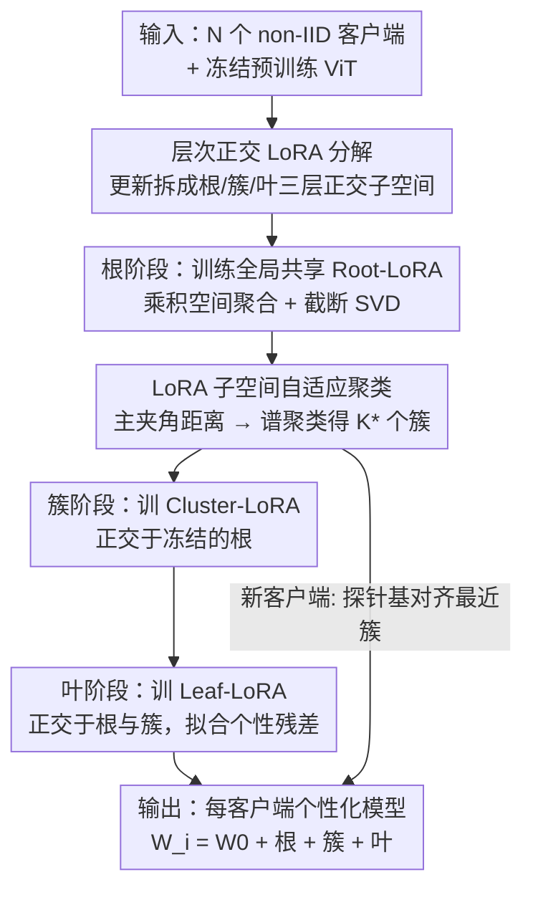

# HiLoRA: Hierarchical Low-Rank Adaptation for Personalized Federated Learning

**会议**: CVPR 2026  
**论文**: [CVF Open Access](https://openaccess.thecvf.com/content/CVPR2026/html/Peng_HiLoRA_Hierarchical_Low-Rank_Adaptation_for_Personalized_Federated_Learning_CVPR_2026_paper.html)  
**代码**: 未公开  
**领域**: 联邦学习 / 参数高效微调  
**关键词**: 联邦学习, LoRA, 个性化, 层次化适配, 子空间聚类

## 一句话总结
HiLoRA 把每个客户端的 LoRA 更新拆成"根—簇—叶"三层正交子空间，分别承载全局共识、子群共性与客户端个性，再配上一个基于 LoRA 子空间相似度的自适应聚类，在 CIFAR-100 与 DomainNet 上同时把个性化和对新客户端的泛化都做到 SOTA。

## 研究背景与动机

**领域现状**：联邦学习（FL）让分布式客户端在不共享原始数据的前提下协同训练；当骨干换成 ViT 这类基础模型后，全量微调的通信开销过高，于是 LoRA 成为主流的参数高效微调（PEFT）方案——只传两个低秩因子 $B\in\mathbb{R}^{p\times r}$、$A\in\mathbb{R}^{r\times q}$ 拼成的更新 $\Delta W=BA$。

**现有痛点**：近期工作把"个性化"和"泛化"拆成双适配器（dual-LoRA）：一个全局聚合、一个本地私有。但论文指出它有三个硬伤：① 在严重 non-IID 下各客户端奔向不同的局部最优，本地梯度互相拉扯，把聚合后的全局适配器**拽离最优解（梯度漂移）**；② 叶子级本地适配器只在少量、偏斜的数据上训练，**容易过拟合**，决策边界脆弱；③ dual 设计完全无视真实部署中客户端天然形成的**潜在子群结构**，子群级共享知识要么被稀释进全局适配器、要么困死在本地，无法在相关客户端间迁移。

**核心矛盾**：全局效用与本地个性化之间的张力是粗粒度的——只有"全局/本地"两档，缺了"子群"这一档中间粒度，导致子群级信息长期被低效利用。

**本文目标**：在保持 PEFT 通信效率的同时，用一个统一的低秩表示**同时**解决全局共识、簇级共性、客户端个性三种粒度，并且能让一个新来的客户端快速对齐到合适的子群。

**切入角度**：作者观察到 LoRA 的加性形式 $W=W_0+\sum_h \Delta W_h$ 天然支持把多个 LoRA 模块**层叠**起来；只要让不同层级的更新落在**互相正交的子空间**里，就能让每一层只负责自己那一档残差，互不干扰。

**核心 idea**：用"根（root）—簇（cluster）—叶（leaf）"三层正交 LoRA 替代双适配器，并用 LoRA 子空间相似度自动发现客户端簇，级联式逐层训练。

## 方法详解

### 整体框架
HiLoRA 的输入是 $N$ 个持有 non-IID 私有数据的客户端和一个冻结的预训练 ViT，输出是每个客户端 $i$ 沿其"根→簇→叶"路径组装出的个性化模型 $W_i = W_0 + B_rA_r + B_{c,j(i)}A_{c,j(i)} + B_{\ell,i}A_{\ell,i}$。整套流程的精髓是"先把知识分层，再级联训练、逐层冻结"：先训出所有人共享的根适配器，再用根更新的子空间相似度把客户端聚成簇、训练簇适配器（约束它正交于已冻结的根），最后训练每个客户端私有的叶适配器（约束它正交于根和簇）。

### 关键设计

**1. 层次正交 LoRA 分解：用正交子空间把三档粒度解耦**

针对"双适配器只有全局/本地两档、子群知识无处安放"的痛点，HiLoRA 把客户端 $i$ 的权重更新分解成三个**正交约束**的低秩分量 $\Delta W_i = B_rA_r + B_{c,j(i)}A_{c,j(i)} + B_{\ell,i}A_{\ell,i}$。这里有一个解耦视角：基矩阵 $B$ 决定"往哪个方向适配"（adaptation direction），配对的系数矩阵 $A$ 决定"沿这些方向适配多少"（magnitude）。为了不让三层在重叠方向上互相覆盖，作者沿每条 $r\!\to\!j(i)\!\to\!i$ 路径强制列空间两两正交：$\forall\,U\neq V\in\{\mathcal{R}(B_r),\mathcal{R}(B_{c,j(i)}),\mathcal{R}(B_{\ell,i})\}: U\perp V$。正交之后，根负责所有客户端共享的趋势、簇负责子群共性、叶只负责高层解释不掉的客户端残差，三档各司其职、互不串扰——这正是双适配器做不到的"中间粒度"。

**2. LoRA 子空间自适应聚类：从适配方向而非原始数据发现客户端子群**

针对"潜在子群结构被忽略"的痛点，且在不暴露原始数据的前提下，HiLoRA 用客户端 LoRA 子空间的相似度来聚类。每轮 $t$ 取出客户端的基 $B_i^{(t)}$，先归一化到单位 Frobenius 范数，再用衰减 $\lambda$ 的 EMA 跨轮稳定：$\bar{B}_i^{(t)}=\lambda\bar{B}_i^{(t-1)}+(1-\lambda)\hat{B}_i^{(t)}$；对 $\bar{B}_i^{(t)}$ 做 SVD 取前 $r$ 个左奇异向量 $U_i^{(t)}$ 张成"适配方向子空间"，从而获得重参数不变性和抗噪性。两个客户端的距离用**主夹角**（principal angle）定义：$d_{ij}=1-\frac{1}{r}\sum_{s=1}^{r}\cos^2\theta_s = 1-\frac{1}{r}\lVert U_i^{(t)\top}U_j^{(t)}\rVert_F^2$，其中 $\cos\theta_s$ 恰是 $U_i^{(t)\top}U_j^{(t)}$ 的第 $s$ 个奇异值。把距离矩阵经高斯核 $S_{ij}=\exp(-d_{ij}^2/2\sigma^2)$ 转成亲和矩阵后跑谱聚类，簇数 $K$ 通过扫描 $[K_{\min},K_{\max}]$ 并最大化归一化拉普拉斯谱的特征间隙（eigengap）自动确定。这样对齐了适配子空间相近的客户端，强化簇内共享、压制跨簇负迁移。

**3. 级联式逐层优化 + 跨层正交正则：分阶段训练并用渐进冻结锁住已学方向**

针对"三层如何协同训练"的问题，HiLoRA 不是同时优化三层，而是**根→簇→叶级联**，每训完一层就冻结、让后一层只在与冻结方向互补的方向上发力。根阶段对全部客户端最小化加权损失，服务器在**乘积空间**聚合 $\Delta W_r^{(t+1)}=\sum_i \pi_i^{\text{root}}B_{r,i}^{(t)}A_{r,i}^{(t)}$（避免分别平均 $B$、$A$ 产生的交叉项），再做秩 $r$ 截断 SVD 重置 $B_r,A_r$；到达相对步长停止准则 $\rho_t=\lVert\Delta W_r^{(t+1)}-\Delta W_r^{(t)}\rVert_F/(\lVert\Delta W_r^{(t)}\rVert_F+\varepsilon)\le\tau_{\text{rel}}$ 即冻结。簇阶段在冻结根之上加正交正则 $\gamma_c\lVert B_r^{\star\top}B_{c,j}\rVert_F^2$，叶阶段同时对根、簇加 $\gamma_c\lVert B_r^{\star\top}B_{\ell,i}\rVert_F^2+\gamma_\ell\lVert B_{c,j}^{\star\top}B_{\ell,i}\rVert_F^2$，逼着叶子只捕获客户端专属残差。三阶段共享同一个总预算 $T_{\text{root}}+T_{\text{cluster}}+T_{\text{leaf}}=50$ 轮，以与所有 baseline 公平对齐通信成本。

**4. 子空间路由实现对新客户端的快速泛化**

针对"对未见客户端的泛化"，HiLoRA 复用聚类时的子空间度量做路由：对新客户端 $u$ 跑几步本地梯度得到轻量探针基 $B_u$，取其前 $r$ 个左奇异向量 $U_u$，按 $j^\star(u)=\arg\max_j \text{mean}(\cos^2\Theta(U_u,U_{c,j}))$ 分配到最相似的簇。这样新客户端**立刻**能通过根+簇两层做推理，叶适配器再在线少量微调即可。理论上，作者给出逐层泛化界（Theorem 1），证明聚类让 $D_i$ 更接近簇分布 $C_{j(i)}$ 从而压低分布偏移项，正交性把假设类收窄、降低 Rademacher 复杂度，二者联合收紧客户端级超额风险上界。

## 实验关键数据

### 主实验
骨干为 ImageNet-21K 预训练的 ViT-Base，LoRA 插入每层注意力的 query/value 投影。CIFAR-100 设 100 个客户端、三种标签偏斜 non-IID 划分（GL–Dir(0.3)、SC–Dir(3)、Patho(10)）；DomainNet 设 90 个客户端跨 6 个域。对比 9 个 LoRA 联邦基线（Local-LoRA、FedIT、FlexLoRA、FedSA-LoRA、FDLoRA、FedDPA-F/T、PF²LoRA、FedALT）。个性化报告均值精度与第 10 百分位（尾部）精度；泛化留出 20% 客户端为未见客户端，测试时各微调 5 个 epoch。

| 数据集 / 设置 | 指标 | HiLoRA | 次优基线 | 提升 |
|--------|------|------|----------|------|
| CIFAR-100 SC–Dir(3) | 均值精度 | **0.934** | 0.912 (FedALT) | +2.2pt |
| CIFAR-100 SC–Dir(3) | 尾部(10%)精度 | **0.791** | 0.763 (FedALT) | +2.8pt |
| CIFAR-100 GL–Dir(0.3) | 均值精度 | **0.846** | 0.818 (FlexLoRA) | +2.8pt |
| CIFAR-100 Patho(10) | 均值精度 | **0.941** | 0.929 (FedALT) | +1.2pt |
| DomainNet | 客户端均值精度 | **0.877** | 0.860 (FedDPA-F) | +1.7pt |
| DomainNet | 尾部(10%)精度 | **0.589** | 0.583 (FedDPA-F) | +0.6pt |
| CIFAR-100 Patho(10) | 未见客户端精度 | **0.940** | 0.879 (FedDPA-T) | +6.1pt |

未见客户端泛化提升尤为明显：在 Patho(10) 上 HiLoRA 达 0.940，远超次优的 0.879；且仅加载根+簇适配器（零叶子微调）就能在 CIFAR-100 达 0.811、DomainNet 达 0.849，已超过需要 5 个 epoch 微调的次优基线（0.788 / 0.840）。

### 消融实验

逐层增益（Table 3）展示三层结构的贡献：

| 阶段 | CIFAR-100 均值±std | 相对根/簇增益 | DomainNet 均值±std |
|------|------|---------|------|
| Root | 0.663 ± 0.18 | — | 0.815 ± 0.15 |
| + Cluster | 0.889 ± 0.10 | +22.6% / — | 0.864 ± 0.13 |
| + Leaf | 0.934 ± 0.06 | +27.1% / +4.5% | 0.877 ± 0.11 |

组件消融（Table 4，逐项叠加）：

| 配置 | CIFAR-100 Per. / Gen. | DomainNet Per. / Gen. |
|------|---------|---------|
| 仅层次 LoRA | 89.7 / 87.5 | 85.4 / 84.2 |
| + LoRA 子空间聚类 | 92.8 / 92.2 | 86.0 / 85.1 |
| + 正交损失（完整） | 94.1 / 94.0 | 87.7 / 86.1 |

### 关键发现
- **簇层贡献最大**：CIFAR-100 上加入簇层把精度从根的 0.663 一举抬到 0.889（+22.6pt），是三层里跳幅最大的一档，说明"子群粒度"确实是 dual-LoRA 漏掉的关键信息；叶层再补 +4.5pt 个性化残差。
- **标准差随层级递减**：CIFAR-100 上 std 从 0.18 → 0.10 → 0.06，说明三层结构不仅抬高均值，还让客户端间表现更均匀（尾部更稳）。
- **子空间聚类 > 参数空间聚类**：把"在全参数更新上用余弦相似度跑 k-means"换成 LoRA 子空间主夹角聚类，个性化与泛化都涨（CIFAR-100 +3.1 / +4.7pt），印证子空间度量的重参数不变性更适合对齐客户端。
- **正交约束确有作用**：Table 4 中加入正交损失后两数据集再涨 1–2pt；图 4 的主夹角分布显示根–叶、簇–叶子空间 $\cos^2\theta$ 明显偏小，验证正交正则真的降低了层间方向重叠。

## 亮点与洞察
- **"方向 vs 幅度"解耦**：把 $B$（往哪适配）和 $A$（适配多少）分开解读，再对 $B$ 的列空间加正交约束，是一个干净的几何直觉——它让"分层"不只是堆叠模块，而是把更新空间真正切成互补的子空间。这个 trick 可迁移到任何多粒度 PEFT 场景（如多任务 LoRA、MoE-LoRA）。
- **用 LoRA 子空间做隐私友好的聚类**：不碰原始数据、只看适配方向的主夹角就能发现客户端子群，且 EMA + SVD 带来跨轮稳定性和重参数不变性——这是把"客户端结构发现"无缝塞进 LoRA 联邦管线的巧妙做法。
- **训练即路由**：聚类用的子空间度量在测试时直接复用为新客户端的簇路由，零额外机制就实现了"根+簇免微调即用"的强泛化，这种"训练与推理共用同一度量"的设计很优雅。

## 局限与展望
- **各层秩固定相同**：作者在结论里承认未来应探索给不同层级分配不同的秩——直觉上根需要更高秩承载全局共识、叶可以更低秩，当前统一 $r$ 可能不是最优。
- **级联训练的预算切分**：$T_{\text{root}}+T_{\text{cluster}}+T_{\text{leaf}}=50$ 是人为切分，三段各分多少轮、停止准则 $\tau_{\text{rel}}$ 如何设，论文未给出系统的敏感性分析，实际部署中可能需要调参。
- **聚类开销与簇数扫描**：每轮都要做 SVD、构距离矩阵、扫 $K$ 选 eigengap，当客户端数极大时这部分服务器端开销和可扩展性存疑 ⚠️（论文以 100/90 客户端为主，未报告千级规模）。
- **仅视觉分类任务**：实验局限在 CIFAR-100 / DomainNet 图像分类，扩展到检测、分割或 LoRA-MoE 架构（作者列为未来工作）尚待验证。

## 相关工作与启发
- **vs 双适配器（FedDPA-F/T、PF²LoRA、FedALT）**：它们只有全局+本地两档，HiLoRA 多了"簇"这档中间粒度并用正交约束解耦三层；消融显示正是簇层带来最大增益（+22.6pt），这是双适配器结构性缺失的部分。
- **vs FlexLoRA**：两者都在乘积空间 $BA$ 聚合以避免分别平均 $B$、$A$ 的交叉项，HiLoRA 沿用了这一聚合方式，但在其上加了层次结构与正交正则。
- **vs 全局 LoRA（FedIT）/ 纯本地 LoRA（Local-LoRA）**：全局 LoRA 强制"一刀切"导致梯度漂移与簇知识丢失，纯本地 LoRA 又过拟合稀缺数据；HiLoRA 用三层路径在两个极端之间提供细粒度折中。
- **vs 参数空间聚类（k-means on full updates）**：HiLoRA 改用 LoRA 子空间主夹角度量，带来重参数不变性与抗噪性，消融验证其在个性化与泛化上都更优。

## 评分
- 新颖性: ⭐⭐⭐⭐ 三层正交 LoRA + 子空间聚类的组合在联邦 PEFT 中是清晰的新结构，但每个零件（层次 LoRA、子空间相似度、正交正则）都有前作影子
- 实验充分度: ⭐⭐⭐⭐ 两数据集、9 基线、三种 non-IID、个性化+泛化双指标、逐层与组件消融齐全；缺大规模客户端与超参敏感性分析
- 写作质量: ⭐⭐⭐⭐ 三个挑战 Q1–Q3 对应三个设计的结构清晰，理论界与图示到位
- 价值: ⭐⭐⭐⭐ 个性化联邦 + 基础模型 PEFT 是热点，"子群粒度 + 训练即路由"的思路实用且可迁移

<!-- RELATED:START -->

## 相关论文

- [\[CVPR 2026\] Personalized Federated Training of Diffusion Models with Privacy Guarantees](personalized_federated_training_of_diffusion_models_with_privacy_guarantees.md)
- [\[CVPR 2026\] GDFA: Geometry-Driven Federated Unlearning with Directional Task Vector Alignment](gdfa_geometry-driven_federated_unlearning_with_directional_task_vector_alignment.md)
- [\[CVPR 2026\] Fully Decentralized Certified Unlearning](fully_decentralized_certified_unlearning.md)

<!-- RELATED:END -->
