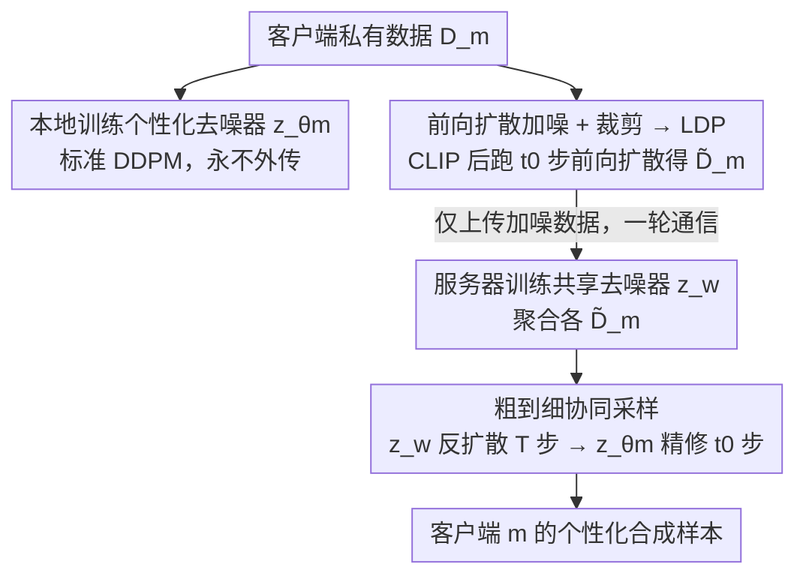

# Personalized Federated Training of Diffusion Models with Privacy Guarantees

**会议**: CVPR 2026  
**论文**: [CVF Open Access](https://openaccess.thecvf.com/content/CVPR2026/html/Patel_Personalized_Federated_Training_of_Diffusion_Models_with_Privacy_Guarantees_CVPR_2026_paper.html)  
**代码**: 待确认  
**领域**: 联邦学习 / 扩散模型 / 差分隐私  
**关键词**: 联邦学习, 扩散模型, 差分隐私, 个性化, 隐私攻击防御

## 一句话总结
PFDM 把扩散模型的反向去噪过程拆成"客户端私有去噪器 + 服务器共享去噪器"两块，客户端只上传经裁剪并前向加噪后的数据，从而对每个数据点给出形式化的本地差分隐私（LDP）保证；共享模型只见加噪数据、单独无法复现任何客户端样本，而协同又能显著提升少数类/欠表示类的生成质量。

## 研究背景与动机
**领域现状**：医院、金融、科研机构受隐私法规所限无法把数据集中，于是用联邦学习（FL）在不交换原始数据的前提下协同训练。近期不少工作把 FL 用到扩散模型上（FedAvg 训 DDPM、FedDM 等），想训一个能扩充数据覆盖、支持多种下游任务的共享生成模型。

**现有痛点**：现有联邦扩散方法训的都是**单一全局扩散模型**，有三个硬伤。其一，**没有客户端级控制**——所有人共用一个生成器，无法生成符合各自分布的个性化合成数据。其二，**记忆风险**——扩散模型会记住训练样本，把一个端到端的全局生成器直接放出去，等于让所有客户端暴露在抽取/重建攻击下。其三，**标准 DP 训练不顶用**——给扩散模型套 DP-SGD 往往严重掉质量、在高维图像上扩展性差，且仍可能记忆；把低维表格上的 DP-SGD 扩散训练搬到高维图像并不平凡，因为 DP 噪声会破坏去噪过程的稳定性。

**核心矛盾**：单一全局生成器在"安全（防记忆/重建）"和"灵活（个性化控制）"之间两头不讨好——越想共享越危险，越加 DP 噪声质量越差。

**本文目标**：在去中心化、形式化隐私保证下，给每个客户端一个个性化生成模型，同时维持一个可安全共享、单独却无法生成任意客户端样本的共享模型。

**切入角度**：作者观察到扩散去噪天然有"粗到细"层次——前向扩散过程里图像的细粒度细节（如纹理）比宏观结构（如背景布局）衰减得更快。于是可以让共享模型只学"加噪后还剩下的粗结构"，把敏感细节留给本地模型。

**核心 idea**：把反向去噪拆成 shared（标准高斯噪声 → 客户端加噪图像的混合）和 client-specific（加噪图像 → 干净图像）两段——共享模型永远只处理加噪数据，从而既降低记忆风险、又给每个客户端直接的合成数据控制权。

## 方法详解

### 整体框架
PFDM（Algorithm 1）是一个只需一轮通信的两阶段联邦框架。每个客户端先在本地私有数据上用标准 DDPM 训一个**个性化去噪器** $z_{\theta_m}$（永不外传）；随后对采样到的数据先做**裁剪**、再跑 $t_0$ 步前向扩散得到加噪数据集 $\tilde{D}_m$，**只把这份加噪数据上传**给服务器。服务器聚合所有 $\tilde{D}_m$ 训一个**共享全局去噪器** $z_w$。采样时先用 $z_w$ 反扩散 $T$ 步得到一个体现跨客户端公共结构的中间样本，再交给客户端的 $z_{\theta_m}$ 精修 $t_0$ 步，补回该客户端特有的细节。整个流程里共享模型只接触加噪数据，因此既能安全共享、又单独无法复现任何人的样本。

### 关键设计

**1. 个性化去噪拆分：共享模型只见加噪数据**

这是治"单一全局生成器既危险又不灵活"的根。PFDM 把反向（去噪）过程拆成两段：**客户端去噪器** $z_{\theta_m}$ 负责把噪声图像映射回干净图像（学的是该客户端特有的细粒度细节），**共享去噪器** $z_w$ 负责把标准高斯噪声映射到"客户端加噪图像的混合分布"。关键在于共享模型**全程只处理加噪后的客户端图像**，从不接触干净数据——这既降低了记忆敏感样本的风险，又使共享模型单独无法生成任何特定客户端的样本（必须配上本地模型才有用）。这种拆分让共享模型专注捕捉可泛化的跨客户端高层特征（有助于缓解数据不平衡），而把敏感的细粒度特征隔离在本地。

**2. 前向扩散加噪+裁剪：用扩散噪声本身换 LDP 保证**

客户端在上传前做两件事：先对样本裁剪 $\text{CLIP}(x,C)=x\cdot\min(1,C/\|x\|_2)$ 把幅度限到 $C$，再跑 $t_0$ 步前向扩散 $\tilde{x}_0=\sqrt{\bar{\alpha}_{t_0}}\,\text{CLIP}(x_0,C)+\sqrt{1-\bar{\alpha}_{t_0}}\,z$。这一步注入的高斯噪声正好被复用为差分隐私机制——定理 5.1 给出：上传结果对每个数据点满足 $(\epsilon,\delta)$-**本地差分隐私（LDP）**，其中有效噪声方差 $\sigma^2=(1-\bar{\alpha}_{t_0})/\bar{\alpha}_{t_0}$，$\epsilon$ 的上界为 $\frac{2C^2}{\sigma^2}+C\sqrt{\frac{8\log(1/\delta)}{\sigma^2}}$。因此 $t_0$ 就是**隐私-效用的旋钮**：$t_0$ 越大、$\sigma^2$ 越大、隐私越强但细节保留越少。作者选 LDP 而非中心 DP 是因为它不需要可信服务器，且逐样本 LDP 严格强于同级别的样本级中心 DP——这对 cross-silo 场景（每个机构持有大量个体记录）最实用。文中举例：$T=1000$、线性噪声调度、$C=10$、$t_0=690$ 时给出 $\epsilon=10,\delta=10^{-5}$ 的 LDP。

**3. 粗到细协同采样：为什么"拆"是有效的**

采样分两段（Algorithm 2）：先用全局 $z_w$ 从标准高斯噪声反扩散 $T$ 步得中间样本 $\tilde{x}_0$，再用本地 $z_{\theta_m}$ 从 $t_0$ 步往回精修 $t_0$ 步得最终样本（若本地模型已能从噪声直接生成高质图像，也可只用本地模型）。拆分之所以成立，靠的是前向扩散的**粗到细**性质：细粒度细节（纹理）比宏观结构（背景布局）衰减更快，所以即便不同客户端原始数据差异很大，它们的加噪分布 $\{q_m(x_{t_0})\}$ 会**聚到相似的大尺度特征上**。于是在这些加噪数据上训 $z_w$ 就能学到广泛有用、又不触及敏感信息的结构模式，敏感细节则由各自的 $z_{\theta_m}$ 补回——这正是"共享公共结构、本地补私有细节"能同时拿到隐私和效用的根本原因。

**4. 效用保证：协同对少数类的增益**

定理 5.2 在高斯混合模型（GMM）下给出效用界：客户端 $m$ 学到的条件分布与真分布的 2-Wasserstein 距离期望为 $O\!\big(\frac{2}{2+3\sigma^2}\cdot\frac{d^2}{N_k}+\frac{3\sigma^2}{2+3\sigma^2}\cdot\frac{d^2}{n_k^m}\big)$，其中 $n_k^m$ 是客户端 $m$ 的类-$k$ 样本数、$N_k=\sum_m n_k^m$ 是全体类-$k$ 样本数。这个界在两个极端间平滑插值：$\sigma^2\to\infty$（最大隐私）逼近非协同率 $O(d^2/n_k^m)$，$\sigma^2\to 0$（最小隐私）逼近集中式率 $O(d^2/N_k)$。由于 $N_k$ 可能远大于 $n_k^m$（尤其类 $k$ 在客户端 $m$ 上欠表示时），协同对**少数类**收益巨大——定理还进一步证明在足够总支持下 PFDM 严格优于非协同训练。

### 损失函数 / 训练策略
两阶段都用标准 DDPM 训练目标（预测噪声的 $\ell_2$ 损失 $\mathbb{E}\|z_t-z_\theta(x_t,t)\|_2^2$）。全程线性噪声调度、$T=1000$，隐私预算固定 $\epsilon=10,\delta=10^{-5}$，只在开头通信一轮。由于全局模型只见裁剪图像、输出也偏裁剪，本地训练额外混入裁剪/未裁剪样本并加一个辅助条件信号，把生成引导回未裁剪图像。

## 实验关键数据

### 主实验
在 CIFAR-10、Colorized MNIST、CelebA 上用 FID 评估（按第一个客户端的多数/少数类分别报，越低越好）。PFDM 逼近非私有基线、且在少数类上大幅优于非协同基线：

| 方法 | CIFAR-10 (多/少/均) | C-MNIST (多/少/均) | CelebA (多/少/均) |
|------|--------------------|---------------------|---------------------|
| 非私有(集中式) | 16.27/17.62/16.95 | 1.85/1.45/1.66 | 13.72/11.70/12.71 |
| 非私有(FedDM) | 18.05/19.15/18.60 | 1.89/1.51/1.70 | 14.47/11.83/13.15 |
| 非协同(隐私极端) | 19.87/36.44/28.16 | 2.19/5.99/4.09 | 23.42/41.38/32.40 |
| **本文(协同)** | **19.85/35.78/27.82** | **1.72/4.79/3.26** | **18.11/28.09/23.10** |

与 DP 训练基线 DPDM 对比（MNIST，两客户端，$\epsilon=10$）：PFDM 多/少数类 FID 为 5.40/8.51（均 6.96），而联邦化 DPDM 仅 31.06/36.40（均 33.73）——说明给扩散模型直接套 DP-SGD 的图像质量远差于本文的"拆分+加噪上传"方案。

### 隐私攻击评估
对全局模型做成员推断（PIA）、记忆、重建三类攻击，AUC/ASR 都贴近 50%（随机猜）：

| 指标 (300 epoch 全局模型) | CIFAR-10 | C-MNIST | CelebA |
|---------------------------|----------|---------|--------|
| AUC | 50.01 | 49.70 | 50.08 |
| ASR | 50.15 | 50.10 | 50.34 |
| TPR@1% FPR | 0.82 | 1.07 | 0.86 |

作为对照，标准非私有（集中式）模型训到 1000 epoch 后 MIA 的 AUC 在三数据集上分别飙到 82.13% / 99.62% / 99.59%。记忆检测（最近邻比例准则）下生成样本无一满足记忆条件；重建攻击下服务器收到的加噪图像也无法被复原。

### 关键发现
- **少数类是协同的最大受益者**：定理 5.2 预言 $N_k\gg n_k^m$ 时协同增益大，实验印证——少数类 FID 相比非协同显著下降（如 C-MNIST 5.99→4.79、CelebA 41.38→28.09）。
- **客户端越多、协同价值越大**：CIFAR-10 上固定总数据量、把客户端从 4 增到 128，协同与非协同的 FID 差距随客户端数增大而扩大，说明数据越碎片、越异质，协同越值。
- **隐私防护是"结构性"的**：全局模型生成的数字形状不可辨（只剩粗色彩/布局），三类攻击全线接近随机猜，证明防护来自"共享模型只见加噪数据"的设计，而非事后调参。

## 亮点与洞察
- **把扩散噪声"一鱼两吃"**：前向扩散注入的高斯噪声既是生成机制、又被直接复用为 DP 机制，省掉了额外 DP-SGD 噪声对去噪过程的破坏——这是比"扩散模型 + DP-SGD"优雅得多的隐私化路径。
- **粗到细 = 隐私边界**：用"细节比结构衰减快"这一扩散固有性质，把"哪些信息可共享"和"哪些必须留本地"在数学上对齐到 $t_0$ 这一个旋钮上，思路非常干净，可迁移到其他需要"共享粗、私有细"的协同生成场景。
- **理论与实证闭环**：定理（隐私 5.1 + 效用 5.2）+ 三类隐私攻击 + 多数据集 FID，把"协同提升少数类、且不泄露"这件事从两头都钉死了。

## 局限与展望
- **依赖 cross-silo 假设**：方法主打 cross-silo（每客户端数据量大），并把标签当公开条件变量只保护图像内容；标签敏感或 cross-device（海量小客户端）场景下的适配性未充分讨论。
- **效用理论限于 GMM**：定理 5.2 的插值界基于高斯混合 + 分段线性去噪网络这一可分析近似，真实高维图像上的紧致性以经验为准。⚠️ 各定理常数与条件以原文为准。
- **裁剪带来的分布偏移**：全局模型只见裁剪图像、输出偏裁剪，需靠本地混入未裁剪样本 + 辅助条件信号纠偏，这步引入额外设计复杂度，其鲁棒性有待更多数据集验证。

## 相关工作与启发
- **vs FedDM / FedAvg-DDPM**：它们训单一全局扩散模型、提升通信效率，但不给形式化 DP，客户端仍易受梯度重建攻击，且无个性化控制；PFDM 给每点 LDP、且产出个性化生成器。
- **vs DPDM（DP-SGD 扩散）**：DP-SGD 给扩散模型在高维图像上加噪会破坏去噪稳定性、严重掉质量（联邦 DPDM FID 33.73 vs 本文 6.96）；PFDM 改用"前向扩散加噪上传"把隐私噪声与生成机制统一。
- **vs 个性化联邦（拆 UNet 为共享/本地）**：已有工作（如把 UNet 拆共享/本地模块）做个性化但**不给形式化 DP**；PFDM 的拆分专门设计成"共享只见加噪数据"，同时拿到个性化与可证隐私。

## 评分
- 新颖性: ⭐⭐⭐⭐ "前向扩散加噪即 DP + 个性化去噪拆分"组合是个漂亮的新视角
- 实验充分度: ⭐⭐⭐⭐ 三数据集 + 多客户端规模 + 三类隐私攻击 + DP 基线对比，较全面
- 写作质量: ⭐⭐⭐⭐ 理论与实证衔接清晰，"为什么拆有效"讲得到位
- 价值: ⭐⭐⭐⭐ 给"可证隐私 + 个性化"的联邦扩散提供了一条比 DP-SGD 更实用的路线

<!-- RELATED:START -->

## 相关论文

- [\[CVPR 2026\] HiLoRA: Hierarchical Low-Rank Adaptation for Personalized Federated Learning](hilora_hierarchical_low-rank_adaptation_for_personalized_federated_learning.md)
- [\[CVPR 2026\] GDFA: Geometry-Driven Federated Unlearning with Directional Task Vector Alignment](gdfa_geometry-driven_federated_unlearning_with_directional_task_vector_alignment.md)
- [\[CVPR 2026\] Fully Decentralized Certified Unlearning](fully_decentralized_certified_unlearning.md)

<!-- RELATED:END -->
