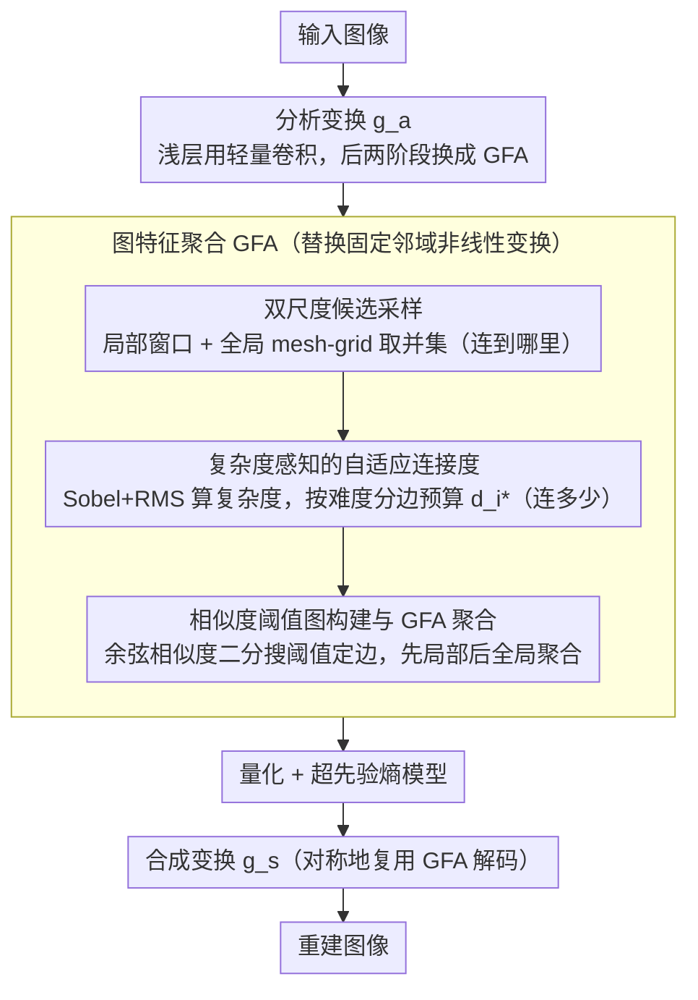

# Adaptive Learned Image Compression with Graph Neural Networks

**会议**: CVPR 2026  
**arXiv**: [2603.25316](https://arxiv.org/abs/2603.25316)  
**代码**: [https://github.com/UnoC-727/GLIC](https://github.com/UnoC-727/GLIC)  
**领域**: 图学习 / 学习图像压缩  
**关键词**: 图像压缩、GNN、双尺度采样、RMS 梯度、内容自适应连接

## 一句话总结

GLIC 把学习图像压缩里的非线性变换从固定卷积或窗口注意力，改造成由图神经网络驱动的内容自适应连接：先用双尺度图决定“连到哪里”，再用复杂度感知机制决定“连多少”，从而更好地建模局部与远程冗余，在三个标准数据集上都显著超过传统编解码器和近期 LIC 强基线。

## 研究背景与动机

学习图像压缩已经从早期卷积式 autoencoder 演化到 CNN、Transformer、Mamba 等多种主干，率失真性能不断逼近甚至超过传统编解码器。但这些方法有一个很深的共同假设：邻接关系大多是预先固定的。卷积把每个像素绑在一个固定 `k x k` 邻域里，窗口注意力把交互限制在预设窗口中，哪怕有移位或形变，本质上仍然是“邻域先定好，再在里面做加权”。

问题在于，图像压缩最关心的是冗余，而冗余既不均匀，也不一定局限在局部欧氏邻域。平滑区域冗余很高，边缘和纹理区域冗余低；一些远距离但结构相似的区域在压缩时也非常值得相互参考。如果仍用固定连接模式，模型就会把很多不相关的近邻硬连起来，却遗漏一些真正有压缩价值的远程相关区域。

因此作者把核心矛盾归纳为两件事：

- **where to connect**：哪些位置应该建立信息交互。
- **how much to connect**：不同像素该分配多少连接预算。

CNN 和窗口注意力在这两个维度上都太刚性。于是作者转向 GNN，希望利用其动态图连接能力，让压缩模型根据内容复杂度和相似性自动决定连接模式。这个想法不是简单“把卷积换成图网络”，而是明确围绕压缩中的空间冗余建模来设计候选邻域、度分配和图聚合。

## 方法详解

### 整体框架

GLIC 要解决的事很具体：把学习图像压缩里固定邻域的非线性变换，换成能根据内容自己决定连接结构的图变换。它建立在标准 VAE 式压缩框架上，保留分析变换 $g_a$、合成变换 $g_s$ 和超先验熵模型，没有改框架的大结构，而是把其中的非线性变换块换成图驱动的 `Graph-based Feature Aggregation (GFA)`。

整条 pipeline 的务实之处在于分层级用图。网络前半段在高分辨率浅层特征上，作者仍用轻量卷积块——因为在大尺寸特征图上直接构图代价太高；到了后两阶段，特征图空间分辨率已经下降，作者才把传统卷积/注意力块替换成 GFA-Local 与 GFA-Global 的串联，让编码和解码都能用上动态邻接。GFA 内部的运转分三步：先用双尺度采样为每个节点圈出候选邻居（连到哪里），再用复杂度感知机制给每个节点分配连接预算（连多少），最后用相似度阈值在候选里挑出真正的边并做图聚合。

### 关键设计

**1. 双尺度候选采样：同时抓住近处细节和远处相似**

如果只在局部窗口里建图，远程相关性就丢了；如果只在全图稀疏采样，低层纹理和边界又会糊掉。作者的做法是给每个像素节点同时构造两个候选集合再取并集：局部候选集来自固定大小的局部窗口，负责保留精细纹理与边界结构；全局候选集来自按步长采样的 mesh-grid，在全图范围稀疏取点，为远距离冗余建模提供一个低成本入口。这样「近处看细节、远处找相似」被一次性纳入同一个候选集，而代价远低于全局全连接注意力——后者要在所有位置间两两计算，而稀疏 mesh-grid 只保留有限个全局锚点。

**2. 复杂度感知的自适应连接度：把连接预算按内容难度分配**

图像压缩不是分类，没必要让每个位置都拥有相同的建模容量；平滑区域冗余高、少连几条边也不伤重建，难压缩的边缘纹理才更需要邻居来消除冗余。作者用 Sobel 算子在每个通道上算梯度，再经 RMS pooling 汇成一个复杂度分数——梯度越大，说明局部结构越复杂、冗余越低。然后把全图总边预算 $B = N \cdot \bar{d}$（$N$ 为节点数，$\bar{d}$ 为平均度数）按复杂度比例分配下去，得到每个节点的目标度数 $d_i^*$：复杂区域分到更高的 $d_i^*$，平滑区域分到更低的。相比每个节点强制同度的 kNN 式 GNN，这等于把有限的连接预算主动倾斜给了难压缩区域。

**3. 相似度阈值图构建与 GFA 聚合：在候选里挑出真正该连的边**

双尺度采样给出了「有哪些点可能值得连」，但最终到底连谁还得再筛一遍。作者对每个节点计算它与候选节点的余弦相似度，再用二分搜索找一个阈值，使保留下来的邻居数量尽量贴近目标度数 $d_i^*$——相似度高于阈值的候选才保留为邻居。随后在这张有向图上做图特征聚合，先局部图聚合、再全局图聚合。这种「先采样圈范围、再阈值定边」的分步构图，比直接在全图上做软注意力更可控，得到的也是压缩真正需要的稀疏结构，而非稠密加权。

### 损失函数 / 训练策略

训练目标仍是标准率失真优化，最小化码率项与失真项之和。作者分别在 PSNR 和 MS-SSIM 两种设定下训练，并用 BD-rate、BD-PSNR 做比较——这意味着 GLIC 的收益不是靠改评价协议换来的，而是在同一压缩目标下得到了更优的变换表示。

## 实验关键数据

### 主实验

作者在 Kodak、Tecnick、CLIC 三个标准数据集上对比 VTM-9.1 和一系列近期 LIC 强基线。最核心结果如下。

| 指标 | Kodak | Tecnick | CLIC |
|---|---:|---:|---:|
| GLIC 相对 VTM-9.1 的 BD-rate | **-19.29%** | **-21.69%** | **-18.71%** |
| 相对 FTIC 的 BD-PSNR 增益 | +0.26 dB | +0.38 dB | +0.37 dB |
| 相对 TCM-L 的 BD-PSNR 增益 | +0.39 dB | +0.56 dB | +0.46 dB |

这些结果说明 GLIC 并不是只在某一个数据集上偶然占优，而是在高分辨率 Tecnick、2K 的 CLIC 以及经典 Kodak 上都稳定收益，尤其 Tecnick 上 21.69% 的 BD-rate 降低很有说服力。

### 消融实验

论文对复杂度评分与通道池化策略做了很细的消融，这一部分很好地支撑了“RMS Sobel 梯度”不是拍脑袋选择。

| 评分策略 | 通道池化 | Kodak | CLIC | Tecnick |
|---|---|---:|---:|---:|
| None | None | -16.97 | -16.21 | -18.21 |
| Local Entropy | RMS | -17.05 | -17.01 | -18.97 |
| Rescaling Residual | RMS | -17.67 | -17.03 | -19.68 |
| Rescaling Residual | Mean | -18.23 | -17.82 | -20.39 |
| Sobel Gradient | Mean | -18.02 | -17.42 | -20.62 |
| **Sobel Gradient** | **RMS** | **-19.29** | **-18.71** | **-21.69** |

### 关键发现

- 双尺度图设计是成立的。论文文字分析指出，只用局部图或只用全局图都会明显退化，其中仅全局图最差，说明压缩确实需要同时保留局部精细结构和远程冗余建模。
- 复杂度感知连接度也很关键。若完全取消复杂度评分，模型退化为更接近固定 `kNN` 的 GNN，三个数据集都比完整设计差。
- Sobel + RMS 优于 mean pooling，说明在压缩里更强调大梯度区域的显著性是合理的。RMS 对强边缘更敏感，正好能把预算分配给难压缩区域。
- 除了压缩率，论文还强调效率。相对 MambaIC，GLIC 在参数量、FLOPs、解码延迟和显存上都有明显下降，说明图结构没有把系统拖进“性能好但太慢”的尴尬境地。

## 亮点与洞察

- 本文真正有价值的地方不是“GNN 首次用于 LIC”这个 headline，而是把 GNN 用在了压缩最关心的两个问题上：连接范围和连接密度。这个问题分解非常自然，也很符合压缩里的物理直觉。
- `where` 和 `how much` 的解耦值得记住。很多架构设计把所有适应性都塞进一个 attention 模块里，而 GLIC 明确先做候选采样，再做预算分配，模块职责清楚，分析也更容易。
- 作者没有把 GNN 全面替换所有层，而是在后两阶段使用 GFA，在前面保留轻量卷积块。这种混合式设计工程感很强，比纯理论上的“全图网络”更落地。
- 论文对 ERF 的分析也很有意思。作者展示 GLIC 在不同内容位置会产生明显不同的有效感受野，这正是内容自适应连接真正起作用的证据。

## 局限与展望

- 图构建仍然需要计算候选相似度并做二分阈值搜索，这部分虽然比全局注意力便宜，但在更高分辨率或更严格实时场景里仍可能成为瓶颈。
- 当前工作主要聚焦静态图像压缩。若扩展到视频压缩，图节点还会增加时间维，图构建与同步更新会复杂得多。
- 连接预算依赖手工定义的复杂度评分。虽然 Sobel-RMS 很有效，但仍属于人为设计特征，未来可尝试学习式复杂度估计器。
- 模型主要与 VTM 和学术 LIC 基线比较。面向工业落地时，还需要与更完整的软件和硬件编码链路评估端到端收益。
- 另一个自然方向是把 GFA 与更强的熵模型结合。本文主要在变换网络上发力，若后续能把图结构进一步引入上下文熵估计，可能还有空间。

## 相关工作与启发

- **vs CNN-based LIC**：卷积最大的优势是高效，但固定邻域太刚。GLIC 表明，在压缩这类强依赖冗余关系的任务上，固定欧氏邻域并不总是最优归纳偏置。
- **vs Window Transformer LIC**：窗口注意力相比卷积扩大了表达力，但本质上仍是块状局部交互。GLIC 的全局稀疏采样解决了“窗口之外也想连”的问题。
- **vs 形变卷积压缩方法**：形变卷积能动态偏移，但偏移数量和范围仍受限制；图连接则在连接集合上更自由。
- 对我的启发是，在低层视觉任务里，图网络最有价值的地方不是追求抽象语义，而是处理空间关系的非均匀性。压缩、去噪、超分这类任务以后可能都可以沿这个思路重新设计邻接结构。

## 评分

- 新颖性: ⭐⭐⭐⭐⭐ 把 GNN 真正嵌入 LIC 的率失真建模逻辑中，而不是简单替代模块，思路很扎实。
- 实验充分度: ⭐⭐⭐⭐ 三个标准数据集、主结果、复杂度分析和多组消融都到位，但更多下游部署评测仍可补充。
- 写作质量: ⭐⭐⭐⭐ 问题拆分清楚，方法和实验之间对应关系强。
- 价值: ⭐⭐⭐⭐⭐ 为学习图像压缩提供了新的建模范式，后续影响力很可能不止停留在图像压缩本身。

<!-- RELATED:START -->

## 相关论文

- [\[AAAI 2026\] Adaptive Riemannian Graph Neural Networks](../../AAAI2026/graph_learning/adaptive_riemannian_graph_neural_networks.md)
- [\[AAAI 2026\] Beyond Fixed Depth: Adaptive Graph Neural Networks for Node Classification Under Varying Homophily](../../AAAI2026/graph_learning/beyond_fixed_depth_adaptive_graph_neural_networks_for_node_classification_under_.md)
- [\[ICLR 2026\] Are We Measuring Oversmoothing in Graph Neural Networks Correctly?](../../ICLR2026/graph_learning/are_we_measuring_oversmoothing_in_graph_neural_networks_correctly.md)
- [\[ICML 2026\] Quantile-Free Uncertainty Quantification in Graph Neural Networks](../../ICML2026/graph_learning/quantile-free_uncertainty_quantification_in_graph_neural_networks.md)
- [\[AAAI 2026\] Self-Adaptive Graph Mixture of Models](../../AAAI2026/graph_learning/self-adaptive_graph_mixture_of_models.md)

<!-- RELATED:END -->
