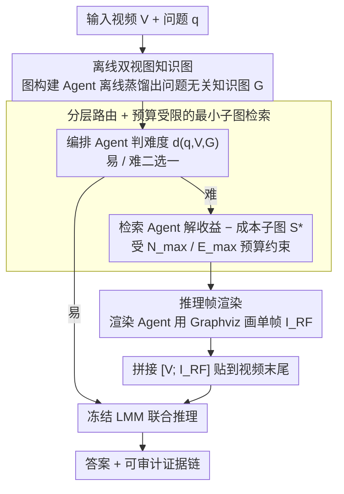

# Graph-to-Frame RAG: Visual-Space Knowledge Fusion for Training-Free and Auditable Video Reasoning

**会议**: CVPR 2026  
**arXiv**: [2604.04372](https://arxiv.org/abs/2604.04372)  
**代码**: 无  
**领域**: 多模态VLM / 图学习  
**关键词**: 视频检索增强生成、知识图谱、视觉空间融合、多智能体框架、免训练视频推理

## 一句话总结
提出 G2F-RAG 范式，将检索到的结构化知识渲染为单帧"推理帧"附加到视频末尾，使大模型在视觉空间内统一推理，避免了文本追加导致的注意力稀释和认知负荷，在 8 个视频基准上实现免训练的一致性提升。

## 研究背景与动机

**领域现状**：大型多模态模型（LMM）在视频理解中已取得很大进展，但复杂视频推理仍面临三大挑战：(1) 多步组合推理（跨镜头因果、导航等）；(2) 需要常识、物体功能等外部知识；(3) 小模型需在无额外训练条件下可靠解决问题并提供可审计的证据链。

**现有痛点**：主流视频 RAG 方法采用"检索-追加"范式：追加文本（ASR/OCR/描述）、检索候选片段、或注入结构化图/事件链为文本。但这些方法有一个隐含假设——更多相关内容+更长上下文=更好推理。实际中即使视频很短也会性能下降：异质信息源共享同一注意力空间，连续低层视觉信号与离散高层文本竞争注意力，导致注意力稀释和认知负荷增加。

**核心矛盾**：不仅在于"检索什么"，更在于"如何表示和融合外部知识"。当语义不对齐、负荷不可控时，检索反而损害模型能力。实验证实：Video-RAG 在 MLVU 上比基线低 5.4 点，而 G2F-RAG 高 4.6 点。

**本文目标** 如何将外部知识以模态对齐的方式融合到视频模型中，避免跨模态竞争和上下文爆炸？子问题包括：(1) 离线构建可复用的视频知识图；(2) 在线判断是否需要外部知识；(3) 检索最小充分子图并渲染为视觉帧。

**切入角度**：视频模型在视觉空间内聚合和推理最强。外部知识应以视觉语法进入同一空间。研究表明视觉模态可以作为文本信息的高效压缩介质。因此将检索到的结构化知识转换为视觉token，让模型在最熟悉的时空推理域操作。

**核心 idea**：将检索到的知识子图渲染为单帧推理帧，追加到视频末尾，实现视觉空间内的知识融合，避免跨模态注意力竞争。

## 方法详解

### 整体框架
G2F-RAG 要回答的是：怎么把检索来的外部知识"喂"给视频模型，又不让它和原始视觉信号抢注意力。答案是把知识画成一帧图、贴在视频末尾，让模型在它最擅长的视觉时空空间里一起看。整条流水线由四个 Agent 协作，分离线、在线两段：离线时，图构建 Agent 把视频看一遍，生成一张与具体问题无关的完整知识图 $\mathcal{G}$（实体、事件、空间关系、外部常识全收进去），构建一次、之后所有问题复用同一张图；在线时，编排 Agent 先判断这道题难不难——简单题直接让 LMM 答，难题才走 RAG，由检索 Agent 从 $\mathcal{G}$ 里抠出最小充分子图 $S^\star$，渲染 Agent 把 $S^\star$ 画成单帧推理帧 $I_{\text{RF}}$，拼到视频后面得到 $\tilde{V}=[V; I_{\text{RF}}]$，再交给冻结的 LMM 联合推理。全程骨干不动一根参数。

### 关键设计

**1. 离线双视图知识图：一次构建、多次复用**

主流 RAG 是来一道题、临时检索一次外部内容，既慢又难复用。这里反过来，先离线把整段视频蒸馏成一张与问题无关的知识图 $\mathcal{G}$，缓存下来后任意问题都直接查。图本身统一了两个互补视图：事件-因果视图记录"发生了什么"——参与者、动作、意图、前置/后置条件、因果链；场景-功能视图记录"在哪里、用什么发生"——物体及其可供性（affordance）、功能区域及其连通性、抽象概念知识。两个视图之间用密集交叉链接绑定，使推理能在因果链和空间布局之间无缝跳转；需要世界知识时还可挂接外部网络工具补充。这套双视图正好覆盖了复杂视频推理的两大类需求（跨镜头因果 + 空间/功能常识），而问题无关的设计让重活只干一次。

**2. 分层路由 + 预算受限的最小子图检索：该补知识才补，且只补刚好够用的**

直觉上"检索越多越好"在这里是错的——对简单题强行注入知识反而掉点（关闭路由、全部走 RAG 会让 VideoMME 从 70.6% 跌到 66.8%）。于是编排 Agent 先做一次难度判断 $d(q,V,\mathcal{G}) \in \{\text{easy}, \text{hard}\}$，判据是代理效用增量 $\Delta U = \hat{U}_{\text{G2F}} - \hat{U}_{\text{Base}}$ 与阈值 $\tau$ 的比较——即"加了推理帧能涨多少分"超过 $\tau$ 才走 RAG，否则让模型裸答。一旦判为 hard，检索 Agent 不是把相关节点一股脑塞进去，而是解一个收益减成本的子图选择问题：

$$S^\star = \arg\max_{S \subseteq \mathcal{G}} \big[\,R(q,S) - \lambda\, C(S)\,\big],\quad \text{s.t.}\ |\mathcal{V}(S^\star)| \leq N_{\max},\ |\mathcal{E}(S^\star)| \leq E_{\max}$$

其中 $R(q,S)$ 是子图对问题 $q$ 的相关性，$C(S)$ 是子图复杂度（会转成视觉 token 开销），$\lambda$ 平衡两者，节点数和边数还有硬上限 $N_{\max}/E_{\max}$ 直接卡死视觉 token 预算。这样既挡掉了简单题的无谓干扰，又保证难题拿到的是"最小但充分"的知识——松散全量子图（Full-Loose）反而会让精度轻微下降，印证了信息过载本身就是损害。

**3. 推理帧渲染：让知识以视觉语法进入模型最熟悉的空间**

前两步选出了该补什么知识，但若把子图当文本 JSON 追加，又会回到"离散文本和连续视觉抢注意力"的老问题。这一步的关键是换交付模态：渲染 Agent 用 Graphviz 把子图 $S^\star$ 画成单帧推理帧 $I_{\text{RF}}$，采用极简视觉语法（图标 + 短标签）勾出关键实体、关系和因果流，不编码时间戳，只呈现结构与机制。帧贴在视频末尾 $[V; I_{\text{RF}}]$——既不打断原始内容的时间聚合，时间注意力又能覆盖到它；prompt 同时声明"以视频为权威、推理帧为辅助"，所以即便故意塞入错误/对抗性的推理帧，性能也几乎不掉。位置和风格都是消融出来的最优解：贴中间（Mid）会破坏时间聚合（MLVU 73.4→67.9），贴四帧（End-4）徒增 token 预算反而降到 69.0，而 Minimal 风格优于 Text-Heavy——后者等于把上下文负担又请了回来。正是这一步把"如何融合"从"融合什么"中拆出来，让同一份子图在视觉帧交付下比文本 JSON（G2J-RAG）在 VideoMME 上整整高 7.6 点。

### 一个完整示例
设有一道难题"主角为什么能打开那扇门"，视频很短但答案藏在跨镜头的因果里。离线阶段图构建 Agent 已经把这段视频蒸馏成知识图 $\mathcal{G}$：事件-因果视图里有"主角拾起钥匙→走向门→门被打开"的因果链及"门上锁"这一前置条件，场景-功能视图里标注了"钥匙可用于开锁"的可供性。提问到来，编排 Agent 估算 $\Delta U$ 发现裸答把握不大、超过阈值 $\tau$，判为 hard 走 RAG。检索 Agent 在 $N_{\max}/E_{\max}$ 预算内解出最小子图 $S^\star$——只保留钥匙、门、主角三个节点和"拾起/开锁/打开"三条边，丢掉无关的背景实体。渲染 Agent 把这张三节点子图用 Graphviz 画成一帧 $I_{\text{RF}}$：钥匙图标→门图标，箭头标"unlock"。这帧贴到视频末尾，冻结的 LMM 在同一视觉空间里把"看到的画面"和"补充的因果帧"对齐，直接读出"主角先拾到钥匙、钥匙能开锁"，给出正确答案；若换成同样信息的文本 JSON 注入，模型注意力会被分散到文本上、反而答错。

### 损失函数 / 训练策略
全程无训练，基于冻结骨干 + prompt 设计。路由与子图提取都靠 prompt 让 Agent 做任务分解和策略选择：离线图构建用 GPT-4o，在线路由和子图提取用更轻的 GPT-4o-mini。

## 实验关键数据

### 主实验（跨模型跨任务）

| 模型 | 原始 VideoMME | +G2F-RAG | 原始 WildVideo | +G2F-RAG | 原始 MLVU | +G2F-RAG |
|------|-------------|----------|--------------|----------|---------|----------|
| InternVL3.5-4B | 65.4 | 70.1 (+4.7) | 45.2 | 47.1 (+1.9) | - | - |
| LLaVA-Video-7B | 63.7 | 64.5 (+0.8) | 53.4 | 57.0 (+3.6) | 69.5 | 75.5 |
| Qwen2.5-VL-7B | 65.1 | 70.6 (+5.5) | 51.3 | 55.4 (+4.1) | 68.8 | 73.4 |
| InternVL3.5-8B | 66.0 | 72.0 (+6.0) | 53.0 | 60.1 (+7.1) | - | - |

### 与其他 RAG 方法对比（Qwen2.5-VL-7B）

| 方法 | MLVU | WildVideo | VideoMME |
|------|------|-----------|---------|
| Baseline | 68.8 | 51.3 | 65.1 |
| +Video-RAG | 63.4 (-5.4) | 47.2 (-4.1) | 60.5 (-4.6) |
| +Vgent | 72.1 | 50.1 | 68.9 |
| **+G2F-RAG** | **73.4 (+4.6)** | **55.4 (+4.1)** | **70.6 (+5.5)** |

### 消融实验（Qwen2.5-VL-7B）

| 消融维度 | 变体 | MLVU | VideoMME |
|---------|------|------|---------|
| 表示方式 | G2J-RAG (文本JSON) | 66.2 | 63.0 |
| | **G2F-RAG (视觉帧)** | **73.4** | **70.6** |
| 帧位置 | Mid-1 | 67.9 | 64.0 |
| | End-4 | 69.0 | 66.0 |
| | **End-1** | **73.4** | **70.6** |
| 路由 | Off (全部走RAG) | 69.9 | 66.8 |
| | **On + Fallback** | **73.4** | **70.6** |

### 关键发现
- 视觉帧融合 vs 文本JSON：同样的子图、不同交付方式，G2F-RAG 在 VideoMME 上比 G2J-RAG 高 7.6 点，证明"如何融合"比"融合什么"更关键
- Video-RAG（追加文本）在所有基准上一致降低性能（MLVU -5.4, WildVideo -4.1, VideoMME -4.6），说明异质信息融合本身就是问题源
- 小模型获益更大（4B/7B 提升 3-7 点），因为视觉空间融合减少跨模态竞争与模型容量正交
- 去掉 intent 和 affordance 导致 MLVU 从 73.4 降到 70.2，说明图中的意图和功能字段捕获了有用的前置条件信息
- 故意输入错误/对抗性推理帧时性能几乎不下降，因为prompt始终要求以原始视频为权威

## 亮点与洞察
- "知识交付方式比知识内容更重要"是一个深刻洞察——同样的检索结果，视觉帧比文本JSON高7.6点。这挑战了RAG领域"检索质量决定一切"的隐含假设
- 免训练设计使方法即插即用到任何LMM骨干（InternVL、LLaVA-Video、Qwen-VL），且不同规模都有一致提升。这种架构级方法比微调更具可迁移性
- 单帧推理帧的极简设计反直觉地优于多帧注入——信息压缩到最小必要量反而最有效

## 局限与展望
- 离线图构建依赖 GPT-4o，成本较高且引入闭源模型依赖
- 路由判断的准确性影响最终效果（误分类会导致简单题走RAG降性能或难题直接答错），当前基于prompt的判断缺乏鲁棒性保证
- 推理帧的 Graphviz 渲染可能在复杂子图中可读性不足
- 未在超长视频（>1小时）上验证，知识图的规模和检索精度可能成为瓶颈
- 外部工具（GPT-4o-mini路由）增加了推理延迟

## 相关工作与启发
- **vs Video-RAG**: Video-RAG 追加文本检索结果，一致降低性能；G2F-RAG 通过视觉空间融合一致提升性能，根本区别在于交付模态
- **vs Vgent**: Vgent 用结构化检索和验证缓解过载但仍追加文本，G2F-RAG 进一步将结构化结果转为视觉——在 WildVideo 上分别 57.0 vs 51.6
- **vs 传统知识图谱RAG**: 传统 KG-RAG 将图谱文本化注入，本文首次将图谱可视化为视频帧，利用模型的视觉处理优势
- 注意力分析实证了方法有效性：文本RAG将注意力分散到检索上下文和非关键帧，而G2F-RAG集中在关键段和推理帧

## 评分
- 新颖性: ⭐⭐⭐⭐⭐ 首次提出将检索知识以视觉帧形式融合到视频推理中，范式级创新
- 实验充分度: ⭐⭐⭐⭐⭐ 8个基准、多个骨干、详尽消融（表示/位置/风格/路由/图设计），非常全面
- 写作质量: ⭐⭐⭐⭐⭐ 注意力分析精确揭示问题本质，消融设计细致
- 价值: ⭐⭐⭐⭐⭐ 提出了全新的RAG范式，对视频理解和多模态推理领域有广泛启发

<!-- RELATED:START -->

## 相关论文

- [\[CVPR 2025\] Knowledge Bridger: Towards Training-Free Missing Modality Completion](../../CVPR2025/graph_learning/knowledge_bridger_towards_training-free_missing_modality_completion.md)
- [\[CVPR 2025\] Unbiased Video Scene Graph Generation via Visual and Semantic Dual Debiasing](../../CVPR2025/graph_learning/unbiased_video_scene_graph_generation_via_visual_and_semantic_dual_debiasing.md)
- [\[CVPR 2026\] M3KG-RAG: Multi-hop Multimodal Knowledge Graph-enhanced Retrieval-Augmented Generation](m3kg_rag_multi_hop_multimodal_knowledge_graph_enhanced_retrieval_augmented_genera.md)
- [\[AAAI 2026\] Human Cognition Inspired RAG with Knowledge Graph for Complex Problem Solving](../../AAAI2026/graph_learning/human_cognition_inspired_rag_with_knowledge_graph_for_complex_problem_solving.md)
- [\[NeurIPS 2025\] DuetGraph: Coarse-to-Fine Knowledge Graph Reasoning with Dual-Pathway Global-Local Fusion](../../NeurIPS2025/graph_learning/duetgraph_coarse-to-fine_knowledge_graph_reasoning_with_dual-pathway_global-loca.md)

<!-- RELATED:END -->
