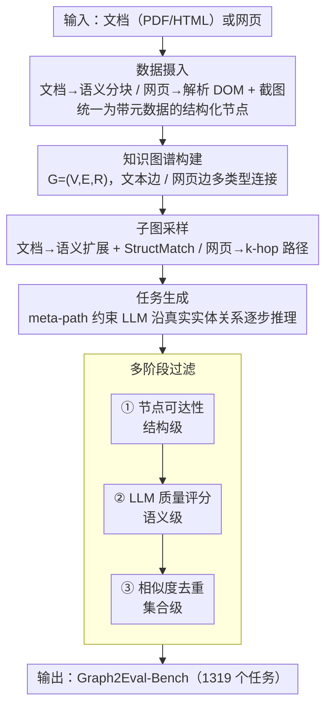

# Graph2Eval: Automatic Multimodal Task Generation for Agents via Knowledge Graphs

**会议**: CVPR 2026  
**arXiv**: [2510.00507](https://arxiv.org/abs/2510.00507)  
**代码**: [github.com/YurunChen/Graph2Eval](https://github.com/YurunChen/Graph2Eval)  
**领域**: 人机理解 / Agent 评估  
**关键词**: 知识图谱, 自动任务生成, agent评估, 文档理解, 网页理解, benchmark构建

## 一句话总结
提出 Graph2Eval，一个知识图谱驱动的 agent 评估任务自动生成框架——通过从文档/网页构建结构化知识图谱、子图采样、LLM 条件生成和多阶段过滤，自动产出语义一致（+20%）且可解（+17%）的多模态 agent 任务，构建了包含 1319 个任务的 Graph2Eval-Bench。

## 研究背景与动机
多模态 agent（文档理解 agent、网页浏览 agent）的评估严重依赖人工标注的静态 benchmark，存在三大缺陷：

**规模瓶颈**：人工构造任务成本高、速度慢，难以跟上 agent 能力的快速迭代

**覆盖不足**：静态 benchmark 只覆盖有限的任务类型和难度级别，容易被"刷榜"过拟合

**时效性差**：真实的文档/网页不断更新，固定 benchmark 的 ground truth 可能过时

**现有自动化方法的不足**：
- **纯 LLM 合成**（Self-Instruct、Evol-Instruct）：直接让 LLM 从文本片段生成 QA 对，但缺乏对实体间关系的显式建模——生成的问题可能引用不存在的实体组合（**语义不一致**），或要求跨越不可达路径的信息（**不可解**）
- **模板填充**：基于预定义模板的方法只能生成格式固定的任务，多样性差
- **随机采样**：从文档中随机抽取片段生成 QA，缺乏结构感知，容易产出琐碎或不合理的任务

**核心 idea**：用知识图谱作为中间结构化表示——先从文档/网页中抽取实体和关系构建 KG $G=(V,E,R)$，再通过子图采样获取语义连贯的上下文子图，最后基于子图约束 LLM 生成任务。KG 的结构保证了实体关系的可达性（可解性）和语义完整性（一致性）。

## 核心问题
如何自动生成语义一致、可解、多样的多模态 agent 评估任务？关键挑战：(1) 如何从异构文档/网页中提取结构化知识？(2) 如何采样出适合做任务素材的子图？(3) 如何保证生成任务的质量（不出幻觉、确实可完成）？

## 方法详解

### 整体框架
Graph2Eval 要解决的是"如何不靠人工、自动批量造出靠谱的多模态 agent 评估任务"。它的做法是把一份文档或一个网页先变成一张知识图谱，再从图上"抠"出连贯的子图当素材，最后让 LLM 沿着图里真实存在的实体关系去写任务，写完还要过三道闸把不靠谱的筛掉。整条线分五步走：先摄入原始数据并切成结构化节点，再连边建成知识图谱 $G=(V,E,R)$，然后采样子图、条件生成任务，最后多阶段过滤。关键在于全程让"图的结构"替代 LLM 的自由发挥——能不能从起点走到答案、答案涉及的实体存不存在，都由图说了算，从源头压住幻觉和不可解。

### 关键设计

**1. 数据摄入：把异构的文档和网页统一成可建图的节点**

文档和网页是两种完全不同的形态，直接喂给 LLM 很难保证结构感。文档模式下，论文对 PDF/HTML 做语义分块（段落、标题、表格、图注各成一块），为每块算嵌入向量并保留页码、层级、上下文窗口等元数据；网页模式下则解析 DOM 树，把表单、按钮、链接、下拉框这些交互元素连同属性和层级关系抽出来，再抓一张页面截图供多模态理解。两条线最终都落到"带元数据的结构化节点"这个统一表示上，下一步才能用同一套建图逻辑处理。

**2. 知识图谱构建：用多类型边捕获不同粒度的语义联系**

有了节点还要连边才能形成可推理的结构。图定义为 $G=(V,E,R)$，节点 $V$ 涵盖 paragraph、heading、hyperlink、form_field、table_cell、image_caption 等类型；边则按模态分两套：文本边包括序列关系（同文档内的先后顺序）、语义关系（嵌入相似度超过阈值）、引用关系（交叉引用/脚注/超链接指向），网页边包括导航关系（链接跳转）、交互关系（按钮↔表单、下拉↔选项）、布局关系（DOM 父子/兄弟）。之所以要分这么多类型，是因为不同边编码的语义粒度不同——序列边保住局部上下文，语义边把远距离的相关内容拉到一起，交互边则直接编码了 agent 可执行的操作路径，这三类信息后面分别支撑不同难度的任务。

**3. 子图采样：按模态特点分别做语义扩展和路径扩展**

整张 KG 太大，得抠出一块"既相关又有结构"的子图当任务素材。文档模式用 cosine similarity 加 StructMatch：先选一个种子节点，按 embedding 相似度向邻域扩展，同时用 StructMatch 评估候选子图的结构多样性（即包含不同类型节点/边的比例），保证抠出来的子图既语义相关又结构丰富。网页模式则用 seed-driven k-hop：从种子交互元素出发，沿导航/交互边做 $k$ 跳扩展（$k$=2–3），把 agent 完成任务要经过的完整操作路径整段取下来。两种策略对应两种任务的本质差异——文档任务靠跨段落推理，所以做语义扩展；网页任务靠多步操作，所以做路径扩展。

> StructMatch 的具体打分公式原文给出，此处只描述其作用。⚠️ 以原文为准

**4. 任务生成：用 meta-path 把 LLM 的每一步推理钉在图上**

到这一步才让 LLM 写任务，但不是放任它自由发挥。论文先把采样子图序列化成结构化 prompt（含节点内容、边关系、元数据），让 LLM 据此造出任务指令加期望答案；更关键的是引入 meta-path 引导——预定义一批元路径模式，比如 `heading→paragraph→table_cell` 表示"根据章节描述去查表格数据"，LLM 必须沿着这种元路径生成需要多步推理的复杂 QA。这样一来，生成的每个推理步骤都对应 KG 里真实存在的实体关系，LLM 没机会编出引用不存在实体或跨越不可达路径的问题，幻觉从生成阶段就被压住。

**5. 多阶段过滤：结构级、语义级、集合级三道闸层层把关**

即便有图约束，生成结果仍会有残次品，于是论文在出口设了三级递进过滤。阶段 1 是节点可达性检查（结构级）：验证任务答案涉及的所有实体在 KG 中能否从任务起点可达，走不到就判为不可解、直接丢弃。阶段 2 是 LLM 质量评分（语义级）：用另一个 LLM 对任务的清晰度、难度合理性、答案正确性打 1–5 分，低于 3 分的剔除。阶段 3 是相似度去重（集合级）：计算任务间的 embedding 相似度，对高度相似的任务簇只留质量最高的一个，保证整体多样性。三级顺序经过设计——先用计算量极小的结构检查刷掉一批，再让昂贵的 LLM 评分只处理通过结构检查的任务，最后做全局去重，既省算力又层层兜住质量。

### 一个完整示例
拿一份带"实验设置"章节和一张结果表格的论文 PDF 走一遍。摄入阶段把它切成若干节点：一个 heading 节点"4. Experiments"、几个 paragraph 节点描述实验配置、一个 table_cell 簇存结果数据。建图时，heading 与其下 paragraph 由序列边相连，paragraph 与 table_cell 因为内容相关被语义边连上，于是形成 `heading→paragraph→table_cell` 这条链路。子图采样以 heading 为种子向外扩展，抠出这条链路加周边节点。生成阶段沿 meta-path `heading→paragraph→table_cell` 让 LLM 造出"根据实验设置章节描述，查出 batch size=64 时的准确率"这类需要先读懂描述、再定位表格的两步任务。最后过滤：可达性检查确认答案所在的 table_cell 从 heading 起点可达（通过），LLM 评分给到 4 分（通过），去重发现没有近似任务（保留）。在整体统计上，这套过滤把无过滤时约 31% 的问题任务压到了 4.7%——大量"看似合理但走不到答案"的候选正是在阶段 1 被结构检查截下。

### 损失函数 / 训练策略
- **无需训练**：Graph2Eval 是纯推理时流水线，不涉及任何参数更新
- KG 构建使用现成的 embedding 模型（如 text-embedding-3-small）
- 任务生成和质量评分分别使用 GPT-4o 和 GPT-4-turbo
- 文档任务平均生成耗时 34.87s/task，网页任务 95.51s/task

## 实验关键数据

### Graph2Eval-Bench 数据集统计

| 类别 | 数量 | 平均步骤数 | 涉及节点类型 |
|------|------|-----------|-------------|
| 文档任务 | 1002 | 2.8 | paragraph, table, heading, image |
| 网页任务 | 317 | 4.2 | form, button, link, dropdown |
| **总计** | **1319** | 3.1 | — |

### 与 baseline 任务生成方法对比

| 方法 | 语义一致性 ↑ | 可解性 ↑ | 多样性 ↑ | 幻觉率 ↓ |
|------|-------------|---------|---------|---------|
| Self-Instruct | 0.62 | 0.58 | 0.71 | 18.3% |
| Evol-Instruct | 0.67 | 0.63 | 0.68 | 15.1% |
| Template-based | 0.78 | 0.82 | 0.41 | 5.2% |
| **Graph2Eval** | **0.84** | **0.80** | **0.76** | **4.7%** |

Graph2Eval 在语义一致性上比最强 baseline Evol-Instruct 提升 +20%（0.84 vs 0.67+），可解性 +17%（0.80 vs 0.63+）。

### Agent 在 Graph2Eval-Bench 上的表现

| Agent | 文档任务准确率 | 网页任务成功率 | 整体 |
|-------|--------------|--------------|------|
| GPT-4o | 61.3% | 42.7% | 56.8% |
| Claude-3.5 | 58.9% | 39.2% | 54.1% |
| Gemini-1.5 | 55.2% | 36.8% | 50.5% |
| Open-source best | 41.7% | 28.3% | 38.4% |

Graph2Eval-Bench 具有足够的区分度——最强的 GPT-4o 也仅 56.8%，开源模型 38.4%，存在显著提升空间。

### 关键发现
- **KG 结构是核心**：去掉 KG 直接用文本块生成任务，语义一致性下降 22%，可解性下降 19%——实体关系建模不可或缺
- **Meta-path 引导有效**：使用 meta-path 的任务平均推理步骤更多（3.4 vs 2.1），且答案正确率更高（+8%）
- **多阶段过滤不可替代**：无过滤时约 31% 的任务有质量问题（不可解或幻觉），三级过滤后降至 4.7%
- **网页任务显著更难**：所有 agent 在网页任务上的表现比文档任务低 15-20 个百分点——多步交互操作是瓶颈

## 亮点与洞察
- **KG 作为"任务生成的骨架"**是巧妙的设计——将自由文本的非结构化问题转化为图论问题，用图的连通性保证可解性，用节点内容保证语义一致性
- 文档模式和网页模式的统一框架体现了方法的通用性——只需更换节点/边类型定义即可适配新模态
- 多阶段过滤的设计实用且高效——结构检查计算量极小，LLM 评分只对通过结构检查的任务执行，相似度分析在最后做全局去重
- 构建了 1319 个任务的 benchmark，对 agent 社区有直接贡献价值

## 局限与展望
- KG 构建的质量依赖 embedding 模型和阈值设定——对专业领域文档（如医学、法律），通用 embedding 可能不够准确
- 网页任务仅 317 个（vs 文档 1002 个），规模不均衡——网页 DOM 解析和交互边抽取更复杂，扩展成本高
- 任务生成和评分都依赖 GPT-4 级别 LLM——成本高，且引入了对特定 LLM 的偏好偏差
- 未考虑动态网页——真实网页内容会随时间变化，生成的任务可能很快失效
- 可解性检查仅验证 KG 中的节点可达性——实际可解性还受 agent 工具能力限制（如无法操作某些 JavaScript 控件）
- Meta-path 模式是预定义的——对新型文档结构可能需要人工扩展模式库

## 相关工作与启发
- 与 OSWorld/WebArena 等人工构建的 web agent benchmark 互补——Graph2Eval 可自动化地为新网站快速生成评估任务
- 与 DocBench（文档理解 benchmark）相比，Graph2Eval 的 KG 方法能生成更复杂的跨段落推理任务
- KG 驱动的 QA 生成思路可迁移到 RAG 评估领域——用 KG 结构约束生成需要多跳推理的评估问题
- 对 agent 评估领域的启发：从"人工构造固定 benchmark"转向"自动化+结构化生成"是可扩展的方向

## 评分
- 新颖性: ⭐⭐⭐⭐ 将知识图谱引入 agent 任务自动生成是新颖的视角，五阶段流水线设计完整
- 实验充分度: ⭐⭐⭐⭐ 多 baseline 对比、消融分析、多 agent 评测、任务质量统计齐全
- 写作质量: ⭐⭐⭐⭐ 框架清晰，流水线各阶段描述详尽
- 价值: ⭐⭐⭐⭐⭐ benchmark + 自动生成框架双重贡献，对 agent 评估社区有直接实用价值

<!-- RELATED:START -->

## 相关论文

- [\[CVPR 2026\] M3KG-RAG: Multi-hop Multimodal Knowledge Graph-enhanced Retrieval-Augmented Generation](m3kg_rag_multi_hop_multimodal_knowledge_graph_enhanced_retrieval_augmented_genera.md)
- [\[ACL 2026\] MegaRAG: Multimodal Knowledge Graph-Based Retrieval Augmented Generation](../../ACL2026/graph_learning/megarag_multimodal_knowledge_graph-based_retrieval_augmented_generation.md)
- [\[ACL 2025\] Can LLMs Evaluate Complex Attribution in QA? Automatic Benchmarking using Knowledge Graphs](../../ACL2025/graph_learning/paper_2401_14640.md)
- [\[CVPR 2026\] Mario: Multimodal Graph Reasoning with Large Language Models](mario_multimodal_graph_reasoning_with_large_language_models.md)
- [\[ACL 2026\] STEM: Structure-Tracing Evidence Mining for Knowledge Graphs-Driven Retrieval-Augmented Generation](../../ACL2026/graph_learning/stem_structure-tracing_evidence_mining_for_knowledge_graphs-driven_retrieval-aug.md)

<!-- RELATED:END -->
