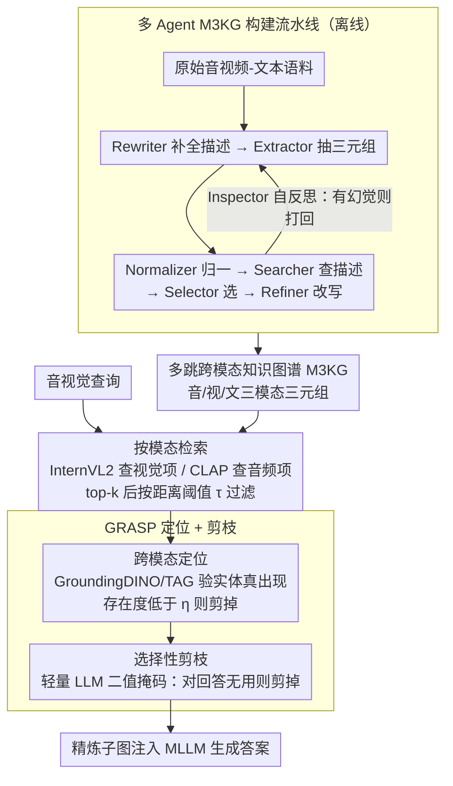

# M3KG-RAG: Multi-hop Multimodal Knowledge Graph-enhanced Retrieval-Augmented Generation

**会议**: CVPR 2026  
**arXiv**: [2512.20136](https://arxiv.org/abs/2512.20136)  
**代码**: [项目页面](https://kuai-lab.github.io/cvpr2026m3kgrag/)  
**领域**: 图学习  
**关键词**: 多模态知识图谱, 检索增强生成, 音视觉推理, 图剪枝, 多跳推理

## 一句话总结

提出M3KG-RAG，通过轻量多Agent流水线构建多跳多模态知识图谱（M3KG），并设计GRASP机制进行实体定位和选择性剪枝，仅保留查询相关且有助回答的知识，大幅提升MLLM的音视觉推理能力。

## 研究背景与动机

现有多模态RAG存在两大瓶颈：1）现有MMKG主要覆盖图文模态，音视觉覆盖有限，且大多为单跳图谱，缺乏时间/因果依赖的多跳连接；2）基于共享嵌入空间的相似度检索存在模态鸿沟，无法过滤离题或冗余知识，即使检索到相关上下文也可能注入噪声。

M3KG-RAG的核心创新在于：构建跨音视觉的多跳知识图谱 + 按模态检索绕过模态鸿沟 + GRASP精准保留回答有用的子图。

## 方法详解

### 整体框架

M3KG-RAG 想让 MLLM 在回答音视觉问题时用上结构化的外部知识，但又不被无关知识带偏。它先离线用一条多 Agent 流水线把原始的音视频-文本语料压成一张**多跳、跨模态的知识图谱 M3KG**（音、视、文三模态实体之间带时间/因果连接的三元组）；在线推理时，对一个查询先**按模态分别检索**候选子图（绕开跨模态嵌入的鸿沟），再用 **GRASP** 把候选三元组「定位 + 剪枝」到只剩查询相关且真正有助回答的那几条，最后把这张精炼子图喂给 MLLM 生成答案。三块设计分别针对「图谱怎么建」「子图怎么找」「噪声怎么去」。

### 关键设计

**1. 多 Agent M3KG 构建流水线：用轻量 LLM 把语料拧成多跳跨模态图**

现有 MMKG 大多只覆盖图文、且是单跳的，缺少音视觉之间的时间/因果连接。M3KG-RAG 把建图拆成一串各司其职的 Agent：Rewriter 先把原始 caption 补成信息更全的描述，Extractor 从中抽出 `(头实体, 关系, 尾实体)` 三元组，Normalizer 把指向同一对象的实体名归一，Searcher 拿归一后的实体去知识库查权威描述，Selector 从查回的多条描述里挑出和当前上下文最契合的一条，Refiner 再把这条描述改写得贴合原始语料的表述风格。整条链路只需 Qwen3-8B 级别的轻量 LLM 就能跑，单张 H100 即可完成全库构建。关键是末端挂了一个 Inspector 做**自反思循环**：它检查刚生成的描述是否与原内容一致，若发现幻觉或偏离就打回上游重做，从而把「轻量 LLM 容易编造描述」这个隐患压住，保证图谱质量。

**2. 按模态检索（Modality-Wise Retrieval）：不在共享空间里硬配，先各管各的模态**

直接把所有模态投到一个共享嵌入空间再算相似度，会撞上模态鸿沟——一个视频查询去匹配文本知识库经常匹配失败。这里改成**按模态各自检索**：视频查询用 InternVL2 在图谱的视觉项里找最近邻，音频查询用 CLAP 在音频项里找最近邻（在 FAISS 索引上取 top-$k$ 最近邻后，再用距离阈值 $\tau$ 滤掉离题项），命中具体的模态节点后，再顺着图的连接「提升」到包含它的三元组层级，得到候选子图。这样每次相似度比较都发生在同模态内部，避开了跨模态对齐的失真，召回的候选子图也更靠谱。

**3. GRASP（Grounded Retrieval And Selective Pruning）：先定位实体真在不在，再剪掉对回答没用的**

相似度检索只能抓「大致相关」的语义，检索回来的三元组里常混着离题或冗余的知识，注进 prompt 反而是噪声。GRASP 用两步细粒度过滤收紧候选集。第一步是**跨模态定位**：对视觉相关的三元组，用 GroundingDINO 在均匀采样的若干视频帧上给出每个实体的检测置信度，取跨帧最大值作为该实体的视觉存在度，再把三元组头、尾实体的存在度相加，低于阈值 $\eta_v$ 的三元组剪掉；对音频相关的三元组，用 TAG 模型把三元组转成自然句、打分它在查询音频里的存在度，低于 $\eta_a$ 的剪掉（音视频两路都有时则按融合得分比 $\eta_{av}$）。定位的目的是确认「这条知识说的东西确实在这段音视频里」，把检索阶段的假阳性挡掉。第二步是**选择性剪枝**：把通过定位的三元组连同查询一起交给一个轻量 LLM，让它对每条三元组输出一个二值掩码，判断「这条对回答当前问题有没有用」，没用的直接剪掉。两步合起来的效果是：检索负责「相关」，定位负责「真实存在」，剪枝负责「有用」，逐层把宽泛的候选压到一小撮高质量证据。

### 一个完整示例：一个音视频问题怎么走完检索到生成

设查询是「视频里那只在叫的动物是什么，它发出的是什么声音」，对应一段含画面和音轨的素材。

1. **按模态检索**：视频帧经 InternVL2 在 M3KG 的视觉项里命中「狗」这个视觉节点，音轨经 CLAP 在音频项里命中「吠叫」音频节点；顺着图连接提升到三元组层级，召回约 20 条候选三元组（含 `(狗, 发出, 吠叫)`、`(狗, 属于, 哺乳动物)`，也混进了 `(汽车, 位于, 背景)`、`(行人, 经过, 街道)` 这类离题项）。
2. **GRASP 定位**：GroundingDINO 在视频帧里检测各实体——「狗」的检测置信度高、视觉存在度超过 $\eta_v$ 保留，「行人」实际并未在帧中清晰出现、存在度不达标被剔除；TAG 模型确认音频确为吠叫，与「汽车引擎声」类三元组不匹配，候选缩到约 8 条。
3. **GRASP 剪枝**：轻量 LLM 对这 8 条逐一打二值掩码，留下 `(狗, 发出, 吠叫)`、`(吠叫, 是一种, 动物叫声)` 这几条直接支撑答案的，剪掉 `(狗, 属于, 哺乳动物)` 这类虽真实但对本问题冗余的，最终剩 3 条。
4. **图增强生成**：这 3 条精炼三元组拼成子图随 prompt 注入 MLLM，模型据此答出「是狗，发出的是吠叫声」。整条链路把 20 → 8 → 3 逐步收紧，喂给 MLLM 的全是相关、真实、有用的证据。

### 损失函数 / 训练策略

全程无模型训练，是纯 pipeline 方案。M3KG 在各评估基准的训练集上离线构建，单张 H100 GPU 即可完成；在线推理只做检索、定位、剪枝与生成，不更新任何权重。需要按数据集调的只有按模态检索的距离阈值 $\tau$ 与 GRASP 的定位阈值 $\eta$。

## 实验关键数据

### 主实验（Model-as-Judge评分）

| MLLM | 方法 | Audio QA | Video QA | AV QA |
|------|------|----------|----------|-------|
| Qwen2.5-Omni | None | 49.00 | 42.21 | 32.42 |
| Qwen2.5-Omni | VAT-KG | 51.30 | 43.50 | 35.44 |
| Qwen2.5-Omni | M3KG-RAG | 60.77 | 44.35 | 44.67 |

### Win-rate对比（vs VAT-KG）

| 基准 | VAT-KG胜率 | M3KG-RAG胜率 |
|------|-----------|-------------|
| AudioCaps-QA | 25.6% | 74.4% |
| VCGPT | 47.6% | 52.4% |
| VALOR | 41.8% | 58.2% |

### 关键发现

- 文本KG+简单RAG经常导致性能下降（Wikidata在多个设置上比无检索更差）
- 单跳MMKG（VAT-KG）改进有限，多跳结构关键
- 即使GPT-4o也能从M3KG-RAG获益，说明外部知识对大模型仍有价值
- GRASP的每个组件（定位+剪枝）都贡献了性能提升

## 亮点与洞察

- 端到端的多模态知识图谱构建和检索框架，覆盖音视觉文本三模态
- GRASP的"定位→剪枝"两步过滤设计直觉简洁且有效
- 仅用轻量级Qwen3-8B即可构建高质量知识图谱，成本可控

## 局限与展望

- 按模态检索的阈值τ和GRASP阈值η需要按数据集手动调整
- 知识图谱构建依赖训练集，泛化到新领域需重新构建
- GRASP的定位模型（GroundingDINO/TAG）本身可能有误差
- 仅评估了开放式QA，未覆盖其他多模态任务

## 相关工作与启发

- **vs VAT-KG**: 单跳概念图+简单检索；M3KG-RAG多跳图+GRASP精准过滤
- **vs GraphRAG/LightRAG**: 纯文本图RAG；M3KG-RAG扩展到音视觉多模态

## 评分

- 新颖性: ⭐⭐⭐⭐ 多跳多模态知识图谱+GRASP的组合新颖
- 实验充分度: ⭐⭐⭐⭐ 三个基准、多个MLLM、win-rate和MJ双评估
- 写作质量: ⭐⭐⭐⭐ 框架图清晰，流水线步骤详细
- 价值: ⭐⭐⭐⭐ 为多模态RAG提供了实用的知识图谱增强方案

<!-- RELATED:START -->

## 相关论文

- [\[ACL 2026\] MegaRAG: Multimodal Knowledge Graph-Based Retrieval Augmented Generation](../../ACL2026/graph_learning/megarag_multimodal_knowledge_graph-based_retrieval_augmented_generation.md)
- [\[CVPR 2026\] Graph2Eval: Automatic Multimodal Task Generation for Agents via Knowledge Graphs](graph2eval_automatic_multimodal_task_generation_for_agents_via_knowledge_graphs.md)
- [\[ACL 2026\] STEM: Structure-Tracing Evidence Mining for Knowledge Graphs-Driven Retrieval-Augmented Generation](../../ACL2026/graph_learning/stem_structure-tracing_evidence_mining_for_knowledge_graphs-driven_retrieval-aug.md)
- [\[ACL 2026\] LegalGraphRAG: Multi-Agent Graph Retrieval-Augmented Generation for Reliable Legal Reasoning](../../ACL2026/graph_learning/legalgraphrag_multi-agent_graph_retrieval-augmented_generation_for_reliable_lega.md)
- [\[NeurIPS 2025\] GFM-RAG: Graph Foundation Model for Retrieval Augmented Generation](../../NeurIPS2025/graph_learning/gfm-rag_graph_foundation_model_for_retrieval_augmented_generation.md)

<!-- RELATED:END -->
