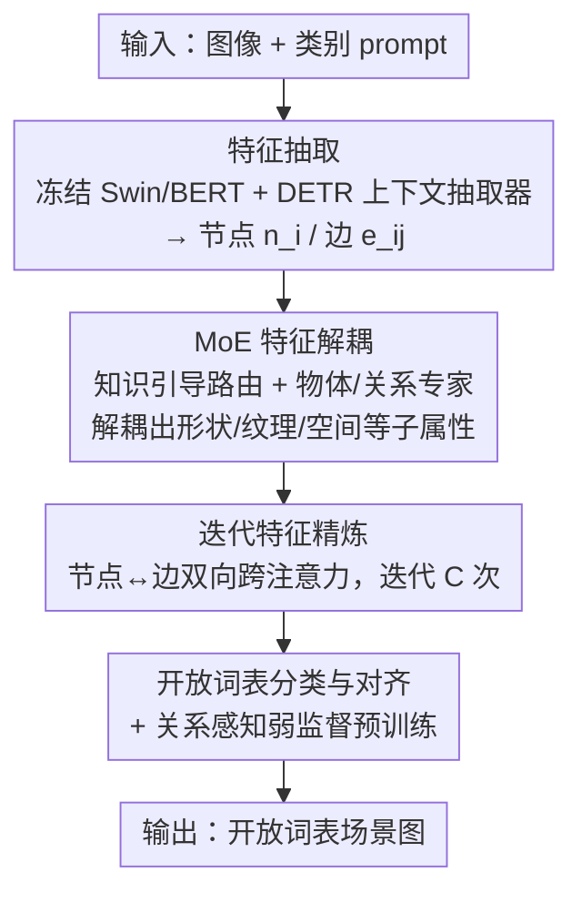

# Mixture-of-Experts based Feature Decoupling for Open Vocabulary Scene Graph Generation

**会议**: CVPR 2026  
**论文**: [CVF Open Access](https://openaccess.thecvf.com/content/CVPR2026/html/Li_Mixture-of-Experts_based_Feature_Decoupling_for_Open_Vocabulary_Scene_Graph_Generation_CVPR_2026_paper.html)  
**代码**: 未公开  
**领域**: 图学习 / 场景图生成  
**关键词**: 开放词表场景图、混合专家、特征解耦、跨注意力、视觉-语义对齐

## 一句话总结
针对开放词表场景图生成（OVSGG）里"只套用现成 VLM 特征、缺乏判别性属性、物体与关系语义割裂"的痛点，本文提出 MoE-FD：用混合专家自适应地把物体/关系特征解耦成形状、纹理、空间等子属性，再用迭代跨注意力让节点与边互相精炼，最终在 Visual Genome 全开放词表设定下把新类 R@100 大幅刷高（OvD+R 新关系 R@20 比 ACC 高 4.24%）。

## 研究背景与动机

**领域现状**：场景图生成（SGG）要把图像解析成 $\langle$主语, 关系, 宾语$\rangle$ 三元组的结构化图。受开放词表目标检测启发，近期工作把 SGG 从封闭类别集扩展到开放词表（OVSGG），主流做法是借 CLIP / Grounding DINO 等现成 VLM，把视觉概念和候选标签映射到同一语义空间做对齐预测。

**现有痛点**：这些方法只是"拿来主义"地用 VLM 抽视觉特征，缺乏对新物体/新关系的判别性属性提取——比如区分图中的"cup"和"bowl"时，模型抓不住"形状""大小"这类细粒度差异，容易把新类误判成相似的基类。此外，它们大多在语义空间里独立地给物体、关系各自算相似度打标签，物体语义和关系语义之间没有交互，导致图文对齐的多样性与准确性受限。

**核心矛盾**：一个直觉的解法是对物体/关系的视觉特征做"属性解耦"，挑出判别性强的部分来区分相似类。但现实中物体属性千差万别、抽象的关系属性更难定义，根本拿不到带属性标注的训练数据——既想解耦属性、又没有属性监督，这是核心矛盾。

**本文目标**：在没有属性标注的前提下，(1) 自适应地学到物体/关系的属性解耦能力；(2) 建立物体与关系之间的语义交互，提升对新类的预测能力。

**切入角度**：用混合专家（MoE）把"属性解耦"这件事变成由路由网络隐式学习——每个专家专攻一个视觉-语义子空间（形状/纹理/功能），由门控权重决定该用谁，不需要人工定义属性标签。

**核心 idea**：用"MoE 特征解耦 + 迭代跨注意力精炼"代替"直接套 VLM 特征 + 独立打标"，在解耦出判别性属性的同时打通物体-关系语义交互。

## 方法详解

### 整体框架
给定图像 $I$ 与所有可能的物体/关系类别（拼成 class prompt），MoE-FD 先用冻结的图像 backbone（Swin-T/B）和文本编码器（BERT）抽特征，经 DETR 式的上下文抽取器融合两模态、用物体查询和关系查询构造场景图的节点特征 $n_i$ 与边特征 $e_{i,j}$；然后进入两个核心组件——**MoE 特征解耦**把节点/边特征拆成判别性子属性，**迭代特征精炼**让节点与边通过双向跨注意力相互更新；最后把精炼后的视觉特征与语义标签在同一语义空间对齐，完成开放词表分类，并沿用 OvSGTR 的关系感知弱监督预训练补足稀有关系的数据。

### 关键设计

**1. 基于 MoE 的知识引导特征解耦：在没有属性标注时学会"挑判别性细节"**

这一步直接打的是"VLM 特征太笼统、分不开相似新类"的痛点。MoE-FD 把特征解耦拆成物体解耦和关系解耦两路，各配一组专家网络（每个专家是 3 层带 ReLU 的 MLP，专攻形状/纹理/功能等一个视觉-语义子空间）。关键在于路由网络不是只看视觉特征：对节点 $n_i$，先用 VLM 给的伪标签去 ConceptNet 里检索语义相似度大于 $\epsilon$ 的相关节点，取其两跳邻域子图 $C_{k,i}$ 编码成 1024 维先验向量，再把 $[n_i, C_{k,i}, r]$（$r$ 为关系感知查询）送进路由 MLP 算专家权重：$z_o = \mathrm{MLP_{Route}}([n_i, C_{k,i}, r])$，$\alpha_k = \mathrm{Softmax}(z_o)_k$，最终节点特征是专家输出的加权和 $n_i^* = \sum_{k=1}^{E_o} \alpha_k \cdot \mathrm{Expert}_k^{obj}(n_i)$。关系解耦同理，用基于 $n_i, n_j$ 双方提取的语义先验 $\hat C_{k,ij}$ 给 $E_r$ 个关系专家算权重 $\beta_m$。把 ConceptNet 结构化知识注入路由，正是为了在没有属性监督的情况下引导模型选出"对新类更相关"的专家——这是它和"直接用 MoE 做预测"（如 Zhou 等）的本质区别：MoE 在这里是用来解耦判别性属性，而不是直接出分类结果。

**2. 迭代特征精炼：让物体语义和关系语义双向"对话"**

解耦只解决了"特征更判别"，但物体和关系仍是各管各的，本设计补的是"物体-关系语义割裂"这个痛点。它分两阶段交替迭代 $C$ 次：第一阶段用节点对的跨注意力更新边——先算节点 $i,j$ 的注意力权重 $w_{i,j} = \mathrm{Softmax}\big(\phi_Q(n_i)\cdot\phi_K(n_j)^T/\sqrt{d}\big)$，再把它聚合进边特征 $e'_{i,j} = e_{i,j} + \mathrm{MLP_{edge}}(w_{i,j}\cdot\phi(n_i+n_j))$，让边能编码细粒度的节点交互（比如"person"和"skateboard"共同贡献"ride"这条边）；第二阶段反过来用更新后的边精炼节点，对每个节点聚合相邻边的语义反馈 $n'_i = n_i + \mathrm{MLP_{node}}(\sum_j \gamma_{i,j}\cdot\phi'(e'_{i,j}))$。这种"节点→边→节点"的双向更新让节点能适应关系语义、边能编码节点细节，迭代多轮后才送去分类，从而强化三元组内部的语义关联。

**3. 开放词表对齐与关系感知弱监督预训练：把判别性特征落到新类预测上**

最后一步把精炼后的特征接回开放词表分类。物体分类用节点特征与词嵌入的相似度 $\mathrm{sim_{obj}}(n_i, g_k) = \sigma(\langle \hat g_k, n_i\rangle)$，并建模成 $K$ 个预测节点与 $N$ 个真值物体之间的二分图匹配，优化 0/1 掩码 $M$ 最大化总相似度；关系分类把候选关系编码成文本嵌入、投影到边特征同一空间后算对齐分 $s(e_{i,j}, t_{proj}) = e_{i,j}^T t_{proj}$，用二元交叉熵优化。为缓解稀有关系的数据稀疏，沿用 OvSGTR 的弱监督范式：从图像 caption 用依存句法解析自动抽关系三元组，再经二分图匹配和检测物体对齐，相当于免费造出大量伪标签来教模型感知新类。

### 损失函数 / 训练策略
物体/关系分类用 Focal Loss 作为预测与语言 token 之间的对比损失，边框回归用 L1 + GIoU 损失；关系对齐用二元交叉熵 $L = -\mathbb{E}[y\log\sigma(s) + (1-y)\log(1-\sigma(s))]$。实现上基于预训练 Grounding DINO 初始化、冻结 Swin-T/B 与 BERT-base，每图 100 个物体查询，物体专家 8 个、关系专家 6 个，知识选择阈值 $\epsilon=0.7$，跨注意力迭代 4 次（物体/关系特征各更新两次）；SGD 优化器、初始学习率 0.001、每个 epoch 乘 0.9 衰减、batch=8，8×NVIDIA 4090 训练。

## 实验关键数据

### 主实验
数据集为 VG150（150 物体类 / 50 关系类），只用最贴近真实的 SG DET 协议（不依赖真值），评测三种设定：OvD-SGG（新物体）、OvR-SGG（新关系）、OvD+R-SGG（物体关系都新）。指标为 Recall@K。

| 设定 | 指标 | 本文 | 之前 SOTA | 提升 |
|--------|------|------|----------|------|
| OvD（Swin-T，含新类）| R@50 / R@100 | 23.39 / 28.33 | OvSGTR 23.20 / — | R@50 +5.36% 量级 |
| OvD（Swin-T，仅新物体）| R@50 / R@100 | 18.13 / 22.72 | VS3 15.07 / 18.73 | 明显领先 |
| OvR（Swin-B，仅新关系）| R@50 / R@100 | 23.06 / 27.60 | OvSGTR 16.39（R@50）| 大幅领先 |
| OvD+R（Swin-B，新关系）| R@20 | 16.61 | ACC 12.37 | +4.24（绝对）|
| 预训练直测（Swin-B）| R@50 / R@100 | 12.41 / 16.40 | ACC 11.61 / 14.33 | 一致领先 |

> ⚠️ 原文称"相比 OvSGTR 在 R@50/R@100 提升 5.36%/5.78%"，这里指 OvD 设定下的增量，具体口径以原文 Table 1 为准。

### 消融实验
FD(Obj)=物体特征解耦，FD(Rel)=关系特征解耦，IFR=迭代特征精炼。下表为 OvD+R 设定（Joint Base+Novel）。

| 配置 | R@20 | R@50 | R@100 | 说明 |
|------|------|------|-------|------|
| 完整模型 | 17.35 | 23.15 | 26.97 | 三组件齐全 |
| w/o FD(Obj) | 15.72 | 21.17 | 25.15 | 去物体解耦，掉点最多 |
| w/o FD(Rel) | 16.09 | 21.91 | 25.58 | 去关系解耦 |
| w/o IFR | 17.03 | 22.70 | 26.66 | 去迭代精炼 |

### 关键发现
- **物体解耦贡献最大**：去掉 FD(Obj) 比去掉 FD(Rel) 掉得更狠，作者归因于物体分类精度会直接影响关系分类——物体认错了，关系基本无从谈起。
- **专家数量有甜点**：物体专家=8、关系专家=6 时最优，过多过少都会下降；知识选择阈值 $\epsilon=0.7$ 最佳。
- **专家确实在分工**：可视化显示路由网络对不同物体/关系类别的专家激活差异显著，验证了"不同专家对应不同属性子空间"的设计意图，而非退化成均匀加权。

## 亮点与洞察
- **用 MoE 把"无标注属性解耦"变成可学习的路由问题**：不需要人工定义"形状/纹理"标签，靠门控权重隐式学出属性子空间，绕开了关系属性难定义、无训练数据的死结——这是把 MoE 从"做预测"挪到"做解耦"的关键转念。
- **ConceptNet 先验注入路由网络**很巧妙：结构化外部知识不是用来直接分类，而是引导"该激活哪个专家"，等于给开放词表新类提供了一条隐性的语义指路，可迁移到其他缺标注的开放词表任务。
- **节点↔边双向迭代**把 SGG 里"物体决定关系、关系也反过来约束物体"的耦合关系显式建模出来，比独立打标更符合场景图的图结构本质。

## 局限与展望
- 作者承认：物体查询数和专家数是固定的，面对类别范围更广的开放场景可能适配不足；未来计划引入可学习的专家控制器（如用强化学习选专家子集、或用 LLM 引导动态选专家）。
- 自己发现的局限：只在 VG150 单一数据集验证，未跨数据集（如 GQA）测泛化；依赖 ConceptNet 等外部知识库，知识覆盖不全的领域可能失效。
- 弱监督预训练靠 caption 依存解析造伪标签，伪标签噪声对稀有关系的影响未深入分析。

## 相关工作与启发
- **vs OvSGTR**：最接近的工作，本文主要差异在于引入 MoE 特征解耦来主动发现关键细节，而非只用 VLM 抽特征；在 OvD/OvR/OvD+R 三种设定上一致超越它。
- **vs ACC**：ACC 用交互感知微调聚焦重要物体，本文在 OvD+R 新关系上比它高 4.24%（R@20），说明显式解耦判别性属性比仅靠交互微调更能区分新类。
- **vs 传统闭集 SGG（IMP/MOTIFS/VCTree/TDE）**：这些方法在新类上 R@K 几乎为 0，凸显开放词表方法在新类预测上的必要性。
- **vs 用 MoE 做预测的 SGG（Zhou 等）**：他们直接用多专家联合做无偏预测，本文则把 MoE 用于解耦视觉特征以提升判别力，目标和用法都不同。

## 评分
- 新颖性: ⭐⭐⭐⭐ 把 MoE 从"预测"挪到"无监督属性解耦"+ ConceptNet 引导路由，思路新颖，但每个组件都在已有技术上拼装。
- 实验充分度: ⭐⭐⭐⭐ 三种开放设定 + 多 backbone + 完整消融 + 专家可视化，较充分；但只在 VG150 验证，缺跨库泛化。
- 写作质量: ⭐⭐⭐⭐ 动机清晰、公式完整，图文对照到位。
- 价值: ⭐⭐⭐⭐ 在全开放词表 SGG 上明显刷新 SOTA，解耦+知识引导路由的范式有迁移价值。

<!-- RELATED:START -->

## 相关论文

- [\[NeurIPS 2025\] Interaction-Centric Knowledge Infusion and Transfer for Open-Vocabulary Scene Graph Generation](../../NeurIPS2025/graph_learning/interaction-centric_knowledge_infusion_and_transfer_for_open-vocabulary_scene_gr.md)
- [\[CVPR 2026\] WSGG: Towards Spatio-Temporal World Scene Graph Generation from Monocular Videos](wsgg_spatiotemporal_world_scene_graph.md)
- [\[CVPR 2026\] Robo-SGG: Exploiting Layout-Oriented Normalization and Restitution Can Improve Robust Scene Graph Generation](robo-sgg_exploiting_layout-oriented_normalization_and_restitution_can_improve_ro.md)
- [\[NeurIPS 2025\] MoEMeta: Mixture-of-Experts Meta Learning for Few-Shot Relational Learning](../../NeurIPS2025/graph_learning/moemeta_mixture-of-experts_meta_learning_for_few-shot_relational_learning.md)
- [\[AAAI 2026\] Self-Adaptive Graph Mixture of Models](../../AAAI2026/graph_learning/self-adaptive_graph_mixture_of_models.md)

<!-- RELATED:END -->
