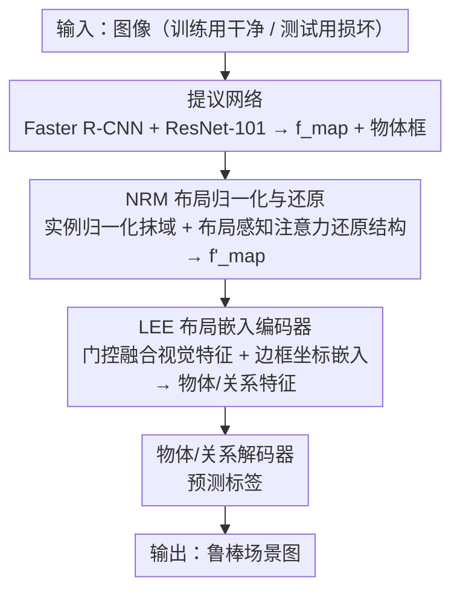

# Robo-SGG: Exploiting Layout-Oriented Normalization and Restitution Can Improve Robust Scene Graph Generation

**会议**: CVPR 2026  
**论文**: [CVF Open Access](https://openaccess.thecvf.com/content/CVPR2026/html/Lv_Robo-SGG_Exploiting_Layout-Oriented_Normalization_and_Restitution_Can_Improve_Robust_Scene_CVPR_2026_paper.html)  
**代码**: https://github.com/MICLAB-BUPT/Robo-SGG  
**领域**: 图学习 / 场景图生成  
**关键词**: 鲁棒场景图生成、图像损坏、布局信息、实例归一化、门控融合、即插即用

## 一句话总结
针对鲁棒场景图生成（在噪声/模糊/天气等损坏图像上推理）里"视觉特征发生域偏移导致性能暴跌"的痛点，本文提出即插即用的 Robo-SGG：用实例归一化抹掉损坏带来的域特异统计、再用布局感知注意力把全局结构特征找回来（NRM），并用门控融合自适应平衡视觉与坐标特征（LEE），插到现有 SGG 模型上即在 VG-C 上把 PredCls/SGCls/SGDet 的 mR@50 相对提升 6.3% / 11.1% / 8.0%。

## 研究背景与动机

**领域现状**：场景图生成（SGG）把图像解析成节点=物体、边=关系的视觉图，广泛用于自动驾驶、机器人导航。现有方法大多假设输入是"干净"图像，靠视觉、文本、外部知识图的多模态交互来提升泛化。

**现有痛点**：真实场景里图像常被噪声、模糊、天气、数字失真等自然损坏污染。损坏会让视觉特征发生**域偏移**（domain shift）——干净图和损坏图的特征分布对不上，错误地引导多模态交互，从而大幅拉低 SGG 性能。现有鲁棒方法（数据增强、对抗训练、归一化、去噪）要么计算开销大，要么是**以物体为中心**的，没能增强"结构性特征"（物体之间的位置和语义关系）的鲁棒性。

**核心矛盾**：损坏破坏的是低层外观线索（纹理、颜色），但 SGG 真正需要的是物体间的全局结构关系；现有方法把鲁棒性做在物体外观上，恰好没保护到 SGG 最依赖的那部分。而布局信息（物体的全局空间排布）天然比纹理/颜色更抗域偏移——这正是被忽略的突破口。

**本文目标**：(1) 在抹掉损坏的域特异扰动同时，保住并恢复对各类损坏都鲁棒的结构性特征；(2) 在检测框因损坏而不可靠时，仍能稳健地融合视觉与空间信息得到物体/关系表示。

**切入角度**：损坏可视为对特征域引入的协变量偏移，每种损坏是一个"域"。既然布局对域偏移鲁棒，那就用实例归一化去掉域特异的均值/方差扰动，再用布局把结构特征"还原"回来。

**核心 idea**：用"实例归一化抹域 + 布局感知注意力还原结构"（NRM）+"门控融合平衡视觉与坐标"（LEE）这套即插即用模块，代替重型的对抗训练/去噪，专门给 SGG 的结构性特征补鲁棒性。

## 方法详解

### 整体框架
Robo-SGG 不重造 SGG 模型，而是把两个模块塞进标准 SGG 流水线（提议网络 → 物体/关系编码器 → 物体/关系解码器）的第二阶段。提议网络（如 Faster R-CNN + ResNet-101）从图像抽特征图 $f_{map}$；**NRM** 接在 $f_{map}$ 后，用实例归一化抹掉损坏的域特异统计、再用布局感知注意力恢复结构特征，输出更鲁棒的 $f'_{map}$；**LEE** 替换原本的物体/关系编码器，用门控融合自适应地平衡视觉特征与边框坐标嵌入，得到鲁棒的物体特征 $f'_i$ 和关系特征 $f'_{i\to j}$；最后照常解码出物体标签和关系标签。训练阶段只用干净图，验证/测试阶段才喂损坏图——这保证模块学到的是泛化结构而非记住某种损坏。整套设计与具体 SGG 模型解耦，一/二阶段模型都能挂载。

### 关键设计

**1. 布局导向的归一化与还原模块 NRM：先抹掉损坏的域统计，再用布局把结构找回来**

这一步直击"损坏导致视觉特征域偏移"的痛点。关键洞察是：每种损坏相当于在特征域引入一次协变量偏移。NRM 分两步走。第一步**实例归一化（IN）**：对每张图、每个通道在空间维上算均值 $\mu_i = \frac{1}{HW}\sum_{m,l} a_{iml}$ 和方差 $\sigma_i^2$，做 $b_{iml} = (a_{iml}-\mu_i)/\sqrt{\sigma_i^2+\epsilon}$。和跨 batch 统计的 BN 不同，IN 逐图逐通道归一化，能有效压掉损坏带来的协变量偏移。但 IN 在抹域的同时也会误删对 SGG 重要的结构特征，于是第二步**布局感知注意力**把结构还原回来：先取残差 $R = f_{map} - \overline{f_{map}}$（原始与归一化特征之差，承载被 IN 抹掉的信息），再用所有物体框的质心 $e_j=(x_j,y_j)$ 建模全局布局——对每个归一化空间位置 $(m,l)$，按到各物体质心的距离算注意力 $A_{(m,l),j} = \frac{\exp(-\|(m,l)-e_j\|^2)}{\sum_{j'}\exp(-\|(m,l)-e_{j'}\|^2)}$，对各物体取最大值得到布局掩码 $M_{m,l} = \max_j A_{(m,l),j}$，用它筛选残差得结构特征 $R^+ = R\odot M$，最终输出 $f'_{map} = \overline{f_{map}} + R^+$。也就是说，IN 抹掉的东西不全丢，而是用布局掩码把"落在物体结构上"的那部分残差挑回来重新加上——既压损坏又保结构。消融里用质心比用整框更好，因为质心对检测噪声更不敏感。

**2. 布局嵌入编码器 LEE：检测框不可靠时，用门控自适应地少信坐标、多信视觉**

这一步补的是"损坏下检测框噪声大、直接拼坐标反而引入噪声"的痛点。已有方法（如 SHA）把边框坐标嵌入直接和视觉特征拼接，但这依赖可靠检测，损坏时框不准就会带毒。LEE 对物体和关系分别做门控融合：先把边框编码成坐标嵌入——物体用 $f_i^C = \mathrm{Emb}^{obj\text{-}bbox}(b_i)$，关系用 $f_{i\to j}^C = \mathrm{Emb}^{pred\text{-}bbox}([b_i, b_j, e_i-e_j, \|b_i-b_j\|_2])$；再用视觉特征算门控系数 $z_i = \mathrm{Sigmoid}(Wf_i)\in[0,1]^d$，表示该保留多少视觉特征，融合为 $f_i^\prime = (1-z_i)\circ f_i^C + z_i\circ f_i$（$\circ$ 为逐元素乘），关系同理。门控让模型在视觉质量变差时自动下调坐标权重、上调对全局布局结构的依赖。论文给了很有说服力的证据：高斯噪声下门控均值 $E[z_i]$ 随损坏加重从 0.65（severity 1）降到 0.52（severity 5），说明视觉越糟、LEE 越倾向于信布局；即便把检测框随机扰动 ±30%，方法仍能提升基线 +2.0%。

### 损失函数 / 训练策略
直接沿用标准 SGG 损失 $L_{SGG}$（物体与关系预测的交叉熵之和），不引入额外损失。集成方式上，NRM 作用于提议网络输出的 $f_{map}$，LEE 替换物体/关系编码器，训练/验证/测试三阶段都能无缝插入现有 SGG 模型。NRM 不引入任何可学习参数、也不增加显存；LEE 推理仅多 0.02GB 显存、增加约 0.005s/iter，NRM 增加约 0.019s/iter，两者合起来换来 8.8% 的 mR@50 提升，开销-收益权衡良好。

## 实验关键数据

### 主实验
数据集为 Visual Genome（VG）与 GQA，按 HiKER 协议施加 20 种损坏（5 大类：噪声/模糊/天气1/数字/天气2）构成 VG-C 与 GQA-C；**所有模型都在干净图训练、在未见过的损坏图上评测**。指标为类别均衡的 mR@K（缓解长尾）。"Corruption Avg." 指 20 种损坏（severity 5）的平均，"Imp." 为相对基线的相对提升。

| 基线模型 | 任务 | 基线损坏 mR@50 | +Robo-SGG | 相对提升 |
|--------|------|------|----------|------|
| VCTree | PredCls | 12.8 | 13.6 | +6.3% |
| VCTree | SGCls | 5.4 | 6.0 | +11.1% |
| VCTree | SGDet | 2.5 | 2.7 | +8.3% |
| HiKER（专为鲁棒 SGG 设计）| PredCls | 32.6 | 33.8 | +3.7% |
| HiKER | SGCls | 3.5 | 3.7 | +5.7% |
| DPL（最新 SOTA）| SGDet mR@50/mR@100 | 4.8 / 5.3 | 5.1 / 5.7 | +6.3% / +7.5% |

> 注：mR 数值本身偏低是 SGDet/SGCls 在损坏图上的固有难度，关键看相对提升的一致性。一阶段模型上也成立：RelTR 的 SGDet mR@50 从 3.4→3.7（+8.8%），EGTR 从 5.6→5.9（+5.4%）。MOTIFS+Ours（SGCls）三个随机种子标准差 <0.01，远小于其 +11.1% 的提升幅度。

### 消融实验
下表为 PredCls / SGCls 上 NRM、LEE 的拆解（基于 MOTIFS，括号内为相对损坏提升）。

| 配置 | PredCls mR@100 | SGCls mR@100 | 说明 |
|------|------|------|------|
| MOTIFS（基线）| 13.9 | 4.9 | — |
| +LEE | 14.1 (+1.4%) | 5.0 (+2.0%) | 仅门控融合 |
| +NRM | 14.1 (+1.3%) | 5.0 (+1.9%) | 仅归一化还原 |
| +LEE+SNR | 14.2 (+2.2%) | 5.0 (+2.1%) | NRM 换成 SNR |
| +LEE+NRM（完整）| 14.5 (+4.3%) | 5.1 (+3.9%) | 两模块协同最佳 |

LEE 内部融合方式消融（VCTree，SGDet mR@50）：直接相加 $\mathrm{LEE_{Add}}$ 在损坏下 −1.2%、直接拼接 $\mathrm{LEE_{Concat}}$ −2.0%，而门控 $\mathrm{LEE_{Gate}}$ +4.2%；NRM 用质心 $\mathrm{NRM_{centroid}}$ +7.2% 优于用整框 $\mathrm{NRM_{bbox}}$ +1.6%。

### 关键发现
- **NRM 优于通用还原方法 SNR**：SNR 用通道注意力做特征还原，在 PredCls mR@100 上 MOTIFS/HiKER 各 +2.2%/+2.0%，而 NRM 用布局感知注意力达 +4.3%/+3.8%，更能恢复关系识别所需的结构特征。
- **直接拼坐标在损坏下有害**：$\mathrm{LEE_{Concat}}$/$\mathrm{LEE_{Add}}$ 在损坏图上反而掉点（−2.0%/−1.2%），印证"框不准时坐标是噪声"，必须靠门控自适应下调。
- **门控随损坏自适应**：高斯噪声下门控均值随 severity 上升而下降（0.65→0.52），定量证实模型越遭损坏越依赖布局。
- **泛化到分布外更明显**：在风格变化（+12.6%）、零样本分布偏移（+17.8%）等更难设定下提升更大，说明结构鲁棒性的收益在域差越大时越突出。

## 亮点与洞察
- **"IN 抹域 + 残差按布局还原"是个漂亮的解耦**：把"去损坏"和"保结构"拆成两步，残差里既有被抹掉的噪声也有结构，用布局掩码做精准筛选——比一刀切的归一化或去噪更对症，且 NRM 零额外参数零额外显存。
- **门控融合把"何时该信检测框"交给数据决定**：用视觉特征生成门控、随损坏严重度自动调权，可直接迁移到任何"检测结果可能不可靠"的下游任务（检测、跟踪、关系推理）。
- **真正即插即用**：在一/二阶段、弱/强基线（MOTIFS 到 DPL/HiKER）上一致提升，且开销极小（合计 +0.024s/iter、+0.02GB），落地性强。
- **用布局对抗域偏移**这一观察本身有启发：全局空间结构比低层纹理更抗损坏，凡是依赖关系/结构的视觉任务都值得借鉴。

## 局限与展望
- 作者承认存在失败案例：当"near"和"behind"都能描述同一关系时模型会混淆，需更细粒度的标注来缓解。
- 自己发现的局限：NRM 的布局感知注意力依赖提议网络给出的物体框/质心，若检测在极端损坏下完全失效（框都没有），布局先验也无从谈起；方法主要在自然损坏上验证，对抗损坏未覆盖。
- mR 绝对值在 SGDet/SGCls 上仍很低，鲁棒 SGG 整体距离实用还有差距；门控只在 $[0,1]$ 单标量级别调权，是否需要更细粒度的空间自适应门控值得探索。

## 相关工作与启发
- **vs HiKER-SGG**：HiKER 专为鲁棒 SGG 设计但依赖外部知识图、灵活性受限；Robo-SGG 不需外部知识、即插即用，且在其基础上还能再提 PredCls/SGCls +3.7%/+5.7%。
- **vs SHA**：SHA 用拼接融合物体/关系的空间与视觉信息，依赖可靠检测；本文用门控自适应下调不可靠空间线索，损坏下更稳。
- **vs SNR（通用特征还原）**：SNR 用通道注意力还原，本文用布局感知注意力专门恢复结构特征，在关系识别上提升更大更稳。
- **vs 常规鲁棒策略（数据增强/对抗训练/去噪）**：这些方法计算开销大且以物体为中心，本文专攻结构性特征鲁棒性、几乎零额外开销。

## 评分
- 新颖性: ⭐⭐⭐⭐ "用布局还原结构对抗损坏"的视角新颖，NRM 的 IN+残差布局筛选设计巧妙；门控融合相对常规。
- 实验充分度: ⭐⭐⭐⭐⭐ 覆盖 VG-C/GQA-C、一/二阶段、5 个基线、多种损坏与分布外设定，消融与开销分析都很完整。
- 写作质量: ⭐⭐⭐⭐ 动机清晰、公式与可视化到位，图文对照好。
- 价值: ⭐⭐⭐⭐ 即插即用、开销极小、在鲁棒 SGG 上一致刷新 SOTA，落地价值高。

<!-- RELATED:START -->

## 相关论文

- [\[CVPR 2026\] Mixture-of-Experts based Feature Decoupling for Open Vocabulary Scene Graph Generation](mixture-of-experts_based_feature_decoupling_for_open_vocabulary_scene_graph_gene.md)
- [\[CVPR 2026\] WSGG: Towards Spatio-Temporal World Scene Graph Generation from Monocular Videos](wsgg_spatiotemporal_world_scene_graph.md)
- [\[CVPR 2025\] Universal Scene Graph Generation](../../CVPR2025/graph_learning/universal_scene_graph_generation.md)
- [\[CVPR 2025\] Unbiased Video Scene Graph Generation via Visual and Semantic Dual Debiasing](../../CVPR2025/graph_learning/unbiased_video_scene_graph_generation_via_visual_and_semantic_dual_debiasing.md)
- [\[CVPR 2026\] M3KG-RAG: Multi-hop Multimodal Knowledge Graph-enhanced Retrieval-Augmented Generation](m3kg_rag_multi_hop_multimodal_knowledge_graph_enhanced_retrieval_augmented_genera.md)

<!-- RELATED:END -->
