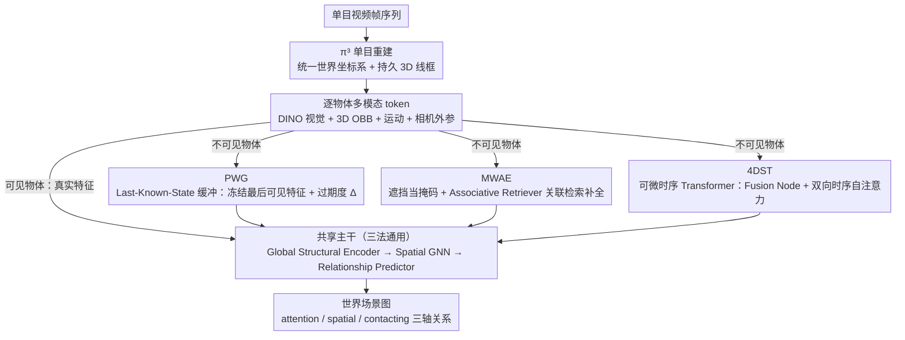

# WSGG: Towards Spatio-Temporal World Scene Graph Generation from Monocular Videos

**会议**: CVPR 2026  
**arXiv**: [2603.13185](https://arxiv.org/abs/2603.13185)  
**代码**: [https://github.com/rohithpeddi/WorldSGG](https://github.com/rohithpeddi/WorldSGG)  
**领域**: 图学习  
**关键词**: World Scene Graph, 物体持久性, 遮挡推理, 4D场景理解, ActionGenome4D

## 一句话总结

本文提出世界场景图生成（WSGG）任务，将传统帧级场景图扩展为在统一世界坐标系下追踪所有物体（包括被遮挡/不可见的），配合 ActionGenome4D 数据集和 PWG/MWAE/4DST 三种互补方法实现持久化场景推理。

## 研究背景与动机

**领域现状**：视频场景图生成（VidSGG）将物体表示为节点、关系表示为边，已有 STTran 等多种 Transformer 方法。但所有方法本质上是"帧级"的——物体离开画面或被遮挡就从图中消失。

**现有痛点**：这种帧级表示与具身智能体的需求严重脱节。机器人需要对整个环境保持持久记忆，即使物体不可见也要知道它们在哪、与人的关系如何。现有数据集既缺 3D 空间标注，也缺被遮挡物体的关系标注。

**核心矛盾**：发展心理学中的"物体恒存性"（object permanence）——物体不因不可见而消失——是物理推理的基础能力，但当前场景图方法完全缺乏这种能力。

**本文目标** (1) 构建 4D 标注数据集 ActionGenome4D；(2) 形式化 WSGG 任务；(3) 探索三种不同归纳偏置处理不可见物体。

**切入角度**：利用 π³ 模型做单目 3D 重建获得世界坐标系，VLM 生成遮挡物体关系伪标注并人工修正。

**核心 idea**：将视频场景图从"帧内可见物体"扩展到"世界坐标系下的所有物体"，通过特征持久化、掩码补全、时序注意力三种路径实现。

## 方法详解

### 整体框架

这篇论文要把视频场景图从"只画当前帧里看得见的物体"升级到"在统一世界坐标系下追踪所有物体（含被遮挡/离开画面的）"。输入单目视频 $V_1^T = \{I^t\}_{t=1}^T$，逐时刻输出世界场景图 $\mathcal{G}_{\mathcal{W}}^t$；世界状态 $\mathcal{W}^t = \mathcal{O}^t \cup \mathcal{U}^t$ 显式拆成可见集 $\mathcal{O}^t$ 与不可见集 $\mathcal{U}^t$，每个物体都用 3D OBB $\mathbf{b}_k^t \in \mathbb{R}^{8 \times 3}$ 锚定位置，关系则横跨 attention（3 类）、spatial（6 类）、contacting（17 类）三个轴。三种方法共用同一套 Global Structural Encoder + Spatial GNN + Relationship Predictor，真正的分歧只在一处——**不可见物体的特征怎么来**，论文借此把"如何实现物体恒存"切成三种递进的归纳偏置来对比。

### 关键设计

**1. PWG：用最后已知状态缓冲，实现最朴素的物体恒存**

针对帧级方法"物体一旦离开画面就从图里凭空消失"的痛点，PWG 维护一个非可微的 Last-Known-State 缓冲区：物体可见时实时刷新它的 DINO 特征 $\mathbf{f}_n^{(t)}$，一旦不可见就把特征冻结在最后一次可见帧的状态。为了让下游意识到这份特征已经有多"过期"，缓冲区同步记录过期度 $\Delta_n^{(t)} = |t - \tau^*|$（$\tau^*$ 是最后可见时刻），并把几何、运动、上下文连同过期度一起拼成 token 送进 Spatial GNN：

$$\mathbf{x}_n^{(t)} = \text{Proj}([\mathbf{g}_n \,\|\, \mathbf{m}_n \,\|\, \mathbf{c}_n \,\|\, \log(\Delta_n + 1)])$$

这是让物体"不消失"的最直接路线，代价也很明确：缓冲区不可微无法端到端优化，且冻结特征随时间只会越用越失真。

**2. MWAE：把遮挡当成天然掩码，用关联检索补回缺失表征**

PWG 只是冻结旧特征，并没有真正"推断"物体此刻被挡住时的样子。MWAE 借鉴 MAE 的视角，把遮挡/不可见直接当作一种自然掩码：对不可见物体的视觉流打掩码，再用一个 Associative Retriever 通过非对称交叉注意力（所有 token 只能去查询可见 token）重建缺失特征；训练时人为模拟遮挡并配合跨视图重建，逼模型学会从可见上下文与 3D 几何先验里把被挡住的物体"补"出来。如此一来遮挡推理被显式建模成掩码补全问题，而完整的 3D 结构恰好为补全提供了骨架支撑。

**3. 4DST：用可微时序 Transformer 取代静态缓冲，端到端学会调用历史**

前两者要么靠不可微缓冲、要么靠人工模拟掩码，信息始终在退化。4DST 干脆用一个可微的时序 Transformer 接管整个推理：视觉、结构、运动、相机四路多模态 token 先汇聚到一个 Fusion Node，再经无掩码的双向时序自注意力在整段视频范围内联合处理所有物体 token（不区分可见与否），最后接 Spatial GNN 输出全局感知表征 $\mathbf{H}^{(t)}$。由于注意力跨越全视频且端到端可训，模型能自动学会调取某物体过去可见时的信息去推断它当前不可见状态下的关系——这也是它在不可见物体上比 PWG 高出近 6 个点 R@20 的根源。

### 损失函数 / 训练策略

三种方法共享同一组损失：attention 轴用交叉熵，spatial 与 contacting 轴因是多标签用二元交叉熵，节点分类用交叉熵。配套的 ActionGenome4D 数据集由 π³ 重建 + GDINO 检测 + SAM2 分割 + VLM 伪标注 + 人工修正这条流水线构建。

## 实验关键数据

### 主实验

| 方法 | 类型 | SGCls R@10 | R@20 | R@50 | PredCls R@10 | R@20 | R@50 |
|------|------|-----------|------|------|-------------|------|------|
| STTran (VidSGG) | 帧级 | 30.2 | 33.8 | 36.1 | 39.5 | 49.2 | 58.4 |
| PWG | WSGG | 27.5 | 31.2 | 34.8 | 35.1 | 44.3 | 53.7 |
| MWAE | WSGG | 29.8 | 33.5 | 37.2 | 38.6 | 48.1 | 57.3 |
| 4DST | WSGG | **31.4** | **35.1** | **38.5** | **41.2** | **51.3** | **60.5** |

### 消融实验

| 配置 | 可见物体 R@20 | 不可见物体 R@20 | 全部 R@20 | 说明 |
|------|-------------|---------------|----------|------|
| 4DST 完整 | 35.1 | 28.3 | 33.5 | 最佳整体性能 |
| w/o 3D 几何编码 | 32.4 | 21.7 | 29.8 | 3D 编码对不可见物体至关重要 |
| w/o 运动特征 | 34.2 | 25.6 | 32.1 | 运动信息辅助推理 |
| w/o 相机姿态编码 | 33.8 | 24.1 | 31.3 | 相机运动判断可见性 |
| PWG (LKS 缓冲) | 33.2 | 22.4 | 30.5 | 不可微缓冲效果最差 |

### 关键发现
- 4DST 全面最优，特别是不可见物体关系预测比 PWG 高 5.9 个点 R@20
- 3D 几何编码是 WSGG 核心组件，去掉后不可见物体 R@20 降 6.6 个点
- WSGG 任务比标准 VidSGG 更难但更有意义，4DST 在 PredCls 上甚至超越帧级 STTran

## 亮点与洞察
- **任务定义精准**：将"物体恒存性"引入场景图是自然且重要的方向，WSGG 形式化清晰，为后续工作提供了标准化评测框架
- **数据集构建流水线实用**：π³ + GDINO + SAM2 + VLM 的自动标注 + 人工修正流程，展示了低成本构建 4D 标注数据的可行路径
- **三方法形成完整设计空间**：从特征缓冲到掩码补全再到可微 Transformer，提供了不同计算-性能权衡的参考

## 局限与展望
- ActionGenome4D 仅基于家庭视频，场景多样性有限，难以泛化到户外/工业场景
- 不可见物体关系伪标注依赖 VLM 质量，有天花板
- 仅处理人-物体关系，未扩展到物体-物体关系
- π³ 重建在长序列存在姿态漂移，需额外 BA 步骤

## 相关工作与启发
- **vs STTran/VidSGG**: 传统方法只处理帧内可见物体，WSGG 扩展到完整世界状态，是质的飞跃
- **vs 3D/4D SGG**: 已有工作在点云上做场景图，但未处理遮挡物体的关系持久化
- **vs RealGraph**: 需多视图输入，WSGG 仅需单目视频更实用

## 评分
- 新颖性: ⭐⭐⭐⭐ 任务定义新颖，三种方法探索全面
- 实验充分度: ⭐⭐⭐⭐ 数据集 + 方法对比 + 消融完整
- 写作质量: ⭐⭐⭐⭐ 形式化严谨，结构清晰
- 价值: ⭐⭐⭐⭐ 为具身智能场景理解提供新范式

<!-- RELATED:START -->

## 相关论文

- [\[CVPR 2026\] Mixture-of-Experts based Feature Decoupling for Open Vocabulary Scene Graph Generation](mixture-of-experts_based_feature_decoupling_for_open_vocabulary_scene_graph_gene.md)
- [\[CVPR 2026\] Robo-SGG: Exploiting Layout-Oriented Normalization and Restitution Can Improve Robust Scene Graph Generation](robo-sgg_exploiting_layout-oriented_normalization_and_restitution_can_improve_ro.md)
- [\[CVPR 2025\] Universal Scene Graph Generation](../../CVPR2025/graph_learning/universal_scene_graph_generation.md)
- [\[NeurIPS 2025\] Spatio-Temporal Directed Graph Learning for Account Takeover Fraud Detection](../../NeurIPS2025/graph_learning/spatio-temporal_directed_graph_learning_for_account_takeover_fraud_detection.md)
- [\[CVPR 2025\] Unbiased Video Scene Graph Generation via Visual and Semantic Dual Debiasing](../../CVPR2025/graph_learning/unbiased_video_scene_graph_generation_via_visual_and_semantic_dual_debiasing.md)

<!-- RELATED:END -->
