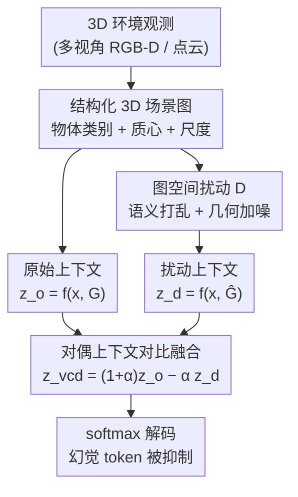

# 3D-VCD: Hallucination Mitigation in 3D-LLM Embodied Agents through Visual Contrastive Decoding

**会议**: CVPR 2026  
**论文**: [CVF Open Access](https://openaccess.thecvf.com/content/CVPR2026/html/Ogunleye_3D-VCD_Hallucination_Mitigation_in_3D-LLM_Embodied_Agents_through_Visual_Contrastive_CVPR_2026_paper.html)  
**代码**: https://plan-lab.github.io/3d-vcd （项目页）  
**领域**: 3D视觉 / 具身智能 / 幻觉抑制  
**关键词**: 3D-LLM, 视觉对比解码, 场景图扰动, 物体幻觉, 推理时干预

## 一句话总结
3D-VCD 是首个面向 3D 具身智能体的**推理时**幻觉抑制框架：对物体中心的 3D 场景图施加语义/几何扰动得到一个"被破坏"的负样本上下文，让 MLLM 在原始图和扰动图上各跑一遍，再用对比解码公式把"换了场景也照样高概率"的 token 压下去——无需重训，几乎零额外开销，就在 3D-POPE / HEAL 上显著降低过度肯定与物体幻觉。

## 研究背景与动机
**领域现状**：MLLM 正越来越多地被当作具身智能体的"推理内核"，配合 3D-LLM、3D-VisTA、LEO 这类把场景图 / 点云 / 体素特征注入语言模型的骨干，智能体可以回答空间问题、做规划、在室内环境里按自然语言指令行动。

**现有痛点**：这些 3D-MLLM 仍然频繁产生**具身接地幻觉**——给出听起来合理、但与真实 3D 场景矛盾的回答，比如肯定一个不存在的物体、或认错在场的物体。当视觉证据弱、模糊或被遮挡时，模型会退化到"语言先验"，凭训练分布猜答案。在具身场景里这尤其致命：输出直接驱动下游动作选择和物理交互，一个幻觉物体就能让整个任务跑偏，把不安全行为传播进控制回路。

**核心矛盾**：现有的推理时幻觉抑制方法（VCD 及其变体）几乎都是为 **2D 视觉-语言**设计的——它们把幻觉当成"文本与像素之间的语义不一致"，靠模糊、遮挡、加噪等**像素空间扰动**制造对比。但具身智能体的幻觉根源不在像素，而在**物体是否在场、空间布局、几何接地**这些 3D 结构推理上；像素扰动根本无法制造"矛盾的 3D 证据"，也无法探测模型预测是否依赖空间结构。另一方面，训练式抑制又受限于泛化——真实场景的布局组合是无穷的，没有数据集能穷举部署时会遇到的长尾排布。

**本文目标**：在不改 MLLM 架构、不重训骨干的前提下，直接在解码阶段抑制 3D 具身幻觉，并且要能跨"几何中心"（3D-POPE）和"高层具身推理"（HEAL）两类设定通用。

**切入角度**：作者用一个可操作的定义刻画"什么是幻觉 token"——**当底层 3D 感知被破坏（$G_t \to \hat G_t$）后，预测概率不降反升（或不被抑制）的那些 token，就是没有被 3D 证据支撑、而由语言先验驱动的**。既然 3D-MLLM 用的是结构化、物体中心的场景表示，就可以在**图空间**直接、可解释地施加扰动，制造出语义上有效但物理上矛盾的"反事实场景"。

**核心 idea**：把 2D VCD 从"扰动像素"升级为"扰动结构化 3D 场景图"——对比原始图与扰动图下的 logits，压掉对 3D 证据不敏感的预测，从而把语言先验驱动的幻觉实时抑制掉。

## 方法详解

### 整体框架
给定时刻 $t$ 的自然语言查询 $x_t$ 和结构化 3D 场景表示 $G_t$，标准 3D-MLLM 自回归地产生下一 token logits $z_t = f_\theta(x_t, G_t)$。3D-VCD 在这之上加一条"反事实"支路：它把场景表示成一个显式编码每个物体语义类别与几何属性的**场景图** $G_t = \{o_i=(c_i, a_i)\}_{i=1}^{N_t}$，然后用一个扰动算子 $D$ 在**保持 MLLM 所需结构 schema 不变**的前提下破坏物体级属性，得到扰动图 $\hat G_t = D(G_t)$。MLLM 在原始上下文和扰动上下文上**各前向一次**，得到 $z_t^o$ 与 $z_t^d$，再用对比融合公式把两者合成一个去偏后的 $z_t^{vcd}$ 用于解码。整个过程训练无关、架构无关，每步只多一次前向。

### 关键设计

**1. 物体中心 3D 场景图 + 图空间扰动：在结构层制造"矛盾的 3D 证据"**

2D VCD 靠加噪像素来探测语义漂移，但具身幻觉来自 3D 结构而非像素，像素扰动既造不出"矛盾的 3D 证据"、也探不到模型对空间结构的依赖。3D-VCD 的做法是把扰动搬进场景图：每个物体节点 $o_i=(c_i, a_i)$ 显式拆出语义类别 $c_i$ 和结构属性 $a_i$，扰动算子 $D$ 只动属性、不破坏 schema，于是产出的 $\hat G_t$ 对 MLLM 来说仍是**句法合法**的输入。在 3D-POPE 上 $a_i$ 是连续几何量（质心 $p_i$ + 尺度 $s_i$），作者用两种轻量扰动：**语义扰动** $\hat c_i \sim \text{Shuffle}(c_i)$，把物体类别替换成错误标签来制造语义矛盾，逼模型去看真实场景证据而非语言先验；**几何扰动** $\hat a_i = a_i + \epsilon$，对质心和尺度加零均值高斯噪声 $\epsilon_p, \epsilon_s \sim \mathcal N(0, \sigma^2 I)$，打乱物理布局来测试预测是否随空间改变。这样得到的负样本是"在物体存在/布局上与真值冲突"的反事实场景——正好对准具身幻觉的病灶，而不是 2D 那种像素噪声。

**2. 对偶上下文对比解码融合：把"换了场景也不变"的 token 压下去**

有了原始图和扰动图，关键是如何利用两套 logits。作者先给出幻觉的可操作判据：扰动后**logits 没被抑制（甚至上升）**的 token，说明它不靠 3D 证据、而靠语言先验。于是在两套 logits $z_t^o = f_\theta(x_t, G_t)$、$z_t^d = f_\theta(x_t, \hat G_t)$ 上做对比融合：

$$z_t^{vcd} = (1+\alpha)\, z_t^{(o)} - \alpha\, z_t^{(d)}$$

其中 $\alpha \ge 0$ 控制对比惩罚强度（默认 $\alpha=1.0$）。直觉上，这个式子会**惩罚那些在两张图下都很高概率的 token**（典型的语言先验驱动项），同时相对抬高只在真实场景下才被支撑的 token；最终解码 $y_{t,k}=\text{softmax}(z_{t,k}^{vcd})$。这套双流公式不引入任何可训练参数，每步只比标准解码多一次前向，因此足够轻量、适合具身实时设定——它把"是否依赖 3D 证据"这件事，变成了原始-扰动两支预测之差的直接读数。

**3. 从显式图扰动推广到任务级不一致：让 HEAL 这类设定也能复用同一框架**

3D-POPE 的扰动是显式改场景图，但 HEAL 是另一类设定——它通过**对抗式任务表述**（干扰物注入、同义词替换、场景-任务矛盾等）来制造语言与 3D 环境之间的不一致。如果框架只会改场景图就用不上。3D-VCD 的解法是**重新诠释**：在 HEAL 上保持场景表示 $G_t$ 不变，转而把这些对抗 prompt 本身当作"扰动上下文"，再套同一个对比融合公式 (3)。这保住了 3D-VCD 的核心原则——**在一致与不一致上下文间都保持不变的 token，正是语言先验驱动的幻觉**。这一步把方法从"几何中心扰动"扩展到"语义/任务级不一致"，得到一个跨 3D-POPE（几何）和 HEAL（高层推理）统一的推理时框架，依旧无需任何额外训练或架构改动。

### 损失函数 / 训练策略
**完全训练无关**：3D-VCD 不改任何权重，纯在解码时操作。实验基于 3D-GRAND 上发布的 3D-LLM 检查点（LLaMA 风格因果解码器），3D-GRAND 仅用于取物体级 3D 上下文来构图。为压低双前向开销，作者用两个工程优化：① **批量对偶前向**——原始图和扰动图打包进一次 batched 推理，摊薄模型加载与分词成本；② **KV 缓存**——两个上下文的 transformer key-value 状态在每步解码后缓存复用，只处理新 token，使对偶解码相对标准自回归只多常数因子开销。概念上是 2× 前向算力，但优化后端到端延迟只增加 0.25×（单查询约 2s → 2.5s）。默认 $\alpha=1.0$、贪心解码、温度 $T=1.0$，A40 GPU、batch size 8。

## 实验关键数据

### 主实验：3D-POPE（物体存在二分类，越低 Yes-rate 越抗幻觉）
3D-VCD 在 Random / Popular / Adversarial 三个子集上全面领先，且**训练无关**，而三个基线都是训练式的。最突出的是把 3D-LLM 病态的过度肯定 Yes-rate 大幅压下来（Random 99.81% → 75.15%），同时 precision / F1 / accuracy 都涨。

| 3D-POPE 子集 | 模型 | 训练无关 | Precision↑ | F1↑ | Accuracy↑ | Yes(%)↓ |
|------|------|------|------|------|------|------|
| Random | 3D-LLM | ✘ | 50.03 | 66.67 | 50.07 | 99.81 |
| Random | LEO | ✘ | 51.95 | 62.25 | 52.91 | 74.73 |
| Random | **3D-VCD** | ✔ | **62.16** | **74.48** | **67.99** | 75.15 |
| Popular | 3D-LLM | ✘ | 49.97 | 66.61 | 49.94 | 99.94 |
| Popular | **3D-VCD** | ✔ | **52.35** | **66.95** | **54.00** | 89.02 |
| Adversarial | 3D-LLM | ✘ | 49.97 | 66.61 | 49.94 | 99.94 |
| Adversarial | **3D-VCD** | ✔ | **52.90** | **67.32** | **54.92** | 87.82 |

Random 子集 precision 从 50.03% 提到 62.16%（+约 10 个点超最好基线）、accuracy 从 50.07% 提到 67.99%，三个子集 recall 都保持在 92% 以上。相对 3D-LLM，整体降低过度肯定 Yes-rate 10.9%–24.7%、提升 accuracy 8.1%–35.8%。⚠️ 注意 Popular/Adversarial 子集 Yes-rate 仍偏高（87%–89%），说明这类更难的分布下过度肯定只是被缓解、未被根治。

### HEAL（CHAIR 幻觉率，对现成指令模型即插即用）
在 HEAL 的 Distraction Injection 子集上，把 3D-VCD 套到现成 Llama-3-8B / Qwen-14B 指令模型上，物体幻觉（CO）和状态幻觉（CS）都下降，最显著的是 Qwen-14B 的状态幻觉 16.45% → 5.00%（约 3.3× 下降）。

| 模型 | CO(%)↓ | CS(%)↓ |
|------|------|------|
| Llama-3-8B-Instruct | 2.58 | 9.49 |
| Llama-3-8B-Instruct + VCD | **2.39** | 12.43 |
| Qwen-14B-Instruct | 4.13 | 16.45 |
| Qwen-14B-Instruct + VCD | **3.55** | **5.00** |

⚠️ 注意 Llama-3 上 CS 反而从 9.49% 升到 12.43%——状态幻觉并非在所有骨干上都改善，物体幻觉（CO）则两个骨干都降。

### 消融：扰动类型（3D-POPE，F1，Figure 3）
作者系统比较了语义（SemSub 低/高、SemDropMod）、几何（Low/High-Geom）、结构（物体稀疏化、关系翻转、干扰物注入）和混合扰动。结论是**所有扰动类型都稳定优于基线**：Random 子集基线 F1≈0.63，各扰动变体下涨到 0.74–0.77。

| 配置 | Random F1 | 说明 |
|------|------|------|
| Baseline | ~0.63 | 不做对比解码 |
| 各类单一扰动（语义/几何/结构） | 0.74–0.75 | 普遍稳定提升 |
| Struct-Sparse（物体稀疏化） | ~0.77 | 该图中靠后、F1 最高之一 |
| Mixed Low-Sem+Geom | 0.74–0.75 | 兼顾鲁棒/可解释/效率，被选为代表变体 |

### 关键发现
- **过度肯定是主病灶**：3D-LLM 的 Yes-rate 高达 99.8%（几乎逢问必答"有"），3D-VCD 的最大价值是把这种 over-affirmation bias 压下来，而非单纯提点。
- **扰动类型不挑食**：语义、几何、结构、混合扰动都能带来提升，说明收益来自"对比一致证据 vs 被破坏 3D 线索"这个机制本身，而非某种特定扰动；作者最终选混合低强度语义+几何作代表变体（鲁棒性/可解释性/效率的折中）。
- **开销可控**：推理时间随场景物体数平滑增长，简单场景约 3.8s、50 物体复杂场景约 6.7s（⚠️ 此处绝对值与"2s→2.5s"那组测的机器/设定不同，不可直接横比），优化后端到端延迟只增 0.25×。
- **泛化到任务级不一致**：HEAL 上无需改场景图、把对抗 prompt 当扰动上下文即可复用，验证了框架不局限于显式图扰动。

## 亮点与洞察
- **把"幻觉"变成可测的扰动响应**：用"破坏 3D 感知后概率不降反升的 token = 幻觉"这一可操作定义，把抽象的"接地与否"变成原始-扰动两支 logits 之差，干净利落，也给了一个解释性强的探针。
- **扰动从像素搬到图空间**是真正的迁移点：因为场景图显式拆开了语义/几何属性，扰动既可控又可解释（换类别 = 语义矛盾、加几何噪声 = 布局矛盾），这是 2D 像素扰动做不到的。
- **统一框架的弹性**：同一个对比融合公式，既能吃显式图扰动（3D-POPE），又能把对抗 prompt 当负上下文（HEAL）。这种"扰动来源可替换、融合公式不变"的设计，迁移性很好——任何能构造"矛盾上下文"的具身设定都能套。
- **工程上把 2× 前向压到 0.25× 延迟**：批量对偶前向 + KV 缓存的组合让对比解码在具身实时场景里真的可用，是个值得复用的 trick。

## 局限与展望
- **作者承认**：当前只处理静态 3D 场景的物体存在/接地，未来要扩展到动态 3D 场景的时序推理。
- **过度肯定未根治**：Popular/Adversarial 子集 Yes-rate 仍在 87%–89%，更难分布下只是缓解；幻觉抑制的天花板还远。
- **状态幻觉收益不稳**：HEAL 上 Llama-3 的 CS 反升（9.49%→12.43%），说明该方法对"状态级"幻觉并非普适，可能需要针对状态属性设计专门扰动。
- **依赖现成场景图质量**：方法假设有一个结构化、物体中心的 3D 场景图可用，且扰动要"保 schema 合法"。若上游 3D 感知/重建本身噪声大或缺物体，对比信号会变弱（自身的几何扰动消融其实也间接说明了对几何质量的敏感）。
- **HEAL 评测面偏窄**：主结果只在 Distraction Injection 一个子集报 CHAIR，其余四类不一致（物体移除、同义替换、场景-任务矛盾）未给完整表格，泛化结论有待更全面验证。

## 相关工作与启发
- **vs 2D Visual Contrastive Decoding (VCD)**：经典 VCD 在像素空间扰动（模糊/遮挡/patch 噪声）对比 logits 来压语言偏置；3D-VCD 沿用对比融合公式 $(1+\alpha)z_o-\alpha z_d$ 的内核，但把扰动从像素搬到结构化 3D 场景图，专门对准物体存在/几何接地这些 2D 扰动够不着的具身幻觉源。
- **vs 训练式 3D 接地（3D-LLM / 3D-VisTA / LEO）**：这些骨干靠注入 3D 表示 + 训练来接地，但不含任何推理时抑制，遇模糊证据仍退化到语言先验；3D-VCD 是即插即用的解码层补丁，无需重训即可压住它们的过度肯定。
- **vs 3D-POPE / HEAL（诊断 benchmark）+ 微调缓解**：先前在具身设定下只能靠在更准场景表示上微调来间接降幻觉，难以泛化到长尾/杂乱/分布漂移场景；3D-VCD 提供了首个**无需训练**的具身幻觉抑制路径，正好补上这个空白。

## 评分
- 新颖性: ⭐⭐⭐⭐⭐ 首个面向 3D 具身智能体的推理时对比解码框架，把 VCD 从像素扰动迁移到结构化场景图扰动，定位清晰。
- 实验充分度: ⭐⭐⭐⭐ 3D-POPE 三子集 + HEAL + 扰动类型消融 + 效率分析较完整，但 HEAL 只报一个子集、Llama-3 状态幻觉反升等问题暴露泛化边界。
- 写作质量: ⭐⭐⭐⭐ 动机-方法-公式链条清楚，幻觉定义和对比公式给得明确；个别指标横比口径（不同机器测的延迟）需读者自行注意。
- 价值: ⭐⭐⭐⭐ 训练无关、架构无关、开销小，能直接挂到现有 3D-MLLM 上提升可靠性，对具身安全有实用意义。

<!-- RELATED:START -->

## 相关论文

- [\[CVPR 2025\] 3D-GRAND: A Million-Scale Dataset for 3D-LLMs with Better Grounding and Less Hallucination](../../CVPR2025/hallucination/3d-grand_a_million-scale_dataset_for_3d-llms_with_better_grounding_and_less_hall.md)
- [\[CVPR 2026\] SEASON: Mitigating Temporal Hallucination in Video Large Language Models via Self-Diagnostic Contrastive Decoding](season_mitigating_temporal_hallucination_in_video_large_language_models_via_self.md)
- [\[CVPR 2026\] Locate-then-Sparsify: Attribution Guided Sparse Strategy for Visual Hallucination Mitigation](locate-then-sparsify_attribution_guided_sparse_strategy_for_visual_hallucination.md)
- [\[CVPR 2026\] First Logit Boosting: Visual Grounding Method to Mitigate Object Hallucination in Large Vision-Language Models](first_logit_boosting_visual_grounding_method_to_mitigate_object_hallucination_in.md)
- [\[CVPR 2026\] Same Attention, Different Truths: Put Logit-Lens over Visual Attention to Detect and Mitigate LVLM Object Hallucination](same_attention_different_truths_put_logit-lens_over_visual_attention_to_detect_a.md)

<!-- RELATED:END -->
