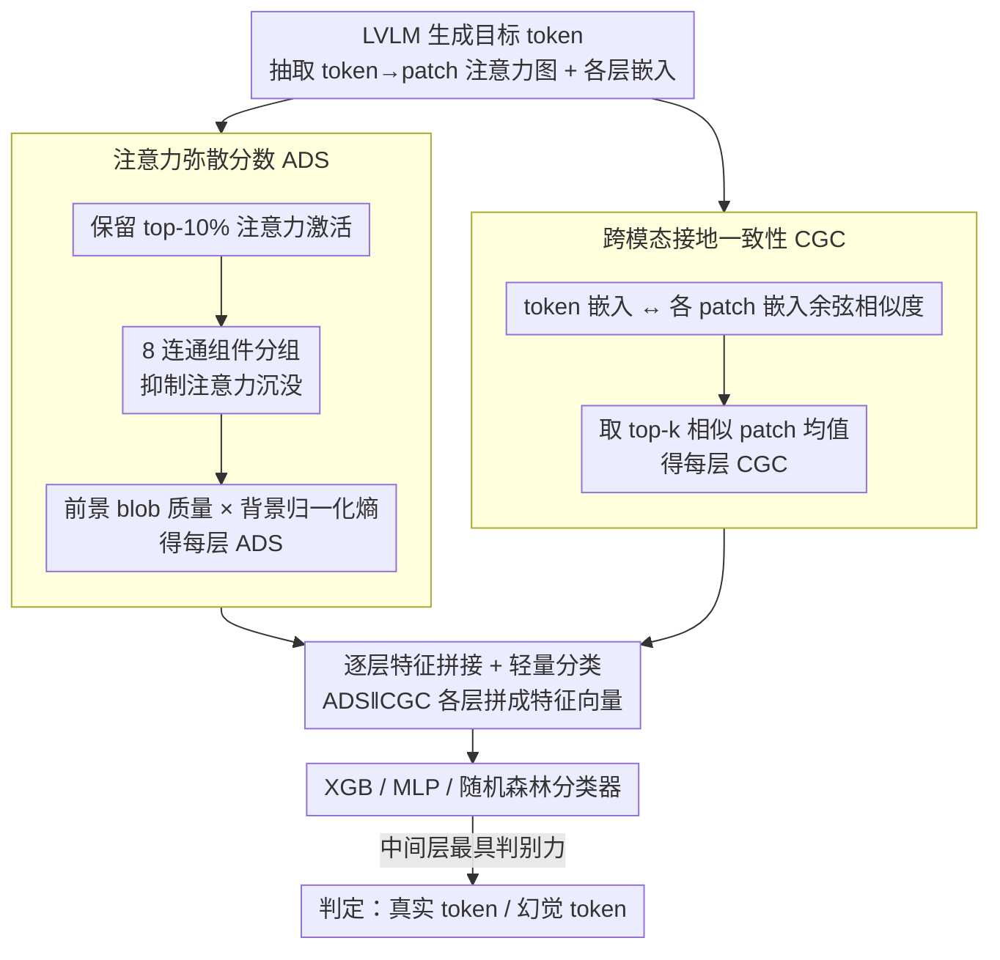

# Beyond the Global Scores: Fine-Grained Token Grounding as a Robust Detector of LVLM Hallucinations

**会议**: CVPR 2026  
**arXiv**: [2604.04863](https://arxiv.org/abs/2604.04863)  
**代码**: 有  
**领域**: 幻觉检测  
**关键词**: hallucination detection, LVLM, attention dispersion, patch-level grounding, token-level

## 一句话总结

提出基于 patch 级别的 LVLM 幻觉检测框架，发现幻觉 token 表现出弥散注意力模式和低语义对齐两个特征标志，据此设计注意力弥散分数（ADS）和跨模态接地一致性（CGC）两个轻量指标，检测准确率达 90%。

## 研究背景与动机

LVLMs 易产生视觉幻觉——描述图像中不存在的目标或属性。现有检测方法依赖粗粒度全图统计（如聚合整体注意力、输出概率、全局嵌入相似度），这种全局策略存在根本局限：幻觉 token 可能与图像多个局部区域有弱但分散的相关性，聚合后产生欺骗性的高相关度，逃过全局检测器。

核心洞察：忠实的目标 token 必须强烈接地到特定图像区域。因此幻觉检测必须从全图分析转向 patch 级别的接地分析。

## 方法详解

### 整体框架

这篇工作要解决的是：现有幻觉检测器只看全图聚合的注意力/概率/相似度，而幻觉 token 往往跟多个局部区域有「弱但分散」的相关性，聚合之后反而伪装成高相关、骗过全局检测器。它的破局思路是把视角从全图下沉到 patch 级别——逐 token 分析它与每个图像 patch 的细粒度交互，提取「注意力空间分布」和「跨模态语义对齐」两类结构性特征，再喂给一个轻量分类器判断这个 token 是不是幻觉。具体流水线是双分支并行：从 token 的注意力图算出注意力弥散分数 ADS，从 token 与 patch 的嵌入相似度算出跨模态接地一致性 CGC，把两者逐层拼成特征向量后交给轻量分类器拍板。

### 关键设计

**1. 注意力弥散分数 ADS：用空间紧凑度区分「聚焦」和「弥漫」**

针对的痛点是真实目标的注意力会牢牢钉在某块区域，而幻觉 token 的注意力四处弥散。ADS 把这个直觉量化成一个分数：先保留 top-k% 的注意力激活，用 8 连通组件把「注意力沉没」（面积 $< \tau_{ADS}$ 的零散小 blob）过滤掉，再算两件事——前景 blob 质量 $m_t^{(n)} = \sum_{c \in \mathcal{C}_t^{(n)*}} \sum_{p \in c} \bar{\mathbf{A}}_t^{(n)}(p)$ 衡量注意力有多集中在主区域，背景归一化熵 $\hat{H}_t^{(n)} = -\sum_{p \in \mathcal{B}} \mathbf{E}(p) \log \mathbf{E}(p) / \log|\mathcal{P}|$ 衡量剩余注意力有多散。两者相乘得 $ADS_t^{(n)} = (1-m_t^{(n)}) \cdot \hat{H}_t^{(n)}$：低 ADS 表示紧凑聚焦（真实目标），高 ADS 表示分散弥漫（幻觉）。连通组件过滤加背景熵的组合恰好把「注意力沉没」这种零散噪声排除在外，让分数只反映真正的聚焦程度。

**2. 跨模态接地一致性 CGC：看 token 和图像区域到底「对没对上」**

ADS 只看注意力分布，还需要一个语义层面的佐证：真实 token 应该和它描述的图像区域在嵌入空间里高度相似。CGC 逐层计算 token 嵌入与各图像 patch 嵌入的余弦相似度，取 top-k 个最相似 patch 的均值。真实 token 会和对应区域出现一个尖锐的相似度峰值，而幻觉 token 跟所有区域相似度都低且平——这正好补上 ADS 看不到的「内容是否真的对应」那一维。

**3. 逐层特征拼接 + 轻量分类：让中间层来拍板**

单看某一层不够稳，于是把所有层的 ADS 和 CGC 拼成一个特征向量，训练 XGB / MLP / 随机森林这类轻量分类器。一个关键观察决定了为什么这样有效：判别力主要集中在中间层——浅层视觉信号还没充分融合，深层则被语言先验主导、真实与幻觉 token 的差距反而收敛，唯有中间层把「是否视觉接地」这件事暴露得最充分。

### 损失函数 / 训练策略

分类器用交叉熵训练，标签来自 GPT-4o 的语义验证（结合 CHAIR 指标和人工描述）。实验在 MS-COCO 2014 验证集的 4000 张图像上进行，按 90/10 划分训练与测试。

## 实验关键数据

### 主实验（图像字幕任务）

| 方法 | LLaVA-1.5-7B F1 | Qwen2.5-VL-7B F1 | InternVL2.5-8B F1 |
|------|----------------|------------------|-------------------|
| MetaToken | 0.51 | 0.54 | — |
| SVAR | — | — | — |
| Ours (XGB) | **0.90** | **0.88** | **0.88** |

### 关键发现

- 真实 token 在早/中层展现紧凑、定位良好的注意力，幻觉 token 注意力弥散
- 真实 token 与对应 patch 有高语义相似度，幻觉 token 与所有 patch 相似度低
- 两个发现共同指出：幻觉主要源于语言先验的过度依赖而非视觉编码器缺陷
- 中间层特征最具判别力，深层因语言先验主导而差距收敛
- ADS 单独作为分类器即可达到 F1=0.73-0.77，结合 CGC 后达到 F1=0.88-0.90
- 实验在 MS-COCO 2014 验证集 4000 张图像上进行，90/10 划分
- 标签由 GPT-4o 的语义验证结合 CHAIR 指标确定

## 亮点与洞察

- "从全局到局部"的视角转换抓住了幻觉检测的关键
- ADS 的连通组件过滤和背景熵设计优雅地处理了注意力沉没现象
- 可解释性强——可以可视化注意力热图来解释检测结果
- 轻量分类器即可达到 90% 准确率

## 局限与展望

- 依赖模型内部注意力权重，需要白盒访问
- 分类器需要针对每个 LVLM 单独训练
- 仅在目标级幻觉上验证，属性幻觉未涉及
- 使用 XGB/MLP/随机森林等轻量分类器，可解释性强但对复杂模式的捕获能力有限
- CGC 通过逐层计算 token 嵌入与 patch 嵌入的余弦相似度，取 top-k patch 均值，真实 token 呈现尖锐峰值而幻觉 token 弥散且低
- 对现有 SVAR 等全局统计方法的根本局限性分析深刻：弥散但广泛的弱相关聚合后产生欺骗性高的全局分数

## 评分

- 新颖性：⭐⭐⭐⭐⭐ — patch 级幻觉分析的开创性工作
- 技术深度：⭐⭐⭐⭐ — ADS 和 CGC 设计精巧
- 实验充分度：⭐⭐⭐⭐ — 多模型多基准验证
- 实用价值：⭐⭐⭐⭐ — 轻量可解释的幻觉检测器

<!-- RELATED:START -->

## 相关论文

- [\[CVPR 2026\] Zina: Multimodal Fine-grained Hallucination Detection and Editing](zina_multimodal_fine-grained_hallucination_detection_and_editing.md)
- [\[CVPR 2026\] Fine-Grained Multi-Image Object Hallucination Benchmark](fine-grained_multi_image_object_hallucination_benchmark.md)
- [\[CVPR 2026\] FINER: MLLMs Hallucinate under Fine-grained Negative Queries](finer_mllms_hallucinate_under_fine-grained_negative_queries.md)
- [\[NeurIPS 2025\] Robust Hallucination Detection in LLMs via Adaptive Token Selection](../../NeurIPS2025/hallucination/robust_hallucination_detection_in_llms_via_adaptive_token_selection.md)
- [\[CVPR 2026\] Evaluating and Easing Hallucinations for GUI Grounding](exposing_and_evaluating_hallucinations_for_gui_grounding.md)

<!-- RELATED:END -->
