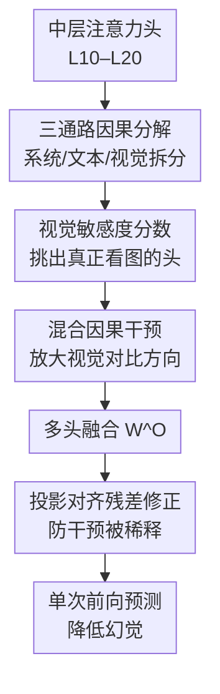

# CausalLens: Sensitivity-Guided Multi-Head Causal Intervention for Hallucination Mitigation in Large Vision-Language Models

**会议**: CVPR 2026  
**论文**: [CVF Open Access](https://openaccess.thecvf.com/content/CVPR2026/html/Ji_CausalLens_Sensitivity-Guided_Multi-Head_Causal_Intervention_for_Hallucination_Mitigation_in_Large_CVPR_2026_paper.html)  
**代码**: 无  
**领域**: 多模态VLM / 幻觉抑制  
**关键词**: LVLM幻觉, 因果干预, 注意力头分解, 视觉敏感度, 训练免费解码  

## 一句话总结
CausalLens 通过把解码器每个注意力头拆成"视觉/文本/系统提示"三条通路，用一个视觉敏感度分数挑出真正看图的头，在中层（L10–L20）单次前向里直接放大它们的视觉贡献并做投影对齐修正，从而在不训练、不多次解码的前提下显著降低大视觉语言模型的幻觉。

## 研究背景与动机

**领域现状**：大视觉语言模型（LVLM，如 LLaVA、Qwen2-VL）把视觉编码器接到 LLM 上，能做 captioning、VQA、指代理解，但普遍会"幻觉"——描述出图里根本没有的物体、属性或关系。主流的缓解手段有两类：一是重训/指令微调，二是推理阶段的对比解码（contrastive decoding，如 VCD）。

**现有痛点**：重训需要高质量数据、梯度访问和大量算力，扩展性差；对比解码虽然免训练，但要把"原图"和"扰动图"各跑一遍（甚至迭代多遍），推理延迟和显存成倍上涨——VCD 延迟是基线的 2 倍，DeGF 高达 4 倍。这让它们在实时、低延迟场景里基本不可用。

**核心矛盾**：这两类方法都卡在一条不利的"性能–效率"前沿上。作者想要的是既不训练、又单次前向（single-pass）、还能压住幻觉的方法，而现有范式做不到。

**切入角度**：作者不从输入/输出层面动手，而是钻进解码器内部，做逐层、逐头的注意力分析，发现一个结构性的因果失衡——视觉信息只在浅层（L0–L2）强表达，往中后层迅速衰减，而系统提示和文本先验从中层（L10 起）开始统治，很多头把 60–80% 的注意力给了提示 token。这条 $V \to H_t \to Y_t$（视觉 → 隐状态 → 输出）的因果链路在中后层被掐断，于是模型生成"流利但脱离画面"的文字。更关键的是，作者用 top-k 头消融在 POPE 上做了因果验证：去掉敏感度最高的头，准确率从 0.879 一路崩到 0.548（k=5）；去掉敏感度最低的头几乎不掉点。这说明"高敏感度头"正是视觉接地的因果载体。

**核心 idea**：与其多跑几遍模型，不如在中层把"真正看图的那几个头"的视觉贡献单独放大、把语言先验压下去，单次前向就把断掉的视觉因果链路接回来。

## 方法详解

### 整体框架

CausalLens 是一个训练免费、单次前向的因果干预框架，只在中层集合 $L_{mid}=\{\ell_{10},\dots,\ell_{20}\}$ 上动手。它的逻辑链是：先把每个注意力头按 key-value 序列的三个连续段（系统提示 $\mathcal{S}$ / 视觉 $\mathcal{V}$ / 文本 $\mathcal{T}$）拆成三条通路贡献；再用视觉敏感度分数 $\hat{s}_{\ell,i}$ 判断哪些头值得增强；接着在多头融合"之前"对每个头做混合因果干预，把视觉对比方向加权注入；融合后再补一个投影对齐残差，防止干预被输出投影矩阵 $W^O$ 稀释。整套流程嵌在 Transformer 解码器的中层 block 里，因为注意力聚合本身是可加的，所以对单条通路的调整不破坏架构，可即插即用。

### 关键设计

**1. 三通路因果分解：把"看图/读字/读提示"在头内部拆开**

要想只增强视觉、不误伤语言流畅度，前提是能把一个头的输出按来源拆开。作者利用一个现成事实：LVLM 的 key-value 序列被组织成三个连续段——系统提示 $\mathcal{S}$、视觉 $\mathcal{V}$、文本 $\mathcal{T}$。于是注意力矩阵可以直接按列切片 $A_{\ell,i}^{X}=A_{\ell,i}[:,X],\ X\in\{\mathcal{S},\mathcal{V},\mathcal{T}\}$，每个切片乘上对应的 value 就得到三条通路各自的隐状态贡献：$H_{\ell,i}^{(\mathrm{sys})}=A_{\ell,i}^{\mathcal{S}}V_{\ell,i}^{\mathcal{S}}$、$H_{\ell,i}^{(\mathrm{text})}=A_{\ell,i}^{\mathcal{T}}V_{\ell,i}^{\mathcal{T}}$、$H_{\ell,i}^{(\mathrm{vis})}=A_{\ell,i}^{\mathcal{V}}V_{\ell,i}^{\mathcal{V}}$。头的原始输出正是三者之和：

$$H_{\ell,i}=H_{\ell,i}^{(\mathrm{sys})}+H_{\ell,i}^{(\mathrm{text})}+H_{\ell,i}^{(\mathrm{vis})}.$$

这个加性分解之所以关键，是因为它把"头输出"显式写成三条因果通路的线性组合——既能单独度量视觉贡献的强弱，又能在不改架构的前提下对某一条通路做手术。后续所有干预都建立在这个分解之上。

**2. 视觉敏感度分数：区分"盯着物体看"和"满图乱看"的头**

不是所有头都真在用视觉。作者观察到有的头（Head A）把注意力精确聚到目标物体（如狗坐的椅子）上，有的头（Head B）几乎均匀铺满整张图、没有判别力。为量化这种差异，定义视觉敏感度分数

$$s_{\ell,i}=\frac{\mathrm{Var}(A_{\ell,i}^{\mathcal{V}})}{\mathrm{Mean}(A_{\ell,i}^{\mathcal{V}})+\epsilon},$$

其中 $A_{\ell,i}^{\mathcal{V}}$ 是该头在视觉 token 上归一化后的注意力分布。直觉是：方差/均值越高，说明注意力越不均匀、越集中在少数显著区域（强空间选择性、强视觉因果性）；分数低则是弥散或被文本驱动的头，对所有视觉 token 一视同仁。为了能在同一层内横向比较各头，再做层内归一化 $\hat{s}_{\ell,i}=s_{\ell,i}\big/\big(\tfrac{1}{H}\sum_{j}s_{\ell,j}+\epsilon\big)$。前面那个"去高 $s$ 头准确率暴跌、去低 $s$ 头几乎不变"的消融，正是这个分数有因果意义的证据——它直接决定了干预只放大谁。

**3. 中层混合因果干预（HCI）：把视觉对比方向按敏感度注入**

挑出可靠头后，需要在多头融合"之前"调整每个头的视觉–文本平衡。作者先定义视觉对比方向 $D_{\ell,i}=H_{\ell,i}^{(\mathrm{vis})}-H_{\ell,i}^{(\mathrm{sys})}$（视觉贡献减系统贡献，指向"更看图、更少受提示主导"），再把系统和文本通路并成一个文本先验项 $T_{\ell,i}=H_{\ell,i}^{(\mathrm{sys})}+H_{\ell,i}^{(\mathrm{text})}$。干预后的头输出为

$$H_{\ell,i}^{*}=(1-\gamma)\,H_{\ell,i}+\gamma\!\left(T_{\ell,i}+\lambda\,\hat{s}_{\ell,i}\,D_{\ell,i}\right).$$

这里 $\lambda$ 控制视觉增强强度（实验取 0.15），$\hat{s}_{\ell,i}$ 保证只有视觉聚焦强的头才被放大、弥散头基本不动；$\gamma$ 是一个自适应门控，按系统通路与视觉通路的能量比自动决定干预力度：

$$\gamma=\frac{\mathbb{E}\,\|H^{(\mathrm{sys})}\|^{2}}{\mathbb{E}\,\|H^{(\mathrm{sys})}\|^{2}+\mathbb{E}\,\|H^{(\mathrm{vis})}\|^{2}+\epsilon}.$$

当系统先验越强（视觉越弱），$\gamma$ 越大，干预介入越多——正好对症"语言先验主导"的情形。注意目标不是逼模型只看图，而是让视觉通路按比例重新拿回因果影响力，因此保留了 $(1-\gamma)H_{\ell,i}$ 这一原始项来维持语言流畅度。

**4. 投影对齐残差修正（PRC）：防止干预被输出投影稀释**

头干预完后要拼接并过输出投影 $H_{\ell}^{fusion}=\mathrm{Concat}(H_{\ell,1}^{*},\dots,H_{\ell,H}^{*})\,W_{\ell}^{O}$。问题是 $W_{\ell}^{O}$ 会把各头输出重新混进模型的语义空间，跨头一搅拌，前面在"头空间"做的视觉增强可能被稀释、对不上语义基。为此作者把同样的视觉对比方向也投到输出基上，构造投影对齐残差

$$\Delta_{\ell}^{proj}=W_{\ell}^{O}\,\mathrm{Concat}\big(H_{\ell,1}^{(\mathrm{vis})}-H_{\ell,1}^{(\mathrm{sys})},\dots\big),$$

再加回融合表示：$\widetilde{H}_{\ell}=H_{\ell}^{fusion}+\lambda\,\Delta_{\ell}^{proj}$。这一步等于在"局部头空间的调整"和"融合后全局语义"之间做对齐补偿，确保视觉因果修正穿过线性投影后依然成立。消融显示 HCI 和 PRC 缺一不可——前者在头层面增强视觉到生成的通路，后者在投影层面稳住语义对齐。

### 损失函数 / 训练策略

完全训练免费、单次前向，无任何梯度更新或架构改动。整套干预（Algorithm 1）就是：对每个中层 $\ell\in L_{mid}$、每个头计算三通路贡献与 $\hat{s}_{\ell,i}$，套用式 HCI 得 $H^{*}$，融合后加 PRC 残差，最后用 $\phi(\widetilde{H})$ 出 logits 预测 token。超参只有视觉增强系数 $\lambda=0.15$ 和中层区间 L10–L20。

## 实验关键数据

模型：LLaVA-v1.5-7B / 13B、Qwen2-VL-7B；基准：POPE、MMHAL-Bench、CHAIR、MME、LLaVA-Bench；基线：VCD、DeGF、VAF（均为训练免费解码）。

### 主实验（POPE，跨 MS-COCO/A-OKVQA/GQA 平均）

| 设置 | 指标 | LLaVA-7B | LLaVA-13B | Qwen2-VL-7B |
|------|------|----------|-----------|-------------|
| Random / Regular | Acc | 85.9 | 87.3 | 88.8 |
| Random / VAF | Acc | 89.6 | 90.1 | 90.5 |
| Random / **Ours** | Acc | **90.6** | **90.9** | **91.4** |
| Adversarial / Regular | Acc | 77.9 | 79.7 | 82.6 |
| Adversarial / VAF | Acc | 80.1 | 82.7 | 84.9 |
| Adversarial / **Ours** | Acc | **81.6** | **83.9** | 84.7 |

在 Random/Popular/Adversarial 三类难度上，CausalLens 在准确率与 F1 上基本全面领先 VCD/DeGF/VAF；最难的 Adversarial 上 Qwen2-VL-7B 略逊 VAF（84.7 vs 84.9），其余设置均最优。

CHAIR（caption 幻觉，LLaVA-7B，Max Token 64，越低越好）：

| 方法 | CHAIR_S ↓ | CHAIR_I ↓ |
|------|-----------|-----------|
| Regular | 26.4 | 9.7 |
| VCD | 23.1 | 7.7 |
| DeGF | 19.1 | 6.3 |
| VAF | 20.7 | 7.1 |
| **Ours** | **18.7** | **6.2** |

效率（LLaVA-7B，单张 L40）：CausalLens 平均延迟 0.293s（×1.04），显存 16111MB（×1.01）；相比 VCD（×2.01 延迟）、DeGF（×4.07 延迟、×1.22 显存）几乎零额外开销，与 VAF 同档。MMHAL-Bench 八类问题、MME（Existence/Count/Position/Color）上也普遍占优。

### 消融实验（LLaVA-7B，POPE-Popular + CHAIR）

| HCI | PRC | POPE Acc↑ | POPE F1↑ | C_i↓ | C_s↓ |
|-----|-----|-----------|----------|------|------|
| ✗ | ✗ | 82.3 | 82.1 | 26.4 | 9.7 |
| ✓ | ✗ | 84.9 | 85.1 | 21.9 | 7.2 |
| ✗ | ✓ | 84.7 | 84.6 | 22.7 | 7.5 |
| ✓ | ✓ | **86.5** | **86.8** | **18.7** | **6.2** |

视觉增强系数 $\lambda$ 敏感性：$\lambda$ 从 0.05→0.15 持续变好，0.15 时 POPE Acc 86.5 / C_s 6.2 达到最优；继续加到 0.20、0.25 反而退化，说明过度放大视觉会扭曲语义一致性。

### 关键发现
- **HCI 和 PRC 互补、缺一不可**：单独 HCI（头层面增强视觉通路）或单独 PRC（融合后稳语义）都只能拿一半收益，合起来 POPE Acc 从 82.3 提到 86.5、C_s 从 9.7 降到 6.2。
- **干预只压在中层 L10–L20**：这正是动机分析里"视觉信号短暂回闪、随后被语言先验吞掉"的区间，针对性强且省算力。
- **高敏感度头是视觉接地的因果载体**：top-k 消融里去掉 1 个高 $s$ 头 POPE 准确率就从 0.879 掉到 0.758，去 5 个掉到 0.548；去低 $s$ 头几乎无变化——这给"只放大高 $s$ 头"提供了直接因果依据。

## 亮点与洞察
- **把"幻觉"重新框成解码器内部的因果失衡**：用逐层逐头注意力图 + top-k 头消融，定量证明"视觉早衰、语言后期主导"，再据此精准定位中层下刀，动机扎实不空泛。
- **三通路加性分解 + 敏感度门控是可复用的 trick**：利用 KV 序列三段连续这一架构事实，把头输出无损拆成 sys/text/vis，再用方差/均值的敏感度分数筛头——这套"分解通路→度量可靠性→选择性增强"范式可迁到任何想做模态/来源级干预的 Transformer 场景。
- **真正做到训练免费 + 单次前向**：与动辄 2–4 倍延迟的对比解码相比，几乎零开销（×1.04 延迟、×1.01 显存）还能 SOTA，是面向实时部署的实用解法。

## 局限性 / 可改进方向
- **中层区间和 $\lambda$ 是经验固定值**：L10–L20、$\lambda=0.15$ 在 LLaVA-7B 上调出，跨架构是否最优未充分扫描；不同骨干的"视觉回闪带"可能不同，固定区间可能次优。
- **敏感度分数只看视觉注意力的方差/均值**：它度量"集中度"而非"正确性"，一个集中盯错区域的头同样会被放大，可能引入新的定向幻觉。
- **三段 KV 连续假设依赖具体实现**：若模型把视觉 token 交错插入或用不同的 prompt 模板，三通路切片会失效，泛化性受限。
- **最难的 Adversarial 设置上并非全面碾压**（Qwen2-VL 略逊 VAF），强语言先验下干预力度的上限值得进一步研究。

## 相关工作与启发
- **vs VCD（对比解码）**：VCD 用高斯模糊的视觉负样本做对比监督，要多跑一遍模型、延迟翻倍；CausalLens 不构造负样本、不额外查询，直接在隐状态层面恢复视觉因果链，效率高一个量级且效果更好。
- **vs DeGF（生成反馈）**：DeGF 反复让模型咨询自己的输出来迭代修正 token，延迟高达 ×4.07；CausalLens 单次前向就完成干预。
- **vs VAF（注意力校准）**：VAF 在每步解码直接抬高对图像区域的注意力、与本文最接近且效率相当；区别在于 CausalLens 不是粗暴抬全图注意力，而是按敏感度只增强可靠头的视觉"贡献"并做投影对齐修正，在多数设置上更优。

## 评分
- 新颖性: ⭐⭐⭐⭐ "因果失衡诊断 + 三通路分解 + 敏感度门控 + 投影对齐"组合新颖，且用头消融把因果论证落到实处
- 实验充分度: ⭐⭐⭐⭐ 五基准三骨干、含效率与 λ/模块消融，但中层区间未做系统扫描、最难设置非全面领先
- 写作质量: ⭐⭐⭐⭐ 动机—机制—验证逻辑清晰，公式与算法完整
- 价值: ⭐⭐⭐⭐⭐ 训练免费、单次前向、几乎零开销的 SOTA 幻觉抑制，实时部署落地性强

<!-- RELATED:START -->

## 相关论文

- [\[CVPR 2026\] Prefill-Time Intervention for Mitigating Hallucination in Large Vision-Language Models](prefill-time_intervention_for_mitigating_hallucination_in_large_vision-language_.md)
- [\[CVPR 2026\] VES-RFT: Rewarding Visual Evidence Sensitivity to Mitigate Hallucinations in Large Vision-Language Models](ves-rft_rewarding_visual_evidence_sensitivity_to_mitigate_hallucinations_in_larg.md)
- [\[CVPR 2026\] Envision, Attend, Then Respond: Counterfactual Hallucination Mitigation in Large Vision-Language Models](envision_attend_then_respond_counterfactual_hallucination_mitigation_in_large_vi.md)
- [\[ICML 2026\] Mitigating Hallucinations in Large Vision-Language Models via Causal Route Gating](../../ICML2026/hallucination/mitigating_hallucinations_in_large_vision-language_models_via_causal_route_gatin.md)
- [\[CVPR 2026\] HulluEdit: Single-Pass Evidence-Consistent Subspace Editing for Mitigating Hallucinations in Large Vision-Language Models](hulluedit_single-pass_evidence-consistent_subspace_editing_for_mitigating_halluc.md)

<!-- RELATED:END -->
