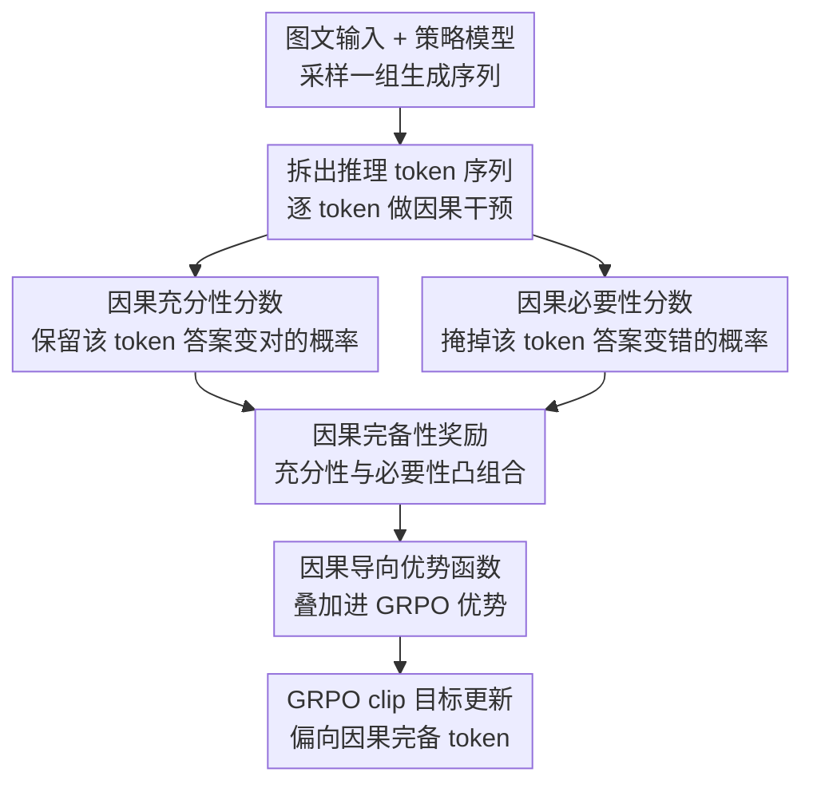

# COPO: Causal-Oriented Policy Optimization for Hallucinations of MLLMs

**会议**: CVPR 2026  
**论文**: [CVF Open Access](https://openaccess.thecvf.com/content/CVPR2026/html/Guo_COPO_Causal-Oriented_Policy_Optimization_for_Hallucinations_of_MLLMs_CVPR_2026_paper.html)  
**代码**: 待开源（原文称 "The code will be available at COPO"，未给出实际链接）  
**领域**: 多模态VLM / 幻觉抑制 / 强化学习后训练  
**关键词**: 多模态幻觉, GRPO, 因果充分性与必要性, token级奖励, 虚假相关

## 一句话总结
作者发现 MLLM 用 GRPO（只看最终答案对错的 outcome reward）后训练时会过度关注图像背景、形成"背景→答案"的虚假相关进而产生幻觉，于是提出 COPO：给每个推理 token 算一个"因果完备性"奖励（充分性 + 必要性），把它注入 GRPO 的优势函数，逼模型只奖励真正决定答案对错的 token，从而在 CHAIR/POPE 等多个幻觉基准上稳定降低幻觉率。

## 研究背景与动机
**领域现状**：缓解 MLLM 幻觉的一条主流路线是用强化学习（尤其是 GRPO）做后训练，提升模型推理能力。GRPO 从一组采样轨迹里按"最终答案是否正确"打分（正确 reward=1，否则 0），用组内相对优势驱动模型探索并强化好的推理路径。

**现有痛点**：GRPO 原本是为纯文本 LLM 设计的，奖励只发给最终结果。作者做了一个关键对比实验：在相同 GRPO 设置下分别训练 MLLM（图+文输入）和 LLM（同样问题但用文字描述代替图像），再看二者的梯度显著性图。结果发现——**无论答案对错，MLLM 在任务无关背景区域上的梯度显著性都明显高于 LLM**，而 LLM 的梯度集中在和问题直接相关的语义词（如"white bird""traffic light"）上。这说明 MLLM 对背景产生了不该有的依赖。

**核心矛盾**：图像比文本信息密度高得多——一句话描述狗要好几个词，一张图却同时塞进外观、姿态、环境。当视觉样本有限时，大量背景信息会和前景线索在空间上重叠，模型很难把背景彻底排除。而 outcome reward 只要最终答案对就给正反馈，**哪怕这次答对部分是靠了背景线索**，这条"走捷径"的路径也会被强化。久而久之模型就把无关背景当成了预测信号，建立起"背景信号↔正确答案"的虚假相关。

**本文目标**：作者把问题拆成两个论断并逐一论证——(i) GRPO 的 outcome-only 奖励会诱发虚假相关；(ii) 虚假相关会进一步导致幻觉。第二个论断的机制是：推理时 token 用 Top-K 采样、答案用 beam search 从多个候选里选，由于模型同时关注前景和背景，解码/选择阶段就有不可忽略的概率让背景特征占主导，最终输出流畅但与事实不符的幻觉。

**切入角度**：作者从因果视角重看 MLLM 的生成过程，给数据生成和 token 生成各建一个结构因果模型（SCM）。把输入 $I=(I_v,I_t)$ 看成由两组隐因子生成：与答案 $Y$ 因果相关的 $L_c$（语义属性，如物体存在与类别）和非因果的 $L_s$（背景、光照等无关环境）。理想情况下预测答案 $\tilde{Y}$ 应只依赖 $L_c$、对 $L_s$ 不变。问题就转成：怎么逼模型在生成 token 时只用 $L_c$、屏蔽 $L_s$。

**核心 idea**：用"因果充分性 + 必要性"约束代替"答案对就行"的粗粒度奖励——只有那些**既单独有助于答对（充分）、又缺了它就答错（必要）**的 token 才配拿高奖励；背景驱动的 token 满足不了这两条，自然撑不起 $L_s \to \tilde{Y}$ 这条虚假路径，幻觉随之减少。

## 方法详解

### 整体框架
COPO 不改 GRPO 的骨架，而是在其奖励/优势这一环动手术。一句话概括：**对策略模型采样出的每条推理轨迹，逐 token 算一个"因果完备性奖励"，再把它加进 GRPO 的优势函数里，让梯度只偏向那些真正决定答案对错的 token。** 整个流程是：策略模型 $\pi_\theta$ 对一个图文输入采样出一组生成序列（含推理 token 和答案 token）→ 对每个推理 token 分别用"掩码后续 token"和"掩码该 token 本身"两种干预估出充分性分数 $S_\text{suff}$ 与必要性分数 $S_\text{nec}$ → 凸组合成因果完备性奖励 $r_\text{causal}$ → 把它叠加到原始 GRPO 优势上得到因果导向优势 $\hat{A}_{i,t}$ → 用修改后的优势跑标准 GRPO 的 clip 目标更新策略。

### 关键设计

**1. 因果充分性分数：保留这个 token 能不能把错答案救对**

充分性针对"哪些推理 token 真正有助于答对"。对推理序列 $\bar{o}=\{\bar{o}_1,\dots,\bar{o}_{T_{\bar{o}}}\}$ 里的某个 token $\bar{o}_t$，作者构造一个干预：保留前缀 $\bar{o}_{\le t}$、掩掉后续 token，让模型从 $\bar{o}_{\le t}$ 和 $\bar{o}_{<t}$ 两种起点各自续写 $H$ 次，得到答案集合 $\{\tilde{Y}^k_{(t)}\}$（含 $\bar{o}_t$）和 $\{\tilde{Y}^k_{(t-1)}\}$（不含 $\bar{o}_t$）。充分性分数定义为

$$S_\text{suff}(\bar{o}_t) = \frac{1}{H}\sum_{k=1}^{H}\big(r(\tilde{Y}^k_{(t)}) - r(\tilde{Y}^k_{(t-1)})\big)\cdot \mathbb{I}\big(r(\tilde{Y}^k_{(t)}) > r(\tilde{Y}^k_{(t-1)})\big)$$

直白讲：加上这个 token 后续写出的答案，奖励比不加它时高多少，且只在"加了确实更好"（指示函数为 1）时累计，再对 $H$ 次采样取平均以抵消解码随机性。$S_\text{suff}$ 越高，说明 $\bar{o}_t$ 越能单独触发正确答案。论文给的例子里，"dog"（主体物）充分性 0.87、"brown"（颜色，视觉可证）0.68，而冠词"a""the"几乎为 0、错误的"sunset"（图实为白天）只有 0.09——分数自然把有据可依的 token 和瞎编/功能词区分开。

**2. 因果必要性分数：去掉这个 token 答案会不会塌**

必要性是充分性的对偶面，衡量"缺了它答案会不会变错"。作者用掩码近似反事实干预：把 $\bar{o}_t$ 替换成掩码 token（值置零）得到 $\bar{o}^\text{mask}_{(t)}$，模型据此生成新答案 $\tilde{Y}^\text{mask}_{(t)}$，必要性分数就是原答案与掩码后答案的奖励差

$$S_\text{nec}(\bar{o}_t) = r(\tilde{Y}) - r(\tilde{Y}^\text{mask}_{(t)})$$

差越大说明去掉该 token 对正确性破坏越大、它越不可或缺。这里和充分性不同：必要性**不做多次采样平均**，作者的理由是大多数 MLLM 在从参考序列生成答案 $\tilde{Y}$ 时已经内置了 Top-K、beam search 这类对解码随机性的处理，没必要再叠一层平均。这一设计上的取舍让必要性计算更省。

**3. 因果完备性奖励：充分且必要才算数**

单看充分或单看必要都不够——一个 token 可能"加了有用但没了也行"（充分不必要），也可能"它在时答案对、但换个别的也对"。要锁定**既单独有用、又不可替代**的 token，作者把两个分数（都归一化到 $[0,1]$）做凸组合成因果完备性奖励

$$r_\text{causal}(\bar{o}_t) = \lambda_s \cdot S_\text{suff}(\bar{o}_t) + \lambda_n \cdot S_\text{nec}(\bar{o}_t)$$

其中 $\lambda_s,\lambda_n\in[0,1]$ 是权重。这个奖励对背景驱动 token 天然不友好：背景 token 既难独立救对答案（充分性低）、也容易被替换（必要性低），两项都小，拿不到高奖励，于是 $L_s\to\tilde{Y}$ 的虚假路径得不到强化。论文示例里"dog"的完备奖励 0.59、"grass"0.46，而"sunset""quickly"这类幻觉/修饰词都在 0.05 上下，对比鲜明。

**4. 因果导向优势函数与 COPO 目标：把 token 级因果信号注入 GRPO**

有了 token 级奖励，关键是怎么让它真正改变梯度。作者保留 GRPO 原有的组内相对优势 $A^\text{orig}_{i,t}=A_i$（按答案对错算，见 $A_i=\frac{r_i-\text{mean}(r_{1..G})}{\text{std}(r_{1..G})}$），但**只对推理 token** 把因果完备性奖励加进去：

$$\hat{A}_{i,t} = A^\text{orig}_{i,t} + r^\text{causal}_{i,t},\quad \text{s.t. } o^i_t\in\bar{o}^i$$

也就是答案 token 仍用原优势，推理 token 则在原优势上叠加它的因果贡献。一个巧妙之处：$\lambda_s,\lambda_n$ 不只调充分/必要的相对比例，还同时控制因果奖励注入优势的整体强度。最后把 $\hat{A}_{i,t}$ 塞回标准 GRPO 的 clip 目标：

$$J_\text{COPO}(\theta) = \mathbb{E}\Big[\frac{1}{G}\sum_{i=1}^{G}\frac{1}{T_i}\sum_{t=1}^{T_i}\big(\min(\rho_{i,t}\hat{A}_{i,t},\,\Psi(\hat{A}_{i,t})) - \beta\,\mu(\pi_\theta)\big)\Big]$$

其中 $\rho_{i,t}$ 是新旧策略的 token 重要性比、$\Psi(\hat{A}_{i,t})=\text{clip}(\rho_{i,t},1-\epsilon,1+\epsilon)\cdot\hat{A}_{i,t}$、$\mu(\pi_\theta)$ 是对参考策略的 KL 惩罚。这样既保住了 GRPO 的稳定性与组内对比性，又额外给了 token 级因果监督，把策略学习推向因果充分且必要的 token。

### 一个例子：给一句 caption 逐 token 打分
以"A brown dog jumps quickly to catch a red frisbee during sunset on the grass"为例，COPO 逐 token 给出三元组（充分/必要/因果奖励）：主体与属性 token 拿高分——"dog"(0.87/0.81/0.59)、"brown"(0.68/0.54/0.43)、"frisbee"(0.65/0.63/0.45)、"grass"(0.71/0.61/0.46)；功能词几乎为 0——"a""the""to"都在 0.01~0.02；而**幻觉 token** "sunset"（图其实是白天）只有 0.09/0.03/0.04、修饰词"quickly"0.11/0.03/0.05。优势函数据此放大有据可依 token 的梯度、压低幻觉 token，模型逐渐学会"看图说话、不脑补"。

## 实验关键数据

### 主实验
在四个代表性 MLLM（InstructBLIP / MiniGPT-4 / LLaVA-1.5 / Qwen-VL，均 7B）上，用 CHAIR（句级 CHAIR$_S$↓、实例级 CHAIR$_I$↓）和 POPE（F1↑）评测物体幻觉。COPO 在全部四个模型上都刷新 SOTA：

| 模型 | 指标 | 之前最佳(GCPO/CSR) | COPO | 提升 |
|------|------|------|------|------|
| InstructBLIP | CHAIR$_S$↓ | 38.2 | 35.9 | ↓1.7 |
| InstructBLIP | POPE↑ | 85.9 | 86.9 | ↑1.0 |
| MiniGPT-4 | CHAIR$_S$↓ | 21.9 | 20.6 | ↓1.3 |
| MiniGPT-4 | POPE↑ | 78.6 | 80.1 | ↑1.5 |
| LLaVA-1.5 | CHAIR$_I$↓ | 5.8 | 5.3 | ↓0.5 |
| LLaVA-1.5 | POPE↑ | 87.2 | 88.0 | ↑0.8 |
| Qwen-VL | CHAIR$_S$↓ | 19.9 | 18.8 | ↓1.1 |
| Qwen-VL | POPE↑ | 86.5 | 88.3 | ↑1.5 |

GPT-4o 辅助评测（在准确性 A / 正确性 C / 细节度 D 三维打分）同样领先：

| 指标 | Vanilla | DeCo(次优) | COPO | 提升 |
|------|---------|------|------|------|
| 准确性 A | 5.21 | 7.42 | 8.71 | ↑1.29 |
| 正确性 C | 6.31 | 6.25 | 6.89 | ↑0.57 |
| 细节度 D | 8.18 | 7.96 | 9.58 | ↑1.40 |

值得注意的是 COPO 在压幻觉的同时细节度反而最高（9.58），说明它不是靠"少说话/只说稳妥的"来降幻觉，而是真的更 grounded。

### 消融实验
拆掉因果完备性奖励的两个分量（在 LLaVA-1.5 上，含文本质量 MME 与 GPT-4 三维）：

| 配置 | CHAIR$_S$↓ | CHAIR$_I$↓ | POPE↑ | MME↑ | A | C | D |
|------|------|------|------|------|---|---|---|
| 完整 COPO | 19.8 | 5.3 | 88.0 | 1589.3 | 8.71 | 6.89 | 9.58 |
| w/o $S_\text{suff}$ | 21.7 | 7.5 | 86.7 | 1531.5 | 7.78 | 6.21 | 8.89 |
| w/o $S_\text{nec}$ | 22.5 | 6.9 | 87.0 | 1522.3 | 7.81 | 6.18 | 8.75 |
| w/o $S_\text{suff}$&$S_\text{nec}$ | 30.5 | 10.9 | 85.9 | 1489.2 | 7.21 | 5.77 | 8.19 |

### 关键发现
- **充分性与必要性缺一不可，且两者协同效应明显**：去掉任一分量 CHAIR$_S$ 都从 19.8 升到 21~22；但**两个都去掉**（退化为近似纯 GRPO）CHAIR$_S$ 直接跳到 30.5、CHAIR$_I$ 翻倍到 10.9——说明因果完备性奖励的收益主要来自两个约束的联合，而非简单叠加。
- **必要性分量略比充分性更重要**：单独去掉 $S_\text{nec}$（CHAIR$_S$ 22.5）比去掉 $S_\text{suff}$（21.7）掉得更多，符合直觉——"缺了它就答错"是更强的因果证据。
- **超参敏感性温和**：$\lambda_s,\lambda_n$ 在 $[0,1]$ 网格搜索，POPE F1 在 86.4~88.4 区间波动，最优落在 $\lambda_s=\lambda_n=0.35$，说明方法对权重不算苛刻。
- **梯度显著性可视化佐证机制**：加 COPO 后，模型在背景区域的梯度显著性明显收缩、向真正的目标物体聚集，直接验证了"抑制虚假背景相关"的设计初衷（图 6）。

## 亮点与洞察
- **把"虚假相关→幻觉"这条因果链做了实证 + 理论双重论证**：先用 MLLM vs LLM 的梯度显著性对照实验给出经验证据，再用 SCM 把"背景隐因子 $L_s$"形式化，论证链条比"我提个新 loss 涨点了"扎实得多——这是论文最让人信服的地方。
- **token 级因果归因用"掩码干预"近似反事实**，巧妙地把抽象的充分/必要性（Pearl 的 PNS 概念）落地成可计算的奖励，且充分性多采样、必要性不采样的非对称设计是有工程考量的（必要性侧复用了模型自带的解码随机性）。
- **完全不动 GRPO 骨架、只在优势函数上加一项**，迁移成本极低——任何已经在跑 GRPO 后训练的 MLLM 都能直接挂上这套奖励，这是很强的可复用性。
- **降幻觉但不牺牲细节度**（D 反而最高）这点很反直觉也很值钱：大多数幻觉抑制方法会让模型变"保守寡言"，COPO 证明了"少幻觉"和"多细节"可以兼得。

## 局限与展望
- **token 级干预的计算开销不小**：充分性要对每个推理 token 续写 $H$ 次，必要性要再跑一次掩码前向，长序列上这是显著的训练时额外成本，论文正文没给训练耗时/吞吐对比（⚠️ 细节在 Appendix，正文未量化）。
- **掩码≈反事实是一个近似**：把 token 置零当作"移除其因果影响"，但置零后的隐状态未必等价于"该 token 从未存在"，这个近似的偏差有多大、对分数估计影响多少，论文没深究。
- **奖励依赖一个可验证的 outcome reward $r(\cdot)$**：充分/必要分数都建立在"答案能判对错"之上，对开放式生成、缺少 ground-truth 的任务（如自由 captioning 的细粒度正确性）如何定义 $r$ 仍需额外设计。
- **提升幅度偏温和**：CHAIR/POPE 上多在 ±1 个点级别，虽全面但不算颠覆性；在更难的推理/数学幻觉基准上的表现被放进 Appendix，正文主表未充分展开。

## 相关工作与启发
- **vs GRPO（基线）**：GRPO 只用 outcome reward、把信用粗暴地平摊给整条轨迹；COPO 在保留其组内相对优势的同时，给推理 token 加了一层 token 级因果信用分配，相当于把"答案对不对"细化到"每个 token 凭什么对"。
- **vs GCPO [17]**：同样把结构因果模型引入策略优化，但 GCPO 处理的是候选回答之间的依赖（用因果投影），针对的是 LLM；COPO 聚焦 MLLM 幻觉、且因果约束下沉到 token 级的充分性与必要性，问题设定和粒度都不同。
- **vs 解码期幻觉抑制（DoLa / OPERA / VCD / DeCo）**：这些方法在推理时调整解码分布来压幻觉，不改模型权重；COPO 是后训练方法，从源头改变模型对背景的依赖，主表上幻觉率也普遍更低。
- **vs 偏好对齐类（HA-DPO / POVID / CSR）**：它们靠构造偏好对做 DPO 式对齐；COPO 不需要成对偏好数据，靠自动算出的 token 级因果奖励驱动，数据构造负担更轻。

## 评分
- 新颖性: ⭐⭐⭐⭐⭐ 把因果充分性/必要性（PNS）落到 token 级奖励并注入 GRPO 优势，角度新且论证扎实
- 实验充分度: ⭐⭐⭐⭐ 四模型多基准 + 消融 + 超参 + 可视化都有，但训练开销未量化、主表提升偏温和
- 写作质量: ⭐⭐⭐⭐⭐ 经验发现→因果建模→方法的逻辑链清晰，公式与示例配合到位
- 价值: ⭐⭐⭐⭐ 即插即用、可复用性强，且揭示了"MLLM 比 LLM 更易学背景捷径"这一有普遍意义的现象

<!-- RELATED:START -->

## 相关论文

- [\[CVPR 2025\] Seeing Far and Clearly: Mitigating Hallucinations in MLLMs with Attention Causal Decoding](../../CVPR2025/hallucination/seeing_far_and_clearly_mitigating_hallucinations_in_mllms_with_attention_causal_.md)
- [\[CVPR 2026\] Tell Model Where to Look: Mitigating Hallucinations in MLLMs by Vision-Guided Attention](tell_model_where_to_look_mitigating_hallucinations_in_mllms_by_vision-guided_att.md)
- [\[CVPR 2026\] FINER: MLLMs Hallucinate under Fine-grained Negative Queries](finer_mllms_hallucinate_under_fine-grained_negative_queries.md)
- [\[ICML 2026\] Learning from Fine-Grained Visual Discrepancies: Mitigating Multimodal Hallucinations via In-Context Visual Contrastive Optimization](../../ICML2026/hallucination/learning_from_fine-grained_visual_discrepancies_mitigating_multimodal_hallucinat.md)
- [\[CVPR 2026\] MoD-DPO: Towards Mitigating Cross-modal Hallucinations in Omni LLMs using Modality Decoupled Preference Optimization](mod-dpo_towards_mitigating_cross-modal_hallucinations_in_omni_llms_using_modalit.md)

<!-- RELATED:END -->
