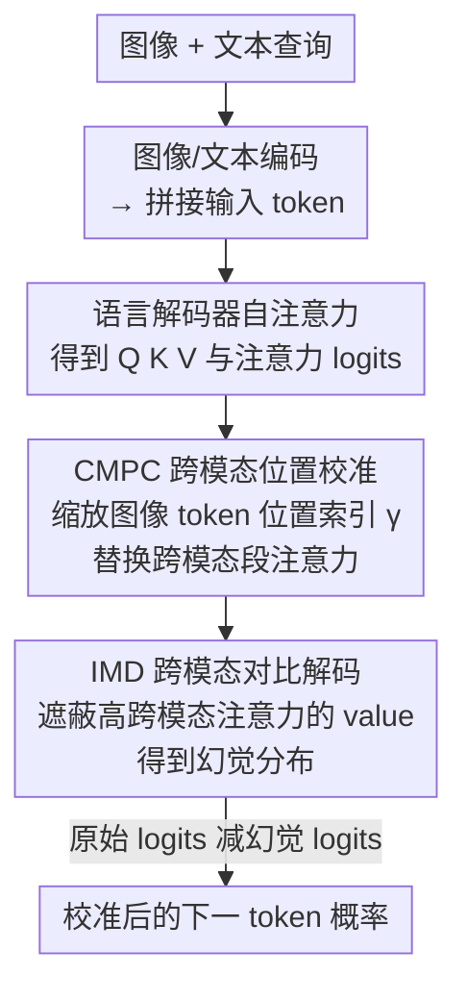

# Cross-Modal Attention Calibration for LVLM Hallucination Mitigation

**会议**: CVPR 2026  
**论文**: [CVF Open Access](https://openaccess.thecvf.com/content/CVPR2026/html/Li_Cross-Modal_Attention_Calibration_for_LVLM_Hallucination_Mitigation_CVPR_2026_paper.html)  
**代码**: https://github.com/lijm48/IMCCD  
**领域**: 多模态VLM  
**关键词**: LVLM幻觉, 对比解码, 跨模态注意力, 位置偏置, 免训练  

## 一句话总结
针对 LVLM 幻觉，本文提出免训练的跨模态注意力校准框架 CMAC：用 IMD 模块在注意力层"外科手术式"地遮蔽跨模态高权重的 value 向量来构造更精准的幻觉分布做对比解码，并用 CMPC 模块缩放图像 token 的位置索引来缓解 RoPE 带来的位置偏置，在 POPE/CHAIR/MME 上全面超过现有对比解码方法。

## 研究背景与动机
**领域现状**：LVLM（如 LLaVA-1.5、InstructBLIP、Qwen-VL）在图文理解上表现强劲，但生成时常出现幻觉——文字流畅却和图像不符。免训练的推理期干预方法里，对比解码（Contrastive Decoding, CD）最受关注：它人为制造一个"会幻觉的"扭曲输入，让模型输出幻觉分布，再用原始分布减去它来压制幻觉。

**现有痛点**：作者指出现有 CD 方法（VCD 加视觉噪声、ICD 加负面指令前缀、token 剪枝等）有两个被忽视的根本缺陷。其一，它们只对付"单模态过度依赖"（模型只看文字或只看图就回答），无法区分**真实视觉关联**和**虚假跨模态关联**——LVLM 从网络数据里学到诸如"食物常和餐桌共现"这种表层关联，于是图里有食物就会幻觉出并不存在的餐桌；而整体扭曲视觉输入的 CD 太粗，无法定点惩罚这种虚假关联。其二，作者发现跨模态注意力存在系统性的**位置偏置**：幻觉更容易发生在图像 token 序列**靠前**的物体上。

**核心矛盾**：位置偏置的根源是语言解码器里的 RoPE。图像被嵌成 token、与文本 token 交错后做自回归生成，这种架构天然让模型在生成时更多注意视觉序列的**后段**，导致前段视觉内容被忽略而产生幻觉。现有免训练方法既没解决虚假跨模态关联，也没碰位置偏置。

**本文目标**：在不训练、不改权重的前提下，同时解决"虚假跨模态关联"和"位置偏置"两类被忽视的幻觉来源。

**切入角度**：与其在输入端整体扭曲图像/文本，不如直接在**注意力层内部**做精准干预——只动那些高跨模态注意力权重对应的 value，既能制造出同时暴露虚假关联和单模态依赖的幻觉分布，又能复用原始前向过程的中间量提速。

**核心 idea**：用"注意力层 value 选择性遮蔽"代替"输入整体扭曲"来构造对比解码的幻觉分布（IMD），再用"位置索引缩放"压平 RoPE 的位置偏置（CMPC）。

## 方法详解

### 整体框架
CMAC（Cross-Modal Attention Calibration）是一个**免训练**框架，挂在 LVLM 的语言解码器推理过程上，由两个互补模块组成：**IMD**（Inter-Modality Decoding，跨模态对比解码）负责消除虚假跨模态关联，**CMPC**（Cross-Modal Position Calibration，跨模态位置校准）负责消除位置偏置。

先回顾 LVLM 的解码记号：图像 token $X=\{x_i\}$、文本 token $T$ 拼成输入 $[T_{0:m_b}, X, T_{m_b+1:m}]$（$T_{0:m_b}$ 是系统提示，$T_{m_b+1:m}$ 是查询提示）。自注意力层把隐状态映射成 $Q,K,V$，RoPE 给 $Q,K$ 加位置信息（旋转矩阵 $R^i$，位置索引 $P=[\{i\}_{i=1}^{m+n}]$），注意力矩阵 $A=\text{softmax}(A^l)=\text{softmax}(Q_pK_p^T/\sqrt{d})$，输出 $O=AV$。标准对比解码为

$$p_\theta(Y_t|T,X)=\text{softmax}((1+\alpha)\,l_t-\alpha\,\widetilde{l}_t)$$

其中 $l_t$ 是原始 logits、$\widetilde{l}_t$ 是扭曲输入的 logits、$\alpha$ 控制对比强度。CMAC 的关键在于**换一种方式产生 $\widetilde{l}_t$**：不扭曲输入，而是扭曲注意力内部的 value，并先用 CMPC 校准过的位置注意力替换跨模态段，再喂给 IMD 做对比。整条推理流如下图。

### 关键设计

**1. IMD：在注意力 value 上做外科手术，精准构造幻觉分布**

这一设计直击"现有 CD 无法区分真实关联与虚假关联"的痛点。作者的洞察是：跨模态注意力里，**权重高**的位置往往是模型真正依赖的强关联（既可能是合理关联，也可能是虚假关联），而**权重低**的位置是弱关联和单模态知识交换。于是 IMD 选择性地把高权重处的 value 压成均值来制造幻觉，而非整体扭曲图像。

具体地，先从注意力 logits 里切出跨模态段 $A^l_{cross}=A^l[m_b+n:m+n,\ m_b:m_b+n]$（即后续文本 token 对图像 token 的注意力）。然后按幅值生成自适应二值掩码：

$$M_{cross}=\mathbb{I}\!\left(A^l_{cross}>\mu(A^l_{cross})\right)$$

$\mu(\cdot)$ 是均值、$\mathbb{I}$ 是指示函数——高于均值的跨模态注意力被标为"显著关联"。把 $M_{cross}$ 零填充到全局掩码 $M$ 后，IMD 不像传统方法那样剪枝 token，而是把 value 向量按维度均值化 $\mu(V)$ 作为"扭曲 value"，再按掩码和注意力权重做加权融合，改写 $O=AV$ 为

$$\widetilde{O}=(M\cdot A)\,\mu(V)+((1-M)\cdot A)\,V$$

即：高跨模态注意力对应的 value 被换成均值（抹掉内容），其余 value 保持不变。这样得到的 $\widetilde{O}\to\widetilde{l}_t$ 同时暴露了"单模态过度依赖"和"虚假跨模态关联"两类失败，再代入对比解码公式 $\text{softmax}((1+\alpha)l_t-\alpha\widetilde{l}_t)$ 就能同时压制两者。相比传统 CD，IMD 有三点优势：① 只动跨模态段、保留低权重关联和模态内知识交换，对幻觉估计更精准；② 不修改注意力**权重**本身（只动 value），避免对图像区域幻觉的过/欠估计；③ 视觉部分前向不变，$K,V$ 和注意力权重可直接复用原始前向，推理更快。

**2. CMPC：缩放图像 token 位置索引，压平 RoPE 的位置偏置**

IMD 解决了跨模态关联，但模型仍因 RoPE 而偏向注意图像序列后段、忽略前段视觉 token，导致前段物体的幻觉。CMPC 针对这个痛点，直接改图像 token 的**位置索引**而非内容。它把原始索引 $P=[\{i\}_{i=1}^{m+n}]$ 替换为缩放后的

$$P^c=\left[\{i\}_{i=1}^{m_b},\ \Big\{m_b+\tfrac{i}{\gamma}\Big\}_{i=1}^{n},\ \Big\{i+\tfrac{n}{\gamma}\Big\}_{i=m_b+1}^{m}\right]$$

$\gamma$ 是缩放因子（实验取 $\gamma=2$）。这相当于把所有图像 token 的位置间隔压缩 $\gamma$ 倍，从而缩小它们在 RoPE 旋转角上的差距，让前段图像 token 不再因位置远而被冷落；同时图像内容在整句中的全局位置关系仍被保留。用 $P^c$ 重算注意力 logits 得到 $A^c$，再只把跨模态段替换掉：

$$\widetilde{A}^l_{i,j}=\begin{cases}A^c_{i,j}, & j>m_b+n \text{ 且 } m_b+n>i\ge m_b\\ A^l_{i,j}, & \text{其他}\end{cases}$$

即只对"文本查询 token 看图像 token"这一跨模态段用校准后的位置注意力，其余保持原样。值得注意的是，这个 $\widetilde{A}^l$ 会同时用于原始输入和 IMD 扭曲输入两路 logits 的估计，让位置校准贯穿整个对比解码过程，鼓励解码器优先看图像内容而非 token 位置。

### 损失函数 / 训练策略
**完全免训练**，无任何参数更新或微调，纯推理期干预。超参数：缩放因子 $\gamma=2$、对比强度 $\alpha=3$，采样时 top-$p=1$，其余沿用 VCD 设置。基座覆盖 LLaVA-1.5、InstructBLIP、Qwen-VL（均用 Vicuna-7B 作语言模型）。

## 实验关键数据

### 主实验
**POPE（物体存在性判别幻觉，Acc/F1）**——三个基座、Random/Popular/Adversarial 三种负采样下全面领先（下表为 LLaVA-1.5 Nucleus 采样代表值）：

| 设置 | 指标 | Baseline | VCD | PAI(次优) | CMAC(本文) |
|------|------|----------|-----|-----------|------------|
| Random | Acc | 83.49 | 86.84 | 87.73 | **89.10** |
| Popular | Acc | 79.98 | 82.65 | 83.45 | **86.0** |
| Adversarial | Acc | 76.03 | 77.31 | 78.36 | **81.41** |
| Adversarial | F1 | 76.26 | 79.28 | 78.53 | **81.84** |

**CHAIR（图像描述长文本幻觉，越低越好）**——LLaVA-1.5 在 $C_i$/$C_s$ 上较 baseline 分别降 9.6% / 5.1%，InstructBLIP 降 6.4% / 3.5%，F1 也更高（描述更准更全）：

| 基座 | 方法 | $C_i$↓ | $C_s$↓ | Recall↑ | F1↑ |
|------|------|--------|--------|---------|-----|
| LLaVA-1.5 | Sampling | 55.6 | 17.8 | 72.4 | 77.0 |
| LLaVA-1.5 | VCD | 54.2 | 16.4 | 76.7 | 80.0 |
| LLaVA-1.5 | **Ours** | **47.0** | **12.7** | 75.6 | **81.0** |
| Qwen-VL | Sampling | 44.8 | 11.3 | 74.6 | 81.1 |
| Qwen-VL | **Ours** | **41.2** | **10.6** | 75.4 | **81.8** |

**MME 幻觉子集（4 类幻觉，分数越高越好）**——LLaVA-1.5 在 Count/Position/Color 上分别提升 17.50 / 8.50 / 5.42，总分从 566.67→612.49，说明能泛化到物体存在性之外的多类幻觉。MME 全集 14 个子任务中本文在 10 个上领先，但在数值计算、文本翻译上较弱（这些更依赖语言推理而非视觉理解）。

### 消融实验
**核心模块消融（LLaVA-1.5，POPE Popular + CHAIR）**：

| IMD | CMPC | POPE Acc | POPE F1 | $C_i$↓ | $C_s$↓ |
|-----|------|----------|---------|--------|--------|
| | | 79.98 | 79.34 | 55.6 | 17.8 |
| ✓ | | 85.10 | 84.68 | 48.2 | 13.6 |
| | ✓ | 82.31 | 81.86 | 54.2 | 16.2 |
| ✓ | ✓ | **86.04** | **85.70** | **47.0** | **12.7** |

**扭曲方式消融**（验证"value 均值遮蔽"优于其他扭曲）：

| 扭曲方式 | POPE Acc | POPE F1 | $C_i$↓ | $C_s$↓ |
|----------|----------|---------|--------|--------|
| Attention mask（剪注意力权重） | 84.92 | 85.21 | 48.4 | 13.9 |
| Value noise（VCD式加噪） | 85.72 | 85.60 | 49.5 | 13.8 |
| **Value mask（本文，均值化）** | **86.04** | **85.70** | **47.0** | **12.7** |

### 关键发现
- **IMD 是主力**：单加 IMD 就把 POPE Acc 拉高 5.12%、F1 拉高 5.34%，是涨点主因；CMPC 在其上再补 ~1.02% F1，对长序列生成（CHAIR）也有小幅增益，二者互补。
- **"动 value 不动权重"更好**：消融显示遮蔽 attention 权重（Attention mask）反而不如遮蔽 value，印证作者论点——改注意力权重会对图像区域幻觉过/欠估计；而 value 均值遮蔽也优于 VCD 式加噪。
- **专攻视觉幻觉**：本文在感知类任务大幅领先，但数值计算/文本翻译类提升有限，因为这些靠语言推理而非视觉理解。

## 亮点与洞察
- **把对比解码从"输入端"搬到"注意力层内部"**：传统 CD 整体扭曲图像，本文只对高跨模态注意力的 value 做均值化，是更"外科手术"的干预——既精准又能复用原始前向中间量提速，这个思路可迁移到任何基于对比解码的推理期幻觉缓解。
- **用注意力幅值自适应选关联**：以跨模态注意力的均值作阈值生成二值掩码（$\mathbb{I}(A^l_{cross}>\mu)$），无需调阈值就能自适应区分强/弱关联，简单且鲁棒。
- **位置偏置的来源诊断到 RoPE 并给出极轻量解法**：把"前段视觉 token 被冷落"归因到 RoPE 旋转角，再用一行位置索引缩放公式 $m_b+i/\gamma$ 解决，不改权重、不加算力，是很巧的"诊断—对症"组合。

## 局限与展望
- 作者承认在 MME 的数值计算、文本翻译、代码推理等子任务上提升有限，这类任务主要受限于语言解码器的推理能力而非视觉理解，CMAC 的视觉侧干预帮不上忙。
- 对比解码引入了额外一路 logits 估计；虽然 IMD 声称比其他 CD 更快（视觉前向可复用），但相对纯贪心/采样解码仍有推理开销，论文未给出明确的时延对比数字（⚠️ 以原文为准）。
- 两个关键超参 $\gamma=2$、$\alpha=3$ 是经验设定，跨基座/数据集的敏感性和自适应选取未充分展开；POPE 上贪心解码对分布更敏感，部分方法会掉点，说明该类干预对解码策略仍较敏感。

## 相关工作与启发
- **vs VCD**：VCD 在输入端给图像加噪来制造幻觉分布，只针对单模态过度依赖；本文在注意力层遮蔽跨模态高权重 value，同时覆盖单模态依赖和虚假跨模态关联，扭曲方式消融也证明 value 遮蔽优于 VCD 式加噪。
- **vs ICD**：ICD 用负面角色前缀隐式扭曲指令（偏文本侧）；CMAC 直接在跨模态注意力内部干预，且额外处理了 ICD/VCD 都忽略的 RoPE 位置偏置。
- **vs OPERA / PAI**：同为免训练推理期方法，但 PAI 等会修改视觉→文本的注意力权重，可能导致图像区域幻觉的过/欠估计；CMAC 坚持"只动 value、不动权重"，在 POPE 上较次优的 PAI 仍有清晰提升。

## 评分
- 新颖性: ⭐⭐⭐⭐ "注意力层 value 遮蔽 + RoPE 位置索引缩放"两个干预都新颖且诊断清晰，但仍属对比解码大框架内的改进。
- 实验充分度: ⭐⭐⭐⭐ 三基座 × POPE/CHAIR/MME 三基准 + 两组消融，覆盖判别与生成两类幻觉，较扎实；缺推理时延实测。
- 写作质量: ⭐⭐⭐⭐ 痛点—诊断—解法链条清楚，公式与图示完整。
- 价值: ⭐⭐⭐⭐ 免训练、即插即用、可复用到任意对比解码方法，对 LVLM 幻觉缓解实用价值高。

<!-- RELATED:START -->

## 相关论文

- [\[CVPR 2026\] AdaIAT: Adaptively Increasing Attention to Generated Text to Alleviate Hallucinations in LVLM](adaiat_adaptively_increasing_attention_to_generated_text_to_alleviate_hallucinat.md)
- [\[CVPR 2026\] MAD: Modality-Adaptive Decoding for Mitigating Cross-Modal Hallucinations in Multimodal Large Language Models](mad_modality-adaptive_decoding_for_mitigating_cross-modal_hallucinations_in_mult.md)
- [\[AAAI 2026\] InEx: Hallucination Mitigation via Introspection and Cross-Modal Multi-Agent Collaboration](../../AAAI2026/hallucination/inex_hallucination_mitigation_via_introspection_and_cross-mo.md)
- [\[CVPR 2026\] Same Attention, Different Truths: Put Logit-Lens over Visual Attention to Detect and Mitigate LVLM Object Hallucination](same_attention_different_truths_put_logit-lens_over_visual_attention_to_detect_a.md)
- [\[ICML 2026\] Capturing Gaze Shifts for Guidance: Cross-Modal Fusion Enhancement for VLM Hallucination Mitigation](../../ICML2026/hallucination/capturing_gaze_shifts_for_guidance_cross-modal_fusion_enhancement_for_vlm_halluc.md)

<!-- RELATED:END -->
