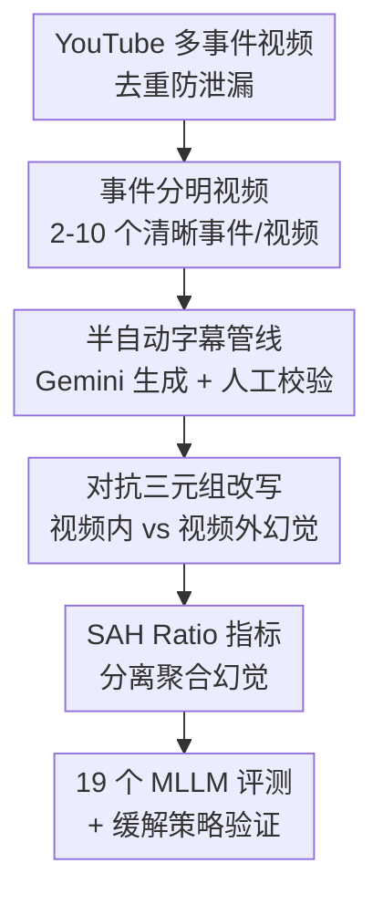

# ELV-Halluc: Benchmarking Semantic Aggregation Hallucinations in Video Understanding

**会议**: CVPR 2026  
**论文**: [CVF Open Access](https://openaccess.thecvf.com/content/CVPR2026/html/Lu_ELV-Halluc_Benchmarking_Semantic_Aggregation_Hallucinations_in_Video_Understanding_CVPR_2026_paper.html)  
**代码**: https://github.com/hlsv02/ELV-Halluc  
**领域**: 视频理解 / 多模态VLM  
**关键词**: 视频幻觉, 语义聚合幻觉, 评测基准, 对抗式问答, DPO  

## 一句话总结
本文提出"语义聚合幻觉（SAH）"这一被忽视的视频幻觉类型——模型每一帧都看对了，却在跨事件聚合时把语义张冠李戴——并构建首个针对它的基准 ELV-Halluc（348 个多事件视频、对抗三元组问答），系统评测 19 个 MLLM，证明 SAH 随语义复杂度上升，并用改进位置编码 + 8K 对抗对 DPO 把 SAH Ratio 最多降 27.7%。

## 研究背景与动机

**领域现状**：视频幻觉（model 输出与视频内容不符甚至凭空捏造）是 Video-MLLM 落地的核心障碍。已有大量工作（VideoHallucer、EventHallusion、VidHalluc、ARGUS 等）尝试度量它，并把成因归结为三类：视觉-语言错位、帧质量/采样不佳，以及模型过度依赖语言先验。

**现有痛点**：这三类解释有一个共同盲区——它们都假设错误发生在"感知帧级语义"这一步。但还存在另一种情况：**每一帧的语义都被正确感知了，模型却在把帧级语义聚合成事件级解读时出错**。比如一段新闻视频里，主持人在第一条新闻里拿着"纸"，"星巴克"其实出现在后面某条新闻里，模型却把"星巴克"安到了第一条新闻的画面上。所有视觉元素都看对了，错的是跨时间段的语义归属。

**核心矛盾**：现有基准几乎都用**短视频、单一自包含事件**，这种设定下帧级内容直接对应一个事件，聚合几乎不会出错，所以这类幻觉天然稀少、从未被单独度量。但真实的长视频、多事件、语义快速切换场景恰恰是聚合最容易崩的地方——已有基准与真实难点错位。

**本文目标**：(1) 给这种被忽视的幻觉正式命名并定义可量化的指标；(2) 造一个能稳定诱发并精细测量它的基准；(3) 给出有效的缓解手段。

**切入角度**：作者把视频幻觉重新放到"语义聚合"视角下审视，提出 **Semantic Aggregation Hallucination（SAH）**——正确感知的帧级语义在聚合成事件级输出时被错误重组。关键观察是：要把 SAH 从"看错了"的普通幻觉中**剥离出来**，必须设计能区分"内容确实在视频里但归属错了（SAH）"和"内容根本不在视频里（普通幻觉）"的探针。

**核心 idea**：用"事件分明"的多事件视频 + **对抗三元组问答（真值 / 视频内幻觉 / 视频外幻觉）**，用视频内与视频外两种幻觉的准确率差，把 SAH 单独量化出来。

## 方法详解

ELV-Halluc 是一个**评测基准**，方法核心是"如何构造一个能稳定诱发并干净度量 SAH 的数据集与评测协议"。下面按数据采集 → 半自动标注 → 对抗问答构造 → 评测指标四步讲清。

### 整体框架

整条管线的目标：拿到一批多事件视频，先得到高质量的"事件级真值字幕"，再在真值上做两种受控的幻觉改写，组合成对抗问答对，最后用一个能把 SAH 从普通幻觉中分离出来的指标来打分。输入是 YouTube 上手工收集的多事件视频，输出是 200 个测试视频、4800 条二元问答（可组成 3200 对对抗问答）+ 148 个训练视频。

最终基准规模相比已有工作有量级差异：ELV-Halluc 平均视频长 **681.8 秒**、每视频 **37.2 个问答**，而 VidHalluc 仅 24.7 秒 / 1.8 个、EventHallusion 仅 11.2 秒 / 1.7 个——长视频 + 高问答密度正是 SAH 得以暴露的前提。

### 关键设计

**1. 事件分明视频（Event-by-Event Video）：让语义复杂度可控、SAH 可被诱发**

SAH 难度量的根本原因是缺乏一个能稳定触发它的视频类型。作者定义"事件分明视频"——由多个**清晰分隔、共享同一主题**的事件组成（如一档含多条新闻的新闻播报）。这种结构有三个针对性好处：事件被切成独立语义单元，降低了字幕标注难度；同一视频的多个事件可以被"重组"成多个看似合理却错误的描述，**天然就是诱发 SAH 的土壤**；事件数还能直接当作"语义复杂度"的直观刻度。作者从 YouTube 手工收 500 个视频并剔除与 YouCook2 等重叠的样本防数据泄漏，再要求标注者为每个视频核心事件写一个关键词、只保留含 **2–10 个**可清晰区分事件的视频，最终留下 348 个。

**2. 半自动三阶段字幕管线：在保证事件级真值精度的同时压低标注成本**

要在 SAH 上做干净评测，前提是有逐事件、时间戳准确的真值字幕，但纯人工标注长视频代价极高。作者用"质检 → Gemini 生成 → 人工精修"三阶段：先让标注者给每个视频的核心事件写关键词并做质量复核；再用 **Gemini-2.5 Flash** 按标注的关键词分段、剔除转场/非核心片段、为每个事件产出详细字幕；最后由人工执行四类修正——纠正不准的时间区间、修事实错误、删冗余片段（开场/总结/转场）、补漏掉的事件并人工标注。这样得到 348 个带人工精修真值字幕的事件分明视频，精度有保证而人工量大幅下降。⚠️ 由于真值字幕用了 Gemini，作者明确提醒 Gemini-2.5 Flash 自身的评测指标不应与其他模型直接横比。

**3. 对抗三元组问答 + 视频内/视频外双改写：把 SAH 从普通幻觉中干净剥离**

这是全文最核心的度量设计。作者用 GPT-4o 在真值字幕上注入幻觉，专门针对四类语义粒度——**视觉细节**（颜色/形状/大小/纹理/空间关系/屏上文字 OCR）、**动作**、**物体**（人或实体）、**陈述内容**（"A 队领先""比赛很激烈"这类高层判断）。每次只改其中一个方面，并设计两种改写策略：

- **视频内改写（In-video）**：把真值里的某个物体替换成**同一视频里另一个事件中真实出现过**的物体。
- **视频外改写（Out-video）**：把它替换成**整个视频任何字幕里都没出现过**的虚构物体。

关键逻辑在于：如果模型被视频内幻觉骗了，所有幻觉类型（含 SAH）都可能是元凶；但如果模型被视频外幻觉骗了，由于该内容根本不在视频里，SAH 就**不可能**是原因。因此 $\text{In-video 误导率} - \text{Out-video 误导率}$ 就近似等于 SAH 的贡献。每个真值字幕配一条幻觉字幕组成问答对，并采用**严格判定**：只有当模型对真值问题答"Yes"、对幻觉问题答"No"时才算这对题做对。改写后得到 20072 条幻觉字幕，再用 GPT-4o 自动复检（视频内须确实引入了其他事件真值里的语义、视频外须引入所有真值都没有的语义、且改写后必须依然合理到"不看视频无法判断对错"），最终保留 8630 对幻觉字幕对。最终基准从 348 选 200 做测试集、148 做训练集，每视频选 24 条字幕构成二元问答，四个方面各 6 题（来自同一视频不同事件的 2 个三元组），共 4800 条二元问答 / 3200 对对抗问答。

**4. SAH Ratio 指标：用相对量而非绝对差，剥离模型整体能力的干扰**

光看"视频内准确率比视频外低多少"会被模型整体水平污染——强模型绝对差自然大。作者定义：

$$\text{SAH Ratio} = \frac{\text{OutAcc} - \text{InAcc}}{1 - \text{InAcc}}$$

其中 $\text{OutAcc}$、$\text{InAcc}$ 分别是视频外、视频内幻觉对的准确率。分子是两类幻觉的准确率差（SAH 的绝对贡献），分母 $1-\text{InAcc}$ 做归一化，使指标度量的是"在视频内幻觉的所有错误中，有多大比例归因于跨事件聚合错误"。这样既能更精确地反映 SAH 的**相对严重度**，又最小化了模型绝对性能水平的影响，便于针对性地设计缓解方案。

### 损失函数 / 训练策略

缓解侧用 **DPO（Direct Preference Optimization）**：用剩下 148 个视频构造正负样本对，模板为"请为 mm:ss-mm:ss 这段生成详细字幕。Chosen=真值字幕，Rejected=幻觉字幕"，分别造出 4k 视频内对、4k 视频外对。以 Qwen2.5-VL-7B 为基座，对比三种设置：仅视频内对、仅视频外对、两者合并 8k。

## 实验关键数据

评测覆盖 **17 个开源 MLLM（1B–78B）+ 2 个闭源（GPT-4o、Gemini-2.5 Flash）**。结果证实 SAH 普遍存在——绝大多数模型在视频内幻觉上的准确率显著低于视频外。

### 主实验（部分模型 Acc 与 SAH Ratio）

| 模型 | 规模 | Acc↑ | SAH-Ratio↓ |
|------|------|------|------------|
| InternVL3-1B | <4B | 9.94 | 1.68 |
| Qwen2.5-VL-3B | <4B | 7.40 | 4.59 |
| Qwen2.5-VL-7B | 7B | 18.18 | 8.88 |
| Qwen3-VL-8B | 7B | 23.59 | 2.34 |
| **Qwen2.5-VL-32B** | 32B | 17.73 | **0.18**（开源最低） |
| Qwen2.5-VL-72B | 72B | 32.01 | 5.89 |
| InternVL3-78B | 78B | 29.39 | 5.41 |
| GPT-4o | 闭源 | 8.70 | 1.04 |
| Gemini-2.5 Flash | 闭源 | 53.09 | 9.78 ⚠️ 含标注偏置勿直接横比 |

整体准确率普遍很低（最高的 Gemini 也仅 53%，多数开源模型个位数到 30%），说明当前 SOTA 在多事件视频幻觉上仍远未解决。

### 缓解实验：位置编码 + DPO

RoPE 变体对比（基于 Qwen2-VL）：

| 位置编码 | In.↑ | Out.↑ | SAH Ratio↓ |
|----------|------|-------|-----------|
| Vanilla-RoPE | 0.94 | 2.75 | 1.82 |
| TAD-RoPE | 0.44 | 2.62 | 2.18 |
| M-RoPE | 1.12 | 2.06 | 0.95 |
| **Video-RoPE** | 1.19 | 2.06 | **0.88** |

DPO 缓解（基座 Qwen2.5-VL-7B）：

| 设置 | ELV Acc↑ | ELV SAH Ratio↓ | VideoMME Avg↑ |
|------|----------|----------------|---------------|
| Qwen2.5-VL-7B | 15.9 | 8.3 | 61.9 |
| + invideo-4k | 16.2 | **6.0 (-27.7%)** | 62.3 |
| + outvideo-4k | 16.0 | 8.6 (+3.6%) | 62.8 |
| + together-8k | 16.4 | 8.4 (+1.2%) | 62.4 |

### 关键发现
- **SAH 随语义复杂度上升**：Qwen2.5-VL-3B/72B、InternVL3-14B、Gemini 等不同尺寸/家族模型，SAH Ratio 都与事件数正相关；而与视频时长无一致关系（本基准里时长不必然对应更多事件）。
- **语义变化越快越易 SAH**：四个方面里视觉细节变化最快、SAH 最高，其次物体、动作，陈述内容变化最慢、SAH 最低。
- **SAH 趋势可与整体幻觉相反**：帧数增多时整体幻觉准确率上升（信息更全），但 SAH Ratio 多数反而上升（语义更复杂、更易错配）——这正是 SAH 必须被单独度量的实证理由。
- **模型越大≠SAH 越低**：大模型整体鲁棒性更好，但模型容量与 SAH Ratio 无一致相关。
- **RL 后训练能压 SAH**：Qwen2.5-VL-32B 异常低的 SAH 疑因其特殊 RL 后训练；Qwen3-VL 的 Thinking 变体在各尺寸上 SAH 都显著低于 Instruct，且在推理过程中能"自我纠正"时间错配。
- **视频内 DPO 是关键**：仅视频内对的 DPO 把 SAH 从 8.3 降到 6.0（-27.7%）且 VideoMME 还涨 0.4；而视频外对反而把 SAH 抬到 8.6——优化"拒绝完全无关内容"会把模型推向更依赖语言先验。注意力可视化显示视频内 DPO 后，模型对"语义合理但错误"区域的注意力显著下降。

## 亮点与洞察
- **重新切分了幻觉的成因空间**：以往把幻觉归为"看错/语言先验"，本文指出还有"看对了但聚合错了"这一独立维度，并给出可操作的剥离方法——这个视角本身就有迁移价值。
- **"视频内 vs 视频外"双改写是极巧的探针**：用"内容是否真存在于视频"这个二分，把 SAH 与普通幻觉在度量上干净切开，而不需要昂贵的逐帧因果标注。
- **SAH Ratio 的归一化设计**：用 $1-\text{InAcc}$ 做分母，把"绝对幻觉量"与"聚合错误占比"解耦，使弱模型与强模型可比——这种"相对化"思路可复用到其他需要剥离基线能力的诊断指标。
- **诊断与缓解闭环**：基准不仅发现问题，还顺势用同一批数据造 DPO 偏好对，证明视频内偏好对齐能改 SAH——benchmark 自带训练集是难得的完整性。

## 局限性 / 可改进方向
- **视频类型偏窄**：事件分明视频（新闻/体育等）是为诱发 SAH 而精选的，与"事件交织、边界模糊"的真实长视频仍有差距，结论的外推性待验证。
- **依赖大模型做标注/改写**：真值字幕用 Gemini、幻觉改写与复检用 GPT-4o，作者已承认 Gemini 自身指标不可横比，但 GPT-4o 改写引入的系统性偏好（哪类幻觉更易被造出）也可能影响四方面的相对结论。
- **缓解手段较轻**：位置编码与 DPO 都是已有技术的应用，27.7% 的下降虽显著但 SAH Ratio 仍非零；⚠️ 整体准确率绝对值极低（个位数居多），说明任务本身极难，缓解效果是否在更强基座上仍成立未充分检验。
- **SAH 近似的边界**：用"视频内误导率−视频外误导率"近似 SAH，假设两类改写难度相当；若视频内改写天然更"似真"，该差值会高估 SAH，作者未深入讨论这一假设的稳健性。

## 相关工作与启发
- **vs VideoHallucer / EventHallusion / VidHalluc / ARGUS**：它们主攻短视频、简单语义，把幻觉归为内在/外在、语言先验/视觉编码偏置、动态片段或开放式字幕；本文指出它们都缺对 SAH 的显式讨论，并用长视频 + 多事件 + 对抗三元组首次把 SAH 单独立项度量。
- **vs Video-MME / MVBench / LVBench / MLVU / EgoSchema**：这些通用视频理解基准覆盖多长度多能力，但把幻觉（尤其是跨事件语义错配的 SAH）这一可靠性维度基本留白；ELV-Halluc 专门补上这块。
- **vs VideoRoPE / M-RoPE 等位置编码工作**：本文不是提新 RoPE，而是把它们当作"增强帧-事件绑定"的缓解工具来对比，证明更强的时序位置编码（VideoRoPE）能降 SAH，但不必然降整体幻觉——给位置编码研究提供了一个新的诊断切面。

## 评分
- 新颖性: ⭐⭐⭐⭐⭐ 提出并命名了一个被忽视的独立幻觉维度（SAH），配套度量与探针设计原创且自洽。
- 实验充分度: ⭐⭐⭐⭐ 覆盖 19 个模型 + 多维分析（事件数/时长/帧数/粒度）+ 双路缓解验证，但缓解侧基座单一、绝对准确率偏低。
- 写作质量: ⭐⭐⭐⭐ 概念定义清晰、图表完整；个别表述与拼写略粗糙。
- 价值: ⭐⭐⭐⭐⭐ 首个 SAH 基准 + 自带训练集 + 可复用的相对化指标，对长视频幻觉研究有方向性意义。

<!-- RELATED:START -->

## 相关论文

- [\[CVPR 2026\] Understanding and Mitigating Hallucinations in Multimodal Chain-of-Thought Models](understanding_and_mitigating_hallucinations_in_multimodal_chain-of-thought_model.md)
- [\[CVPR 2026\] Unstitching the Chimera: Frame-Level Risk and Train-Free Mitigation for Video Hallucination](unstitching_the_chimera_frame-level_risk_and_train-free_mitigation_for_video_hal.md)
- [\[CVPR 2026\] SEASON: Mitigating Temporal Hallucination in Video Large Language Models via Self-Diagnostic Contrastive Decoding](season_mitigating_temporal_hallucination_in_video_large_language_models_via_self.md)
- [\[CVPR 2026\] Understanding the Role of Hallucination in Reinforcement Post-Training of Multimodal Reasoning Models](understanding_the_role_of_hallucination_in_reinforcement_post-training_of_multim.md)
- [\[ACL 2026\] Understanding New-Knowledge-Induced Factual Hallucinations in LLMs: Analysis and Interpretation](../../ACL2026/hallucination/understanding_new-knowledge-induced_factual_hallucinations_in_llms_analysis_and_.md)

<!-- RELATED:END -->
