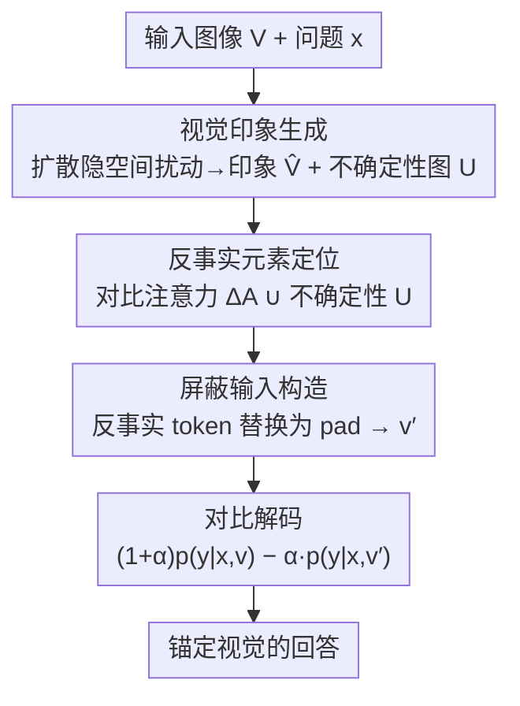

# Envision, Attend, Then Respond: Counterfactual Hallucination Mitigation in Large Vision-Language Models

**会议**: CVPR 2026  
**论文**: [CVF Open Access](https://openaccess.thecvf.com/content/CVPR2026/html/Liang_Envision_Attend_Then_Respond_Counterfactual_Hallucination_Mitigation_in_Large_Vision-Language_CVPR_2026_paper.html)  
**代码**: https://github.com/Lyxxx1211/CVPR2026-EnAR  
**领域**: 多模态VLM / 幻觉抑制  
**关键词**: 反事实幻觉, 对比解码, 扩散先验, 视觉印象, 训练无关  

## 一句话总结
EnAR 是一个训练无关框架，用扩散模型为输入图像生成一张"它本该长什么样"的视觉印象，再通过比对原图与印象的视觉注意力差异定位出违反常识的反事实元素（如五条腿的羊驼），把这些 token 屏蔽掉做对比解码，从而让 LVLM 把回答锚定在真实像素而非语言先验上——在反事实基准 VLMBias 上提升 10.82%、在通用幻觉 POPE 上平均提升 6.9%。

## 研究背景与动机
**领域现状**：大视觉语言模型（LVLM）把预训练视觉编码器对齐到 LLM 上，在描述、VQA、多模态对话里表现很强。但它们普遍会"幻觉"——生成的文字和真实视觉内容对不上。

**现有痛点**：现有抑制幻觉的方法分布在数据、编码、训练、解码四个层级，其中训练无关的解码层方法（VCD 加高斯噪声、RITUAL 旋转/裁剪图像、M3ID 对比纯文本输入、AGLA 屏蔽与提示无关区域、DeGF 用模型自述图像回灌验证）最实用。但这些方法只针对**广义幻觉**——它们假设幻觉来自模型"看漏了"或"看错了"普通物体。

**核心矛盾**：有一类幻觉它们处理不了——**反事实幻觉**（counterfactual hallucination）：当图像本身违反常识时（一只羊驼被画了五条腿、Adidas logo 被改了条纹），LLM 在网络规模预训练中积累的语言先验会**压过**视觉证据，模型不看图直接答"四条腿"。问题根本在于现有解码方法**无法在图像里定位出那个反常元素**——加噪、旋转、屏蔽都是全局或随机扰动，没有任何机制能指向"第五条腿在哪"。

**本文目标**：（1）造出一个能精确定位反事实元素的信号；（2）用这个定位去引导模型的注意力和解码，让它把判断建立在感知而非先验上；（3）整套方法不依赖训练、跨架构通用。

**切入角度**：作者从人的认知机制出发——人通过长期视觉经验形成"视觉印象"（visual impression），看到反常场景时，印象与实际场景产生**认知冲突**，注意力会自动转移到那个不一致的元素上去重新评估。能不能让模型也经历这个"先想象正常的样子、再对比找出反常处"的过程？

**核心 idea**：用扩散模型当作"现实世界视觉先验"，把输入图像编辑成一张"先验下它本该长成的样子"（视觉印象），再用原图与印象在视觉编码器里的**注意力差异**+扩散过程的**像素级不确定性**双信号定位反事实 token，最后对原始/屏蔽两路输入做对比解码。

## 方法详解

### 整体框架
EnAR（Envision-Attend-Respond）是一个完全训练无关的三阶段流水线，挂在任意现成 LVLM 上即用。给定一张图 $V$ 和问题 $x$：

- **Envision（想象）**：调用预训练扩散模型，对输入图像做隐空间扰动，生成一张"先验一致版"的视觉印象 $\hat V$，同时产出一张逐像素的不确定性图 $U$；
- **Attend（注意）**：把原图 $V$ 和印象 $\hat V$ 都送进 LVLM 的视觉编码器，比对两者的注意力分布得到对比注意力 $\Delta A$，再融合 $U$，定位出反事实 token 索引集 $H$，把这些 token 替换成 `<pad>` 得到第二路输入 $v'$；
- **Respond（回答）**：在原始输入 $v$ 和屏蔽输入 $v'$ 之间做对比解码，压制由反事实元素带来的偏置，输出锚定真实视觉的回答。

三阶段的关键在于："想象"提供了一个对照物（正常的样子），"注意"把对照物变成对原图的精确 token 级定位，"回答"用这个定位反向放大被语言先验淹没的视觉证据。

### 关键设计

**1. 视觉印象生成：用扩散先验把"反常处"拉回"正常该有的样子"**

这一步解决的是"模型没有对照物、不知道哪里反常"的痛点。作者把扩散模型当作编码了真实世界视觉先验 $p(V)$ 的生成器：扩散公式天然提供一个梯度场 $\nabla_V \log p(V)$，指向视觉上更"合理"的区域。具体做法（Algorithm 1）：先用 VAE 编码 $z_0=\mathrm{Encoder}(V)$，再用**确定性 DDIM** 前向把 $z_0$ 推到第 $T$ 步（总步数 $T_{\max}=50$，扰动施加在 $T=30$）——之所以用 DDIM 而非随机 DDPM，是因为印象必须能精确重建/受控修改，随机采样不可逆。

在 $z_T$ 上用**退火 Langevin 动力学**做局部扰动，把隐变量往高似然区域推：
$$z_T \leftarrow z_T + \rho \cdot G + \sqrt{2\rho\tau}\,\epsilon,\qquad G = \nabla_{z_T}\log p(z_T) \approx -\frac{\epsilon_\theta(z_T,T)}{\sqrt{1-\bar\alpha_T}}$$
其中梯度场 $G$ 用 Tweedie 估计器从去噪网络 $\epsilon_\theta$ 得到，步长 $\rho$ 从 $10^{-2}$ 退火到 $10^{-4}$、温度 $\tau=0.1$，做 $M=10$ 步。这个设置的巧妙在于：只在反常区域改、保留正常结构——因为 Langevin 把样本拉向先验高似然处，而正常区域本来就在高似然处不会动，只有"五条腿"这种低似然处会被拉回"四条腿"。扰动后用 DDIM 反向回 $\hat z_0$ 再解码成印象。

**2. 不确定性图：把"模型在哪里拿不准"也变成定位信号**

只有一张印象还不够稳。作者让扰动跑 $K$ 次得到 $K$ 张印象 $\{\hat V^{(k)}\}$，逐位置算方差构成不确定性图：$U_{i,j}=\mathrm{Var}(\{\hat V^{(k)}_{i,j}\}_K)$。直觉是：反事实元素正是扩散模型"反复纠结、每次生成都不一样"的地方，方差天然高。最终印象选偏离原图最大的那张 $\hat V=\hat V^{(k^\*)},\ k^\*=\arg\max_k \lVert \hat V - \hat V^{(k)}\rVert_2^2$——偏离最大意味着该印象最大程度地"修正"了反常处。消融显示去掉不确定性图三个骨干上 VLMBias 都掉 2 个点左右，它和注意力是互补信号。

**3. 反事实元素定位：注意力差 ∪ 不确定性，得到 token 级屏蔽**

有了对照物，怎么把它变成原图上的精确定位？作者比对原图和印象在视觉编码器**第 $L$ 层**的注意力（取 `<cls>` token 对各 patch 的注意力；Qwen-VL 这类无 `<cls>` 的就把每个 token 的入注意力求和再跨头平均），算逐元素绝对差：
$$\Delta A = \big|\,\mathrm{Attn}^{(L)}(V) - \mathrm{Attn}^{(L)}(\hat V)\,\big|$$
$\Delta A$ 越大说明该 token 越可能是反事实元素引起的注意力转移。取 $\Delta A$ 最高的 top-K% 索引成集合 $H_{\text{attn}}$，再把不确定性图里 top 5% 最不确定位置映射成 token 索引 $H_{\text{unc}}$，两者**并集** $H=H_{\text{attn}}\cup H_{\text{unc}}$ 得到最终反事实 token 集。把原始视觉嵌入 $v$ 里 $H$ 索引的 token 换成 `<pad>` 得屏蔽输入 $v'$，原始分支 $v$ 保持不动。这样 $v$ 与 $v'$ 之间只在反事实处有 token 级差异，构成了一个"精确到反常元素"的对比对——这正是 VCD 等全局扰动做不到的。实验里固定用第 6 层、屏蔽比例 10%。

**4. 对比解码：用屏蔽分支反向放大被先验压住的视觉证据**

最后沿用 VCD 的对比解码形式，把原始分支和屏蔽分支的 logits 相减：
$$p(y\,|\,x,v,v') = (1+\alpha)\,p(y\,|\,x,v) - \alpha\,p(y\,|\,x,v')$$
$\alpha$ 控制压制强度。机制上：屏蔽分支 $v'$ 把反事实元素抹掉了，于是 $p(y|x,v')$ 代表"看不到反常处时模型倾向答什么"（很大程度由语言先验主导，比如答"四条腿"）；用 $(1+\alpha)p(v)-\alpha\,p(v')$ 相减，恰好把"依赖先验才会出现的回答"的概率拉低、把"只有看到反常处才会出现的回答"放大，最终输出被推向真实视觉证据。

### 损失函数 / 训练策略
无训练。整套方法纯推理期插件：视觉印象用 Stable Diffusion v1.5 生成，对比解码超参沿用 VCD 配置，统一用视觉编码器第 6 层、屏蔽比 10%。

## 实验关键数据

### 主实验
在三个异构 LVLM（InternVL3.5-8B、Qwen2.5VL-7B、LLaVA-v1.5-7B）、五个基准上对比 Regular / VCD / M3ID / RITUAL / DeGF / AGLA。

VLMBias（反事实幻觉，整体准确率 %）：

| 骨干 | Regular | 最强 baseline | EnAR | 提升 |
|------|---------|---------------|------|------|
| InternVL3.5-8B | 19.83 | 23.76 (VCD) | **31.36** | +11.53 |
| Qwen2.5VL-7B | 22.63 | 24.78 (VCD) | **28.02** | +5.39 |
| LLaVA-v1.5-7B | 16.92 | 19.18 (VCD) | **22.20** | +5.28 |

WHOOPS / POPE（反事实 + 通用幻觉，节选）：

| 基准 / 骨干 | 指标 | Regular | EnAR | 提升 |
|-------------|------|---------|------|------|
| WHOOPS / InternVL3.5-8B | 平均 Acc | 62.45 | **74.15** | +11.70 |
| WHOOPS / Qwen2.5VL-7B | 平均 Acc | 49.34 | **62.30** | +12.96 |
| POPE-Random / LLaVA-v1.5-7B | F1 | 80.8 | **88.9** | +8.1 |
| POPE-Adversarial / LLaVA-v1.5-7B | F1 | 76.9 | **83.8** | +6.9 |

在 PhD（Counting 子集）和 HallusionBench 上 EnAR 也一致超过所有对手，且在 POPE 上保持精度-召回的平衡（不像有些方法靠拉高召回换 F1）。

### 消融实验
逐组件消融（VLMBias 整体 Acc / POPE 平均 F1）：

| 配置 | InternVL3.5-8B VLMBias | InternVL3.5-8B POPE-F1 | LLaVA-v1.5-7B VLMBias |
|------|------|------|------|
| EnAR 完整 | **31.36** | **89.0** | **22.20** |
| w/o 不确定性图 | 29.03 | 88.9 | 20.27 |
| w/o 视觉印象 | 25.80 | 88.5 | 17.78 |
| w/o ours (= Regular) | 19.83 | 88.2 | 16.92 |

### 关键发现
- **视觉印象是主力，不确定性图是有效补充**：去掉视觉印象（只剩原图不确定性定位）掉得最狠（InternVL 31.36→25.80），说明"先想象出正常样子再对比"这个对照物是定位反事实元素的核心；去掉不确定性图各骨干再掉约 2 个点，两者互补。
- **编码器层数有甜点**：用第 6 层附近的注意力效果最好。作者还在 HKU-IS 显著目标检测集上量化了不同层 top-K% token 区域与显著物体的 IoU，发现浅层注意力与真实物体区域对齐更好，这解释了为何取中浅层。
- **屏蔽比例**：固定 10% 的 padding 比例在 VLMBias/POPE/HallusionBench 上平均最优。
- **Chess Pieces 类全员零分**：所有方法在该类都是 0，作者归因于基线模型本身缺乏处理该类推理的能力，"没有可纠正的空间"——一个诚实的负面结果。

## 亮点与洞察
- **把"扩散模型"当作可查询的世界先验来用**：不是用它生成新图，而是用它"想象输入本该长什么样"，再用想象与现实的差异定位反常处——这个用法很巧，把生成模型的先验转成了判别式的定位信号。
- **双信号定位互为保险**：注意力差捕捉"模型注意力转移处"，不确定性图捕捉"扩散反复纠结处"，并集让定位更鲁棒，这套"注意力 ∪ 生成方差"的思路可迁移到任何需要无监督定位异常区域的任务（如异常检测、OOD 定位）。
- **完全训练无关 + 跨架构**：在三个不同视觉编码器结构（含有/无 `<cls>` token）上都生效，工程落地成本低，是该方向少见的"即插即用还专攻反事实"的方案。

## 局限与展望
- **推理成本高**：要跑 $K$ 次扩散扰动生成印象、再过两路视觉编码器和对比解码，作者把效率分析与降本方案放在附录 E，正文未给出具体延迟数字 ⚠️ 以原文为准——这是该框架最现实的落地瓶颈。
- **依赖扩散先验的覆盖范围**：视觉印象由 SD v1.5 生成，若反事实元素落在扩散先验本身就薄弱/有偏的域（罕见物体、抽象图形），"想象出的正常样子"可能不可靠，定位随之失准。Chess Pieces 全员零分也侧面反映：当基线模型连基本识别都做不到时，本框架无能为力。
- **超参对层数/屏蔽比敏感**：第 6 层、10% 是在这几个骨干上调出来的甜点，换骨干或换扩散模型是否仍最优需重新搜索。
- **改进思路**：印象生成可用更快的少步采样器（如 LCM/一步蒸馏）降本；不确定性图与注意力差的融合目前是硬并集，可学一个自适应权重。

## 相关工作与启发
- **vs VCD / RITUAL**：它们靠全局扰动（加噪 / 旋转裁剪）造对比对，本质是"让图变模糊/变形"再对比，无法指向具体反常元素；EnAR 用扩散印象 + 注意力差做**token 级精确定位**的屏蔽对比对，专门吃反事实场景。VCD 把 EnAR 视作"注入细粒度对比噪声"也能解释它在通用 POPE 上同样有效。
- **vs DeGF**：DeGF 用模型自述文本回灌生成图来验证一致性，依赖模型自己的描述（可能本就幻觉）；EnAR 的印象直接由扩散先验生成、不经过 LLM 文本，避免了"用幻觉验证幻觉"。
- **vs AGLA**：AGLA 屏蔽"与提示无关"的区域，是基于文本相关性的；EnAR 屏蔽的是"与世界先验冲突"的区域，定位依据完全不同，因此能抓住 AGLA 抓不住的反事实元素。

## 评分
- 新颖性: ⭐⭐⭐⭐⭐ 把扩散先验转成反事实定位信号、专攻被忽视的反事实幻觉，角度新颖
- 实验充分度: ⭐⭐⭐⭐⭐ 三骨干×五基准全面对比 + 组件/层数/屏蔽比消融，诚实报告零分负例
- 写作质量: ⭐⭐⭐⭐ 认知动机讲得清晰、三阶段逻辑顺，但效率数据藏在附录略影响完整性
- 价值: ⭐⭐⭐⭐ 训练无关即插即用、跨架构通用，落地价值高，主要受推理成本掣肘

<!-- RELATED:START -->

## 相关论文

- [\[CVPR 2026\] First Logit Boosting: Visual Grounding Method to Mitigate Object Hallucination in Large Vision-Language Models](first_logit_boosting_visual_grounding_method_to_mitigate_object_hallucination_in.md)
- [\[CVPR 2026\] CausalLens: Sensitivity-Guided Multi-Head Causal Intervention for Hallucination Mitigation in Large Vision-Language Models](causallens_sensitivity-guided_multi-head_causal_intervention_for_hallucination_m.md)
- [\[CVPR 2026\] SEASON: Mitigating Temporal Hallucination in Video Large Language Models via Self-Diagnostic Contrastive Decoding](season_mitigating_temporal_hallucination_in_video_large_language_models_via_self.md)
- [\[CVPR 2026\] Locate-then-Sparsify: Attribution Guided Sparse Strategy for Visual Hallucination Mitigation](locate-then-sparsify_attribution_guided_sparse_strategy_for_visual_hallucination.md)
- [\[CVPR 2026\] HulluEdit: Single-Pass Evidence-Consistent Subspace Editing for Mitigating Hallucinations in Large Vision-Language Models](hulluedit_single-pass_evidence-consistent_subspace_editing_for_mitigating_halluc.md)

<!-- RELATED:END -->
