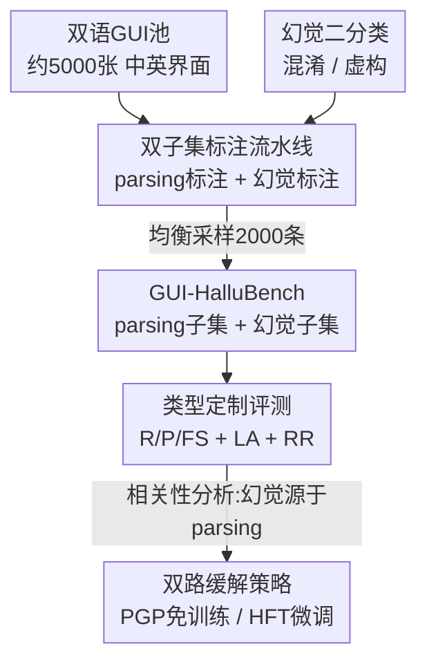

# Evaluating and Easing Hallucinations for GUI Grounding

**会议**: CVPR 2026  
**论文**: [CVF Open Access](https://openaccess.thecvf.com/content/CVPR2026/html/Zhang_Exposing_and_Evaluating_Hallucinations_for_GUI_Grounding_CVPR_2026_paper.html)  
**代码**: https://github.com/aibench/GUI-HalluBench  
**领域**: 多模态VLM / GUI Agent / 幻觉评测  
**关键词**: GUI grounding, 幻觉评测, 多模态大模型, benchmark, 双语  

## 一句话总结
本文首次系统研究 GUI grounding 中的幻觉问题，把它拆成"认错相似元素"的混淆幻觉和"凭空捏造坐标"的虚构幻觉，构建了双语、双子集的 GUI-HalluBench 来诊断幻觉与 parsing 能力的关联，并给出一个免训练的"先解析后定位"提示（PGP）和一个基于幻觉数据微调（HFT）的缓解方案，实验证明 parsing 越强幻觉越少、HFT 最高带来约 7% 的绝对提升。

## 研究背景与动机

**领域现状**：大型多模态模型（LMM）正被大量部署到 GUI 自动化、智能助手、交互式 agent 中。GUI 交互有两个核心能力：parsing（识别并归类界面里的按钮、图标、文本框等元素）和 grounding（把用户指令映射到具体元素的坐标）。围绕这两件事，社区已经做了 ScreenSpot、ScreenSpot-Pro、MMBench-GUI、Mind2Web 等一系列 benchmark。

**现有痛点**：这些 benchmark 几乎都在比拼"综合能力"——能不能看懂界面、跟随指令、完成任务，却基本忽略了**可靠性**，尤其是幻觉。在自然图像领域幻觉已经被 POPE、HallusionBench 等研究得比较透，但它们关注的是"看错物体 / 图文不一致"，放到结构化的 GUI 里完全不适用。GUI 里的幻觉是另一种形态：模型会**自信地输出错误或捏造的目标坐标**，直接破坏真实交互中的可信度。

**核心矛盾**：grounding 作为 GUI 交互的核心能力，恰恰最容易幻觉，但没有任何 benchmark 专门去分析它、找它的根因。作者从经验观察发现，grounding 幻觉并非孤立现象，而是和 parsing 缺陷强相关——模型连界面结构都没看清，自然要么认错相似元素，要么凭空想象不存在的元素。

**本文目标**：拆成三个子问题——① 把 GUI grounding 幻觉**分类**清楚；② 造一个能**同时测 parsing 与幻觉、并分析二者关联**的 benchmark；③ 给出**低成本到高成本**的缓解手段。

**切入角度**：既然幻觉源于 parsing 缺陷，那就把 parsing 和幻觉放进同一个 benchmark 的两个互补子集里同时评测，用相关性分析坐实"parsing 差 → 幻觉多"这条因果链，再顺着这条链去缓解。

**核心 idea**：把 GUI grounding 幻觉二分为**混淆幻觉**与**虚构幻觉**，用"parsing 子集 + 幻觉子集"的双语诊断基准暴露其根因（parsing 缺陷），并用"先解析后定位"的提示与幻觉感知微调来对症下药。

## 方法详解

### 整体框架

这是一篇 benchmark + 分析 + 缓解三位一体的工作，核心不在于提出新模型，而在于把"GUI grounding 为什么会幻觉、怎么测、怎么缓解"这条链路打通。整体分四块：先定义两类幻觉作为标注与评测的靶子；再从约 5000 张双语界面出发，经过一条"自动检测 + 人工复核"的双阶段标注流水线，均衡采样出 2000 条（中英各 1000）同时带 parsing 标注与幻觉标注的基准；然后对每类幻觉设计专属指标，在 13+ 个 SOTA 模型上跑评测并做相关性分析，确认幻觉与 parsing 强相关；最后给出免训练的 PGP 提示和需训练的 HFT 微调两条缓解路径。

### 关键设计

**1. 幻觉二分类：把 GUI grounding 的失败模式讲清楚**

作者首先回答"GUI grounding 到底怎么幻觉"这个此前没人系统回答的问题，给出两类失败模式。**混淆幻觉（Confusion Hallucination）**指目标元素确实存在，但模型因为语义理解模糊或视觉高度相似而选错了"干扰元素"——比如把长得像相机的图标当成相机 app，把"乒乓球"图标当成"网球"。**虚构幻觉（Fabricated Hallucination）**指界面里根本没有目标元素，模型却"想象"出一个并给出看似合理的坐标——比如在日历里凭空定位"11 月 17 日"，或为不存在的"PowerPoint 图标""购买 iPhone 17 Pro Max 图标"输出 bounding box。这个二分法不是文字游戏，它直接决定了后面两类样本怎么造、两类指标怎么设：混淆幻觉要测"在有干扰项时能不能选对"，虚构幻觉要测"该拒绝时能不能拒绝"。在最终基准里两类约为 40% 混淆、60% 虚构，反映出真实场景中虚构更高发。

**2. 双子集标注流水线：让 parsing 与幻觉在同一基准里可联合诊断**

为了能把"幻觉"和"parsing 缺陷"放在一起比对，benchmark 被设计成两个互补子集——**parsing 子集**测模型对界面元素结构的识别（输出所有图标/文本的语义 + 坐标），**幻觉子集**在挑战性条件下测 grounding 鲁棒性。数据来自双语 GUI 池：英文界面取自 ScreenSpot 与 AMEX，中文界面按国内热门 app 的统计手工采集日常生活、出行、医疗、餐饮、娱乐五大领域，共约 5000 张。标注分两阶段：**parsing 标注**先用 Grounding DINO 检测图标 bounding box、PaddleOCR 识别关联文本，经 NMS 去冗余，再由一个 LMM 模块统一格式并做语义验证，最后人工复核；**幻觉标注**先用 LMM 过滤出"适合改造成幻觉案例"的界面，再让 LMM 联合界面与 parsing 标注生成混淆/虚构幻觉建议，最后由**至少 3 名标注员**审核定稿。两阶段共享同一批界面，使得"某模型 parsing 错在哪 → 幻觉发生在哪"可被对齐分析。最后按冗余度与信息密度做均衡采样，得到中英各 1000、共 2000 条的子集，每条都同时带 parsing 与幻觉标注。

**3. 类型定制评测指标：不同幻觉用不同的"对/错"定义**

parsing 与两类幻觉的失败形态不同，作者为它们各设指标而非套一个统一分数。parsing 侧用三个指标：元素召回 $R = N_m / N_{gt}$（$N_m$ 为与真值匹配即 IoU $\geq 0.5$ 的预测框数，$N_{gt}$ 为真值元素总数）、元素精度 $P = N_m / N_{pr}$（$N_{pr}$ 为预测框总数），以及衡量语义忠实度的函数相似度 $FS = \frac{1}{N_m}\sum_{i=1}^{N_m}\mathrm{sim}(f_i^{pred}, f_i^{gt})$，其中 $\mathrm{sim}$ 是预测与真值功能描述文本嵌入的余弦相似度。幻觉侧按类型分别定义：**混淆幻觉用定位准确率** $LA = N_{cor} / N_{tot}$（在有干扰项时选对的比例），**虚构幻觉用拒识率** $RR = N_{rej} / N_{fab}$（对不存在元素成功拒绝识别的比例，$N_{fab}$ 为虚构案例总数）。拒识率这个指标是关键——它把"该说没有时能不能说没有"量化成了硬指标，正是虚构幻觉鲁棒性的核心。

**4. 双路缓解策略：免训练的 PGP 与需训练的 HFT**

确认"幻觉源于不完整的结构感知 + 推理不一致"后，作者从推理时和训练时两条路缓解。**PGP（Parsing-guided Prompt，免训练）**把原本"直接定位某元素"的指令改写成单轮内的"先解析后定位"结构化提示：强制模型先枚举界面上所有图标/文本及其语义坐标，再基于这份解析结果输出目标坐标。它不改一个参数，只靠提示工程把隐式的"看清界面"这一步显式化。**HFT（Hallucination-aware Fine-Tuning，需训练）**则用幻觉数据做监督微调：为防数据泄漏，单独采集与 GUI-HalluBench 来源完全隔离的 20K 界面做 parsing 标注、再造 10K 幻觉标注（用单标注员快速剔除低质标签以兼顾规模），混入 WidgetCaption、Os-Atlas、GUIEnv、LLaVA-Instruct 等公开数据，对 Qwen3-VL-8B 与 InternVL3.5-8B 用 LoRA（rank 8、α 32、lr 1e-4、3 epoch、8×A100）微调，冻结 ViT 与 aligner。两条路成本递增、效果递增：PGP 零成本但提升温和，HFT 成本高但能把幻觉鲁棒性大幅拉起。

## 实验关键数据

### 主实验

在 GUI-HalluBench 上评测 13+ 个代表性模型，下表给出 parsing 平均分（A–F 综合）与幻觉平均分（混淆 LA + 虚构 RR 综合）的代表性结果：

| 模型 | Parsing Avg (%) | Hallu Avg (%) | 备注 |
|------|------|------|------|
| GPT-4o (with grounding) | 20.2 | 57.2 | 闭源；元素精度仅 4.3%，杂乱界面下定位极弱 |
| Claude Computer Use | 37.7 | 56.6 | 闭源 |
| Gemini-2.0 (Project Mariner) | 41.6 | 60.5 | 闭源中最佳 |
| InternVL3.5-8B | 55.7 | 63.2 | 开源 |
| GUI-Owl-7B | 55.4 | 64.9 | 开源 GUI 专用 |
| Qwen3-VL-8B | 58.1 | 66.0 | 开源中最佳（基线） |
| InternVL3.5-8B (HFT) | 71.9 | 69.1 | 本文微调 |
| **Qwen3-VL-8B (HFT)** | **72.3** | **73.0** | 本文最佳 |

一个反直觉的结论：闭源模型尽管通用推理更强，但在 GUI 的 parsing 与幻觉两个子任务上**都没领先**，说明强通用多模态推理并不直接等于可靠的 GUI 理解，后者需要领域适配的结构感知与细粒度定位。

### 缓解策略消融

下表对比基线 / PGP / HFT 在两个开源模型上的效果：

| 配置 | Parsing Avg (%) | Hallu Avg (%) | 说明 |
|------|------|------|------|
| Qwen3-VL-8B 基线 | 58.1 | 66.0 | — |
| Qwen3-VL-8B + PGP | 58.1 | 67.7 | 免训练，parsing 不变、幻觉 +1.7 |
| Qwen3-VL-8B + HFT | 72.3 | **73.0** | 微调，幻觉 +7.0 |
| InternVL3.5-8B 基线 | 55.7 | 63.2 | — |
| InternVL3.5-8B + PGP | 55.7 | 64.8 | 幻觉 +1.6 |
| InternVL3.5-8B + HFT | 71.9 | 69.1 | 幻觉 +5.9 |

### 关键发现

- **幻觉与 parsing 强相关**：用 SRCC 相关性热图分析 12 个指标，发现 parsing 平均性能（L）与幻觉平均性能（G）强相关——parsing 的元素精度/召回越高，抗幻觉越强，坐实了"grounding 幻觉源于 parsing 缺陷"的核心论点。而函数相似度（C、F）与幻觉指标相关性弱，因为它测的是匹配框的语义对齐，与幻觉所依赖的"元素检测 + 上下文推理"是不同的底层能力。
- **PGP 提升温和但零成本**：PGP 不改 parsing 分数（提示不增强解析本身的准确率），却通过"先解析后定位"的推理顺序让模型决策更稳，对英文/中文的拒识率（I、K）提升最明显，因为更准的元素识别减少了导致幻觉的错误。
- **HFT 提升显著且跨语言泛化**：HFT 把 Qwen3-VL-8B 平均准确率从 66.0% 拉到 73.0%（约 +7%），且一旦结构感知被强化，幻觉抑制能跨语言迁移——说明幻觉模拟数据是有效的数据增强工具。
- **双语不一致**：所有模型都存在中英性能差，且 parsing 子任务的差距明显大于幻觉子任务（结构感知更依赖语言相关线索如内嵌文本、OCR 噪声；幻觉鲁棒性更依赖相对语言无关的视觉推理与拒识）。英文公司的模型（GPT-4o、Claude）在英文界面更强，中文公司的模型（Qwen3-VL、InternVL）相反，暴露出训练语料的语言文化偏置。

## 亮点与洞察

- **把"幻觉"在 GUI 这个结构化域里重新定义**：自然图像的幻觉范式搬不过来，作者用"混淆 / 虚构"二分法精准刻画了 GUI grounding 的两种失败，且让每种失败都有对应的样本构造与评测指标，这是整个工作能成立的地基。
- **拒识率（RR）是被低估的好指标**：把"该拒绝时能不能拒绝"量化出来，正中虚构幻觉要害——很多 grounding benchmark 默认目标一定存在，从不测模型"说没有"的能力，而真实 GUI 里目标缺失非常常见。
- **用相关性分析把"诊断"做实**：不止报告各模型分数，还用 SRCC 把 parsing 与幻觉的因果关系量化出来，让"提升 parsing 就能降幻觉"从直觉变成可验证的结论，进而直接指导了 PGP/HFT 的设计方向。
- **PGP 的迁移性**："先解析后定位"这种把隐式中间步骤显式化的提示思路，可迁移到其他需要先感知结构再决策的任务（如表格问答、图表理解），零成本就能换取鲁棒性。

## 局限与展望

- **parsing 标注依赖自动检测器**：parsing 真值由 Grounding DINO + PaddleOCR + LMM 验证生成，虽有人工复核，但检测器本身在小图标、密集界面上的漏检/误检可能给"真值"引入系统性偏差，进而影响 IoU≥0.5 的匹配判定。⚠️ 论文未给出人工复核改动比例。
- **幻觉样本部分由 LMM 生成**：幻觉建议由 LMM 模拟产生再经人工审核，HFT 的 10K 幻觉数据更是用"单标注员剔除低质"来换规模，标签质量与多样性可能不如全人工标注，存在 LMM 生成偏好被放大的风险。
- **PGP 收益有限**：免训练路线的幻觉提升仅 1–2 个百分点，且不改善 parsing 本身；真正大幅缓解仍需 HFT 这种高成本路线，对无法微调的闭源大模型实用性受限。
- **评测仍是静态单步 grounding**：基准聚焦单张界面的元素定位幻觉，未覆盖多步导航、动态界面下幻觉的累积传播，而后者才是 agent 落地最关心的场景。

## 相关工作与启发

- **vs 自然图像幻觉基准（POPE / HallusionBench / MMHal-Bench）**：它们在自然图像上测物体/关系/指令幻觉，幻觉表现为视觉误识或图文不一致；本文把战场搬到结构化 GUI，幻觉表现为功能混淆与界面元素捏造，并首次引入 parsing 子集做根因诊断与双语覆盖。
- **vs GUI grounding 基准（ScreenSpot / ScreenSpot-Pro / MMBench-GUI-L2）**：它们测综合定位/指代能力，默认目标存在、只看定位准不准；本文新增"拒识"维度，专门暴露与量化幻觉，把评测从"能力"扩展到"可靠性"。
- **vs GUI LMM 方法（SeeClick / Ferret-UI / UI-TARS / OmniParser）**：这些工作聚合多平台数据微调以提升 grounding/navigation 能力；本文不比拼能力上限，而是诊断它们共有的幻觉短板，并指出"强化 parsing"是降幻觉的可操作杠杆，HFT 正是沿这条杠杆做的数据增强。

## 评分
- 新颖性: ⭐⭐⭐⭐⭐ 首个系统研究 GUI grounding 幻觉、首创混淆/虚构二分法与拒识率指标
- 实验充分度: ⭐⭐⭐⭐ 覆盖 13+ SOTA 模型、双语、含相关性分析与两路缓解消融，但缺多步导航场景
- 写作质量: ⭐⭐⭐⭐ 诊断→根因→缓解逻辑清晰，指标定义完整；部分附录细节未在正文展开
- 价值: ⭐⭐⭐⭐⭐ 为 GUI agent 可靠性提供了可复用的诊断基准与可操作的缓解杠杆

<!-- RELATED:START -->

## 相关论文

- [\[CVPR 2026\] HalluGen: Synthesizing Realistic and Controllable Hallucinations for Evaluating Image Restoration](hallugen_synthesizing_realistic_and_controllable_hallucinations_for_evaluating_i.md)
- [\[CVPR 2026\] TriDF: Evaluating Perception, Detection, and Hallucination for Interpretable DeepFake Detection](tridf_evaluating_perception_detection_and_hallucination_for_interpretable_deepfa.md)
- [\[CVPR 2026\] Beyond the Global Scores: Fine-Grained Token Grounding as a Robust Detector of LVLM Hallucinations](beyond_global_scores_fine_grained_token_grounding_as_robust_detector_of_lvlm_hallucinations.md)
- [\[ACL 2026\] FinGround: Detecting and Grounding Financial Hallucinations via Atomic Claim Verification](../../ACL2026/hallucination/finground_detecting_and_grounding_financial_hallucinations_via_atomic_claim_veri.md)
- [\[CVPR 2026\] First Logit Boosting: Visual Grounding Method to Mitigate Object Hallucination in Large Vision-Language Models](first_logit_boosting_visual_grounding_method_to_mitigate_object_hallucination_in.md)

<!-- RELATED:END -->
