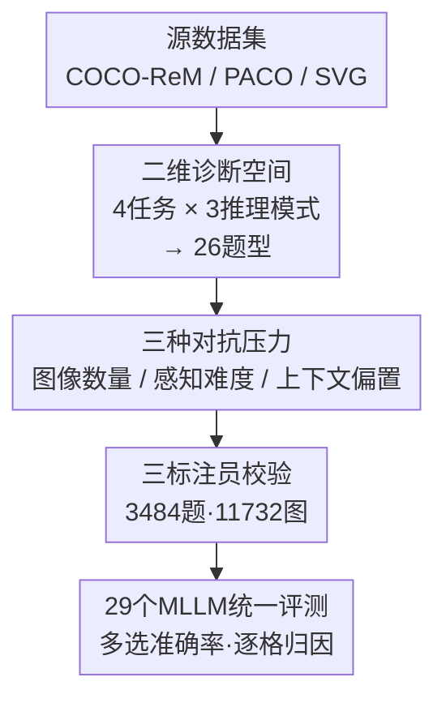

# Fine-Grained Multi-Image Object Hallucination Benchmark

**会议**: CVPR 2026  
**论文**: [CVF Open Access](https://openaccess.thecvf.com/content/CVPR2026/html/Min_Fine-Grained_Multi_Image_Object_Hallucination_Benchmark_CVPR_2026_paper.html)  
**代码**: 待确认  
**领域**: 多模态VLM / 幻觉评测  
**关键词**: 物体幻觉, 多图推理, 评测基准, 对抗压力, MLLM诊断

## 一句话总结
MIOH 是首个面向**多图场景**的细粒度物体幻觉诊断基准，把"4 类物体任务 × 3 种多图推理模式"交叉出 26 种题型，再叠加"图像数量 / 感知难度 / 上下文偏置"三种可控对抗压力，对 29 个模型评测后发现即便 GPT-5、Gemini-2.5-Pro 的整体准确率也分别只有 63.1% / 64.4%，全场平均仅 36.1%，并定位出幻觉主要来自**跨图整合阶段**而非单纯感知失败。

## 研究背景与动机

**领域现状**：多模态大模型（MLLM）越来越多被用在多图场景——看一组图做对比、检索、汇总。但它们仍受**物体幻觉**困扰：生成听上去合理、实则与图像不符的物体描述。已有的物体幻觉基准（POPE 一类）几乎都是**单图 + 二元问题**，集中在"存在性 / 计数"两类任务。

**现有痛点**：单图基准没法揭示"视觉难度因素如何系统性地诱发幻觉"，也评不了多图特有的推理模式和组合能力（属性绑定、空间关系）。另一边的通用多图基准（如 Mantis-Eval 一类）虽然测了跨图推理，却缺乏对视觉因素的**可控操纵**，无法专门诊断幻觉。最接近的 MIHBench 也只把"图像数量"当作消融里的单一对抗因子，没系统地改变视觉难度，也不区分推理模式。

**核心矛盾**：多图把幻觉沿**两条独立轴**放大——① **感知失败**（小目标、遮挡、误导性共现场景）；② **信息整合失败**（要把跨图信息汇总 / 对比 / 检索）。现有基准把这两条轴混在一起，导致"模型到底是看不清，还是整合不动"无法分离诊断。

**本文目标**：造一个能**分离这两条轴**的细粒度诊断空间——既能问"哪种视觉条件触发感知错误"，又能问"哪种整合需求最脆弱"。

**切入角度**：把评测拆成正交的三层——推理模式（怎么整合）× 物体任务（看什么）× 对抗压力（多难），每一格只改变一个变量，从而把失败模式逐一隔离出来。

**核心 idea**：用"推理模式 × 物体任务 × 对抗压力"的**受控笛卡尔积**，把多图物体幻觉变成一个可逐格归因的诊断矩阵。

## 方法详解

### 整体框架

MIOH 不是一个新模型，而是一个**评测基准**，核心产出是 3,484 道多图选择题（覆盖 11,732 张图）以及对应的评测协议。它的设计骨架是两个互补维度的交叉：

1. **多图推理模式**（探测不同的整合能力）：Comprehensive（汇总全集）、Comparative（两图找差异）、Selective（检索符合条件的某张图）；
2. **物体任务**（探测看什么）：Existence（存在）、Counting（计数）、Attribute（属性绑定，如"红色的车"）、Position（空间关系，如"猫旁边的狗"）。

四类任务 × 三种推理模式经过人工筛选，落成 **26 种题型**（并非 12 格——计数等任务在某种模式下会自然衍生多个变体，而部分组合无意义被剔除）。在此之上再叠加三种**对抗压力**生成难/易样本，最后用统一的多选题格式 + 准确率评测 29 个模型。整条构造流水线如下：

### 关键设计

**1. 二维诊断空间：推理模式 × 物体任务的受控笛卡尔积**

针对"现有基准只问存在/计数、且把感知和整合混在一起"的痛点，MIOH 把"看什么"和"怎么整合"拆成正交两维。三种推理模式各自压在模型不同的整合机制上：Comprehensive 问"任意一张图里有斑马吗""所有图里车的总数"，考的是把分散信息维护成**统一表征**的能力；Comparative 问"哪张图车更多""哪个物体只在图 1 不在图 2"，要求**为不同场景维护分离表征**并精确跨图比对；Selective 问"哪张图恰好有 3 只斑马"，考的是**目标检索 + 过滤干扰**。

这套设计的诊断价值在于：三种模式不是问法换皮，而是探测不同失败模式。**所有模式齐刷刷失败 → 根因在物体识别（感知失败）；Selective 崩而 Comprehensive 还行 → 根因是检索/定位这一整合环节出问题**。把这维与四类物体任务交叉，就能从"基础检测"一路升到"细粒度属性绑定"，定位到底是哪种能力在幻觉压力下断裂。实验也正是靠这个矩阵发现 Selective 平均仅 34.2%、Selective×Attribute 低到 26.7%——即模型知道"某个属性-物体对存在于图集中"，却答不出"具体在哪张图"，是一种多图特有的 grounding 失败。

**2. 三种可控对抗压力：把视觉难度做成可调旋钮**

针对"现有基准无法系统改变视觉难度"的痛点，MIOH 设计了三个互不重叠、各打一种失败机制的对抗因子：

- **视觉上下文规模（Number of Images, NI）**：对同一道题把输入图数在 $\{2,4,8,10\}$ 间系统变化，灵感来自"视觉草堆"（Visual Haystack）问题——图越多，模型越难在扩大的视觉上下文里维护准确的物体表征，直接压**整合容量**。
- **感知难度（Hard Positive, HP）**：专挑小目标/遮挡目标。用两条互补途径构造——(a) 规则筛选：目标 bbox 小或遮挡率高的图；(b) CLIP 语义筛选：图与文本提示 "A photo of [object]" 的 CLIP 相似度异常低，说明感知上有歧义。这一压力测的是**特征提取**这一下游推理的前置必要条件。
- **上下文偏置（Hard Negative, HN）**：专造"语境上合理但视觉上不存在"的物体陷阱（如厨房场景激活"煎锅"先验导致假阳）。构造方式：(a) 从 COCO 训练集估共现概率 $P(\text{object}_A \mid \text{object}_B)$，选含高共现物体却**缺失目标**的图；(b) CLIP 语义混淆，找视觉-文本相似度高但目标实际缺席的图。它测的是模型**依赖语境捷径还是依赖视觉证据**。

三个旋钮的价值在于把"模型为什么错"做成可归因变量：NI 升高掉点 → 整合容量不足；HP 掉点 → 感知瓶颈；HN 掉点 → 被先验带偏。这正是把前面那条"感知 vs 整合"双轴落地为可测量的实验设计。

**3. 高质量数据来源与三重标注协议**

针对幻觉基准最大的隐患——标注噪声会让"幻觉"和"标注错误"混淆，MIOH 按任务**分数据集取标注最干净的来源**：Existence/Counting 用 COCO-ReM（修复了 COCO 掩码不全、实例缺失的重标注版），Attribute 用 PACO（跨类别的标准化属性标签），Position 用 SVG（场景级完整关系标注，避开 Visual Genome 平均每主语仅 1.5 条关系的稀疏问题）。所有题目经**三名独立标注员**校验，最终 3,484 题 / 11,732 图，在任务、推理模式、难度三个维度上保持平衡。这一步保证后续观察到的失败确实归因于模型幻觉，而非数据脏。

## 实验关键数据

### 主实验

29 个模型、temperature=0、四块 A6000 上评测。整体平均准确率仅 **36.1%**，专有模型与开源模型差距明显，但即便最强模型也远未饱和。

| 模型 | Existence | Counting | Attribute | Position | Overall |
|------|-----------|----------|-----------|----------|---------|
| 全场平均 (29 模型) | 49.4 | 25.4 | 32.4 | 37.3 | **36.1** |
| Gemini-2.5 Pro | 75.4 | 57.5 | 57.9 | 66.6 | **64.4** |
| GPT-5 | 78.4 | 49.1 | 57.8 | 67.1 | **63.1** |
| Qwen2-VL-7B | 67.5 | 26.0 | 41.9 | 61.1 | 49.1 |
| MiniCPM-V-2.6 | 68.5 | 28.3 | — | — | 48.5 |
| Qwen2.5-VL-3B | 60.8 | 21.7 | 40.0 | 54.6 | 44.3 |
| MiniCPM-Llama3-V-2.5 | 20.4 | 5.9 | — | — | 最低档 |

可见即使前沿模型，**Counting 都是重灾区**（GPT-5 仅 49.1，Gemini 57.5），而 Existence 普遍最高——印证模型严重偏向"简单的存在性核验"。

### 细分实验：推理模式 × 任务

| 推理模式 | 平均准确率 | 关键观察 |
|----------|-----------|----------|
| Comprehensive | 最高档 | 汇总类最好做，Existence-Comprehensive 全场最高 |
| Comparative | 中等 | 两图对比，需维护分离表征 |
| Selective | **34.2（最低）** | 检索+定位最难，× Attribute 低至 **26.7** |

对抗压力维度上，**NI（图像数量）造成的掉点最剧烈**：以 Existence 为例，全场平均从 Easy 的 62.4 一路掉到 NI 条件下的 30.0；GPT-5 也从 91.4 掉到 55.3。这说明随图数增加，跨图表征维护能力快速衰减。

### 关键发现
- **幻觉主要源于整合阶段而非感知阶段**：模型在"知道存在 vs 定位到哪张图"之间断裂（Selective×Attribute 仅 26.7%），是多图特有的 grounding 失败，单图基准完全测不到。
- **存在性偏置普遍**：所有模型在 Existence-Comprehensive 这一行密集高分，单看这类会**系统性高估**模型鲁棒性——这正是作者批评旧基准的核心论据。
- **图越多越崩**：NI 是掉点最猛的对抗因子，验证了"视觉草堆"假说在物体幻觉上同样成立。
- **专有 vs 开源差距大**：Gemini/GPT-5 在 60% 出头，最强开源（Qwen2-VL-7B 49.1、MiniCPM-V-2.6 48.5）仍有 ~15 个百分点差距。

## 亮点与洞察
- **把"幻觉为什么发生"做成可归因实验**：三种对抗压力各打一种机制（容量/感知/先验），三种推理模式各探一种整合能力，配合"齐崩 vs 单崩"的诊断逻辑，能直接读出根因落在感知还是整合——这种"正交可控变量"的设计思路可迁移到任何想做细粒度归因的 benchmark。
- **分数据集取最干净标注**：用 COCO-ReM/PACO/SVG 分别供给计数/属性/空间任务，避免单一数据集标注稀疏污染评测，是 benchmark 质量控制上务实又巧妙的一招。
- **Selective×Attribute 这个"知道存在却定位不到"的失败模式**，是本文最有洞察的发现，给后续多图 grounding 研究指明了具体靶点。

## 局限与展望
- **任务/数据局限于 COCO 生态**：Existence/Counting/Attribute/Position 都建在 COCO 系列标注上，物体类别和场景分布受限，真实开放域的幻觉模式可能不同。⚠️ 论文未充分讨论域外泛化。
- **多选题格式**：用多选准确率虽便于自动评测，但和真实生成式描述里的幻觉（自由文本）有 gap，模型在 MC 上的表现未必等价于开放生成时的幻觉率。
- **只评测、不缓解**：MIOH 是诊断工具，本身不提供降幻觉方法。作者把"基于诊断结果做针对性缓解（如专门针对 Selective/NI 的训练）"留作未来工作，是自然的下一步。
- **横向比较需谨慎**：不同任务/推理模式难度差异大，跨格直接比大小要带 caveat（如 Counting 本身就难，不能简单说某模型"计数差"）。

## 相关工作与启发
- **vs POPE / 单图物体幻觉基准**：它们只测单图、二元、存在/计数；MIOH 把场景扩到多图、把任务扩到属性/空间、把难度做成可控旋钮，能诊断单图基准完全覆盖不到的"跨图整合幻觉"。
- **vs 通用多图基准（Mantis-Eval 等）**：通用基准测整体推理但不控制视觉因素、不专门针对幻觉；MIOH 牺牲任务广度换来对幻觉的细粒度可控诊断，二者互补。
- **vs MIHBench**：MIHBench 同样做多图幻觉，但只问二元存在性、只变图像数量；MIOH 在题型、推理模式、对抗条件三个维度都做了系统扩展，诊断空间更细。

## 评分
- 新颖性: ⭐⭐⭐⭐ 首个细粒度多图物体幻觉诊断基准，"推理模式×任务×对抗压力"的正交设计有方法论价值
- 实验充分度: ⭐⭐⭐⭐⭐ 评测 29 个模型含 GPT-5/Gemini-2.5-Pro，逐维度归因分析扎实
- 写作质量: ⭐⭐⭐⭐ 动机-设计-发现链条清晰，诊断逻辑表述到位
- 价值: ⭐⭐⭐⭐ 给多图幻觉研究提供了可控评测底座，并定位出"整合阶段 grounding 失败"这一具体靶点

<!-- RELATED:START -->

## 相关论文

- [\[CVPR 2026\] Zina: Multimodal Fine-grained Hallucination Detection and Editing](zina_multimodal_fine-grained_hallucination_detection_and_editing.md)
- [\[CVPR 2026\] FINER: MLLMs Hallucinate under Fine-grained Negative Queries](finer_mllms_hallucinate_under_fine-grained_negative_queries.md)
- [\[CVPR 2026\] Beyond the Global Scores: Fine-Grained Token Grounding as a Robust Detector of LVLM Hallucinations](beyond_global_scores_fine_grained_token_grounding_as_robust_detector_of_lvlm_hallucinations.md)
- [\[CVPR 2026\] First Logit Boosting: Visual Grounding Method to Mitigate Object Hallucination in Large Vision-Language Models](first_logit_boosting_visual_grounding_method_to_mitigate_object_hallucination_in.md)
- [\[CVPR 2026\] Same Attention, Different Truths: Put Logit-Lens over Visual Attention to Detect and Mitigate LVLM Object Hallucination](same_attention_different_truths_put_logit-lens_over_visual_attention_to_detect_a.md)

<!-- RELATED:END -->
