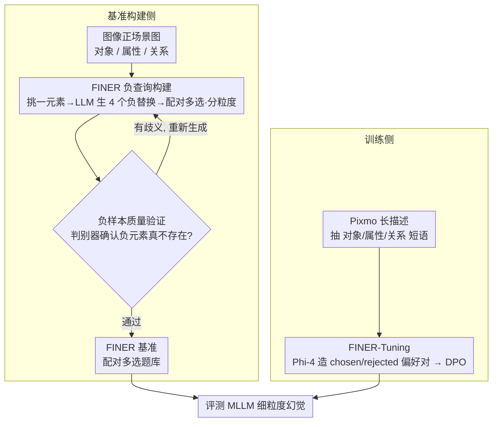

# FINER: MLLMs Hallucinate under Fine-grained Negative Queries

**会议**: CVPR 2026  
**arXiv**: [2603.17662](https://arxiv.org/abs/2603.17662)  
**代码**: [https://explainableml.github.io/finer-project/](https://explainableml.github.io/finer-project/)  
**领域**: 幻觉检测  
**关键词**: MLLM幻觉, 细粒度负查询, DPO, 场景图, 幻觉基准

## 一句话总结
发现 MLLM 在细粒度负查询（涉及多个对象/属性/关系的查询中仅有一个细微错误）下幻觉率急剧上升，提出 FINER 基准和 FINER-Tuning 方法（基于 DPO），在 InternVL3.5-14B 上最高提升 24.2%。

## 研究背景与动机
**领域现状**：MLLM 的幻觉问题已被广泛研究，现有基准（POPE、DASH、AMBER）主要关注粗粒度查询，如单个物体是否存在。

**现有痛点**：真实场景下用户的查询往往是精细的——涉及多个对象、多个属性、多个关系。当查询越精细，模型越容易被"大部分正确"的内容误导而回答"是"。

**核心矛盾**：查询粒度与幻觉率之间存在强正相关。InternVL3.5-14B 在粒度1时准确率约80%，到粒度5-7时骤降至约20%。

**本文目标** (a) 系统研究细粒度负查询下的幻觉行为；(b) 提出能有效缓解细粒度幻觉的训练方法。

**切入角度**：模拟人类构句过程（先说物体→加属性→加关系），构建渐进精细的负查询来系统化地暴露幻觉。

**核心idea**：用场景图驱动构建精细负查询基准，配合 DPO 训练让模型学会检测查询中的细微错误。

## 方法详解

### 整体框架
这篇论文要做两件事：先用一个新基准把「MLLM 在细粒度负查询下到底有多容易幻觉」量化出来，再给出一套训练方法把这个弱点补上。基准这一侧从每张图像的场景图（对象、属性、关系三类元素）出发，挑出其中一个元素换成图中不存在的负版本、并用判别器验证这个负元素确实不在图里，组成一对正/负多选题，并按涉及元素的多少把查询分成不同粒度。训练这一侧则换一批数据（Pixmo 长描述）按同样的方式造出大量「正确答案 vs 含细微错误的答案」偏好对，用 DPO 让模型学会盯住查询里的那个错误元素。两侧最终都汇到「评测 MLLM 的细粒度幻觉」这一落点。

### 关键设计

**1. FINER 基准：把负查询从"单物体存在性"推到"多元素细粒度"**

POPE、AMBER 这些老基准大多只问「图里有没有某个物体」，而真实用户的问题往往一句话里塞进好几个对象、属性、关系，模型很容易被句子里「大部分都对」的内容带着回答「是」。FINER 直接从图像的正场景图下手：对每个元素，用 LLM 生成 4 个语义合理但图中并不存在的负替换（比如把 "door frame" 换成 "pillar"），再套模板拼成多选题，覆盖多对象、多属性、多关系和 Wh-问题四种设置。两个关键取舍让这个基准更难作弊——一是用多选题代替简单的 Yes/No，避开模型天生偏好某个答案带来的偏差；二是把正查询和它对应的负查询配成一对，要求两道题都答对才算这一对正确（paired accuracy），模型靠"一律答 No"蒙不过去。

**2. 负样本质量验证：保证"不存在"的元素是真的不存在**

整个基准的可靠性都压在一点上——那些被当作负样本的替换元素，必须确实不在图像里，否则一道"负"题其实是对的，评测就失真了。FINER 用 Qwen2.5-VL-72B 当判别器来把关：把真正存在的正元素混进一堆负元素里让它挑，如果判别器反而挑不出那个正元素，说明这组负元素里有歧义项（可能也算图里有），就打回去重新生成。这一步相当于给每条负样本做了一遍交叉检验，把"看起来像负其实是正"的脏数据滤掉。

**3. FINER-Tuning：用 DPO 教模型检测查询里的错误，而不是回答里的幻觉**

以往用 DPO 缓解幻觉（如 RLAIF-V、OPA-DPO）针对的是模型自己生成的描述里的幻觉，而 FINER 的弱点出在"读懂用户那句含细微错误的问句"上，所以训练目标也得换。具体做法是从 Pixmo 的长描述里抽出对象/属性/关系短语，用 Phi-4-14B 把其中一个改成负版本，于是同一道题就有了一个正确答案（chosen）和一个含细微错误的答案（rejected），再用标准 DPO 损失拉开两者的概率差：

$$\mathcal{L}_{DPO}(\theta) = -\mathbb{E}\big[\log\sigma\big(\beta(\Delta_\theta - \Delta_{ref})\big)\big]$$

其中 $\Delta$ 是模型对 chosen 与 rejected 的对数似然之差，$\beta$ 控制偏离参考模型的强度。训练数据特意用 Pixmo-caption 而非基准的图像，避免训练集泄漏；造数据用的 Phi-4-14B 也和基准构建用的 LLM 错开，防止学到同一个生成器的系统性偏好。

### 训练策略
DPO 取 $\beta = 0.1$；数据源固定为 Pixmo-caption，与基准评测集隔离以排除泄漏。

## 实验关键数据

### 主实验（FINER-CompreCap，Paired Accuracy）

| 模型 | Multi-obj | Multi-attr | Multi-rel | Wh |
|------|-----------|------------|-----------|-----|
| Random Guess | 4.0 | 4.0 | 4.0 | 4.0 |
| LLaVA-1.6-7B | 25.3 | 13.0 | 7.6 | 15.3 |
| +FINER-Tuning | **48.4** (+23.1) | **38.4** (+25.4) | **24.2** (+16.6) | **22.1** (+6.8) |
| InternVL-3.5-8B | 75.0 | 72.5 | 49.8 | 23.5 |
| +FINER-Tuning | **77.1** (+2.1) | **78.9** (+6.4) | **64.1** (+14.3) | **34.2** (+10.7) |
| InternVL-3.5-14B | 74.5 | 68.1 | 47.0 | 21.8 |
| +FINER-Tuning | **80.0** (+5.5) | **78.9** (+10.8) | **71.2** (+24.2) | **30.1** (+8.3) |

### 粒度-准确率关系

| 查询粒度 | InternVL3.5-14B 基线 | +FINER-Tuning |
|---------|---------------------|--------------|
| Level 1 | ~80% | ~85% |
| Level 3 | ~50% | ~65% |
| Level 5 | ~25% | ~50% |
| Level 7 | ~20% | ~45% |

### 关键发现
- 幻觉与查询粒度强相关：粒度越高，正确率越低，证实细粒度查询是 MLLM 的系统性弱点
- Multi-rel（多关系）是最难的设置，即使强模型基线也低于50%
- FINER-Tuning 对弱模型（LLaVA-1.6-7B）的提升比强模型更大
- FINER-Tuning 不仅提升 FINER 基准表现，在现有8个幻觉基准上也同步提升，且通用能力（6个基准）不退化

## 亮点与洞察
- **粒度-幻觉相关性**的发现非常有洞察力：揭示了 MLLM 被"大部分正确"的信息误导的机制
- **配对正负查询**的评估方式确保模型不能通过偏好"No"来作弊
- FINER-Tuning 在教模型检测"查询中的错误"而非"回答中的幻觉"，视角新颖
- 数据构建流程可迁移到其他 VQA 鲁棒性评估

## 局限与展望
- 负元素的生成依赖 LLM，可能引入系统性偏差
- 场景图到查询的模板较为固定，不涵盖自然语言的所有表达方式
- 基准仅关注否定查询，肯定查询的细粒度理解也值得研究
- DOCCI 的场景图是从长描述中提取的，可能有提取噪声

## 相关工作与启发
- **vs POPE**: POPE 仅测试单物体存在性，FINER 扩展到多元素细粒度否定
- **vs AMBER**: AMBER 包含单物体/属性/关系，FINER 把粒度推到多元素组合
- **vs RLAIF-V/OPA-DPO**: 这些方法用 DPO 减少模型自身生成的幻觉，FINER-Tuning 专门针对查询中的细微错误

## 评分
- 新颖性: ⭐⭐⭐⭐⭐ 粒度-幻觉关系的系统性研究开创了新方向
- 实验充分度: ⭐⭐⭐⭐ 4个模型+2个基准+8个已有基准+6个通用基准
- 写作质量: ⭐⭐⭐⭐ 动机分析清晰，数据构建流程详尽
- 价值: ⭐⭐⭐⭐⭐ 基准和方法对理解和缓解 MLLM 幻觉均有重要价值

<!-- RELATED:START -->

## 相关论文

- [\[CVPR 2026\] Zina: Multimodal Fine-grained Hallucination Detection and Editing](zina_multimodal_fine-grained_hallucination_detection_and_editing.md)
- [\[CVPR 2026\] Fine-Grained Multi-Image Object Hallucination Benchmark](fine-grained_multi_image_object_hallucination_benchmark.md)
- [\[CVPR 2026\] Beyond the Global Scores: Fine-Grained Token Grounding as a Robust Detector of LVLM Hallucinations](beyond_global_scores_fine_grained_token_grounding_as_robust_detector_of_lvlm_hallucinations.md)
- [\[ICML 2026\] Learning from Fine-Grained Visual Discrepancies: Mitigating Multimodal Hallucinations via In-Context Visual Contrastive Optimization](../../ICML2026/hallucination/learning_from_fine-grained_visual_discrepancies_mitigating_multimodal_hallucinat.md)
- [\[CVPR 2026\] COPO: Causal-Oriented Policy Optimization for Hallucinations of MLLMs](copo_causal-oriented_policy_optimization_for_hallucinations_of_mllms.md)

<!-- RELATED:END -->
