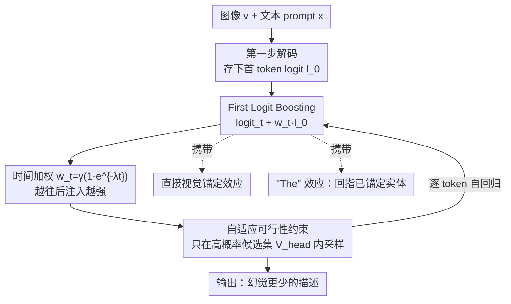

# First Logit Boosting: Visual Grounding Method to Mitigate Object Hallucination in Large Vision-Language Models

**会议**: CVPR 2026  
**论文**: [CVF Open Access](https://openaccess.thecvf.com/content/CVPR2026/html/Ha_First_Logit_Boosting_Visual_Grounding_Method_to_Mitigate_Object_Hallucination_CVPR_2026_paper.html)  
**代码**: https://github.com/jiwooha20/FLB  
**领域**: 多模态VLM / 物体幻觉缓解  
**关键词**: 物体幻觉, 视觉锚定, 对比解码, 训练无关, 长程衰减  

## 一句话总结
针对大视觉语言模型（LVLM）"越生成越脱离图像、后段越容易编造物体"的长程衰减问题，本文提出 First Logit Boosting（FLB）：把**第一个生成 token 的 logit 存下来，按随步数递增的权重加回到后续每一步的 logit 上**，零训练、零外部模型、只需一次前向，就把 CHAIR/AMBER 上的物体幻觉显著压低且几乎不增加推理开销。

## 研究背景与动机
**领域现状**：LVLM（LLaVA-1.5、InstructBLIP 等）由视觉编码器 + LLM + 跨模态对齐模块拼成，在图像描述、VQA 上表现很强，但普遍存在 **object hallucination**——生成的描述里出现图里根本不存在的物体，这在自动驾驶、医学影像等安全敏感场景里是硬伤。缓解幻觉的工作分三类：① 重训练类（RLHF、改位置编码），数据和算力成本高；② 外部锚定类（额外接一个模型去核验物体是否存在），牺牲效率；③ 训练无关类（推理时直接干预 logit / 隐空间），最轻量。

**现有痛点**：训练无关里最有代表性的是**对比解码（Contrastive Decoding, CD）**——同时跑"原始输入"和"加噪/扰动输入"两路，相减以压制语言先验（VCD 用噪声图、ICD 用扰动指令、M3ID 用无条件输入）。但 CD 有两个根子上的毛病：（1）**长程衰减（long-term decay）**：随着句子变长，模型注意力逐渐从视觉证据漂走、被语言先验主导，幻觉集中出现在后段 token；作者实测 VCD/ICD/M3ID 都压不住这条趋势——ground-truth token 的平均 logit 随位置一路下滑、幻觉 token 的 logit 一路上爬。（2）**推理低效**：CD 每步要跑两次前向（原始 + 扰动），推理时间几乎翻倍，且开销随序列长度线性增长。

**核心矛盾**：长程衰减的物理根源是 LVLM 普遍用的 **RoPE 旋转位置编码**——图像 token 被放在序列最前面，随着文本越生成越长，图文 token 间的相对位置距离越来越大，跨模态注意力被稀释。CD 只在**每一步局部**做对比修正，没有一个**全局、持续**的视觉锚来对抗这种随位置增长的漂移。

**切入角度 / 核心 idea**：作者抓住一个位置上的关键观察——**第一个 token 紧接在视觉 token 之后生成，此时跨模态注意力还没开始衰减，所以第一个 token 的 logit 是整个生成过程中"视觉锚定最强"的一刻**（实测第一步 ground-truth 与幻觉 token 的 logit 间隔最大）。那就把这一刻"冻结"下来——存住第一个 logit，在后续每一步都把它加回去，等于把"最干净的视觉证据"反复注入，对抗衰减。一句话：**用第一步的 logit 当持久视觉锚，按需放大地回灌进后续解码**。

## 方法详解

### 整体框架
FLB 是一个挂在解码循环上的**训练无关插件**：输入图像 $v$ + 文本 prompt $x$，输出文本回答 $y$，与普通自回归解码唯一的差别是在每一步的 logit 上叠加一项"被时间权重缩放过的第一步 logit"，再经一个自适应可行性约束过滤后采样。整条流程只需一次前向（第一步算完 $l_0$ 就一直复用），所以几乎不加开销。

它带来两个互补效应：**直接视觉锚定效应**（first logit 本身视觉证据强，反复加 = 反复强化视觉信号）和意外发现的**"The" 效应**（first token 高概率是 "The" 这类冠词，提升它会让模型更倾向回指前文已经视觉锚定过的实体，从而隐式抑制幻觉）。

### 关键设计

**1. First Logit Boosting：把"最视觉锚定的一刻"冻结再回灌**

这是方法的主干，直接对付长程衰减。普通解码每步从 $y_t \sim \mathrm{softmax}(\mathrm{logit}_\theta(y\mid v,x,y_{<t}))$ 采样，后段 logit 已被语言先验污染。FLB 先在第一步把 logit 存下来：

$$l_0 = \mathrm{logit}_\theta(y \mid x, v)$$

由于 $l_0$ 在所有步上恒定，只算一次、可忽略成本。随后每一步把它加回去：

$$y_t \sim \mathrm{softmax}\big[\mathrm{logit}_\theta(y\mid v,x,y_{<t}) + w_t\, l_0\big]$$

之所以有效，是因为第一步 token 紧贴视觉 token 生成、RoPE 距离最短、跨模态注意力尚未衰减，作者实测此时 ground-truth 词（man/hat/tie…，均值 logit 4.74）系统性高于幻觉词（woman/sun/tree…，均值 2.15）。把这份"干净的视觉间隔"在后续每步反复施加，相当于给一路漂移的解码持续打视觉补丁。与以往 logit steering 把生成推向某个**目标分布**不同，FLB 复用的是**最早、最视觉锚定的真实分布**，不引入外部目标。

**2. 时间递增权重 $w_t$：衰减越严重的地方，锚定打得越重**

如果对所有步等权注入 $l_0$，前段（本来就锚定得好）会被过度干扰、后段（真正需要救）又不够。FLB 让权重随步数单调上升，正好和长程衰减的强度曲线反向匹配：

$$w_t = \gamma\,(1 - e^{-\lambda t})$$

其中 $\gamma$ 是最大缩放系数、$\lambda$ 控制上升速度（实验取 $\gamma=0.3,\ \lambda=0.05$）。$t$ 小时 $w_t\approx 0$，几乎不动早期已正确的预测；$t$ 大时 $w_t\to\gamma$，在最容易幻觉的后段把视觉锚定打满。这条曲线是 FLB"对症下药"的关键——不是无差别加噪，而是按衰减程度精准补偿。

**3. 自适应可行性约束：防止"跨位置的 logit"硬塞进不合时宜的 token**

$l_0$ 来自第一步、并不对应当前解码位置，如果不加约束地相加，可能抬高一些当前语境下不合理 token 的概率（比如把句中某处突然顶出一个大写的 "The"）。FLB 借鉴 VCD 的做法，先用**原始** logit 分布圈一个高概率候选集，只在集合内采样：

$$\mathcal{V}_{\mathrm{head}}(y_{<t}) = \{\,y_t\in\mathcal{V} : p_\theta(y_t\mid v,x,y_{<t}) \ge \beta\max_w p_\theta(w\mid v,x,y_{<t})\,\}$$

集合外的 token 概率直接置零（$\beta=0.1$）。这一步保证 FLB 只在"原模型本来就认可"的范围内重排序，既兜住了语法/流畅度（实验里整套 AMBER ~1000 句没出现一例句中乱插大写词），又保留了视觉重排的收益。最终解码规则即在 $y_t\in\mathcal{V}_{\mathrm{head}}$ 约束下做上面那步带 boosting 的 softmax 采样。

**4. "The" 效应：被意外发现的隐式视觉回指**

这是分析中浮现的互补机制，而非刻意设计。FLB 复用 $l_0$ 时，会顺带放大第一步 logit 最高的句首词——实测 Top-20 里 "The" 排第一。作者发现**以 "The" 开头的句子幻觉率明显更低，且 "The" 后面跟的名词更常被视觉锚定**：在 "The/the" 之后，ground-truth 名词出现占比 0.317、幻觉仅 0.020；而 "A/a" 之后幻觉占比升到 0.105。原因是 "The" 是定冠词，语义上暗示"指代前文已经提到/已被视觉关注过的实体"，于是引导模型回指已锚定对象、而不是在语言先验驱动下采样新的、含糊的物体。换句话说，**语言学上的句首初始化本身就充当了一种隐式视觉锚定**，FLB 通过回灌 $l_0$ 顺势放大了这一偏好。

### 损失函数 / 训练策略
无训练。FLB 是纯推理期方法，不改模型权重、不接外部模块，只有三个超参 $\gamma=0.3,\ \lambda=0.05,\ \beta=0.1$，对 LLaVA-1.5 与 InstructBLIP 通用。

## 实验关键数据

### 主实验
两个主流生成式幻觉基准：**AMBER**（1,004 张图）与 **CHAIR**（MSCOCO val 采样 500 张），prompt 统一为 "Please describe this image in detail."；骨干为 LLaVA-1.5 (7B, MLP 投影) 与 InstructBLIP (7B, Q-Former)；对比 Baseline、VCD、ICD、M3ID，每个结果三次平均。

AMBER（CHAIR↓ 幻觉物体占比，Cover↑ 覆盖率，Hal↓ 含幻觉句占比，Cog↓ 似真幻觉）：

| 模型 | 方法 | CHAIR↓ | Cover↑ | Hal↓ | Cog↓ |
|------|------|--------|--------|------|------|
| LLaVA-1.5 | Baseline | 11.5 | 50.1 | 48.9 | 4.6 |
| LLaVA-1.5 | VCD | 9.9 | 51.2 | 43.4 | 4.6 |
| LLaVA-1.5 | ICD | 9.1 | 51.2 | 40.6 | 4.3 |
| LLaVA-1.5 | M3ID | 9.8 | 55.6 | 48.4 | 3.6 |
| LLaVA-1.5 | **FLB** | **6.1** | 50.4 | **31.6** | **2.7** |
| InstructBLIP | Baseline | 11.6 | 53.4 | 51.7 | 5.3 |
| InstructBLIP | **FLB** | **9.0** | 53.6 | **43.8** | 4.7 |

CHAIR（MSCOCO，CHAIR$_s$/CHAIR$_i$↓ 越低越好，Recall↑）：

| 模型 | 方法 | CHAIR$_s$↓ | CHAIR$_i$↓ | Recall↑ |
|------|------|-----------|-----------|---------|
| LLaVA-1.5 | Baseline | 57.5 | 17.3 | 73.3 |
| LLaVA-1.5 | ICD | 53.0 | 14.6 | 76.7 |
| LLaVA-1.5 | **FLB** | **43.5** | **12.0** | 73.6 |
| InstructBLIP | Baseline | 59.0 | 18.5 | 69.4 |
| InstructBLIP | **FLB** | **52.5** | **15.8** | 71.3 |

关键在于：FLB 在大幅压幻觉的同时 **Cover/Recall 几乎不掉**，绕开了"压幻觉就掉答对率"的典型 trade-off。生成质量上，FLB 平均词数 78.62 / token 数 101.40 与 Baseline（79.58 / 104.67）几乎一致，GPT-4V 评分 Accuracy 5.01→7.28、Detailedness 5.47→6.51，说明没牺牲流畅度。推理速度上，VCD/ICD/M3ID 因双前向比 Baseline 慢约一倍，FLB 只复用存好的 $l_0$，速度与 Baseline 持平。

### 消融实验
通过 mask $l_0$ 隔离两个效应（AMBER，LLaVA-1.5）：

| 配置 | CHAIR↓ | Cover↑ | Hal↓ | Cog↓ | 说明 |
|------|--------|--------|------|------|------|
| Baseline | 11.9 | 49.6 | 48.8 | 4.4 | 普通解码 |
| Direct visual grounding only | 9.2 | 50.3 | 41.1 | 4.7 | 只留名词 token 的 $l_0$ |
| "The" effect only | 6.5 | 50.6 | 29.9 | 2.4 | 只留 "The" token 的 $l_0$ |
| FLB (full) | 5.7 | 50.3 | 30.7 | 2.4 | 两效应联合 |

### 关键发现
- **两个效应都有效且互补**：单独的直接视觉锚定把 CHAIR 从 11.9 降到 9.2，单独 "The" 效应更猛、降到 6.5，完整 FLB 在 CHAIR（5.7）上最好。⚠️ 注意 Hal 指标上 "The"-only（29.9）略低于 full（30.7），说明两者并非每个指标都严格叠加，但综合最优。
- **"The" 效应贡献更大**且出乎意料——它不是设计出来的，而是复用 $l_0$ 时顺带放大句首冠词带来的副产物。频率统计佐证："The/the" 后 ground-truth 名词概率 0.279、幻觉仅 0.012，远好于 "A/a" 后（0.225 / 0.029）。
- **长程衰减被真正压住**：分位置看，VCD/ICD/M3ID 的幻觉 logit 随位置一路上涨，只有 FLB 把这条曲线压平；按句首是否为 "The" 分组，普通句后段幻觉概率陡升、"The" 句几乎不升，且位置越靠后两组分化越大。

## 亮点与洞察
- **"冻结第一刻"是个极简又对路的 trick**：长程衰减的本质是"越往后越脱离视觉"，那干脆把"还没脱离视觉的第一步"存下来反复用——一行 logit 缓存换来全局视觉锚定，几乎零成本，比双前向的 CD 又快又好。
- **时间递增权重 $w_t=\gamma(1-e^{-\lambda t})$ 与衰减曲线反向匹配**，是"对症下药"而非无差别干预的范例，这个"按问题强度调注入强度"的思路可迁移到其他随位置/步数恶化的解码问题（如长文本重复、事实漂移）。
- **"The" 效应是真正的"啊哈"点**：把一个纯语言学现象（定冠词暗示回指已知实体）解释成隐式视觉锚定，并用频率/概率统计扎实佐证，提示我们句法成分本身可能携带可利用的 grounding 信号。

## 局限与展望
- 只在 LLaVA-1.5 / InstructBLIP 两个 7B 骨干、英文 caption 类生成任务上验证；"The" 效应高度依赖英文定冠词，**换语言（无冠词的中文/日文）或换判别式任务能否成立存疑** ⚠️。
- $l_0$ 是固定不变地复用整段生成，对**多物体、多句、话题切换**的长描述，早期锚定是否会"过度锚定"在前几个物体上、压抑后文该出现的新物体，论文未深入（Cover 基本持平但未排查这一风险）。
- 三个超参 $\gamma,\lambda,\beta$ 的最优值随骨干/数据可能漂移，论文给的是固定一组，泛化到更大模型时的敏感性未充分扫描。
- 改进方向：把 $l_0$ 升级为"随话题滑动更新的锚"（如每生成完一句重存一次），或把 "The" 效应推广到更一般的"指代性句法触发器"。

## 相关工作与启发
- **vs VCD / ICD / M3ID（对比解码）**: 它们靠每步两次前向（原始 vs 扰动）做局部对比，慢一倍且压不住长程衰减；FLB 单前向、用第一步 logit 做全局持久锚，又快又在 CHAIR/AMBER 上更好。本质区别：CD 是**局部去偏**，FLB 是**全局补锚**。
- **vs 重训练类（RLHF / 改位置编码）**: 那类需大规模标注或改架构，成本高；FLB 完全训练无关、即插即用，代价是收益上限受限于"第一步 logit 有多准"。
- **vs 外部锚定类**: 后者额外接核验模型、牺牲效率；FLB 不引入任何外部模块。
- **vs 一般 logit steering**: 以往把生成推向某个**目标分布**，FLB 反其道——复用模型自己**最早、最视觉锚定的真实分布**，并借 "The" 的稳定化（降低预测熵）顺势抑制幻觉。

## 评分
- 新颖性: ⭐⭐⭐⭐ "存第一步 logit 反复回灌"简单到反直觉，"The" 效应的发现尤其有想象力。
- 实验充分度: ⭐⭐⭐⭐ 两骨干、四基准、三种 CD 对比 + 隔离消融 + 速度/质量分析齐全，但缺跨语言与更大模型验证。
- 写作质量: ⭐⭐⭐⭐ 动机—观察—机制—验证链条清晰，"The" 效应的递进分析很有说服力。
- 价值: ⭐⭐⭐⭐ 零训练、零开销、即插即用，对实时多模态系统落地友好。

<!-- RELATED:START -->

## 相关论文

- [\[CVPR 2026\] Same Attention, Different Truths: Put Logit-Lens over Visual Attention to Detect and Mitigate LVLM Object Hallucination](same_attention_different_truths_put_logit-lens_over_visual_attention_to_detect_a.md)
- [\[CVPR 2026\] VES-RFT: Rewarding Visual Evidence Sensitivity to Mitigate Hallucinations in Large Vision-Language Models](ves-rft_rewarding_visual_evidence_sensitivity_to_mitigate_hallucinations_in_larg.md)
- [\[CVPR 2026\] Envision, Attend, Then Respond: Counterfactual Hallucination Mitigation in Large Vision-Language Models](envision_attend_then_respond_counterfactual_hallucination_mitigation_in_large_vi.md)
- [\[ICML 2026\] Revis: Sparse Latent Steering to Mitigate Object Hallucination in Large Vision-Language Models](../../ICML2026/hallucination/revis_sparse_latent_steering_to_mitigate_object_hallucination_in_large_vision-la.md)
- [\[CVPR 2026\] SEASON: Mitigating Temporal Hallucination in Video Large Language Models via Self-Diagnostic Contrastive Decoding](season_mitigating_temporal_hallucination_in_video_large_language_models_via_self.md)

<!-- RELATED:END -->
