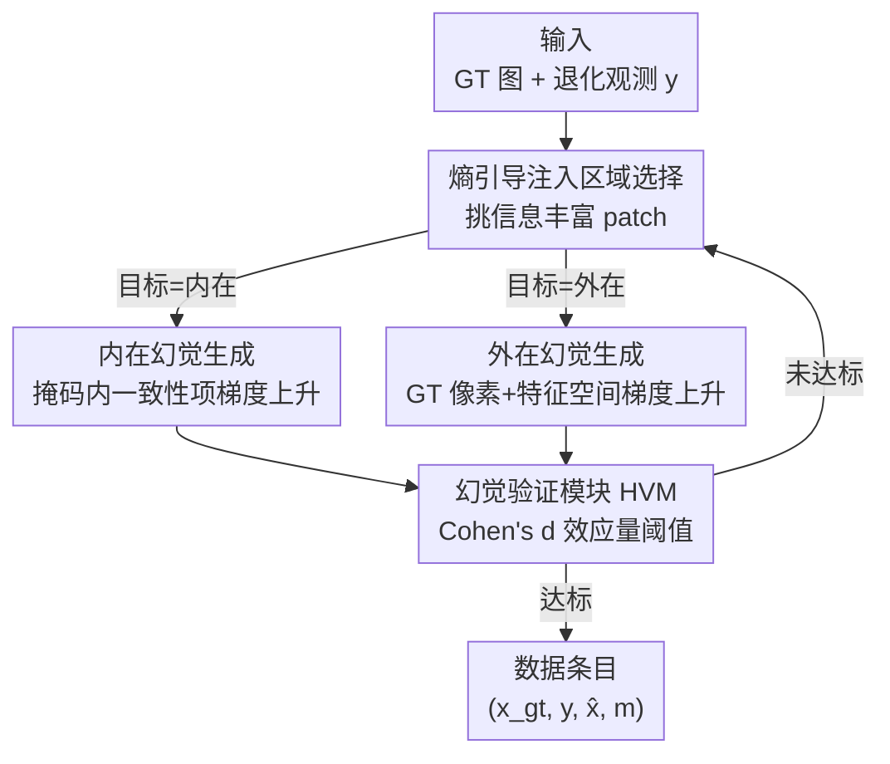

# HalluGen: Synthesizing Realistic and Controllable Hallucinations for Evaluating Image Restoration

**会议**: CVPR 2026  
**论文**: [CVF Open Access](https://openaccess.thecvf.com/content/CVPR2026/html/Kim_HalluGen_Synthesizing_Realistic_and_Controllable_Hallucinations_for_Evaluating_Image_Restoration_CVPR_2026_paper.html)  
**代码**: https://github.com/edshkim98/HalluGen （有）  
**领域**: 幻觉评测 / 扩散模型 / 图像复原  
**关键词**: 幻觉合成, 扩散后验采样, 可控幻觉, 医学图像复原, 幻觉评测基准

## 一句话总结
HalluGen 用扩散后验采样 + 带掩码的梯度引导，把"类型/位置/严重度都可控"的真实感幻觉**主动注入**到图像复原结果里，从而第一次拿到带 ground-truth 标注的幻觉数据集（4350 张脑 MRI），并基于它建立幻觉评测基准、提出对幻觉敏感的 SHAFE 指标、训练出能泛化到真实复原失败的无参考检测器。

## 研究背景与动机

**领域现状**：在超分、去噪、去模糊等图像复原任务里，基于扩散先验的生成式复原方法能产出极其锐利逼真的结果，已被推广到低场 MRI 增强等医疗场景（低场设备便宜、资源受限地区常用，但成像质量差，必须靠复原模型把它"提质"到可诊断水平）。

**现有痛点**：生成式复原有个致命副作用——**幻觉**（hallucination）：图像上长出看起来合理、但 ground-truth 里根本不存在的结构（比如多出一条沟回、虚构一个病灶）。在医学影像、工业质检、遥感这类安全攸关领域，这种"看着对、实际错"的内容会直接导致误诊。更糟的是它**很难被度量**：PSNR/SSIM/LPIPS 这类常用指标偏爱"感知锐利度"而非"内容正确性"，论文 Fig.2 实测中幻觉图反而拿到比"轻微模糊但内容正确"图更高的分数。

**核心矛盾**：幻觉研究卡在一个**循环依赖**上——要评测幻觉就得有标注好"哪里是幻觉"的数据，但幻觉本身模糊主观、标注极贵。作者让两位领域专家在 50 张图上做 patch 级标注，Cohen's κ 只有 0.30，远低于可接受阈值 0.60，证明人工标注既不可扩展也不可靠。

**本文目标**：跳出这个死循环——不要去"找"幻觉再标注，而是**主动合成已知 ground-truth 的幻觉**，把标注从"事后猜测"变成"生成时就已知"。

**切入角度**：作者沿用近期工作把幻觉分两类——**内在幻觉（intrinsic）**违反测量一致性（$\mathcal{A}(\hat{x}) \neq \mathcal{A}(x_{gt})$，可被测量一致性检查抓出），**外在幻觉（extrinsic）**保持测量一致但在逆问题域里偏离（$\mathcal{A}(\hat{x}) = \mathcal{A}(x_{gt})$ 但反解不同，必须靠 ground-truth 或领域知识才能识别）。既然有这套形式化定义，就可以**按定义反向构造**两类幻觉。

**核心 idea**：在扩散后验采样（DPS）的反向去噪过程里，对**指定掩码区域**施加"反向"的梯度引导——内在幻觉让测量一致性项做梯度上升（主动破坏一致性），外在幻觉在 GT 像素+特征空间做梯度上升（在测量看不见的方向上语义偏离），并用扩散先验本身把结果拉回流形保证真实感。

## 方法详解

### 整体框架

HalluGen 是一个建立在 **Diffusion Posterior Sampling (DPS)** 之上的"幻觉注入"流水线。输入是一张干净 ground-truth 图 $x_{gt}$ 和它经退化算子得到的观测 $y$；输出是一张**视觉逼真但在指定 patch 内语义错误**的复原图 $\hat{x}$，外加精确的幻觉掩码 $m$。整条管线分四步串起来：先用**熵引导策略**挑出值得注入的信息丰富区域 → 在这些 patch 上按目标类型施加**内在/外在梯度引导**生成幻觉 → 用 **HVM 验证模块**检查效应量是否达标，不达标就重采样 → 拼成 $(x_{gt}, y, \hat{x}, m)$ 数据条目。掩码外区域在每个扩散时间步与 DPS 基线平滑插值，把幻觉严格限制在注入 patch 内，保证评测时只测被注入的那部分。

DPS 的基础更新规则是在每个去噪步注入测量一致性梯度：

$$x_{t-1} = \mu_\theta(x_t, t) - \lambda_t \nabla_{x_t}\|y - \mathcal{A}(\hat{x}_0(x_t))\|^2 + \sigma_t \epsilon$$

其中 $\mu_\theta$ 是模型预测均值、$\hat{x}_0(x_t)$ 是 Tweedie 估计的干净图、$\lambda_t$ 控制引导强度。HalluGen 的全部"魔法"就是改写这个梯度项的符号和作用区域。

### 关键设计

**1. 熵引导的注入区域选择：让幻觉长在该长的地方**

幻觉只有出现在"有内容"的区域才有意义。如果随机撒 patch，大概率落到背景/颅外空白区，注入了也看不出；而用分割掩码定位语义区又需要额外标注，违背"摆脱标注依赖"的初衷。HalluGen 用一个**无标注的熵启发式**：对每个候选 patch 计算其归一化强度直方图的香农熵 $H(p) = -\sum_i p_i \log p_i$，熵低（同质平坦）或背景占比过高的 patch 直接拒绝重采样，patch 边长在 16–24 像素间随机抽取以匹配典型幻觉尺度。这样既不用任何标注，又能可靠地把幻觉注入到沟回、脑室这类**语义敏感的非同质区域**。

**2. 内在幻觉生成：在掩码内主动破坏测量一致性**

内在幻觉的定义就是违反 $\mathcal{A}(\hat{x}) = \mathcal{A}(x_{gt})$。要"按定义"造出来，HalluGen 把 DPS 的一致性梯度在掩码内外**反号**：掩码外照常做梯度下降（拉回一致性、保真），掩码内改成梯度上升（推离一致性）：

$$x_{t-1} = \mu_\theta(x_t,t) - \lambda_t \nabla_{x_t}\|(1-m)\odot(y-\mathcal{A}(\hat{x}_0(x_t)))\|^2 + \gamma_t \nabla_{x_t}\|m\odot(y-\mathcal{A}(\hat{x}_0(x_t)))\|^2$$

$\gamma_t > 0$ 是上升强度，直接对应"严重度"旋钮——$\gamma$ 越大，掩码内的测量空间违反越强。这样只在指定 patch 制造 $\mathcal{A}(\hat{x}) \neq \mathcal{A}(x_{gt})$ 的内在幻觉，其余区域保真不变。

**3. 外在幻觉生成：测量看不见的方向上做语义偏离**

外在幻觉更棘手：它要求保持测量一致（$\mathcal{A}(\hat{x}) = \mathcal{A}(x_{gt})$），却在反解域里偏离。对一般非线性算子 $\mathcal{A}$，这种"零空间"无法显式求出，所以 HalluGen 改在 **ground-truth 图像空间**做梯度上升来诱导语义偏离。但作者发现只在像素空间发散效果差——优化要在"数据分布先验 / 测量一致性 / GT 发散"三个约束间妥协。于是再加一项**特征空间发散**，用预训练特征提取器 $F(\cdot)$（DINO / SAM / MedSAM）：

$$x_{t-1} = \mu_\theta(x_t,t) - \lambda_t\odot\nabla_{x_t}\|y-\mathcal{A}(\hat{x}_0)\|^2 + \gamma_{1,t}\nabla_{x_t}\|m\odot(\hat{x}_0 - x_{gt})\|^2 + \gamma_{2,t}\nabla_{x_t}\|m\odot(F(\hat{x}_0)-F(x_{gt}))\|^2$$

$\gamma_{1,t}, \gamma_{2,t}$ 分别控制像素/特征发散强度。特征项让幻觉在保持视觉真实的同时，在语义特征上**大幅偏离**（实测掩码区分割 IoU 从 0.86 掉到 ~0.36），这正是外在幻觉"看着对、语义错"的本质。

> 补充——**流形正则效应**：尽管梯度上升在扰动扩散过程，去噪网络 $\mu_\theta$ 本身是一个"软流形先验"，每步都把样本投回 $p_{data}(x)$ 的高似然区，从而在引入局部偏离的同时维持全局连贯。作者还在最后几步**逐渐抑制梯度上升**，让去噪先验主导收敛，进一步增强真实感。这解释了为什么注入了"错误"却依旧逼真。

**4. 幻觉验证模块 HVM：用效应量卡住"既真实又确实是幻觉"**

注入不保证成功——可能太弱（看不出）或跑偏了类型。HVM 在最后扩散步（$t=0$）用 **Cohen's d 效应量**在掩码区做质检。对内在幻觉，要求测量域违反达标：$d_{meas} = (\mu^{pred}_{meas} - \mu^{gt}_{meas})/\sigma_{meas} \ge \tau_{hvm}$；对外在幻觉，要求测量域**一致**（$d_{meas} \le \tau_{hvm}$）但图像域**偏离**（$d_{img} \ge \tau_{hvm}$）。不满足分类标准的样本一律重采样，直到所有 patch 达标。用 Cohen's d 这种归一化效应量的好处是**域无关**，跨数据集/任务都能用同一套阈值 $\tau_{hvm}$ 控制"必须多严格地符合分类定义"。

### 损失函数 / 训练策略
HalluGen 本身**不训练新模型**——它是推理时对预训练扩散先验做引导的采样框架。底层扩散模型先在 HCP 的高质量 3T 脑 MR（256×256）上训练，再用复合退化算子 $\mathcal{A} = \mathrm{Blur}(\mathrm{DS}_k(\Gamma_\gamma(\cdot)))$（$k=4, \gamma=0.7$）模拟低场 MRI（<0.36T），构成中等病态的非线性逆问题。每张 GT 生成三路：DPS 非幻觉基线、内在幻觉、外在幻觉，每张含 $n\in\{1,2,3\}$ 个不重叠 patch，数据集内外两类各 1450 张保持平衡。

## 实验关键数据

### 主实验：幻觉生成质量验证
HalluGen 要同时做到"够真实"（FID 低）和"够幻觉"（掩码区语义偏离大）。对比 vanilla DPS、随机旋转、测量扰动三个 baseline：

| 方法 | FID ↓ | 掩码区 IoU ↓ | 分类符合度 |
|------|-------|-------------|-----------|
| DPS（非幻觉参照） | 0.32 | 0.861±0.09 | - |
| Random Rotation | 0.32 | 0.393±0.12 | 仅内在 |
| Meas. Perturb. | 0.48 | 0.721±0.10 | 仅内在 |
| HalluGen + MedSAM | 0.41 | 0.363±0.15 | 内+外 |
| HalluGen + SAM | 0.36 | 0.367±0.15 | 内+外 |
| HalluGen + DINOv3 | 0.43 | 0.362±0.04 | 内+外 |

HalluGen 的 FID 与 DPS 相当（真实感保住），分割 IoU 却从 0.86 砍到 ~0.36（语义大幅偏离），且是唯一能同时造出两类幻觉的方法。专家盲测（n=2，把 HalluGen 输出混进 vanilla DPS）识别准确率仅 **50.5%**，几乎等于瞎猜，证明肉眼分不出真假。

分类符合度验证（掩码区 MSE）证实两类幻觉确实按定义生成：

| 区域 | 测量损失 | 图像损失 |
|------|---------|---------|
| DPS | 0.006 | 0.022 |
| 内在 | 0.039 | 0.058 |
| 外在 | 0.003 | 0.041 |

内在幻觉测量损失约为 DPS 的 **7 倍**（违反测量一致性），外在幻觉测量损失低到 0.003（保持一致）却在图像域偏离 0.041，完全吻合 Eq.2–3 的形式化定义。

### 可控性实验
| 控制维度 | 旋钮 | 效果 | FID |
|---------|------|------|-----|
| 严重度 | 梯度强度 γ | 掩码区平方误差 718（γ=0.0005）→ 767（γ=0.01） | 稳定 |
| 空间范围 | patch 数 1→5 | 总平方误差近线性 150 → 810 | 持续低 |
| 粒度 | patch 尺寸 | 16×16: 488 → 64×64: 9000 | 稳定 |

三个维度都能独立调节幻觉强度，而 FID 始终稳定——这正是"流形正则效应"在起作用，证明可控性与真实感可以兼得。

### 应用一：幻觉指标基准 + SHAFE
基于 HalluGen 数据集第一次系统评测了主流全参考指标对幻觉的敏感性，并提出 **SHAFE**（Semantic Hallucination Assessment via Feature Evaluation）。SHAFE 的核心是**软注意力聚合**——传统指标对空间误差均匀平均，会把稀疏局部的幻觉稀释掉；SHAFE 对每个 patch 算特征余弦距离 $\delta_{cos}$，再用温度 softmax 加权：

$$\text{SHAFE} = \sum_i w_i\,\delta_{cos,i}, \quad w_i = \frac{\exp(\delta_{cos,i}/\tau)}{\sum_j \exp(\delta_{cos,j}/\tau)}$$

$\tau$ 越小，越把权重指数级集中到局部严重误差上。部分指标对比（AUC-ROC 检测，Real 列是真实复原输出上的人工标注 AUC）：

| 指标 | 类型 | AUC 内在 | AUC 外在 | Real AUC |
|------|------|---------|---------|----------|
| PSNR | 像素 | 0.59 | 0.51 | 0.58 |
| LPIPS | 特征 | 0.51 | 0.50 | 0.42 |
| DISTS | 特征 | 0.52 | 0.54 | 0.44 |
| MS-SSIM | 像素 | 0.79 | 0.21 | 0.57 |
| SHAFE-MedSAM | 特征 | 0.81 | 0.75 | 0.70 |
| SHAFE-DINOv3 | 特征 | 0.76 | 0.74 | **0.79** |

传统感知指标（LPIPS/DISTS）几乎贴近随机（AUC≈0.5），SHAFE 在所有基准指标上提升约 30%，真实预测上把 AUC 提高约 0.2，假阴性率（FNR）也从 LPIPS 的 26% 等显著改善。SHAFE 的 patch 设计还能输出热力图定位幻觉区域。

### 应用二：无参考幻觉检测器
用一个简单 CNN 吃 $(\hat{x}, y)$、不需要 ground-truth 直接判断有无幻觉，仅在 HalluGen 数据上训练：

| 测试集 | AUC ↑ | F1 ↑ |
|--------|-------|------|
| HalluGen 内在 | 0.91 | 0.95 |
| HalluGen 外在 | 0.77 | 0.76 |
| 真实预测 | 0.73 | 0.63 |

只训练在合成数据上却能泛化到真实复原失败（AUC 0.73），证明 HalluGen 合成的幻觉确实迁移到了真实失败模式。

### 关键发现
- **内在幻觉比外在更易检测**（AUC 差约 0.14）：内在违反测量一致性，留下像素级大偏差容易抓；外在保持与 $y$ 一致，只能靠语义识别，本质更难。
- **多尺度/特征聚合是敏感性来源**：MS-SSIM 靠多尺度大幅超过 SSIM，但仍输给 SHAFE，差距来自 SHAFE 的非均匀软注意力聚合——印证"幻觉是局部稀疏的，均匀平均会稀释"这一判断。
- **跨域泛化**：在 MVTec AD（工业）、ImageNet（自然图）上 HalluGen 都能造出低 FID、高语义偏离的幻觉（如缺失晶体管引脚、虚构昆虫腿），说明框架不绑定医学影像。

## 亮点与洞察
- **把"评测难题"转化为"生成问题"**：幻觉评测卡在标注循环依赖上，作者反手用生成式模型自己造已知答案的幻觉，一举绕开标注——这个"用生成解评测"的思路可迁移到任何缺标注的失败模式分析。
- **梯度反号造幻觉极其巧妙**：DPS 原本用一致性梯度下降保真，HalluGen 只是在掩码内把它改成上升，就精确制造出"内在幻觉"，几乎零额外成本且与分类定义严格对应。
- **扩散先验当"真实感保险"**：梯度上升本会破坏图像，但去噪网络每步把样本投回数据流形，使"注入错误"和"保持逼真"不再冲突——这是整个方法能成立的关键，也是可控性实验里 FID 始终稳定的根因。
- **Cohen's d 做域无关质检**：用归一化效应量而非绝对阈值卡 HVM，让同一套 $\tau_{hvm}$ 跨域跨任务通用，是个很实用的工程 trick。

## 局限与展望
- **同质区域注入失败**（作者承认，Fig.8）：在脑壳核、背景等平滑区域，扩散先验太强会把注入的幻觉抹平，导致幻觉视觉上很弱——这也是熵引导策略要刻意避开同质区的原因，但意味着这些区域的幻觉无法被这套框架覆盖。
- **缺乏显式语义控制**：能控类型/位置/严重度，但不能指定"造一个看起来像肿瘤的幻觉"这种语义层面的内容。
- **数据集只含健康 MR 图**：当前 4350 张全是健康脑 MRI，扩展到多种病理是优先方向；⚠️ 这也意味着在真实病灶场景下的可靠性尚未验证。
- **外在幻觉依赖特征提取器选择**：Eq.7 的特征发散项依赖 $F(\cdot)$（DINO/SAM/MedSAM），不同 backbone 的语义偏置可能影响生成的幻觉"长什么样"，跨域时需谨慎选择。

## 相关工作与启发
- **vs 下游任务评测 / 人工标注**：以往幻觉评测要么用下游任务性能（把幻觉和任务精度混为一谈），要么靠人工标注（不可扩展、κ=0.30 不可靠）。HalluGen 提供带 ground-truth 的合成数据，绕开两者的根本缺陷。
- **vs VLM 幻觉合成（如自动标注幻觉的工作）**：它们能合成幻觉但**缺空间控制**（不能指定大小、位置）。HalluGen 是首个在图像复原中支持空间标注、可控类型/位置/严重度、且有分类学根基的幻觉合成框架。
- **vs 传统全参考指标（PSNR/SSIM/LPIPS/DISTS）**：这些指标均匀平均空间误差、偏爱锐利度，对稀疏局部幻觉几乎无感（AUC≈0.5）。SHAFE 用软注意力聚合突出稀有结构不一致区域，是对这类指标盲区的直接修补。
- **vs 医学重建幻觉量化（线性前向模型/特定架构）**：以往工作受限于线性前向模型或任务特定架构，HalluGen 兼容一般非线性算子和多种扩散公式，通用性更强。

## 评分
- 新颖性: ⭐⭐⭐⭐⭐ 首个可控、分类学根基的图像复原幻觉合成框架，"用生成解评测"破解标注循环依赖，思路扎实。
- 实验充分度: ⭐⭐⭐⭐ 生成质量/可控性/跨域/两大应用全覆盖，专家盲测+真实数据验证到位；同质区失败与病理缺失是已知短板。
- 写作质量: ⭐⭐⭐⭐⭐ 动机（循环依赖）讲得清晰，幻觉分类学与公式对应严谨，图表支撑充分。
- 价值: ⭐⭐⭐⭐⭐ 开源数据集+指标+检测器，为安全攸关领域的幻觉评测建立了首个可扩展基础设施。

<!-- RELATED:START -->

## 相关论文

- [\[CVPR 2026\] Evaluating and Easing Hallucinations for GUI Grounding](exposing_and_evaluating_hallucinations_for_gui_grounding.md)
- [\[ICML 2026\] REALISTA: Realistic Latent Adversarial Attacks that Elicit LLM Hallucinations](../../ICML2026/hallucination/realista_realistic_latent_adversarial_attacks_that_elicit_llm_hallucinations.md)
- [\[CVPR 2026\] Fine-Grained Multi-Image Object Hallucination Benchmark](fine-grained_multi_image_object_hallucination_benchmark.md)
- [\[CVPR 2026\] TriDF: Evaluating Perception, Detection, and Hallucination for Interpretable DeepFake Detection](tridf_evaluating_perception_detection_and_hallucination_for_interpretable_deepfa.md)
- [\[CVPR 2026\] HulluEdit: Single-Pass Evidence-Consistent Subspace Editing for Mitigating Hallucinations in Large Vision-Language Models](hulluedit_single-pass_evidence-consistent_subspace_editing_for_mitigating_halluc.md)

<!-- RELATED:END -->
