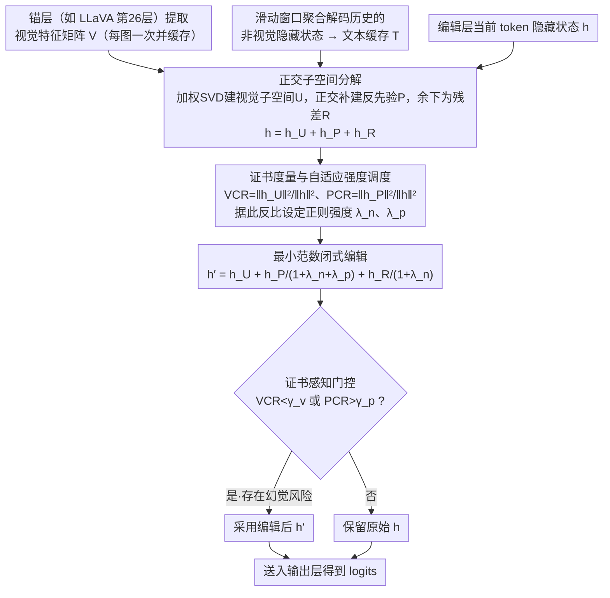

# HulluEdit: Single-Pass Evidence-Consistent Subspace Editing for Mitigating Hallucinations in Large Vision-Language Models

**会议**: CVPR 2026  
**arXiv**: [2602.22727](https://arxiv.org/abs/2602.22727)  
**代码**: [GitHub](https://github.com/VioAgnes/HulluEdit)  
**领域**: 幻觉检测

## 一句话总结

提出HulluEdit，一种单次前向、无参考模型的子空间编辑框架，通过将隐藏状态分解为正交的视觉证据子空间、冲突先验子空间和残差不确定性子空间，选择性抑制幻觉模式而不干扰视觉定位，在POPE和CHAIR基准上达到SOTA幻觉缓解效果。

## 背景与动机

1. **对象幻觉问题严重**：LVLM倾向于生成图像中不存在的对象、属性或数量描述，语言先验常常压过弱或模糊的视觉证据，导致文本与图像内容不一致。
2. **对比解码方法效率低**：VCD等方法虽能缓解幻觉，但通常需要参考模型或二次推理，增加延迟和工程复杂度。
3. **静态子空间编辑缺乏自适应性**：Nullu等方法离线构建数据集级别的幻觉子空间，缺乏token级自适应能力，存在抑制真实视觉证据的风险。
4. **缺乏可靠的解耦机制**：现有方法在抑制语言先验和保留视觉证据之间缺乏可靠的解耦机制和细粒度控制。

## 方法详解

### 整体框架

HulluEdit 要解决的是 LVLM 在解码时语言先验压过视觉证据、说出图像里根本不存在的对象这一类对象幻觉，而且要做到单次前向、不引入参考模型、不做二次推理。它的整体思路是：在解码的每一步，把编辑层当前 token 的隐藏状态 $h$ 拆成三个互相正交的子空间——承载视觉证据的视觉子空间 $U$、承载冲突语言先验的反先验子空间 $P$、剩下的不确定残差子空间 $R$——再用两个"证书"度量判断这个 token 此刻有多依赖视觉、有多依赖先验，据此用一个闭式解把先验和残差分量按比例收缩、把视觉分量原封不动留下；最后用一道门控决定这次编辑到底要不要落地。视觉证据来自锚层（如 LLaVA 第 26 层）一次性提取并缓存的视觉特征矩阵 $V$，先验则来自滑动窗口聚合非视觉隐藏状态得到的文本缓存 $T$，而干预只发生在最后一层，所以整条链路只是在前向里多算几次矩阵投影。

下面这张图把这条「提取缓存 → 正交分解 → 证书调度 → 闭式编辑 → 门控落地」的单次前向链路画出来，后面的四个关键设计正对应图中自上而下的四个贡献环节（$V$/$T$/$h$ 的提取是脚手架，不单列设计）：

### 关键设计

**1. 正交子空间分解：把"看图说话"和"凭先验瞎编"在表示空间里彻底分开**

幻觉难治的根源在于视觉证据和语言先验混在同一个隐藏状态里，粗暴压制先验往往连真实的视觉定位一起伤掉，所以第一步是把它们拆干净。视觉证据子空间不是静态预存的，而是 token 级在线构建：先用当前隐藏状态 $h$ 对锚层缓存的每个视觉 token $v_i$ 算一个余弦相关权重 $w_i = \text{softmax}_i\!\left(v_i^\top h / (\|v_i\|_2\|h\|_2 + \epsilon)\right)$，让与当前生成最相关的视觉区域权重更高，再对加权后的视觉矩阵做截断 SVD，取前 $r$ 个左奇异向量当正交基：

$$U, \Sigma, V^\top = \text{SVD}(W^{1/2}V), \quad U = U_{[:,1:r]}$$

反先验子空间则刻意建在 $U$ 的正交补里——把文本缓存先投影掉视觉成分 $\tilde{T} = T(I_d - UU^\top)$，再对残差做 SVD 取前 $q$ 维得到 $P$。这样 $U^\top P = 0$ 由构造直接成立，意味着之后无论怎么压制 $P$，视觉分量 $h_U$ 都纹丝不动，这正是论文"非干扰性"保证的来源。剩下的方向归入残差子空间 $\Pi_R = I_d - \Pi_U - \Pi_P$，于是隐藏状态被无损分解、并满足能量守恒：

$$h = \underbrace{\Pi_U h}_{h_U} + \underbrace{\Pi_P h}_{h_P} + \underbrace{\Pi_R h}_{h_R}, \quad \|h\|_2^2 = \|h_U\|_2^2 + \|h_P\|_2^2 + \|h_R\|_2^2$$

**2. 证书度量与自适应强度调度：让每个 token 自己决定该不该治、治多狠**

光有分解还不够，不同 token 对视觉的依赖天差地别——有些词本就该靠语言流畅性生成，硬压反而伤质量。HulluEdit 用两个比值当"证书"刻画当前状态：视觉一致率 $\text{VCR}(h) = \|h_U\|_2^2 / (\|h\|_2^2 + \epsilon)$ 衡量隐藏状态有多落在视觉证据上，先验一致率 $\text{PCR}(h) = \|h_P\|_2^2 / (\|h\|_2^2 + \epsilon)$ 衡量有多落在冲突先验上。编辑强度按反比调度：VCR 低（视觉支撑弱）就加强对非视觉成分的抑制，PCR 高（先验占上风）就激活反先验抑制，而当 VCR 高、PCR 低时干预自然减弱到几乎不动。这就把静态方法"一刀切"的固定强度换成了逐 token 自校准。

**3. 最小范数闭式编辑：用一个凸优化的解析解做最小必要的修改**

知道该治之后，怎么改才能既压住先验又不破坏生成？论文把它写成一个带正则的最小扰动优化：在尽量小的扰动 $\|\delta\|_2^2$ 前提下，惩罚编辑后状态在正交补 $\Pi_\perp$ 和先验子空间 $\Pi_P$ 上的能量：

$$\min_{\delta \in \mathbb{R}^d} \frac{1}{2}\|\delta\|_2^2 + \frac{\lambda_n}{2}\|\Pi_\perp(h+\delta)\|_2^2 + \frac{\lambda_p}{2}\|\Pi_P(h+\delta)\|_2^2$$

这个凸问题有闭式解，不需要迭代：

$$h' = h_U + \frac{1}{1+\lambda_n+\lambda_p}h_P + \frac{1}{1+\lambda_n}h_R$$

它的行为可以直接读出来：视觉分量 $h_U$ 系数恒为 1、完全保留；冲突分量 $h_P$ 同时被 $\lambda_n$ 和 $\lambda_p$ 两个正则压得最狠；不确定残差 $h_R$ 只受 $\lambda_n$ 适度收缩。因为是解析解、不需迭代求解，整步编辑的额外开销不到 transformer 层复杂度的 2%。论文据此能证明编辑后 $\text{VCR}$ 单调不减、$\text{PCR}$ 单调不增（"证据一致性"），且整个编辑是 Lipschitz 连续变换，不会破坏生成稳定性。

**4. 证书感知门控：只在真有幻觉风险时才出手**

即便编辑代价很低，对本来就生成良好的 token 动手仍是多余的扰动。最后一道闸门用证书做硬判定：

$$g(h) = \begin{cases} 1 & \text{if } \text{VCR}(h) < \gamma_v \ \lor\ \text{PCR}(h) > \gamma_p \\ 0 & \text{otherwise} \end{cases}$$

只有当视觉一致率低于阈值 $\gamma_v$、或先验一致率高于阈值 $\gamma_p$ 时才触发编辑，其余情况让模型原样输出。消融里去掉门控会让 CHAIRs 从 13.00 飙到 22.90，是所有组件里最关键的一个——说明"少干预、只在该治时治"本身就是性能的重要来源。

## 实验结果

### POPE基准（对象幻觉检测）

| 类别 | 方法 | LLaVA-1.5-7B Acc | LLaVA-1.5-7B F1 | LLaVA-1.5-13B Acc | Qwen-VL-Chat Acc |
|------|------|-------------------|------------------|---------------------|-------------------|
| Random | Greedy | 87.8 | 87.5 | 87.6 | 88.2 |
| Random | VCD | 88.4 | 87.7 | 88.9 | 89.1 |
| Random | VAF | 89.6 | 89.3 | 90.1 | 90.0 |
| Random | **HulluEdit** | **90.4** | **90.5** | **90.6** | **90.2** |
| Popular | Greedy | 82.5 | 83.2 | 82.7 | 82.4 |
| Popular | **HulluEdit** | **87.5** | **87.6** | **88.0** | **88.2** |
| Adversarial | Greedy | 77.6 | 79.4 | 77.8 | 77.2 |
| Adversarial | **HulluEdit** | **82.5** | **83.4** | **82.7** | **84.3** |

### CHAIR基准（图像描述幻觉）

| 方法 | LLaVA-1.5 CHAIRi↓ | CHAIRs↓ | mPLUG-Owl2 CHAIRi↓ | CHAIRs↓ |
|------|---------------------|---------|----------------------|---------|
| Greedy | 7.08 | 20.40 | 8.62 | 22.90 |
| OPERA | 6.07 | 17.50 | 7.18 | 20.07 |
| HALC | 5.72 | 16.90 | 7.00 | 18.80 |
| Nullu | 5.30 | 15.20 | 5.77 | 15.60 |
| **HulluEdit** | **4.18** | **13.00** | **3.35** | **13.60** |

### MME细粒度评估

| 方法 | Existence↑ | Count↑ | Position↑ | Color↑ |
|------|-----------|--------|-----------|--------|
| LLaVA-1.5 | 181.67 | 118.33 | 104.44 | 152.78 |
| Nullu | 190.00 | 121.11 | 105.56 | 156.67 |
| DeCo | 175.00 | 128.33 | 98.33 | 125.00 |
| **HulluEdit** | **195.00** | 105.00 | **126.67** | **160.00** |

### 消融实验

| 消融变体 | CHAIRi↓ | CHAIRs↓ |
|----------|---------|---------|
| 完整模型（$L_a$=26, $L_e$=last） | **4.18** | **13.00** |
| $L_a$=20 | 5.55 | 19.72 |
| 单层（$L_a$=$L_e$=last） | 5.50 | 18.20 |
| 均匀SVD（无加权） | 4.85 | 13.68 |
| 无正交补约束 | 5.60 | 15.90 |
| 固定编辑强度 | 5.20 | 13.88 |
| 无门控机制 | 7.70 | 22.90 |

**关键发现**：消融里最致命的是去掉门控（CHAIRs 7.70/22.90，几乎退回 Greedy 水平），说明"只在该治时才治"比编辑本身更重要；其次是无正交补约束和单层架构，印证子空间分离与锚层/编辑层分工都不可省。值得注意的是 MME 上 HulluEdit 在 Existence/Position/Color 全面领先，唯独 Count 反而比基线低（105.00 vs 118.33），暗示数值信息被保守正则的残差子空间压住了——这也是局限部分的伏笔。

## 亮点

- **数学严格的正交分解**：将隐藏状态分解为三个正交子空间，从构造上保证 $U^\top P = 0$，编辑反先验子空间时视觉分量完全不受影响，有理论证明
- **单次前向、无参考模型**：无需额外模型或二次推理，在解码时在线操作，推理开销不到transformer层复杂度的2%
- **闭式最优解**：编辑过程有严格的凸优化闭式解，无需迭代求解，数学上保证最小扰动
- **证书感知自适应编辑**：通过VCR和PCR度量动态调整编辑强度，证据强时减弱干预，冲突强时加强抑制，不同于静态方法的"一刀切"
- **跨架构泛化**：在LLaVA-1.5（7B/13B）、MiniGPT-4、mPLUG-Owl2、Qwen-VL-Chat等多种架构上一致有效

## 局限性

- **Count性能下降**：在MME的Count任务上表现下降（-13.33），表明细粒度数值信息可能编码在被保守正则化的残差子空间中
- **超参数敏感性**：锚层选择、子空间维度（$r$, $q$）、门控阈值（$\gamma_v$, $\gamma_p$）等需要针对不同模型调整
- **仅限对象级幻觉**：主要针对对象存在性和属性的幻觉，对关系推理、事件幻觉等更复杂类型的覆盖有限

## 评分

- ⭐⭐⭐⭐ 新颖性：正交子空间分解的思路新颖且数学优美，将幻觉缓解形式化为有理论保证的子空间编辑问题
- ⭐⭐⭐⭐ 实用性：单次前向、无训练、无参考模型，部署友好，推理开销极低
- ⭐⭐⭐ 实验充分度：POPE/CHAIR/MME覆盖全面、消融实验详尽，但缺少更新的模型（如LLaVA-Next、InternVL2等）
- ⭐⭐⭐⭐ 写作质量：数学推导严谨清晰，理论保证完整，图表直观有效

<!-- RELATED:START -->

## 相关论文

- [\[CVPR 2026\] HulluEdit: Single-Pass Evidence-Consistent Subspace Editing for Mitigating Hallucinations in LVLMs](hulluedit_subspace_editing_hallucination.md)
- [\[CVPR 2026\] VES-RFT: Rewarding Visual Evidence Sensitivity to Mitigate Hallucinations in Large Vision-Language Models](ves-rft_rewarding_visual_evidence_sensitivity_to_mitigate_hallucinations_in_larg.md)
- [\[CVPR 2026\] Prefill-Time Intervention for Mitigating Hallucination in Large Vision-Language Models](prefill-time_intervention_for_mitigating_hallucination_in_large_vision-language_.md)
- [\[CVPR 2026\] PAS: Prelim Attention Score for Detecting Object Hallucinations in Large Vision-Language Models](pas_prelim_attention_score_for_detecting_object_hallucinations_in_large_vision-l.md)
- [\[CVPR 2026\] MAD: Modality-Adaptive Decoding for Mitigating Cross-Modal Hallucinations in Multimodal Large Language Models](mad_modality-adaptive_decoding_for_mitigating_cross-modal_hallucinations_in_mult.md)

<!-- RELATED:END -->
