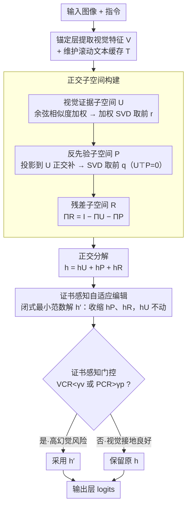

# HulluEdit: Single-Pass Evidence-Consistent Subspace Editing for Mitigating Hallucinations in LVLMs

**会议**: CVPR 2026  
**arXiv**: [2602.22727](https://arxiv.org/abs/2602.22727)  
**代码**: [https://github.com/VioAgnes/HulluEdit](https://github.com/VioAgnes/HulluEdit)  
**领域**: 幻觉检测  
**关键词**: 幻觉缓解, 子空间编辑, 正交分解, LVLM, 单次推理

## 一句话总结
提出HulluEdit，一个单次推理、无参考模型的幻觉缓解框架，通过将隐藏状态正交分解为视觉证据子空间、冲突先验子空间和残差不确定性子空间，选择性抑制幻觉模式而不干扰视觉接地，在POPE和CHAIR上达到SOTA。

## 研究背景与动机
1. **领域现状**: 大视觉语言模型(LVLM)在图像描述、VQA等任务上表现出色，但存在严重的物体幻觉问题——生成不存在的物体、属性或数量。
2. **现有痛点**: 对比解码方法(VCD/DoLa)需要参考模型或多次前向传播，增加延迟和工程复杂度；静态子空间编辑方法(Nullu)在数据集级别离线构建幻觉子空间，缺乏token级自适应性且有抑制真实视觉证据的风险。
3. **核心矛盾**: 幻觉的根源在于强语言先验压过弱/模糊的视觉证据，但现有方法无法可靠地**解耦**先验抑制和视觉证据保护——抑制先验时往往也损害了视觉接地。
4. **本文目标**: 如何在单次推理中，精确地抑制有害的语言先验同时完整保留视觉证据？
5. **切入角度**: 受DeCo观察启发——中间层表示可作为校准输出层的可靠参考，利用中间层构建样本级子空间结构，通过正交分解实现先验与视觉证据的数学保证级解耦。
6. **核心 idea**: 将隐藏状态正交分解为3个子空间(视觉/先验/残差)，通过闭式最小范数编辑选择性收缩先验和残差分量，保持视觉分量完全不变。

## 方法详解

### 整体框架
HulluEdit 想解决的是 LVLM 解码时语言先验压过视觉证据导致的物体幻觉，但它不靠对比解码或参考模型，而是直接在最终 Transformer 层把隐藏状态拆开来"做手术"。整条流水线在解码过程中在线运行：每生成一个 token，先从锚定层取出视觉特征并维护一份随生成滚动更新的文本缓存；再用这两者在当前 token 的隐藏状态上动态估计出一个视觉证据子空间和一个反先验子空间；最后把隐藏状态 $h$ 正交分解成视觉、先验、残差三个分量，按当前 token 的幻觉风险选择性地收缩后两个分量，视觉分量则原封不动地保留下来。

### 关键设计

**1. 正交子空间构建：让先验编辑在数学上碰不到视觉证据**

现有静态子空间方法（如 Nullu）在数据集级别离线挖一个固定的"幻觉子空间"，既不随 token 自适应，又有连带抑制真实视觉信号的风险。HulluEdit 的做法是给每个 token 现场构造三个互相正交的子空间。视觉证据子空间 $U$ 由加权 SVD 得到：先算当前隐藏状态 $h$ 与每个视觉 token 的余弦相似度作为权重 $w_i$，再对加权视觉矩阵 $W^{1/2}V$ 做截断 SVD 取前 $r$ 个左奇异向量——加权让真正和当前生成相关的视觉 token 主导子空间，而不是一视同仁。反先验子空间 $P$ 关键在于它建在 $U$ 的**正交补**里：把文本缓存先投影到 $(I_d - UU^\top)$ 上再做 SVD 取前 $q$ 个方向，于是 $U^\top P = 0$ 由构造直接成立。剩下的残差子空间则由 $\Pi_R = I_d - \Pi_U - \Pi_P$ 定义。这个正交性不是靠正则项软约束出来的，而是硬性几何事实——后面无论怎么动 $P$ 和 $R$，视觉分量 $h_U$ 在数学上都不可能被波及。

**2. 证书感知自适应编辑：按当前 token 的"证据强度"调编辑力度**

不同解码位置的幻觉风险天差地别——视觉接地很强的 token 不该被碰，先验冲突很大的 token 才需要重手。HulluEdit 用两个量化指标当"证书"：视觉确信比 $\text{VCR}=\|h_U\|^2/\|h\|^2$ 衡量隐藏状态里有多少来自视觉证据，先验冲突比 $\text{PCR}=\|h_P\|^2/\|h\|^2$ 衡量有多少来自语言先验。两个编辑力度 $\lambda_n$、$\lambda_p$ 按反比例调度——视觉证据越弱越加强对非视觉分量的整体抑制，先验冲突越强越激活定向抑制。最终编辑是一个闭式最小范数解：

$$h' = h_U + \frac{1}{1+\lambda_n+\lambda_p}h_P + \frac{1}{1+\lambda_n}h_R$$

本质就是对 $h_P$、$h_R$ 做收缩、对 $h_U$ 系数恒为 1，因此视觉分量完全不变。整个操作没有迭代、没有反传，代价极低。

**3. 证书感知门控：先判断"这个 token 要不要动"，再决定动多少**

即便编辑力度可调，对本来就没问题的 token 强行收缩也会损害生成流畅度，反而引入新错误。所以在编辑之前还有一道门：只有当 $\text{VCR}(h) < \gamma_v$（视觉证据偏弱）或 $\text{PCR}(h) > \gamma_p$（先验冲突偏强）时才触发上面的编辑，否则隐藏状态原样通过。这等于把干预限制在真正高幻觉风险的 token 上，对视觉接地良好的大多数 token 实现零干扰——消融里去掉这道门后 CHAIRi 几乎退回 Greedy 水平，可见它是整个框架里贡献最大的一环。

### 损失函数 / 训练策略
HulluEdit 完全在推理时在线运行，不需要训练、不需要参考模型、不需要额外前向传播。超参数只有子空间维度（$r=8, q=5$）、锚定层位置（7B 模型取第 26 层）、编辑力度基础值 $\kappa, \lambda_0$ 和门控阈值 $\gamma_v, \gamma_p$。总计算开销为 $O(d(r+q))$，不到一个 Transformer 层复杂度的 2%。

## 实验关键数据

### 主实验

**POPE基准（Adversarial split，最难）**

| 方法 | LLaVA-1.5-7B Acc | LLaVA-1.5-13B Acc | Qwen-VL-7B Acc |
|------|------|----------|------|
| Greedy | 77.6 | 77.8 | 77.2 |
| VCD | 78.1 | 78.2 | 78.8 |
| DeCo | 78.3 | 72.6 | 81.5 |
| VAF | 80.1 | 80.7 | 80.4 |
| **HulluEdit** | **82.5** | **82.7** | **84.3** |

**CHAIR基准（Caption幻觉）**

| 模型 | 方法 | CHAIRi↓ | CHAIRs↓ | BLEU↑ |
|------|------|------|------|------|
| LLaVA-1.5 | Greedy | 7.08 | 20.40 | 15.72 |
| LLaVA-1.5 | Nullu | 5.30 | 15.20 | 15.69 |
| LLaVA-1.5 | **HulluEdit** | **4.18** | **13.00** | 15.49 |
| mPLUG-Owl2 | Greedy | 8.62 | 22.90 | 15.01 |
| mPLUG-Owl2 | **HulluEdit** | **3.35** | **13.60** | 15.34 |

**MME细粒度评估**：Existence +13.33, Position +22.23, Color +7.22, Count -13.33

### 消融实验

| 配置 | CHAIRi↓ | CHAIRs↓ | 说明 |
|------|---------|------|------|
| Full ($L_a$=26, $L_e$=last) | 4.18 | 13.00 | 完整模型 |
| $L_a$=20 | 5.55 | 19.72 | 锚定层太浅 |
| Uniform SVD | 4.85 | 13.68 | 加权SVD更优 |
| w/o 正交补约束 | 5.60 | 15.90 | 正交性关键 |
| w/o 门控 | 7.70 | 22.90 | 门控避免过度干预 |
| 仅抑制残差 | 5.90 | 16.82 | 需两路联合抑制 |
| 仅抑制反先验 | 5.40 | 14.66 | 需两路联合抑制 |

### 关键发现
- **门控贡献最大**：去掉门控后CHAIRi从4.18飙升到7.70，几乎回到Greedy水平(7.08)，说明选择性干预极其重要——不需要编辑的token被强制编辑反而引入新问题。
- **正交补约束第二重要**：去掉后CHAIRi上升到5.60，验证了先验/视觉空间严格分离的必要性。
- DeCo在13B模型上出现严重退化(72.6 vs HulluEdit的82.7)，说明正交分解比简单层间校准更鲁棒。
- 在所有LVLM架构(LLaVA、MiniGPT-4、mPLUG-Owl2、Qwen-VL)上一致有效。
- 推理开销<2%的Transformer层复杂度，远快于OPERA和HALC。

## 亮点与洞察
- **正交分解的数学保证**：不是靠正则化软约束，而是通过子空间构造硬保证$U^\top P = 0$，这是非常优雅的设计。任何对$P$的编辑在数学上不可能影响$U$分量——这种级别的保证在LVLM幻觉缓解领域是新的。
- **闭式解的高效性**：编辑公式$h' = h_U + \frac{1}{1+\lambda_n+\lambda_p}h_P + \frac{1}{1+\lambda_n}h_R$极其简洁，是一个收缩操作，实现代价极低。
- **从"黑盒修复"到"白盒分析"的范式转变**：不再把隐藏状态当黑盒来对抗解码，而是结构化地分析其组成并精确干预，为可解释的LVLM幻觉缓解提供了新方向。

## 局限与展望
- 锚定层和编辑层的选择依赖经验（7B模型用26层），不同架构可能需要不同设置。
- 子空间维度$r, q$是全局固定的超参数，是否可以也做自适应。
- 主要验证在物体幻觉上，对属性幻觉、关系幻觉的效果未充分评估。
- 视觉证据子空间基于cosine相似度加权，可能对视觉token质量较差的场景（如低质量图片）效果有限。

## 相关工作与启发
- **vs VCD**: VCD通过对比有/无视觉输入的输出分布来增强视觉信号，但需要额外前向传播；HulluEdit单次推理完成，且通过正交分解更精确地保留视觉证据。
- **vs Nullu**: Nullu构建数据集级别的静态幻觉子空间，缺乏token自适应性；HulluEdit在线构建样本自适应的子空间，更灵活。
- **vs DeCo**: DeCo用中间层校准输出层，启发了HulluEdit的设计，但DeCo的编辑粒度较粗且在大模型上不稳定；HulluEdit的正交分解更精细更稳定。

## 评分
- 新颖性: ⭐⭐⭐⭐⭐ 正交子空间分解+闭式编辑的框架非常优雅，有理论保证
- 实验充分度: ⭐⭐⭐⭐ 多模型多benchmark验证，含POPE、CHAIR、MME
- 写作质量: ⭐⭐⭐⭐ 数学推导清晰严谨，图示辅助理解
- 价值: ⭐⭐⭐⭐⭐ 为LVLM幻觉缓解提供了新的理论基础和实用方法

<!-- RELATED:START -->

## 相关论文

- [\[CVPR 2026\] HulluEdit: Single-Pass Evidence-Consistent Subspace Editing for Mitigating Hallucinations in Large Vision-Language Models](hulluedit_single-pass_evidence-consistent_subspace_editing_for_mitigating_halluc.md)
- [\[CVPR 2026\] Thinking in Uncertainty: Mitigating Hallucinations in MLRMs with Latent Entropy-Aware Decoding](thinking_in_uncertainty_mitigating_hallucinations_in_mlrms_with_latent_entropy-a.md)
- [\[CVPR 2026\] Beyond the Global Scores: Fine-Grained Token Grounding as a Robust Detector of LVLM Hallucinations](beyond_global_scores_fine_grained_token_grounding_as_robust_detector_of_lvlm_hallucinations.md)
- [\[CVPR 2026\] PAS: Prelim Attention Score for Detecting Object Hallucinations in Large Vision-Language Models](pas_prelim_attention_score_for_detecting_object_hallucinations_in_large_vision-l.md)
- [\[CVPR 2026\] Zina: Multimodal Fine-grained Hallucination Detection and Editing](zina_multimodal_fine-grained_hallucination_detection_and_editing.md)

<!-- RELATED:END -->
