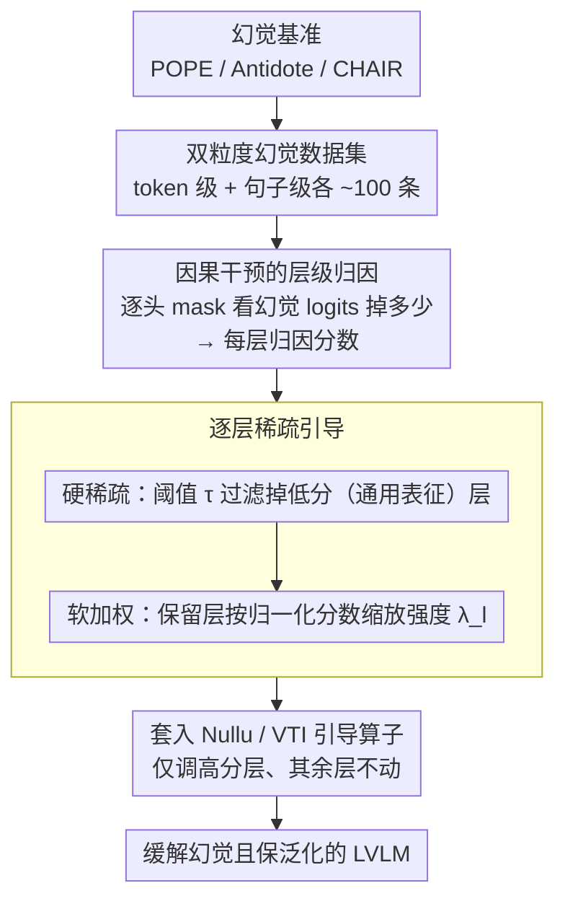

# Locate-then-Sparsify: Attribution Guided Sparse Strategy for Visual Hallucination Mitigation

**会议**: CVPR 2026  
**arXiv**: [2603.16284](https://arxiv.org/abs/2603.16284)  
**代码**: [https://github.com/huttersadan/LTS-FS](https://github.com/huttersadan/LTS-FS)  
**领域**: 幻觉检测  
**关键词**: 视觉幻觉, 特征引导, 层级归因, 稀疏调整, LVLM

## 一句话总结
提出 LTS-FS（Locate-Then-Sparsify for Feature Steering）框架，通过因果干预归因方法定位幻觉相关层，并根据归因分数逐层稀疏地控制特征引导强度，在有效缓解 LVLM 幻觉的同时保持模型泛化能力。

## 研究背景与动机

**领域现状**：大视觉语言模型（LVLM）虽然在多模态任务上表现出色，但仍存在严重的幻觉问题——生成流畅但与视觉内容不符的描述。现有缓解方法可分为：微调方法（成本高、损害泛化）、解码增强方法（推理开销大）和特征引导方法（修改中间层特征）。

**现有痛点**：特征引导方法（如 Nullu、VTI）对所有层施加相同强度的引导，忽略了层间差异——有些层与幻觉高度相关，有些层则负责通用表征。均匀引导会扰动与幻觉无关的层，破坏原始特征分布，导致泛化能力下降。

**核心矛盾**：幻觉缓解和泛化能力保持之间的 trade-off——过强引导减少幻觉但损害通用能力，过弱引导则效果不足。

**本文目标**：如何精准定位幻觉相关层并差异化地施加引导，只在"该调"的地方调？

**切入角度**：借鉴参数定位技术，通过因果干预量化每层对幻觉输出的贡献，得到层级归因分数。

**核心 idea**：先定位（Locate）幻觉相关层，再稀疏化（Sparsify）引导强度——高分层强调整、低分层不调整。

## 方法详解

### 整体框架
这篇论文要解决的是：特征引导类的幻觉缓解方法对所有层"一刀切"地施加相同强度，结果连那些负责通用表征、和幻觉无关的层也被扰动，泛化能力随之受损。LTS-FS 的思路是先找到"该调的层"再差异化地调——整条流水线分三步：先用少量幻觉样本构建一个分粒度（token 级 + 句子级）的双粒度幻觉数据集，再用因果干预逐层量化每层对幻觉输出的贡献得到一组归因分数，最后把这组分数翻译成逐层不同的引导强度，分数低的层干脆不动、分数高的层重点调。整个框架解耦于具体的引导算子，Nullu、VTI 等现成方法可以直接套进来用。

### 关键设计

**1. 双粒度幻觉数据集：短回答和长描述的幻觉形态不同，要分开诊断**

短问答（如 POPE 的 yes/no）里的幻觉往往集中在个别 token 上，而长描述（如 CHAIR 的多句 caption）里的幻觉会蔓延成整句话。如果只用一种粒度采样，归因信号就会偏。所以作者构建两类样本：token 级样本取自 POPE、Antidote 等 yes/no 基准，幻觉 token 可以靠规则直接识别出来；句子级样本取自 CHAIR 的多句描述，把段落拆成单句后检测哪些句子含有幻觉 token，含的就标为幻觉句。两类样本各只需约 100 条，后面的归因就分别在这两种粒度上算。

**2. 因果干预的层级归因：用"挡住这层会不会让幻觉变弱"来量化每层的因果贡献**

要判断第 $l$ 层和幻觉到底有多大关系，作者不走梯度分析，而是直接做干预——在该层逐个注意力头把输出 mask 掉，看幻觉 token 的 logits 因此掉了多少。掉得越多，说明这层对幻觉的贡献越大。token 级归因分数定义为：

$$s_{tok}^l = \sum_{h=1}^H \log \frac{P(y\mid\mathbf{h}_{l-1}, \mathbf{a}_l)}{P(y\mid\mathbf{h}_{l-1}, \mathbf{a}_l \odot M^h)}$$

其中分子是该层注意力输出 $\mathbf{a}_l$ 完整时幻觉 token $y$ 的概率，分母是把第 $h$ 个头用掩码 $M^h$ 挡掉后的概率，对所有头求和。句子级归因则在 token 级分数之上加权聚合，权重由三个指标决定——cue indicator、position indicator、hallucination indicator——让靠后的 token 和真正含幻觉的 token 拿到更高权重，从而把"整句蔓延"的幻觉算准。相比梯度，这种直接挡一刀的干预更能反映层的真实因果作用。

**3. 逐层稀疏引导：先硬过滤掉无关层，再给保留层软加权**

有了每层的归因分数，最后一步是把它翻译成逐层不同的引导强度，做法是"硬稀疏 + 软加权"两道。硬稀疏先设一个相对阈值 $\tau = r_s \cdot \frac{1}{L}\sum_l s^l$（$r_s$ 是稀疏比例超参，$L$ 是层数），归因分数低于这个均值倍数的层判定为和幻觉无关，直接不施加引导——这正是为了避免一刀切去动那些负责通用表征的层。剩下的高分层再做软加权，按归一化后的分数 $\tilde{s}^l$ 缩放引导强度：

$$\lambda_l = \lambda \cdot m_l + \lambda \cdot \tilde{s}_l$$

$\lambda$ 是基础引导强度，$m_l$ 是该层是否被保留的二元掩码，$\tilde{s}_l$ 是归一化归因分数。这样越和幻觉相关的层调得越重，无关层则完全不被触碰，既压住了幻觉又没破坏原始特征分布。

### 一个完整示例
以 LLaVA-1.5-7B（共 32 层，⚠️ 层数为该模型常识值，以原文为准）跑一遍：先用 100 条 token 级 + 100 条句子级幻觉样本，逐层逐头做 mask 干预，算出 32 个归因分数；假设均值是 $\bar s$、稀疏比例 $r_s$ 取使阈值 $\tau$ 落在中段的值，那么分数明显低于 $\tau$ 的若干中低层被判为"通用表征层"直接跳过（$m_l=0$），归因分数靠前的高层被保留（$m_l=1$）并按 $\tilde{s}_l$ 拿到各自不同的 $\lambda_l$。最终推理时，只有这批高分层被 Nullu / VTI 的引导向量按各自强度调整，其余层保持原状——既把 CHAIR-S 这类幻觉指标压下去，又因为没动通用层而保住了 POPE 准确率和描述细致度。

### 损失函数 / 训练策略
归因只需 100 句子级 + 100 token 级幻觉样本，算完后引导策略就固定下来，不针对测试集再做任何调整；推理阶段没有额外开销，速度和原始模型一致。

## 实验关键数据

### 主实验（CHAIR 指标，越低越好）

| 模型 | 方法 | CS↓ | CI↓ | Recall | Len |
|------|------|-----|-----|--------|-----|
| LLaVA-1.5-7B | Regular | 53.0 | 13.9 | 77.2 | 98.0 |
| LLaVA-1.5-7B | Nullu | 50.2 | 13.7 | 76.9 | 93.3 |
| LLaVA-1.5-7B | LTS-FS(Nullu) | 46.8 | 13.5 | 76.6 | 93.2 |
| LLaVA-1.5-7B | VTI | 47.4 | 13.9 | 76.2 | 88.9 |
| LLaVA-1.5-7B | LTS-FS(VTI) | **35.8** | **11.9** | 75.4 | 82.2 |
| Qwen-VL2.5-7B | LTS-FS(Nullu) | **23.8** | **6.0** | 60.8 | 120.6 |

### 泛化能力（POPE 准确率 / MMMU 等）

| 指标 | Nullu | LTS-FS(Nullu) | 说明 |
|------|-------|---------------|------|
| POPE-popular Acc | 基线 | +2% | Qwen-VL-2.5-7B |
| LLaVA-Bench detailness | 4.72 | 4.92 | 泛化能力更好 |
| MMMU | 下降 | 保持/提升 | 通用能力不受损 |

## 亮点
- 首次在幻觉缓解中引入层级稀疏引导思想，解耦于具体引导方法具有通用性
- 因果干预归因方法简洁有效，仅需 200 个校准样本即可完成层级归因
- 框架 plug-and-play，可直接增强 Nullu、VTI 等已有方法的效果
- 在缓解幻觉的同时显著保持甚至提升泛化能力（LLaVA-Bench detailness 4.72→4.92）
- LTS-FS(VTI) 在 LLaVA-1.5-7B 上将 CHAIR-S 从 47.4 降至 35.8，降幅达 24.5%

## 局限与展望
- 归因计算需要对每层逐头干预，大模型（>13B）上的归因开销较大且需要 GPU 显存
- 双粒度数据集的构建依赖已有幻觉基准（POPE、CHAIR、Antidote），域外场景的适用性需验证
- 当前仅在 LLaVA 和 Qwen-VL 系列上验证，更多架构（如 InternVL、Gemma）的适配性值得探索
- 可考虑将归因粒度细化到注意力头或神经元级别，实现更精细的引导控制
- 归因分数在不同任务（问答 vs 描述）间可能不一致，当前分别使用 token/句子级分数的策略较粗
- 阈值参数 $r_s$ 的最优选择可能因模型和任务而异
- 与解码增强方法（如 VCD）的组合效果值得进一步探索
- 长文本生成场景下句子级归因的计算效率有待优化

### 其他模型结果
- 在 LLaVA-1.5-13B 上同样有效：CS 从 40.8 降至 35.7（LTS-FS+Nullu），32.0（LTS-FS+VTI）
- 在 Qwen-VL2.5-7B 上 CHAIR-CI 从 7.4 降至 6.0，幻觉详细描述减少约 19%

<!-- RELATED:START -->

## 相关论文

- [\[CVPR 2026\] Envision, Attend, Then Respond: Counterfactual Hallucination Mitigation in Large Vision-Language Models](envision_attend_then_respond_counterfactual_hallucination_mitigation_in_large_vi.md)
- [\[CVPR 2026\] CausalLens: Sensitivity-Guided Multi-Head Causal Intervention for Hallucination Mitigation in Large Vision-Language Models](causallens_sensitivity-guided_multi-head_causal_intervention_for_hallucination_m.md)
- [\[CVPR 2026\] 3D-VCD: Hallucination Mitigation in 3D-LLM Embodied Agents through Visual Contrastive Decoding](3d-vcd_hallucination_mitigation_in_3d-llm_embodied_agents_through_visual_contras.md)
- [\[ACL 2026\] Spotlight and Shadow: Attention-Guided Dual-Anchor Introspective Decoding for MLLM Hallucination Mitigation](../../ACL2026/hallucination/spotlight_and_shadow_attention-guided_dual-anchor_introspective_decoding_for_mll.md)
- [\[CVPR 2026\] Same Attention, Different Truths: Put Logit-Lens over Visual Attention to Detect and Mitigate LVLM Object Hallucination](same_attention_different_truths_put_logit-lens_over_visual_attention_to_detect_a.md)

<!-- RELATED:END -->
