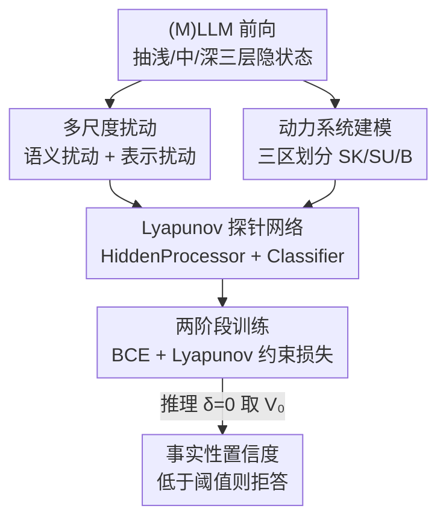

# Lyapunov Probes for Hallucination Detection in Large Foundation Models

**会议**: CVPR 2026  
**论文**: [CVF Open Access](https://openaccess.thecvf.com/content/CVPR2026/html/Luan_Lyapunov_Probes_for_Hallucination_Detection_in_Large_Foundation_Models_CVPR_2026_paper.html)  
**代码**: 无  
**领域**: 多模态VLM / 幻觉检测  
**关键词**: 幻觉检测, Lyapunov 稳定性, 动力系统, 探针网络, 知识边界

## 一句话总结
把 (M)LLM 看成在表示空间里演化的高维动力系统、把"幻觉"重新定义为"输入落在稳定平衡点附近还是不稳定的知识边界区域"，用一个带 Lyapunov 单调衰减约束的轻量探针网络（吃多层隐状态 + 扰动信息）来判别，AUPRC 在多个 LLM/MLLM 上稳定超过普通探针 4–8%。

## 研究背景与动机
**领域现状**：幻觉检测目前主要分两派——外部验证（把输出和知识库比对）和内部特征（在隐状态或 token 概率上训分类器，logit 平坦度、多次生成一致性、提示模型自评置信度等）。

**现有痛点**：外部方法需要持续更新、覆盖面有限且昂贵的事实库；内部方法则缺乏理论根基，本质上是把幻觉检测当成"标准二分类 / 模式识别"，能拟合表面统计模式，却答不出**幻觉到底为什么、在哪里发生**。

**核心矛盾**：现有方法把幻觉当成随机分布的错误来分类，但作者主张幻觉其实是**系统性**现象——它集中出现在"可靠知识区"和"不确定区"之间的过渡地带，是表示空间里"表征不稳定"的体现。缺了这层机理刻画，探针学到的只是数据集相关的伪特征，跨域就崩。

**本文目标**：给幻觉检测找一个有理论根基、能解释"何处/何故"的框架，并落成一个实际可训练、可跨域迁移的探针。

**切入角度**：借动力系统稳定性理论，把 (M)LLM 的逐层前向计算看成一个动力系统 $\mathcal{F}: \mathbb{R}^d \to \mathbb{R}^d$，隐状态随层演化 $h^{(l+1)}=\mathcal{F}^{(l)}(h^{(l)})$。事实性知识对应**吸引子 / 稳定平衡点**（小扰动下输出仍保持事实一致），幻觉对应**不稳定点**（微小扰动就让输出剧烈漂移）。

**核心 idea**：用 Lyapunov 稳定性理论刻画知识边界——定义探针函数 $V(h,\delta)$ 估计"该表示在扰动下仍保持事实正确"的概率，并强制它随扰动幅度**单调衰减**；这样判别幻觉就从"区分事实/非事实输出"变成"判断输入落在稳定区还是不稳定边界区"。

## 方法详解

### 整体框架
方法要解决的是：给定一个 (M)LLM 的某次输出，判断它是否落在"幻觉易发"的不稳定区。整体转法是——先把表示空间按稳定性划成三个区，再训一个轻量探针网络去拟合 Lyapunov 函数 $V(h,\delta)$：探针同时吃**多层隐状态** $\{h_l\}_{l\in\mathcal{L}}$ 和**显式扰动强度** $\delta$，输出 $[0,1]$ 的事实性置信度（越接近 1 越稳定/越可信）。训练时除了普通的事实性监督（BCE），还额外加一条 Lyapunov 约束损失，逼着置信度在扰动增大时单调下降——这正是稳定平衡点的标志。推理时，扰动设为 0 拿到 $V_0=V(h,0)$ 作为该输入的事实性打分，低于阈值就让模型 abstain（拒答），从而把幻觉挡在生成之前。

### 关键设计

**1. 动力系统建模与三区划分：把"判事实"改成"判稳定性"**

针对"现有方法缺机理、把幻觉当随机错误分类"这个痛点，作者把表示空间显式切成三块：**稳定已知区 (SK)**——输入有扎实的参数知识支撑，表示 $h=\text{Encoder}(x)$ 满足对任意 $\|\delta\|<\epsilon_0$ 有 $\|\mathcal{F}(h+\delta)-\mathcal{F}(h)\|<\epsilon$，输出稳健一致；**稳定未知区 (SU)**——超出模型知识范围，但模型在小扰动下仍稳定地输出"不知道 / 拒答"；**不稳定知识边界区 (B)**——夹在两者之间、稳定性脆弱，小扰动就让响应突变，**幻觉绝大多数发生在这里**。这套划分把检测目标从"输出文本对不对"重定义成"输入处在稳定区还是不稳定边界"，给后续的探针提供了明确的优化标的。

**2. Lyapunov 探针网络：多层隐状态融合的轻量判别器**

为把上面的抽象判据落地，探针把多层原始隐状态和扰动强度拼接后送入网络：

$$V(h,\delta)=\text{Classifier}\big(\text{HiddenProcessor}(\{h_l\}_{l\in\mathcal{L}};\delta)\big)$$

其中 HiddenProcessor 是一个 Transformer，用自注意力捕捉层间依赖，后接 2 层特征投影；Classifier 是 3 层 MLP，末端 sigmoid 输出 $[0,1]$ 置信度。关键之处在于**多层信号聚合**：作者选浅、中、深三层——浅层富含语义/句法信息、中层提供最强的事实判别信号、深层越来越反映输出生成过程。三层互补的融合比任何单层探针都更可靠，且无需为不同架构手调"该取哪一层"。

**3. Lyapunov 约束损失：用导数符号强制置信度单调衰减**

普通探针只学到"判别模式"，无法保证真的捕捉到稳定性结构。作者在 BCE 之外加一条显式的稳定性约束。总损失为 $\mathcal{L}_{\text{total}}=\mathcal{L}_{\text{BCE}}+\lambda\mathcal{L}_{\text{Lyapunov}}$。其中 BCE 在**无扰动**样本上监督事实正确性：$\mathcal{L}_{\text{BCE}}=-\mathbb{E}[y\log V_0+(1-y)\log(1-V_0)]$，$V_0=V(h,0)$，$y\in\{0,1\}$ 表示模型能否正确回答——这让 $V$ 在稳定平衡点处取峰。Lyapunov 约束损失则惩罚导数非负的情况：

$$\mathcal{L}_{\text{Lyapunov}}=\mathbb{E}_{h,\delta}\Big[\max\Big(0,\tfrac{\partial V(h,\delta)}{\partial\delta}\Big)\Big]$$

它强制 $\partial V(h,\delta)/\partial\|\delta\|<0$，即扰动越大、预测的事实性置信度必须越低。这正是稳定平衡点"偏离即衰减"的 Lyapunov 条件，把"稳定性"从理论判据变成可微的训练信号，使探针学到的是机理而非表面相关性（消融显示去掉它掉 3–5 点）。

**4. 多尺度扰动 + 两阶段训练：让稳定性转变变得"可观测"**

要让探针看见稳定性如何随扰动崩塌，需要系统地把表示推过知识边界。作者用两类扰动：**语义扰动**（同词性替换、插随机 token、调整句法结构，测试核心事实在语言变化下稳不稳）和**表示扰动**（直接往隐状态注入高斯噪声，模拟内部表示的随机波动）。对每个输入构造一串幅度递增的扰动 $\delta_1,\dots,\delta_K$，并用余弦相似度量化扰动幅度 $\delta=1-\cos(h,h_\delta)$，在"让稳定性转变可见"和"保留原始语义"之间取平衡。训练分两阶段：先只用 BCE 学会区分事实/非事实，再**逐步加大 $\lambda$** 引入 Lyapunov 约束、强制单调衰减——这种 warm-up 式调度保证优化稳定，同时把期望的稳定性性质刻进探针。

### 损失函数 / 训练策略
总目标 $\mathcal{L}_{\text{total}}=\mathcal{L}_{\text{BCE}}+\lambda\mathcal{L}_{\text{Lyapunov}}$；两阶段训练（阶段一仅 BCE、阶段二渐增 $\lambda$）。采用 80/20 训练/验证划分、贪心解码、多随机种子。⚠️ 三个隐状态层的具体层号、$\lambda$ 的取值范围与扰动步数 $K$ 原文未在正文给出确切数值，以原文/附录为准。

## 实验关键数据

### 主实验（LLM，AUPRC↑）
在四个 LLM 上对比基于概率/自评的基线和不带稳定性约束的普通 Probe（节选 Llama-3-8B 与 Falcon-7B）：

| 模型 | 方法 | TriviaQA | PopQA | CoQA | MMLU |
|------|------|----------|-------|------|------|
| Llama-3-8B | Seq. Prob. | 70.72 | 27.02 | 50.35 | 57.48 |
| Llama-3-8B | Probe | 78.82 | 60.77 | 80.67 | 79.26 |
| Llama-3-8B | **Ours** | **86.46** | **67.08** | **81.28** | **80.00** |
| Falcon-7B | Probe | 63.27 | 60.48 | 65.36 | 24.79 |
| Falcon-7B | **Ours** | **65.52** | **61.23** | **66.03** | **25.11** |

平均比普通探针高 6.2%、比概率类基线高 18.5%；在需要事实准确性的任务上稳定取得 4–8% 提升（TriviaQA 上 Llama-3-8B +7.1%）。

### MLLM 实验（AUPRC↑）
| 模型 | 方法 | POPE | TextVQA | VizWiz | MME |
|------|------|------|---------|--------|-----|
| LLaVA-1.5 | Probe | 98.08 | 85.89 | 77.02 | 93.61 |
| LLaVA-1.5 | **Ours** | **99.13** | **89.02** | **83.18** | **95.18** |
| Qwen-2.5-VL | Probe | 98.41 | 95.61 | 84.04 | 96.32 |
| Qwen-2.5-VL | **Ours** | **99.00** | **96.98** | **85.17** | **97.57** |

平均比基础探针高 2.1%；POPE 已近饱和（仅 +0.8%），但在 VizWiz 这类真实低质量图像上增益最大（平均 +3.6%，LLaVA 在 VizWiz 上 +6.2%）。

### 消融实验（TriviaQA，AUPRC↑）
| 配置 | Llama-2-7B | Llama-3-8B | Qwen-3-4B | Falcon-7B |
|------|-----------|-----------|-----------|-----------|
| w/o 扰动数据 | 82.41 | 82.35 | 79.92 | 65.65 |
| w/o 两阶段训练 | 82.00 | 84.80 | 80.58 | 64.27 |
| w/o 多层隐状态 | 77.34 | 82.16 | 77.59 | 60.50 |
| w/o Lyapunov 约束损失 | 78.13 | 82.86 | 74.19 | 62.48 |
| **完整模型** | **83.09** | **86.46** | 79.47 | **65.52** |

### 关键发现
- **多层隐状态最关键**：去掉后掉点最多（Llama-2-7B 从 83.09 → 77.34）；单层探针最优深度随架构而变，但多层融合比最佳单层还高 1.8–4.8 个百分点。
- **Lyapunov 约束损失贡献第二**：去掉掉 3–5 点，证明显式单调衰减确实让探针超出普通监督学习。
- **稳定性是真学到的、不是拟合**：图 4 显示完整探针置信度随扰动幅度（0→1）平滑单调下降（Qwen-3-4B 0.80→0.50，Llama-3-8B 0.69→0.48），而普通探针中段会乱跳——确认其满足 Lyapunov 条件。
- **跨域迁移强**：仅在 TriviaQA 训练、直接测 CoQA/PopQA，跨域探针比概率基线高 20–30 个百分点，与同域探针差距仅 5–16 点，印证"知识边界的不稳定性是跨任务通用规律"。
- **稳定性信号集中在中后层**：深层（15–32）普遍优于浅层（0–5）。
- ⚠️ 两阶段训练对部分模型增益很小（Qwen-3-4B 去掉反而略升），作者归因为架构相关的最优训练策略，并非所有模型都需要。

## 亮点与洞察
- **视角重构本身就是最大贡献**：把"判事实"改成"判表示稳定性"，让幻觉检测第一次有了"何处/何故"的机理解释，而不只是刷分类器。这种把动力系统/Lyapunov 理论引到 LLM 认知层面的做法很可迁移。
- **用导数符号当损失**很巧妙：$\max(0,\partial V/\partial\delta)$ 把抽象的"单调衰减稳定性"变成一行可微正则，几乎零额外成本就把理论性质刻进网络。
- **跨域近乎不掉点**是这套机理假设最有力的证据：如果探针只是拟合数据集伪特征，跨域应该崩，而它没崩，说明知识边界的不稳定性确实是模型层面的普遍结构。
- 轻量、与基座解耦：探针只读隐状态、不动基座，可即插即用到不同 (M)LLM。

## 局限与展望
- **需要标注的可答/不可答标签**训练探针（$y\in\{0,1\}$），落到全新领域仍要一批监督数据，虽然跨域迁移缓解了这点。
- **扰动构造较启发式**：语义+高斯噪声两类扰动、幅度用 $1-\cos$ 度量，扰动步数与强度区间属超参，正文未充分给出敏感性分析。
- POPE 等已饱和的基准提升有限，方法的价值主要体现在真实噪声/开放事实 QA 场景。
- ⚠️ 自定义指标 AUPRC 在类不平衡下合理，但跨任务绝对值不可直接横比（CoQA 因上下文连贯天然增益小，不代表方法弱）。
- 可改进：把三区划分的边界 $B$ 显式参数化、或把 Lyapunov 函数从置信度推广到向量场，或许能给出更精细的"幻觉风险地图"。

## 相关工作与启发
- **vs 概率/自评类基线（Verbalized / Surrogate / Seq. Prob.）**: 它们靠 token 概率平坦度或提示自评，本文靠隐状态稳定性；前者把幻觉当模式识别、易过自信，后者有理论根基且跨域稳，AUPRC 高出 18.5%。
- **vs 普通监督探针（Probe）**: 同样训隐状态分类器，但本文加了 Lyapunov 单调衰减约束 + 多层融合 + 多尺度扰动；普通探针中段非单调、是表面拟合，本文平均高 6.2% 且跨域差距小很多。
- **vs HaloScope 等子空间方法**: 它们做激活协方差特征分解/找幻觉子空间，本文不找方向而是刻画"扰动下的稳定性"，把表征稳定性与事实可靠性理论挂钩。

## 评分
- 新颖性: ⭐⭐⭐⭐⭐ 把动力系统/Lyapunov 稳定性引入幻觉检测、重定义问题，视角确实新。
- 实验充分度: ⭐⭐⭐⭐ 覆盖 6 个 (M)LLM、8 个基准 + 跨域 + 单调性验证，较充分；但缺扰动超参敏感性、$\lambda$/层号等细节。
- 写作质量: ⭐⭐⭐⭐ 理论框架讲得清楚，三区划分与损失推导逻辑顺；部分实现细节散在附录。
- 价值: ⭐⭐⭐⭐ 轻量即插即用 + 跨域稳，幻觉检测落地有实用价值，机理视角也有启发性。

<!-- RELATED:START -->

## 相关论文

- [\[NeurIPS 2025\] Beyond Token Probes: Hallucination Detection via Activation Tensors with ACT-ViT](../../NeurIPS2025/hallucination/beyond_token_probes_hallucination_detection_via_activation_tensors_with_act-vit.md)
- [\[CVPR 2026\] HulluEdit: Single-Pass Evidence-Consistent Subspace Editing for Mitigating Hallucinations in Large Vision-Language Models](hulluedit_single-pass_evidence-consistent_subspace_editing_for_mitigating_halluc.md)
- [\[CVPR 2026\] TriDF: Evaluating Perception, Detection, and Hallucination for Interpretable DeepFake Detection](tridf_evaluating_perception_detection_and_hallucination_for_interpretable_deepfa.md)
- [\[CVPR 2026\] Prefill-Time Intervention for Mitigating Hallucination in Large Vision-Language Models](prefill-time_intervention_for_mitigating_hallucination_in_large_vision-language_.md)
- [\[ACL 2026\] HalluAudio: A Comprehensive Benchmark for Hallucination Detection in Large Audio-Language Models](../../ACL2026/hallucination/halluaudio_a_comprehensive_benchmark_for_hallucination_detection_in_large_audio-.md)

<!-- RELATED:END -->
