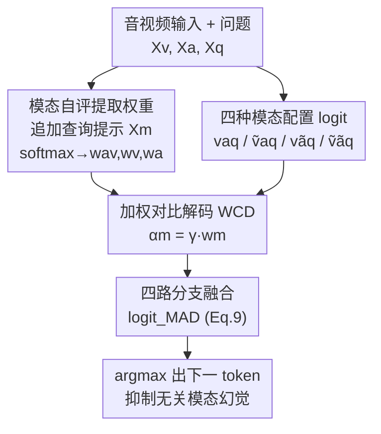

# MAD: Modality-Adaptive Decoding for Mitigating Cross-Modal Hallucinations in Multimodal Large Language Models

**会议**: CVPR 2026  
**论文**: [CVF Open Access](https://openaccess.thecvf.com/content/CVPR2026/html/Chung_MAD_Modality-Adaptive_Decoding_for_Mitigating_Cross-Modal_Hallucinations_in_Multimodal_Large_CVPR_2026_paper.html)  
**代码**: https://github.com/top-yun/MAD  
**领域**: 多模态VLM / 幻觉检测 / 对比解码  
**关键词**: 跨模态幻觉, 对比解码, 训练免调, 模态自评, 音视频大模型

## 一句话总结
针对音视频大模型里"一个模态错误地影响另一个模态生成"的跨模态幻觉，提出训练免调的模态自适应解码 MAD：先让模型自己回答"这个问题需要哪个模态"提取模态权重，再用这些权重去自适应加权四路对比解码分支，从而压住无关模态的干扰，在 CMM/AVHBench 上比 AVCD 等基线整体准确率提升数个百分点。

## 研究背景与动机
**领域现状**：音视频大模型 (AV-LLM，如 Video-LLaMA、Qwen2.5-Omni) 把视觉、音频、文本一起喂进 LLM，做视频问答、音视频场景理解。缓解幻觉的训练免调主流是**对比解码 (CD)**——把"干净输入"的输出分布和"被破坏输入"（加噪、遮挡、删模态）的输出分布相减，放大那些真正依赖输入证据的 token、压掉靠语言先验编出来的 token。AVCD 把它扩到音视频三模态。

**现有痛点**：单模态幻觉是"在一个模态内编错"；多模态里有更隐蔽的**跨模态幻觉 (cross-modal hallucination)**——一个模态不恰当地影响另一个模态的生成，比如视频里有船，模型描述音频时就凭空编出"鱼跳出水的水花声"。现有 CD/AVCD 是**模态无关 (modality-agnostic)** 的：对所有模态施加**统一**的破坏强度，不管当前任务到底需要哪个模态。

**核心矛盾**：跨模态幻觉的根子在**模态交互控制失败**——该给每个模态分配多大权重、该压住哪个误导模态、该如何保住模态边界，统一强度的静态策略做不到。对"听到什么声音？"这种问题，本该强压视觉对比、弱压音频对比；对"车是什么颜色？"则相反。固定 $\alpha$ 一刀切必然顾此失彼。

**本文目标**：让对比解码**按任务自适应**地决定对每个模态施加多大对比强度，且不需要重新训练模型。

**切入角度**：模型其实有**模态适配性判断**的潜能——直接问它"回答这个问题需要 audio、video 还是 both？"，它的预测能反映出任务真正依赖哪个模态。

**核心 idea**：让模型**自评模态相关性**得到权重 $w_m$，再用 $\alpha_m=\gamma\cdot w_m$ 把这权重注入对比解码强度，实现任务感知的多分支模态对比融合。

## 方法详解

### 整体框架
MAD 是一个训练免调的解码期方法，整体分两步。**Step 1（模态权重提取）**：给定视频 $X_v$、音频 $X_a$、问题 $X_q$，再追加一个固定的模态查询提示 $X_m$——"回答这个问题需要哪个模态（audio/video/both）？"，取模型在 'video'/'audio'/'both' 三个 token 上的 logit 做 softmax，得到归一化的模态权重 $(w_{av},w_v,w_a)$。**Step 2（模态自适应生成）**：自回归解码每一步，分别算四种模态配置下的 logit（音视频齐全、仅视频、仅音频、都缺），按 $\gamma\cdot w_m$ 加权融合成四路对比分支，得到 $\text{logit}_{\text{MAD}}$，取 argmax 出下一个 token。直观效果：当任务需要音频时调高音频分支的对比强度去压视觉编造，反之亦然。

### 关键设计

**1. 加权对比解码：把固定对比强度换成任务相关的 $\alpha_m=\gamma\cdot w_m$**

针对"现有 CD 对所有模态一刀切"的痛点，作者先把对比解码推广到任意模态 $m$：

$$\text{logit}_{\text{CD}}^{(m)}(y_t)=\text{logit}(y_t\mid X_m,X_q,y_{<t})+\alpha_m\cdot\Delta_m$$

其中 $\Delta_m=\text{logit}(y_t\mid X_m,X_q)-\text{logit}(y_t\mid X_{\tilde m},X_q)$ 是对比信号，衡量输出对模态 $m$ 的依赖程度，$\alpha_m$ 控制对"缺乏 $m$ 接地的 token"惩罚多狠。关键改动是把固定的 $\alpha_m$ 拆成 $\alpha_m=\gamma\cdot w_m$：$\gamma$ 是所有模态共享的固定基础强度，$w_m\in[0,1]$ 是任务相关的相关性权重。用统一的 $\gamma$ 保证对比强度的差异**纯粹来自自适应权重**、不掺模态固有偏置；$w_m$ 高（模态相关）则放大幻觉抑制，$w_m$ 低（无关）则减少不必要的惩罚。

**2. 模态自适应权重提取：让模型自评"这题需要哪个模态"**

$w_m$ 怎么动态拿到？作者不外接判别器，而是直接利用模型自身的模态相关性判断能力。在 $X_v,X_a,X_q$ 后追加固定查询提示 $X_m$："To answer this question, which modality is needed (audio, video, or both)?"，模型自回归预测下一个 token，取 'both'/'video'/'audio' 对应的 logit $z_{av},z_v,z_a$，softmax 归一化：

$$[w_{av},w_v,w_a]=\text{softmax}([z_{av},z_v,z_a])$$

这组权重就是模型自评的各模态重要度。作者用 VideoMME 随机采 100 个视频、构造 300 个分三类（视觉相关/音频相关/音视频相关）的问题验证：视觉问题 $w_v$ 占优（平均 0.565）、音频问题 $w_a$ 占优、音视频问题 $w_{av}$ 占优——确认这个查询提示**无需任何监督**就能正确识别任务所需模态，给后续加权提供可靠依据。

**3. 四分支模态自适应生成：按缺哪个模态分别施加对比**

把两模态（视频 v、音频 a）代入对比公式并区分联合强度 $\alpha_{av}$ 与单模态强度 $\alpha_v,\alpha_a$，得到四分支形式（再把 $\alpha$ 全替换成 $\gamma\cdot w$）：

$$\text{logit}_{\text{MAD}}(y_t)=\underbrace{(1{+}\gamma w_{av})\text{logit}^{vaq}{-}\gamma w_{av}\text{logit}^{\tilde v aq}}_{\text{视觉 CD|音频在场}}+\underbrace{(1{+}\gamma w_{av})\text{logit}^{vaq}{-}\gamma w_{av}\text{logit}^{v\tilde a q}}_{\text{音频 CD|视觉在场}}+\underbrace{(1{+}\gamma w_v)\text{logit}^{v\tilde a q}{-}\gamma w_v\text{logit}^{\tilde v\tilde a q}}_{\text{视觉 CD|音频缺}}+\underbrace{(1{+}\gamma w_a)\text{logit}^{\tilde v aq}{-}\gamma w_a\text{logit}^{\tilde v\tilde a q}}_{\text{音频 CD|视觉缺}}$$

每一行实现针对某个模态配置的对比：两模态齐全时（前两行）用 $w_{av}$ 控制联合音视频对比；某模态缺失时（后两行）回退到带模态专属强度 $w_v/w_a$ 的单模态对比。四路信号各自针对一种模态配置下产生的幻觉，**软融合**所有分支（而非只选最相关那一支），既压住主导模态诱发的跨模态编造，又保留非主导模态的互补线索。整个过程见 Algorithm 1：先一次性提取权重，再在每个解码步算四种配置的 logit、按 Eq.9 融合、取 argmax。

### 损失函数 / 训练策略
训练免调，无任何参数更新。唯一超参是基础对比强度 $\gamma$：每个数据集采 100 例、$\gamma$ 在 0.5–3.0 间以 0.5 为步长搜，最终所有数据集统一取 $\gamma=2.5$；温度设 0 做确定性生成。被破坏输入 $X_{\tilde v}/X_{\tilde a}$ 通过加噪/遮挡等方式得到（⚠️ 具体破坏算子原文未在正文细列，以原文/附录为准）。

## 实验关键数据

### 主实验（准确率 %↑）
在 CMM（按视觉/音频/语言三类主导性评估）和 AVHBench（视频驱动音频幻觉、音频驱动视频幻觉）上对比 Base、VCD-Extended、AVCD：

| 模型 + 方法 | CMM 视觉主导 | CMM 音频主导 | CMM 语言主导 | CMM 整体 | AVHBench 整体 |
|------|------|------|------|------|------|
| VideoLLaMA2-AV | 71.8 | 80.0 | 68.8 | 73.5 | 77.4 |
| VideoLLaMA2-AV + AVCD | 71.8 | 84.0 | 71.5 | 75.8 | 79.3 |
| VideoLLaMA2-AV + **MAD** | **82.3** | **84.3** | **77.5** | **81.3** | **79.4** |
| Qwen2.5-Omni-7B | 64.5 | 72.3 | 81.3 | 72.7 | 76.9 |
| Qwen2.5-Omni-7B + AVCD | 66.3 | 72.8 | 81.0 | 73.3 | 77.8 |
| Qwen2.5-Omni-7B + **MAD** | **76.8** | **84.3** | **83.3** | **81.4** | **81.6** |

MAD 在所有模型/数据集上都超过基线：VideoLLaMA2-AV 视觉主导 +9.3%、语言主导 +5.5%；Qwen2.5-Omni 视觉主导 +12.3%、音频主导 +12.0%。AVHBench 上 VideoLLaMA2-AV 的视频驱动音频幻觉 +4.0%、Qwen2.5-Omni +5.7%。

### 消融一：权重融合策略（VideoLLaMA2-AV，CMM %↑）
| 融合方式 | 视觉主导 | 音频主导 | 语言主导 | 整体 |
|------|------|------|------|------|
| Baseline | 71.8 | 80.0 | 68.8 | 73.5 |
| Uniform（均权 1/3） | 77.5 | 83.3 | 77.5 | 79.4 |
| Argmax（只选最相关一支） | 78.5 | 80.5 | 77.0 | 78.7 |
| **Weighted（本文）** | **82.3** | **84.3** | **77.5** | **81.3** |

### 消融二：模态专属权重的贡献（VideoLLaMA2-AV，CMM 整体 %↑）
| 启用的权重 | 整体 Acc |
|------|------|
| 仅 $w_v+w_{av}$（去 $w_a$） | 78.0 |
| 仅 $w_a+w_{av}$（去 $w_v$） | 78.3 |
| 仅 $w_a+w_v$（去 $w_{av}$） | 78.9 |
| **$w_a+w_v+w_{av}$ 全用** | **81.3** |

### 关键发现
- **软加权 > 均权 > 只选一支**：Uniform 忽略任务的模态需求，Argmax 丢掉非选中模态的互补线索，都不如按相关性软融合所有分支。
- **三个权重缺一不可且作用对称**：去掉 $w_a$ 掉到 78.0（视觉主导 −6.5%，模型听不到音频转而凭视觉编音频事件）；去掉 $w_v$ 掉到 78.3（音频主导 −3.0%）；$w_{av}$ 提供联合推理的耦合机制，三者齐全才到 81.3。
- **跨模态幻觉是双向的**：视觉主导诱发音频幻觉、音频主导诱发视觉幻觉，所以必须按每个问题的模态相关性自适应平衡，而非固定。
- **不伤通用 AVQA 能力**：在 OmniBench/Worldsense/MUSIC-AVQA 等通用基准上 MAD 持平甚至略升（如 VideoLLaMA2-AV 的 Worldsense 23.3→25.6），说明压幻觉同时还顺手提升了对可靠证据的依赖。

## 亮点与洞察
- **"让模型自己说需要哪个模态"是最巧的一笔**：把对比强度这个本来要手调的超参，转成模型自评 + softmax 得到的可解释权重，零训练、零额外标注，且实验证明权重分布和直觉一致。
- **统一 $\gamma$ + 自适应 $w_m$ 的解耦**很干净：保证对比强度差异只来自任务需求而非模态固有偏置，是把 AVCD 的"一刀切"升级成"按需分配"的关键。
- **四分支软融合**而非 argmax 硬选，保住了联合音视频推理所需的互补信息，这点消融里体现得很明显。
- 训练免调、即插即用到任意 AV-LLM，落地成本极低，是其相对需重训方法的实用优势。

## 局限与展望
- 只在音、视频两模态（外加文本问题）上推导与实验，扩到更多模态时四分支会指数膨胀（$2^M$ 种配置），可扩展性存疑。
- 每步要算四种模态配置的 logit，**推理开销约为普通解码的 4 倍**，对长生成代价不小（原文未给延迟数据）。
- 权重提取依赖模型对"audio/video/both"这三个 token 的自评 logit，若基座模型本身模态判断能力弱，$w_m$ 可能失真——方法上限受基座自评质量约束。
- $\gamma=2.5$ 是在采样子集上搜出来的全局值，未做逐数据集/逐任务的敏感性分析。
- ⚠️ 摘要写"three audio-visual language models"但正文主表只给了 VideoLLaMA2-AV 与 Qwen2.5-Omni 两个，以原文为准。

## 相关工作与启发
- **vs 标准对比解码 CD / VCD**: 它们只针对视觉破坏、单模态场景，本文推广到音视频并把固定 $\alpha$ 换成任务自适应的 $\gamma w_m$。
- **vs VCD-Extended**: VCD-Extended 用统一 $\alpha$ 对所有模态破坏一起减（Eq.10），没有任务感知；MAD 按问题给每个模态不同权重，主表上稳定胜出。
- **vs AVCD**: AVCD 也扩到三模态、靠注意力找弱势模态并扰动，但仍是**统一强度**、不看任务需要哪个模态；MAD 显式让模型自评模态相关性再加权，CMM/AVHBench 整体均超 AVCD。
- **vs DoLa**: DoLa 对比深浅层 logit 放大事实知识，是层间对比；MAD 是模态间对比，两者正交，思路上可结合。

## 评分
- 新颖性: ⭐⭐⭐⭐ "模态自评 → 加权对比解码"的组合新颖且自洽，但建立在 CD/AVCD 既有框架上的增量。
- 实验充分度: ⭐⭐⭐⭐ 两个跨模态基准 + 通用 AVQA + 两组消融较扎实；模型数偏少、缺推理开销与 $\gamma$ 敏感性。
- 写作质量: ⭐⭐⭐⭐ 四分支公式推导清晰、配 Algorithm，动机讲得透。
- 价值: ⭐⭐⭐⭐ 训练免调即插即用、显著降跨模态幻觉，对音视频大模型落地实用。

<!-- RELATED:START -->

## 相关论文

- [\[CVPR 2026\] MoD-DPO: Towards Mitigating Cross-modal Hallucinations in Omni LLMs using Modality Decoupled Preference Optimization](mod-dpo_towards_mitigating_cross-modal_hallucinations_in_omni_llms_using_modalit.md)
- [\[CVPR 2026\] Cross-Modal Attention Calibration for LVLM Hallucination Mitigation](cross-modal_attention_calibration_for_lvlm_hallucination_mitigation.md)
- [\[CVPR 2026\] SEASON: Mitigating Temporal Hallucination in Video Large Language Models via Self-Diagnostic Contrastive Decoding](season_mitigating_temporal_hallucination_in_video_large_language_models_via_self.md)
- [\[CVPR 2026\] HulluEdit: Single-Pass Evidence-Consistent Subspace Editing for Mitigating Hallucinations in Large Vision-Language Models](hulluedit_single-pass_evidence-consistent_subspace_editing_for_mitigating_halluc.md)
- [\[CVPR 2026\] Understanding and Mitigating Hallucinations in Multimodal Chain-of-Thought Models](understanding_and_mitigating_hallucinations_in_multimodal_chain-of-thought_model.md)

<!-- RELATED:END -->
