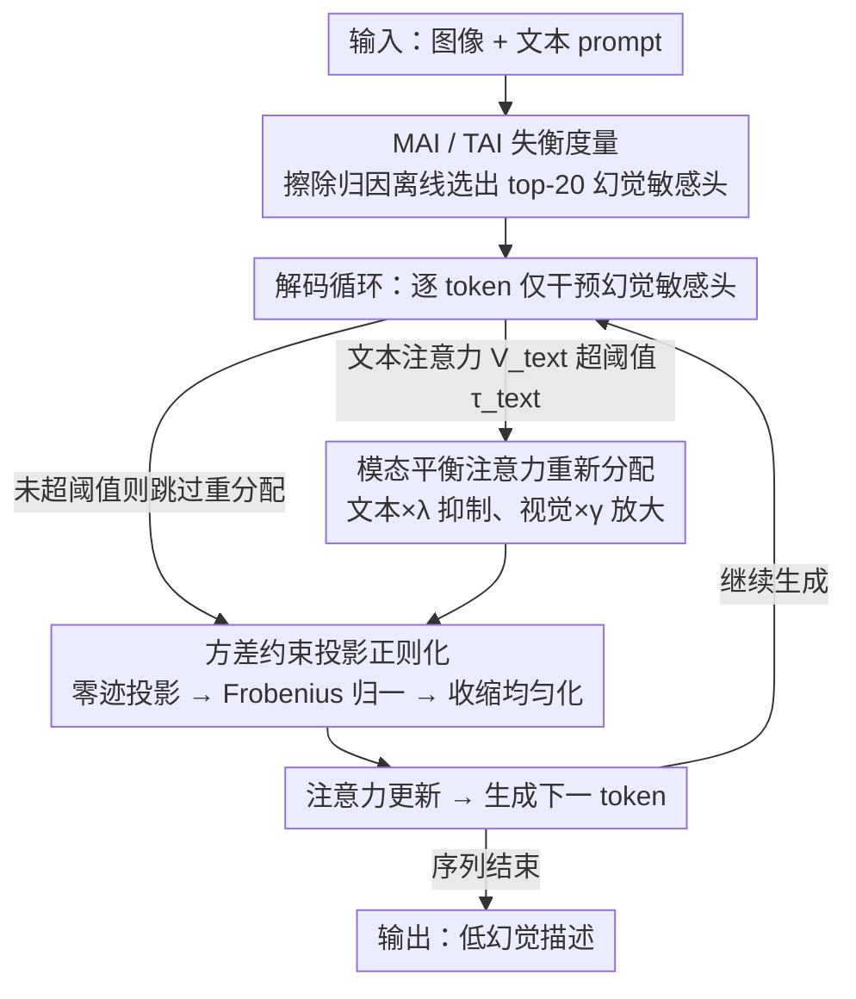

# Mitigating Object Hallucination in LVLMs via Attention Imbalance Rectification

**会议**: CVPR 2026  
**arXiv**: [2603.24058](https://arxiv.org/abs/2603.24058)  
**代码**: 无  
**领域**: 幻觉检测  
**关键词**: 大视觉语言模型, 对象幻觉, 注意力失衡, 解码时干预, 注意力矫正

## 一句话总结

提出注意力失衡（Attention Imbalance）概念来解释 LVLM 中的对象幻觉现象，并设计轻量级解码时干预方法 AIR，通过跨模态注意力重新分配和方差约束投影正则化矫正注意力失衡，在四个 LVLM 上将幻觉率最高降低 35.1%，同时提升通用能力最高达 15.9%。

## 研究背景与动机

1. **领域现状**：大视觉语言模型（LVLM）在跨模态理解任务上表现优异，但对象幻觉（生成图像中不存在的物体描述）严重损害了模型在自动驾驶、医学影像等高风险场景的可靠性。
2. **现有痛点**：现有方法分三类——视觉指令微调（高训练成本）、后处理技术（额外推理开销）、对比解码（稳定性和泛化性有限）。更根本的问题是，幻觉的根因分析仍然不充分。
3. **核心矛盾**：LVLM 复杂的训练流程和架构阻碍了可解释性分析，现有从视觉信息交互、位置编码、异常 token 等角度的研究未能提供全面的理解。
4. **本文目标** （1）提供一个定量框架来解释幻觉的注意力机制根因；（2）基于此设计无需训练的轻量级干预方法。
5. **切入角度**：作者通过系统性实验发现注意力分配失衡——包括模态间和 token 间——与对象幻觉存在强因果相关。
6. **核心 idea**：幻觉源于注意力失衡，矫正幻觉敏感注意力头的跨模态和 token 级失衡即可有效缓解。

## 方法详解

### 整体框架

AIR 的出发点是把"对象幻觉"翻译成一个可观测、可干预的注意力问题：作者先用两个量化指标证明幻觉与注意力失衡强相关，再把矫正失衡的操作直接挂到解码循环里。它完全工作在推理时，不改任何权重——先用擦除归因法离线挑出一小撮"幻觉敏感头"，然后在生成每个 token 时只对这些头做两件事：当它们过度盯着文本时，把权重从文本 token 搬一部分到视觉 token；当它们把注意力过度堆在某个 token 上时，把分布重新摊平。两步分别对应模态级和 token 级的失衡，叠加起来在不损伤正常能力的前提下压制幻觉。

### 关键设计

**1. 注意力失衡的两个度量（MAI + TAI）：先把"幻觉的根因"做成可量化的数**

方法的整个干预逻辑都建立在两个自定义指标上，所以它们必须先有严格定义。模态级失衡 MAI（Modality-wise Attention Imbalance）是两种模态接收到的总注意力之比

$$\text{MAI}(M_p, M_q) = \frac{A_{M_p}}{A_{M_q}}$$

值远大于 1 就说明 $M_p$（通常是文本）在抢占注意力。Token 级失衡 TAI（Token-wise Attention Imbalance）则把单个 token 拿到的注意力比例除以它实际承载的信息贡献比例，值远大于 1 意味着这个 token 被过度关注、名不副实。这两个数不是装饰——作者用它们做了关键的因果观测：幻觉敏感头的 MAI 高达 5.1，而不敏感头只有 1.5；并且一旦某个 token 的 TAI 飙高，后续 15 个 token 之内几乎必然冒出幻觉。正是这两条规律，把"在哪些头、在什么时刻、朝哪个方向"该干预这件事彻底确定了下来。

**2. 模态平衡注意力重新分配：把被文本抢走的注意力还给图像**

这一步针对 MAI 偏高的问题。作者发现幻觉敏感头其实"继承"了底座语言模型的纯文本注意力习惯——它们的注意力模式与基座 LM 的余弦相似度高达 0.81，而不敏感头只有 0.69，说明视觉对齐训练没能扭过这些头对文本的偏好。于是 AIR 在每个解码步对这些头统计文本 token 拿到的累积注意力 $V^{\text{text}}$，一旦超过阈值 $\tau_{\text{text}}$（默认 0.3）就动手：文本 token 的权重乘以一个抑制系数 $\lambda \in [0,1]$（默认 0.1），视觉 token 的权重乘以一个放大系数 $\gamma > 1$（默认 3.5）。因为只碰这一小撮被点名的头、且只在文本确实越界时触发，模型的正常文本能力基本不受影响，被挤出去的注意力却能精准回流到图像证据上。

**3. 方差约束投影正则化：不让注意力全堆在一个 token 上**

这一步针对 TAI 偏高的问题——TAI 分析显示幻觉爆发前总有某个 token 吃掉了过量注意力（极端时如 `<0x0A>` 换行 token 的 TAI 值达到 98），而这种过度集中正是"雪球式"幻觉的引信。AIR 用三步把这种尖峰摊平：先按谱能量对 $W_{\text{QK}}$ 做自适应缩放，避免不同头量级差异带来的偏差；再做零迹投影去掉 token 对自己的自对齐偏置

$$\hat{A} = A - \frac{\text{tr}(A)}{L}\,I$$

最后在用 Frobenius 能量归一化保持整体量级（记为 $\tilde{A}$）之后，做一次收缩正则化把分布往均匀方向拉

$$A^* = (1-\beta)\,\tilde{A} + \beta \cdot \text{mean}(\tilde{A}) \cdot \mathbf{1}$$

其中 $\beta$（默认 0.3）控制摊平的力度。这样既保住了注意力的整体能量、不破坏正常对齐，又削掉了那些会触发幻觉传播的孤立尖峰。

### 损失函数 / 训练策略

AIR 是纯推理时方法，**不需要任何训练**，所以这里没有损失函数，只有两件准备工作。其一是离线挑出幻觉敏感头：用擦除归因法（erasure-based attribution）逐一移除每个注意力头、观察幻觉概率的变化，把影响最大的 top-20 个头选出来作为干预目标。其二是固定一组超参数：$\tau_{\text{text}}=0.3$、$\lambda=0.1$、$\gamma=3.5$、$\xi=0.01$、$\beta=0.3$。

## 实验关键数据

### 主实验

CHAIR 幻觉评估（Max New Tokens=256）：

| LVLM | 指标 | AIR (Ours) | 最优基线 (AD-HH) | 改进 |
|------|------|------|----------|------|
| LLaVA-1.5 | $C_S$ ↓ | **28.8** | 35.2 | -18.1% |
| MiniGPT-4 | $C_S$ ↓ | **21.3** | 32.8 | -35.1% |
| InstructBLIP | $C_S$ ↓ | **30.1** | 36.0 | -16.4% |
| Shikra | $C_S$ ↓ | **30.3** | 36.9 | -17.9% |

MM-Vet 通用能力：

| LVLM | AIR Overall | Greedy Overall | 提升 |
|------|------------|----------------|------|
| LLaVA-1.5 | **32.0** | 27.6 | +15.9% |
| MiniGPT-4 | **22.0** | 20.0 | +10.0% |

### 消融实验

| 配置 | $C_S$ ↓ | $C_I$ ↓ | MM-Vet ↑ | 说明 |
|------|---------|---------|----------|------|
| Greedy (baseline) | 51.8 | 13.7 | 27.6 | 无干预 |
| R-only（仅重分配） | 32.1 | 9.9 | 30.5 | 文本抑制+视觉放大有效 |
| P-only（仅投影正则） | 38.4 | 11.2 | 29.8 | 均匀化注意力有效 |
| Full AIR | **28.8** | **8.6** | **32.0** | 两者互补，最佳 |

### 关键发现

- 注意力重分配贡献更大（$C_S$ 从 51.8 降到 32.1），说明跨模态失衡是幻觉主因
- AIR 独特之处在于**同时减少幻觉并提升通用能力**——其他方法（如 AD-HH）抗幻觉但通用能力下降 14.8%
- 幻觉敏感头主要集中在模型中间层，与先前研究一致
- 高 TAI token 与幻觉的共现现象在四个 LVLM 上一致出现，说明注意力失衡是通用的幻觉根因
- 幻觉存在"雪球效应"——一个幻觉词会触发后续更多幻觉

## 亮点与洞察

- **因果链路清晰**：从 TAI/MAI 定义 → 共现验证 → 头级别归因 → 继承假说验证，形成了完整的幻觉因果分析链。这不仅是方法论贡献，更是对 LVLM 可解释性的重要推进。
- **零训练开销**：AIR 完全在推理时操作，不引入额外参数或训练成本，极具实用性。
- **发现幻觉敏感头继承基座 LM 模式**：这一发现暗示 LVLM 的视觉对齐训练未能充分改变某些注意力头的纯文本偏好，为未来训练策略改进提供了方向。

## 局限与展望

- 幻觉敏感头的选取需要预先通过擦除法分析，增加了部署前的准备工作
- $\tau_{\text{text}}$、$\lambda$、$\gamma$ 等超参数可能需要针对不同模型调整
- 仅验证了 7B 级别模型，更大模型（70B+）上的效果未知
- 可探索将 AIR 的洞察融入训练阶段，设计注意力平衡的微调目标

## 相关工作与启发

- **vs VCD (ICLR24)**: VCD 通过对比不加/加视觉输入的输出分布来削弱语言先验，但在某些 LVLM 上反而加剧幻觉（LLaVA-1.5 上 $C_S$ 从 51.8 升至 59.4）。AIR 直接操作注意力权重更精准。
- **vs OPERA (ICML24)**: OPERA 通过惩罚过度关注摘要 token 来缓解幻觉，但仅关注 token 级别。AIR 同时解决模态级和 token 级失衡。
- **vs AD-HH**: 前最优基线，但通用能力下降 14.8%。AIR 在幻觉缓解上更强且通用能力反而提升，说明注意力矫正是更正确的干预方向。

## 评分

- 新颖性: ⭐⭐⭐⭐⭐ 注意力失衡概念及 MAI/TAI 定义是全新贡献，从可解释性角度推导出干预方法的因果链路非常优雅
- 实验充分度: ⭐⭐⭐⭐⭐ 四个 LVLM、三个基准、七个基线、详细消融和超参分析
- 写作质量: ⭐⭐⭐⭐⭐ 数学定义严谨，分析递进清晰，图表信息量大
- 价值: ⭐⭐⭐⭐⭐ 同时解决幻觉和通用能力退化问题，无需训练即可部署，实用价值极高

<!-- RELATED:START -->

## 相关论文

- [\[AAAI 2026\] Causally-Grounded Dual-Path Attention Intervention for Object Hallucination Mitigation in LVLMs](../../AAAI2026/hallucination/causally-grounded_dual-path_attention_intervention_for_objec.md)
- [\[CVPR 2026\] HulluEdit: Single-Pass Evidence-Consistent Subspace Editing for Mitigating Hallucinations in LVLMs](hulluedit_subspace_editing_hallucination.md)
- [\[ICML 2026\] Finding the Correct Visual Evidence Without Forgetting: Mitigating Hallucination in LVLMs via Inter-Layer Visual Attention Discrepancy](../../ICML2026/hallucination/finding_the_correct_visual_evidence_without_forgetting_mitigating_hallucination_.md)
- [\[CVPR 2026\] Reallocating Attention Across Layers to Reduce Multimodal Hallucination](reallocating_attention_across_layers_to_reduce_multimodal_hallucination.md)
- [\[CVPR 2026\] Tell Model Where to Look: Mitigating Hallucinations in MLLMs by Vision-Guided Attention](tell_model_where_to_look_mitigating_hallucinations_in_mllms_by_vision-guided_att.md)

<!-- RELATED:END -->
