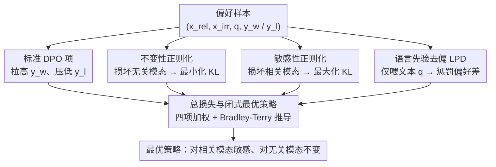

# MoD-DPO: Towards Mitigating Cross-modal Hallucinations in Omni LLMs using Modality Decoupled Preference Optimization

**会议**: CVPR2026  
**arXiv**: [2603.03192](https://arxiv.org/abs/2603.03192)  
**代码**: 待确认  
**领域**:幻觉检测
**关键词**: omni LLM, cross-modal hallucination, DPO, modality decoupling, audio-visual, preference optimization

## 一句话总结
提出 MoD-DPO（Modality-Decoupled DPO），通过不变性正则化、敏感性正则化和语言先验去偏三个机制解耦多模态 LLM 中各模态的贡献，有效缓解跨模态幻觉（如用听觉信息回答视觉问题），并推导出闭式最优策略。

## 背景与动机
全模态 LLM（Omni LLM）同时处理文本、视觉、音频等多种模态输入，是当前多模态智能的前沿方向。然而，这类模型面临一个独特且严重的问题——**跨模态幻觉（cross-modal hallucination）**：

1. **虚假相关性（Spurious Correlations）**：训练数据中不同模态的信息经常共现（如看到"狗"的画面时通常伴随"吠叫"的声音），模型学会利用这种统计相关性"走捷径"。当测试时这种相关性不成立时（如看到狗但没有声音），模型仍然会虚构另一个模态的信息
2. **语言先验支配（Dominant Language Priors）**：Omni LLM 的骨干通常是预训练的 LLM，其强大的语言先验会覆盖真实的多模态感知。例如，模型可能忽略实际音频内容，仅根据文本 prompt 中的线索（如"What sound..."）胡编一个"合理"的声音描述
3. **模态间干扰**：当一个模态的输入质量差或不相关时，模型不能正确忽略它，反而会被干扰

具体例子：给 Omni LLM 一个视频及问题"视频中的人在说什么？"，即使音频轨道被完全静音，模型也可能根据视觉中人的嘴型/场景"脑补"一段对话内容——这就是跨模态幻觉。

现有方法（如 vanilla DPO、mDPO）将多模态输入视为整体进行偏好优化，没有区分各模态的独立贡献，因此无法精准解决跨模态幻觉问题。

## 核心问题
如何让 Omni LLM 正确区分各模态的贡献——对相关模态敏感、对无关模态不敏感——从而消除跨模态幻觉？

## 方法详解

### 整体框架
Omni LLM 的输入含 $M$ 个模态 $\{x^1, \ldots, x^M\}$ 加文本 prompt $q$，输出文本回答 $y$。对某个具体问题 $q$，只有部分模态**相关**（记 $x^{rel}$），其余**无关**（记 $x^{irr}$）。跨模态幻觉的本质是模型"看错了该看的"——要么对无关模态 $x^{irr}$ 的变化过度敏感（被无关信息带偏），要么对相关模态 $x^{rel}$ 的变化不够敏感（没真正在看）。MoD-DPO 的解法是在标准 DPO 之上，加三个正则项分别校正这两种偏差和语言先验偏差，让模型"对该看的敏感、对不该看的免疫、不靠背词典作答"。整体结构是从同一条偏好样本派生出四路并行计算：标准 DPO 项管偏好排序，另外三个正则项各自把输入按特定方式"损坏"后比较模型输出，最后加权汇合成总损失，并由此推出闭式最优策略。

### 关键设计

**1. 不变性正则化：无关模态变了，输出不该变**

把无关模态换成噪声或别的样本，模型输出应保持稳定。给定原始输入 $(x^{rel}, x^{irr}, q)$ 和"损坏"输入 $(x^{rel}, \tilde{x}^{irr}, q)$，最小化两者输出分布的 KL：

$$\mathcal{L}_{\text{inv}} = D_{\text{KL}}\big(\pi_\theta(\cdot | x^{rel}, x^{irr}, q) \| \pi_\theta(\cdot | x^{rel}, \tilde{x}^{irr}, q)\big)$$

KL 越小，说明无关模态变动时输出越稳——即模型没被无关信息牵着走。

**2. 敏感性正则化：相关模态变了，输出必须变**

反过来，把相关模态损坏成 $\tilde{x}^{rel}$，模型应"察觉"输入变了、输出随之改变。目标是**最大化** KL（loss 取负）：

$$\mathcal{L}_{\text{sen}} = -D_{\text{KL}}\big(\pi_\theta(\cdot | x^{rel}, x^{irr}, q) \| \pi_\theta(\cdot | \tilde{x}^{rel}, x^{irr}, q)\big)$$

与第 1 项正好相反：这一项逼模型真的"盯着"相关模态看，而不是无视它。

**3. 语言先验去偏（LPD）：别只靠文本就敢答**

针对"语言先验支配"——模型不看模态、光凭 prompt 的统计规律就自信作答。引入惩罚项，其中 $\pi_\theta(\cdot|q)$ 是**只给文本、不给任何模态**时的输出：

$$\mathcal{L}_{\text{LPD}} = \log \pi_\theta(y_w | q) - \log \pi_\theta(y_l | q)$$

$y_w / y_l$ 是 preferred/rejected 回答。如果模型仅凭文本就能拉开 $y_w$ 和 $y_l$，说明它在吃语言先验而非真感知——这一项就压制这种倾向。

**4. 总损失与闭式最优策略**

四项加权合成：

$$\mathcal{L}_{\text{MoD-DPO}} = \mathcal{L}_{\text{DPO}} + \alpha \cdot \mathcal{L}_{\text{inv}} + \gamma \cdot \mathcal{L}_{\text{sen}} + \lambda \cdot \mathcal{L}_{\text{LPD}}$$

作者仿原始 DPO 的 Bradley-Terry 推导，给出 MoD-DPO 的**闭式最优策略**，证明最优解天然满足"对相关模态敏感、对无关模态不变"。

### 一个完整 walkthrough（一条"视觉问题"训练样本）
1. **取样本**：视频里有人弹吉他（视觉=相关），背景有钢琴声（音频=无关），问"画面里的人在弹什么乐器？"，$y_w$="吉他"、$y_l$="钢琴"。
2. **$\mathcal{L}_{\text{DPO}}$**：拉高 $y_w$、压低 $y_l$ 的偏好。
3. **不变性项**：把音频换成噪声 → 要求输出仍是"吉他"（KL→0），防止模型被钢琴声带偏答成"钢琴"。
4. **敏感性项**：把画面（相关）打乱 → 要求输出发生变化（KL 变大），逼模型确实在看画面而非瞎猜。
5. **LPD 项**：只喂文本"在弹什么乐器"——若模型此时仍偏向"吉他/钢琴"，说明在吃语言先验，惩罚之。
6. **合梯度**：四项一起更新，模型学会"盯画面、忽略背景音、不靠文本套路"。

这条链把三个抽象 loss 落到一条样本上：inv 管"别被无关音频带偏"、sen 管"真去看画面"、LPD 管"别背词典"。

### 训练策略
- **偏好数据自动构建**：从 10.8k 视频出发自动造 18.1k 偏好样本——用 GPT-4o 生成针对不同模态的问题（视觉/音频/联合），对每题通过损坏相关/无关模态采集模型在不同条件下的回答，再按回答的模态一致性自动判定 preferred/rejected。
- **效率优化**：损坏输入的 forward 只用于算 KL 目标、不需梯度，故用 `torch.no_grad()` 执行；整体只需标准 DPO 约 **1/4 训练 epoch** 即收敛。

## 实验关键数据

### AVHBench（Audio-Visual Hallucination Benchmark）

| 方法 | Visual Acc ↑ | Audio Acc ↑ | Joint Acc ↑ | Avg ↑ |
|------|-------------|-------------|-------------|-------|
| Vanilla SFT | 61.2 | 58.7 | 55.3 | 58.4 |
| Vanilla DPO | 65.8 | 62.1 | 59.4 | 62.4 |
| mDPO | 67.3 | 63.5 | 60.1 | 63.6 |
| OmniDPO | 68.1 | 64.2 | 61.8 | 64.7 |
| **MoD-DPO** | **73.5** | **70.8** | **68.2** | **70.8** |

### CMM Benchmark（Cross-Modal Mismatch）

| 方法 | Audio→Visual ↓ | Visual→Audio ↓ | Language Prior ↓ | Overall Score ↑ |
|------|----------------|----------------|------------------|----------------|
| Vanilla DPO | 28.3 | 31.5 | 35.2 | 62.4 |
| mDPO | 25.1 | 28.7 | 32.8 | 63.6 |
| OmniDPO | 23.4 | 26.3 | 30.1 | 64.7 |
| **MoD-DPO** | **15.2** | **17.6** | **19.8** | **70.8** |

（↓ 表示跨模态幻觉率越低越好）

### 消融实验
- **不变性正则化**：去掉后 Audio→Visual 幻觉率增加 5.3%，说明不变性是抑制无关模态干扰的关键
- **敏感性正则化**：去掉后 Visual Acc 下降 3.2%，说明敏感性帮助模型更好地利用相关模态
- **LPD**：去掉后 Language Prior 幻觉率增加 8.1%，证实了语言先验去偏的必要性
- **训练效率**：MoD-DPO 在 1/4 epoch 后性能即超过 vanilla DPO 的完整训练，4 epoch 后进一步提升

## 亮点
- **问题定义精准**：跨模态幻觉是 Omni LLM 的核心问题，本文是首批系统性研究并提出解决方案的工作之一
- **模态解耦的三重机制**：不变性（对无关模态稳定）+ 敏感性（对相关模态响应）+ 语言去偏（抑制文本支配）三管齐下，设计逻辑完整
- **理论支撑**：推导出闭式最优策略，不是纯经验性的 loss 设计
- **自动数据构建**：从 10.8k 视频自动生成 18.1k 偏好样本，无需人工标注，可扩展性强
- **训练效率高**：无梯度 forward pass + 快速收敛，仅需 1/4 epoch 即可超越完整训练的 baseline

## 局限与展望
1. **模态数量限制**：当前主要在音视频两个模态上验证，扩展到更多模态（如触觉、深度、点云）时，损坏策略和正则化的设计可能需要调整
2. **相关/无关模态的判定**：自动数据生成依赖于预定义的"哪个模态与问题相关"规则，对于模态边界模糊的问题（如"描述整个场景"涉及所有模态）不完全适用
3. **损坏方式的影响**：不变性/敏感性正则化的效果可能依赖于损坏操作的具体方式（随机噪声 vs 替换为其他样本 vs 完全移除），不同损坏方式的比较不充分
4. **闭式解的实际差距**：虽然推导了闭式最优策略，但实际训练是近似优化，两者之间的差距未被量化
5. **只关注幻觉缓解**：对 Omni LLM 的整体能力（如多模态理解、生成质量）是否有退化未充分评估

## 评分
- 新颖性: ⭐⭐⭐⭐⭐ 首次系统性解决 Omni LLM 跨模态幻觉，模态解耦思路新颖
- 实验充分度: ⭐⭐⭐⭐ 在两个 benchmark 上验证，消融完整，但仅限音视频两个模态
- 写作质量: ⭐⭐⭐⭐ 问题动机清晰，方法推导严谨
- 价值: ⭐⭐⭐⭐ 切中 Omni LLM 的核心痛点，方法可推广到更多多模态场景

<!-- RELATED:START -->

## 相关论文

- [\[CVPR 2026\] MAD: Modality-Adaptive Decoding for Mitigating Cross-Modal Hallucinations in Multimodal Large Language Models](mad_modality-adaptive_decoding_for_mitigating_cross-modal_hallucinations_in_mult.md)
- [\[NeurIPS 2025\] Mitigating Hallucination Through Theory-Consistent Symmetric Multimodal Preference Optimization](../../NeurIPS2025/hallucination/mitigating_hallucination_through_theory-consistent_symmetric_multimodal_preferen.md)
- [\[CVPR 2026\] Cross-Modal Attention Calibration for LVLM Hallucination Mitigation](cross-modal_attention_calibration_for_lvlm_hallucination_mitigation.md)
- [\[ACL 2025\] CCHall: A Novel Benchmark for Joint Cross-Lingual and Cross-Modal Hallucinations Detection in Large Language Models](../../ACL2025/hallucination/cchall_a_novel_benchmark_for_joint_cross-lingual_and_cross-modal_hallucinations_.md)
- [\[CVPR 2026\] KVSmooth: Mitigating Hallucination in Multi-modal Large Language Models through Key-Value Smoothing](kvsmooth_mitigating_hallucination_in_multi-modal_large_language_models_through_k.md)

<!-- RELATED:END -->
