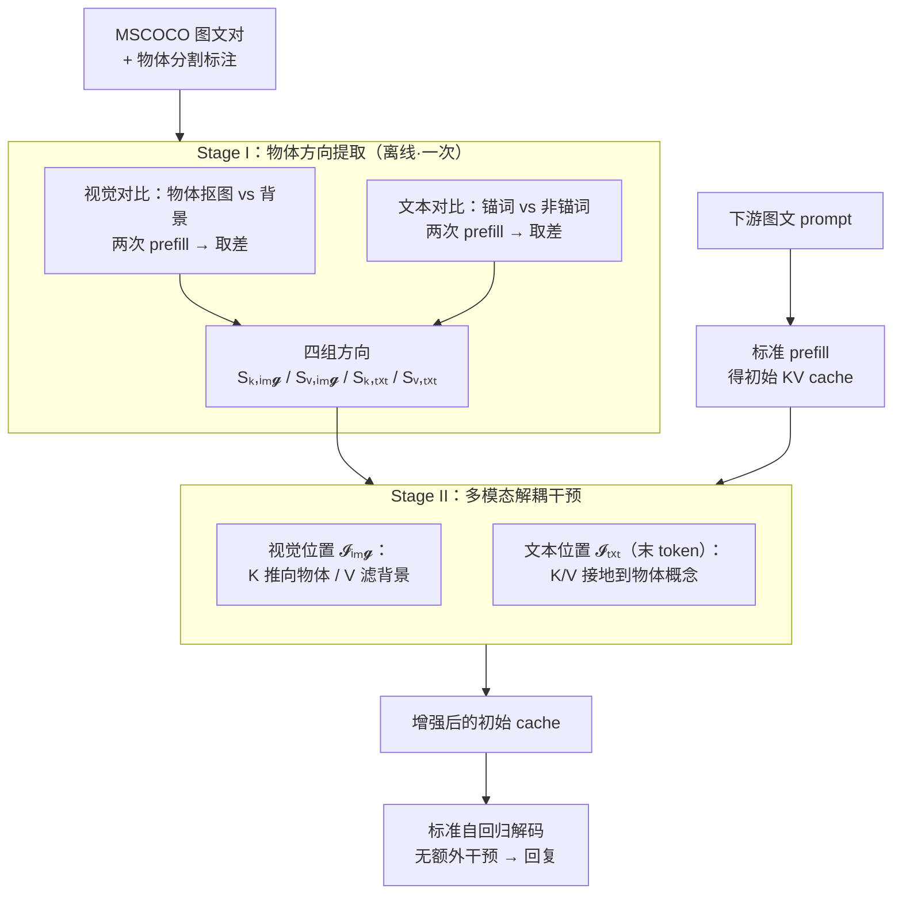

# Prefill-Time Intervention for Mitigating Hallucination in Large Vision-Language Models

**会议**: CVPR 2026  
**arXiv**: [2604.25642](https://arxiv.org/abs/2604.25642)  
**代码**: https://github.com/huaiyi66/PTI  
**领域**: 多模态VLM / 幻觉缓解  
**关键词**: LVLM幻觉、KV cache、steering vector、prefill干预、模态解耦

## 一句话总结
PTI 把缓解 LVLM 幻觉的 steering 干预从「逐 token 的解码阶段」前移到「只做一次的 prefill 阶段」，对初始 KV cache 施加模态感知、key/value 解耦的方向向量，从源头修正易致幻表征，在三个 LVLM、五个 benchmark 上超过现有解码期方法，且能与它们即插即用叠加。

## 研究背景与动机
**领域现状**：大视觉语言模型（LVLM）能力强但爱「幻觉」——生成图里根本不存在的物体、错误属性或不存在的关系。免训练的主流缓解路线是**解码期干预（Decoding-Time Intervention, DTI）**：从对比样本里抽出一个 steering vector，在解码的每一步都加到模型的 hidden states 上，把行为「掰」向更忠于视觉的方向（如 VTI、VISTA、PAI）。

**现有痛点**：作者观察到一个反直觉现象——DTI 虽然降低了幻觉的**频率**，却放大了残余幻觉的**严重度**，表现为「雪球幻觉（snowball hallucination）」：一旦开头生成了一个错误 token，持续干预反而压不住它的传播，错误沿着自回归一路滚大。论文用 PSH 指标量化这种级联程度，定义为 $\text{PSH}=\frac{\text{Snowball Hallucinations}}{\text{Overall Hallucinations}}\times 100\%$，在 CHAIR 上证实 DTI 把 PSH 推高了。

**核心矛盾**：DTI 的失败被归因到三个维度——**how / what / when**。① how：它通常只从**文本**状态导出一个统一向量（modality-agnostic），无视文本解码器对视觉表征的特殊敏感性，反而加剧了播下初始错误的模态错配；② what：它作用在**粗粒度**的 hidden states 上，修不了细粒度的视觉感知错误；③ when（最致命）：它是**反应式**的，在「一个没接好地的表征已经算出来之后」才在解码期持续介入，错误早已成形并开始滚雪球。

**本文目标**：与其在解码期反复补救，不如在**源头**——表征刚成形的 prefill 阶段——一次性把初始状态塑造好。

**切入角度**：Transformer-based LVLM 的初始状态物化为 prefill 阶段构建的 **KV cache**。KV cache 不只是存储模块，它通过 attention 主动塑造后续**每一步**解码。已有工作（推理加速、长上下文）证明操纵 KV cache 能显著影响整段生成，所以它是天然的干预点。

**核心 idea**：提出 **Prefill-Time Intervention（PTI）**——只在 prefill 阶段对初始 KV cache 干预**一次**（proactive，解决 when）；对视觉/文本 token 分别导出方向（modality-aware，解决 how）；干预细粒度的 K/V 而非粗粒度 hidden states（解决 what），并利用 key 决定「往哪看」、value 决定「聚合什么」的天然分工，**解耦**地把 key 推向有视觉依据的物体、把 value 用于过滤背景噪声。

## 方法详解

### 整体框架
PTI 的核心是一个两阶段、训练无关的流程。**输入**是下游任务的图文 prompt，**输出**是幻觉更少的生成回复，中间唯一的改动发生在 prefill 算出初始 KV cache 之后、解码开始之前。

- **Stage I（离线·方向提取）**：在 MSCOCO 上构造「物体 vs 背景」的对比样本，分别在**视觉**和**文本**两条独立支路上各做两次 prefill 前向（正样本/负样本），用正负 cache 的差值导出 steering 方向。视觉和文本各自再拆出 **key 方向**和 **value 方向**，于是一共得到四组方向 $S_{\text{k,img}}, S_{\text{v,img}}, S_{\text{k,txt}}, S_{\text{v,txt}}$（逐层、对 N 个样本平均后再做 PCA 去噪）。这套方向是 task-agnostic 的，只需提取一次。
- **Stage II（在线·下游干预）**：下游样本正常 prefill 得到初始 cache 后，把上面四组方向按 token 位置注入——视觉方向只加到视觉 token 位置 $\mathcal{I}_{\text{img}}$、文本方向只加到文本 token 位置 $\mathcal{I}_{\text{txt}}$，对所有层都做。增强后的 cache 作为「接好地」的初始状态交回解码器，之后走完全标准的自回归解码，**不再有任何额外干预**，开销可忽略。

### 关键设计

**1. Prefill-time 一次性干预：把「补救」换成「塑形」**

针对 DTI「反应式、错误已成形后才介入」的 when 痛点，PTI 只在 prefill 阶段对初始 KV cache 动一次手，之后解码完全照旧。理由是：KV cache 是后续每一步 attention 的上下文来源，从一开始就给一个「接好地」的初始状态，等价于在错误能够累积之前就掐断雪球的起点；而 DTI 在每个 token 上反复加同一个向量，既贵又会把已经错的表征越推越偏。代价上，因为只改初始 cache、不碰解码循环，PTI 几乎零额外开销，这也是它能和解码期方法叠加的前提。

**2. 模态感知 + 位置敏感：视觉全局、文本精准**

针对 DTI「只用文本状态导出统一向量」的 how 痛点，PTI 对视觉和文本分别导出方向，并且**注入位置不同**。视觉方向加到**全部视觉 token**（$\mathcal{I}_{\text{img}}$），因为视觉感知错误是弥散在整张图的表征里的；文本方向只加到**输入序列的最后一个文本 token**（index $N_x{-}1$），因为它最接近即将开始的生成状态，精准纠偏的收益最大。消融（Table 5）正是这个「视觉 all tokens、文本 last token」组合给出最优结果，印证了二者最佳作用粒度本就不同——视觉宜「广」、文本宜「准」。

**3. Key/Value 解耦：key 改「往哪看」、value 改「看到什么」**

针对 DTI「干预粗粒度 hidden states」的 what 痛点，PTI 直接作用在 attention 内部的 K 和 V 上，并利用二者天然分工解耦干预。**视觉方向提取**：给定图像 $I^i$ 和物体分割 $M^i_{\text{obj}}$，正样本是抠出物体 $I^i_{\text{pos}}=I^i\odot M^i_{\text{obj}}$、负样本是只剩背景 $I^i_{\text{neg}}=I^i\odot(1-M^i_{\text{obj}})$；两次 prefill 后取正负 cache 之差并在视觉 token 维做平均池化：
$$\Delta C^{i,l}_{\text{img}}=\text{AP}(C^{i,l}_{\text{pos}}-C^{i,l}_{\text{neg}})[\mathcal{I}_{\text{img}}],\quad C\in\{K,V\}$$
得到 key 方向 $S_{\text{k,img}}$ 和 value 方向 $S_{\text{v,img}}$。**文本方向提取**：用 NLP 工具把 caption 里的物体锚词（如 "cat"、"vehicle"）当正样本 $T_{\text{pos}}$、其余非锚词当负样本 $T_{\text{neg}}$，同样两次 prefill、在末 token 取差。下游注入是简单的加性平移（带强度系数 $\lambda$ 和归一化）：
$$\tilde{K}^l[\mathcal{I}_{\text{img}}]\mathrel{+}=\lambda_{\text{k,img}}S^l_{\text{k,img}},\quad \tilde{V}^l[\mathcal{I}_{\text{img}}]\mathrel{+}=\lambda_{\text{v,img}}S^l_{\text{v,img}}$$
可解释性分析（Figure 5）显示二者效果不同：**key 干预**缓解了生成过程中视觉注意力的全局衰减、并把注意力聚焦到物体局部细节（「往哪看」）；**value 干预**则用「物体 vs 背景」这一最大对比信号过滤背景噪声、增强鲁棒性（「聚合什么」），其中物体-背景对比比随机遮挡对比的去幻效果好得多（CHAIR$_I$ 降 9.7%）。

### 损失函数 / 训练策略
PTI **完全免训练、无可学习参数**。方向从仅 100 对随机抽取的 MSCOCO VQA holdout 上一次性提取，逐层平均后再用 SVD 做 PCA 去噪。唯一的「超参」是四个强度系数 $\lambda_{\text{k,img}},\lambda_{\text{v,img}},\lambda_{\text{k,txt}},\lambda_{\text{v,txt}}$，实验中令 $\lambda_{\text{k,img}}{=}\lambda_{\text{k,txt}}$、$\lambda_{\text{v,img}}{=}\lambda_{\text{v,txt}}$，通过 grid search 选最优值。

## 实验关键数据

评测覆盖三个架构各异的 LVLM（LLaVA-1.5、Qwen-VL-Chat、DeepSeek-VL-Chat）、三种解码策略（Greedy / Beam Search / Nucleus Sampling）、五个 benchmark（CHAIR、POPE、AMBER、MMHal、MME），baseline 为免训练 SOTA（PAI、VTI、VISTA、VCD、OPERA）。

### 主实验

CHAIR 物体幻觉（越低越好，500 张 MSCOCO 详细描述，max 512 token）：

| 解码 / 模型 | 指标 | Vanilla | VISTA(次优) | PTI | PTI 相对 Vanilla |
|------|------|------|------|------|------|
| Greedy · LLaVA-1.5 | CHAIR$_S$ | 47.4 | 20.4 | **15.4** | ↓32.0 |
| Greedy · LLaVA-1.5 | CHAIR$_I$ | 13.7 | 6.9 | **5.4** | ↓8.3 |
| Beam · Qwen-VL | CHAIR$_S$ | 43.6 | 30.0 | **18.8** | ↓24.8 |
| Beam · DeepSeek-VL | CHAIR$_S$ | 27.0 | 24.0 | **15.6** | ↓11.4 |

POPE（Acc/F1 越高越好，nucleus sampling）与综合 benchmark：

| Benchmark | 模型 | 指标 | Vanilla | PTI |
|------|------|------|------|------|
| POPE Adversarial | LLaVA-1.5 | Acc | 75.40 | **77.40** |
| POPE Average | Qwen-VL | Acc | 83.69 | **85.69** |
| MME（认知子集） | LLaVA-1.5 | Acc | 611.6 | **651.6**（↑40.0） |
| MME | Qwen-VL | Acc | 598.3 | **638.3**（↑40.0） |
| AMBER Sampling | LLaVA-1.5 | C$_I$↓ | 9.9 | **7.3** |

PTI 在大多数「模型 × 解码策略」组合上取得最优，且在 MME 上把三个模型的提升幅度（+40/+40/+20）拉到明显高于 VTI、VISTA。MMHal（GPT 打分，8 类问题）上 PTI 在 counting、spatial、attributes 这些需要细粒度物体感知的类别上尤其突出。

### 消融实验

干预模态与位置（LLaVA-1.5，Table 5）：

| 配置 | CHAIR$_S$↓ | CHAIR$_I$↓ | F1↑ | 说明 |
|------|------|------|------|------|
| Vanilla | 47.4 | 13.7 | 75.3 | 不干预 |
| 仅文本·last token | 40.8 | 12.0 | 76.5 | 文本精准纠偏，小幅降幻 |
| 仅文本·all tokens | 45.2 | 14.3 | 75.6 | 文本铺全反而变差 |
| 仅视觉·last token | 41.2 | 12.4 | 76.4 | 视觉只点一处效果有限 |
| 仅视觉·all tokens | 16.8 | 6.2 | 70.3 | 视觉全局：降幻最猛但 F1 掉 |
| **PTI（文本 last + 视觉 all）** | **15.4** | **5.4** | 72.7 | 视觉主攻 + 文本回补 F1 |

### 关键发现
- **视觉干预是降幻主力，但会牺牲生成质量**：仅视觉·all tokens 把 CHAIR$_S$ 从 47.4 砍到 16.8，但 F1 从 75.3 掉到 70.3——过度强调视觉细节会偏离语言连贯性；文本干预的作用是「精修 + 回补 F1」，二者组合才达到整体最优，PTI 本质是在「降幻」与「生成质量」之间求 trade-off。
- **模态各有最佳粒度**：视觉宜「全局铺开」（all tokens），文本宜「精准点一处」（last token），把它们对调都会变差，证明统一向量的 DTI 路线先天不足。
- **value 的最佳对比是「物体 vs 背景」**：随机遮挡对比在不同遮挡比例下饱和无差异，而物体-背景对比给出最大去幻信号（CHAIR$_I$ ↓9.7%）。
- **正交叠加 + 跨模型迁移**：PTI 叠在 PAI / VISTA 上仍有 +0.16~+1.83 的额外增益（Table 6）；从 LLaVA 提取的方向迁移到 Qwen（同 KV 维度）仍带来 +1.21 提升，说明方向捕捉到了一定程度模型无关的物体表征属性。

## 亮点与洞察
- **把「干预时机」当成一等设计维度**：以往工作几乎都默认在解码期动手，PTI 系统性地论证了 when（prefill vs decoding）才是雪球幻觉的根因所在——一次性塑形比持续补救更划算，这个 reframe 比具体公式更有启发性。
- **借 attention 的物理分工做解耦**：key 管「往哪看」、value 管「看到什么」是 Transformer 的固有性质，PTI 顺势把「聚焦物体」交给 key、「滤背景噪声」交给 value，干预语义清晰、可解释性强，而不是笼统地加一个向量。
- **几乎零成本的即插即用**：只改一次初始 cache、不碰解码循环，所以既快又能和任何解码期方法叠加——这让它更像一个「底座增强模块」而非互斥方案。
- **可迁移 trick**：「物体抠图 vs 纯背景」构造对比正负样本来提纯物体方向，比随机遮挡更干净，这个思路可迁移到任何需要「物体 vs 上下文」对比方向的视觉表征编辑任务。

## 局限性 / 可改进方向
- **作者承认的 trade-off**：强视觉干预会压低 F1（生成质量/语言连贯性），需要靠文本干预回补，说明「降幻」和「保质量」之间仍是手动平衡，没有自适应机制。
- **依赖分割标注与 NLP 工具**：方向提取需要 MSCOCO 的物体分割掩码和锚词解析工具，迁移到没有此类标注的域可能受限。
- **四个 $\lambda$ 靠 grid search**：强度系数需逐模型搜索且做了对称约束（key 系数相等、value 系数相等），未必是全局最优，也增加了部署调参成本。
- **跨模型迁移受 KV 维度限制**：迁移实验只能在 KV cache 维度相同的 LLaVA↔Qwen 之间做，对架构差异更大的模型能否迁移仍未知。
- **改进思路**：把 $\lambda$ 做成输入自适应或可学习；探索免分割标注的物体信号提取；在更长生成、视频 LVLM 上验证一次性 prefill 干预是否仍足够压制雪球。

## 相关工作与启发
- **vs DTI（VTI / VISTA / PAI）**：它们在解码期对每个 token 持续加统一向量、作用于粗粒度 hidden states；PTI 在 prefill 期只干预一次、模态/位置/K-V 三重解耦、作用于细粒度 KV cache。优势是从源头掐断雪球、开销近零、可叠加；劣势是需要分割标注提方向。
- **vs 视觉对比解码（VCD / OPERA）**：它们对比原图与扰动图的 logits、需要多轮解码，推理延迟高且可能丢失有益语言先验；PTI 不增加解码轮次，直接增强初始多模态 cache。
- **vs 并发的 pre-generation 增强工作**：一类训练可微 "coprocessor" 做预生成增强、一类借 GPT-4o 迁移推理风格到小模型；PTI 不需重训练、不依赖强力辅助模型，围绕「干预的模态与位置」做系统设计，更通用轻量。

## 评分
- 新颖性: ⭐⭐⭐⭐⭐ 把幻觉缓解从解码期前移到 prefill-time KV cache，并按 how/what/when 三维系统性重构干预范式，视角新颖。
- 实验充分度: ⭐⭐⭐⭐⭐ 3 模型 × 3 解码 × 5 benchmark，含跨模型迁移、正交叠加与 key/value 可解释性分析，证据链完整。
- 写作质量: ⭐⭐⭐⭐ 动机沿 how/what/when 推进清晰，但方法部分公式密集、需对照 Figure 才好懂。
- 价值: ⭐⭐⭐⭐⭐ 免训练、近零开销、即插即用且可与现有方法叠加，落地价值高。

<!-- RELATED:START -->

## 相关论文

- [\[CVPR 2026\] CausalLens: Sensitivity-Guided Multi-Head Causal Intervention for Hallucination Mitigation in Large Vision-Language Models](causallens_sensitivity-guided_multi-head_causal_intervention_for_hallucination_m.md)
- [\[CVPR 2026\] HulluEdit: Single-Pass Evidence-Consistent Subspace Editing for Mitigating Hallucinations in Large Vision-Language Models](hulluedit_single-pass_evidence-consistent_subspace_editing_for_mitigating_halluc.md)
- [\[CVPR 2026\] Envision, Attend, Then Respond: Counterfactual Hallucination Mitigation in Large Vision-Language Models](envision_attend_then_respond_counterfactual_hallucination_mitigation_in_large_vi.md)
- [\[CVPR 2026\] SEASON: Mitigating Temporal Hallucination in Video Large Language Models via Self-Diagnostic Contrastive Decoding](season_mitigating_temporal_hallucination_in_video_large_language_models_via_self.md)
- [\[CVPR 2026\] First Logit Boosting: Visual Grounding Method to Mitigate Object Hallucination in Large Vision-Language Models](first_logit_boosting_visual_grounding_method_to_mitigate_object_hallucination_in.md)

<!-- RELATED:END -->
