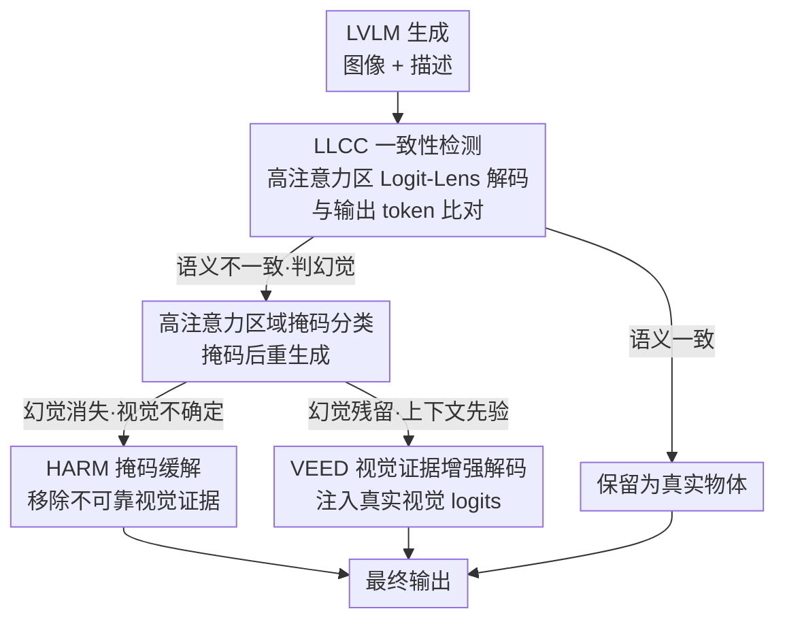

# Same Attention, Different Truths: Put Logit-Lens over Visual Attention to Detect and Mitigate LVLM Object Hallucination

**会议**: CVPR 2026  
**论文**: [CVF Open Access](https://openaccess.thecvf.com/content/CVPR2026/html/Wang_Same_Attention_Different_Truths_Put_Logit-Lens_over_Visual_Attention_to_CVPR_2026_paper.html)  
**代码**: https://github.com/wzczc/SADT  
**领域**: 多模态VLM  
**关键词**: 物体幻觉, LVLM, Logit Lens, 注意力分析, 免训练解码

## 一句话总结
本文用 Logit-Lens 重新审视 LVLM 物体幻觉，发现真实物体与幻觉物体在中后层"注意力强度其实一样"，关键不在"看多少"而在"看的地方解码出来是不是同一个东西"，据此把幻觉分成"视觉不确定"与"上下文先验"两类，并提出免训练的"检测—缓解"框架（LLCC 检测 + HARM 掩码 + VEED 解码增强），在多个幻觉基准上取得 SOTA。

## 研究背景与动机
**领域现状**：LVLM 物体幻觉（描述里出现图中不存在的物体）是可靠性的核心障碍。一种盛行观点把幻觉归因于"视觉注意力不足"——要么文本先验压制了视觉关注，要么视觉信息处理不当导致对显著区域关注不够；相应的缓解方法大多去**放大/重分配注意力**或注入额外视觉引导。

**现有痛点**：作者实测发现这个解释**不完整**。把物体 token 的逐层注意力强度量化后，视觉注意力在中后层（20–27 层，作者称"图像注意力阶段"）才达到峰值，而**真实物体 token 与幻觉物体 token 在这一阶段的图像注意力强度几乎没有系统性差异**（Fig. 1b）——两者都把注意力收敛到某些具体区域。所以"看得不够多"无法解释幻觉。

**核心矛盾**：问题不在 *how much* 模型看图，而在 *what* 看到、*why* 看那里。作者用 Logit Lens（拿模型的文本解码头把中间层视觉表示翻译成词）去"读"高注意力区的语义，发现**真实物体所在的高注意力区能被解码成与目标一致的 token，幻觉物体的高注意力区却解不出语义一致的 token**——这就是"Same Attention, Different Truths"：同样强的注意力，背后真相不同。

**本文目标**：(1) 用语义一致性而非注意力强度来检测幻觉；(2) 进一步弄清"模型为什么要关注这些区域"，并据因施治。

**切入角度**：对高注意力区做掩码再重生成，看幻觉是否消失。由此把幻觉分成两类：**视觉不确定**（掩码后幻觉消失，根在模糊/相似区域被强行解读）与**上下文先验**（掩码后幻觉仍在、注意力漂移到别处，根在共现先验主导，注意力只是"走流程"式的锚定）。在 LLaVA-1.5-7b 上两类比例约 2:1。

**核心 idea**：用"高注意力区 Logit-Lens 解码是否与输出一致"做检测，再对两类幻觉分别用"掩码"和"视觉证据增强解码"对症缓解。

## 方法详解

### 整体框架
本文是一个免训练的"检测—分类—缓解"流水线。给定图像与提示，模型正常生成描述；对每个生成 token，先在图像注意力阶段（mid-to-late 层）用平均图像注意力筛出**物体 token**，再对其高注意力区做 **Logit-Lens 一致性检测（LLCC）**——解码语义与该 token 不一致就判为幻觉。判为幻觉后，用**高注意力区域掩码**重生成来分类：幻觉消失 → "视觉不确定"（Type 1），幻觉残留 → "上下文先验"（Type 2）。Type 1 直接用 **HARM**（掩掉不可靠视觉证据）即可缓解；Type 2 对掩码不敏感，改用 **VEED**（把高注意力区的真实视觉语义注入解码 logits，压过先验）。整条链只在推理时操作、不改模型。

### 关键设计

**1. Logit-Lens 一致性检测（LLCC）：用"看的地方解码出什么"判幻觉，而非"看得够不够"**

针对"真假物体注意力强度一样、强度不可靠"这一痛点，LLCC 把检测建立在语义一致性上。先做**物体 token 定位**：在图像注意力阶段 $S_{IA}$ 上算每个生成 token 的平均图像注意力 $A_{\text{img}}(o_t)=\frac{1}{|S_{IA}|}\sum_{l\in S_{IA}}\sum_{j=1}^{N_{\text{img}}}\alpha^{(l)}_{tj}$，超过阈值 $\tau_{\text{attn}}$（设 0.15）的才当物体 token，省去对非物体 token 的无谓计算。再做**语义一致性检查**：取该 token 注意力 Top-$k$（$k=3$）的图像 token $\Omega_t$，对每个隐状态用 Logit Lens 解出最高概率词 $v_t^i=\arg\max_v\text{softmax}(W_U h(\omega_t^i))_v$，用 WordNet 语义相似度 $\text{Sim}(\cdot,\cdot)$ 判断：$\text{Sim}(o_t,v_t^i)>\tau_{\text{sim}}$（设 0.8）则判真实，否则判幻觉。这样它直接检验"生成是否被视觉证据支撑"，因果链比"看 logits 不确定性"或"跨层聚合"更紧。

**2. 高注意力区域掩码分类：用一次掩码-重生成区分两类病因**

检测到幻觉后还要判病因，因为"一刀切"缓解无效。沿用病因分析的做法：把该幻觉 token 的 Top-$k$ 高注意力图像 token 对应 patch 掩掉，重生成新序列 $O_{\text{new}}$，按幻觉是否还在分类——$o_t\notin O_{\text{new}}$ 判为 **Type 1 视觉不确定**（幻觉随证据被移除而消失，说明它扎根在那块模糊/相似区域），$o_t\in O_{\text{new}}$ 判为 **Type 2 上下文先验**（掩了还在、注意力漂到别处，说明真正主导生成的是共现先验，注意力只是"必须先看个地方"的程序性锚定）。这一步既是分类器、也产出 Type 1 的中间结果。

**3. HARM 高注意力区域掩码：对视觉不确定幻觉，直接抽掉错误证据**

Type 1 的根因是模型从高不确定区强行抽语义。HARM 用与分类同样的掩码：对所有幻觉 token 的 Top-$k$ 高注意力图像 token 集合 $\Omega$ 构造二值掩码 $M$，用替换值 $\mu$（图像均值色或全黑）得到 $I_{\text{mask}}=(1-M)\odot I+M\odot\mu$，再以同一提示在 $I_{\text{mask}}$ 上重生成。把"不可靠视觉锚点"移走后，模型失去了产生该幻觉的依据，幻觉自然消失——简单但精准，因为只动极少量被点名的 patch。

**4. VEED 视觉证据增强解码：对上下文先验幻觉，把真实视觉语义重新放大**

Type 2 对掩码免疫，根因是强先验压住了本来能解码正确的视觉证据。VEED 在解码阶段直接注入视觉语义：取最受关注区域隐状态的 Logit-Lens 视觉 logits $z_t^{\text{vis}}=W_U h(\omega_t^{\max})$，与掩码后模型 logits $z_t^{\text{mask}}=\text{logits}_\theta(y_t\mid y_{<t},I_{\text{mask}})$ 融合：

$$p_t=\text{softmax}\big((1-\alpha)\,z_t^{\text{vis}}+\alpha\,z_t^{\text{mask}}\big).$$

$\alpha$ 越小，高注意力区的真实视觉语义在最终决策里权重越大，从而抬高图像支撑的物体、压低先验臆造的物体。和"直接掩掉"不同，VEED 是"把正确证据加回来"，正好对症那些"区域本能解对、却被先验否决"的情况。

### 损失函数 / 训练策略
全程**免训练**：不引额外数据、不加训练目标、不做 RL。所有操作（注意力筛选、Logit-Lens 解码、掩码、logits 融合）都在推理时完成。关键超参：$\tau_{\text{attn}}=0.15$、Top-$k=3$、$\tau_{\text{sim}}=0.8$，VEED 的 $\alpha$ 控制视觉注入强度。

## 实验关键数据

> 评测指标说明：**CHAIR$_S$/CHAIR$_I$**（句级/实例级幻觉率，越低越好；$\text{CHAIR}_I=\frac{\text{幻觉物体数}}{\text{所有提及物体数}}$，$\text{CHAIR}_S=\frac{\text{含幻觉的句子数}}{\text{所有句子数}}$）；**AMBER** 报 CHAIR（幻觉率↓）、Cover（物体覆盖率↑）、Hal（含任意幻觉的回复占比↓）、Cog（产生认知诱导物体的倾向↓）。检测部分报 Precision/Recall/F1。

### 主实验
CHAIR 基准（COCO2014 采 500 图，越低越好）多模型对比，CHAIR$_S$ / CHAIR$_I$：

| 方法 | LLaVA-7B | LLaVA-13B | Shikra-7B | Qwen2-VL-7B |
|------|------|------|------|------|
| Greedy | 49.8 / 20.4 | 47.8 / 19.8 | 58.4 / 22.2 | 31.4 / 12.7 |
| VCD | 56.3 / 22.9 | 50.3 / 18.9 | 52.4 / 19.8 | 32.1 / 13.2 |
| OPERA | 42.9 / 18.7 | 42.1 / 16.4 | 38.1 / 16.7 | 28.0 / 10.3 |
| Devils | 32.1 / 13.7 | 35.4 / 14.1 | 32.8 / 13.1 | – |
| PAI | 29.8 / 13.2 | 33.2 / 13.5 | 37.9 / 15.0 | 24.7 / 8.6 |
| **本文** | **26.8 / 10.0** | **31.3 / 12.4** | **31.4 / 12.7** | **24.0 / 8.3** |

AMBER 生成设定（LLaVA-1.5-7B，CHAIR/Hal/Cog 越低越好，Cover 越高越好）：

| 方法 | CHAIR ↓ | Cover ↑ | Hal ↓ | Cog ↓ |
|------|------|------|------|------|
| Greedy | 6.9 | 51.0 | 32.0 | 3.3 |
| VCD | 6.4 | **52.1** | 33.2 | 2.9 |
| Devils | 3.5 | 50.2 | 19.9 | 1.3 |
| PAI | 4.2 | 50.7 | 18.4 | 1.6 |
| **本文** | **2.8** | 51.2 | **14.7** | **1.2** |

### 检测实验（消融性对比）
LLCC 与三种近期检测方法在 500 图上的对比：

| 方法 | Precision | Recall | F1 |
|------|------|------|------|
| Uncertainty Score | 0.5965 | 0.6415 | 0.6182 |
| InterConf | 0.6717 | 0.6907 | 0.6811 |
| SVAR | 0.6500 | 0.7222 | 0.6842 |
| **LLCC（本文）** | **0.7870** | **0.7955** | **0.7932** |

### 关键发现
- **注意力"质量"胜过"数量"**：SVAR 看注意力总量（Summed Ratio），F1 仅 0.6842；LLCC 先锁定视觉来源再查语义一致性，F1 升到 0.7932。作者强调注意力只在后期图像注意力阶段才对齐视觉证据，跨层聚合反而引入噪声。
- **缓解时不牺牲内容**：多数基线在降幻觉的同时 Cover 下降（用少说话换低幻觉），本文 Cover（AMBER 上 51.2）几乎不降反略升，CHAIR/Hal/Cog 全面最优——得益于"只掩极少 patch + 只对 Type 2 用解码增强"的最小干预。
- **两类幻觉占比约 2:1**：LLaVA-1.5-7b 上视觉不确定 : 上下文先验 ≈ 2:1，印证"单一缓解策略不够"的设计前提。
- **跨模型稳定**：绝对分随模型规模/架构变化，但相对排名稳定，LLaVA-7B/13B、Shikra、Qwen2-VL 上均领先。

## 亮点与洞察
- **推翻"看得不够"的主流归因**：用 Fig. 1b 的注意力强度直方图把"真假物体注意力一样"摆出来，再用 Logit Lens 揭示"差在语义一致性"，这种"先证伪旧解释、再给新机制"的写法很有说服力。
- **掩码作为因果探针**：用"掩掉高注意力区看幻觉消不消失"把幻觉拆成两种病因，既是分析工具又直接复用为分类器和 Type 1 的缓解手段，一举三用。
- **对症下药的可迁移范式**："检测 → 判因 → 分支缓解"的结构可迁移到属性幻觉、关系幻觉甚至文本 LLM 的事实错误：先定位证据、再判"是证据不可靠还是先验压制"、再分别"删证据/加证据"。

## 局限与展望
- 作者把更多参数实验与额外消融放在附录，正文未展开 $\tau_{\text{attn}}/k/\tau_{\text{sim}}/\alpha$ 的敏感性，鲁棒性边界不清。
- ⚠️ 自评局限：方法依赖"图像注意力阶段"在 20–27 层这一经验划分（基于 LLaVA-1.5-7B 观察），换架构（如 Qwen2-VL）时该阶段是否同样定位、Logit-Lens 解码头是否同样可靠，原文未充分论证，跨架构迁移可能需重标阶段。
- VEED 需要额外一次掩码前向来得到 $z_t^{\text{mask}}$，且分类阶段也要重生成，**推理开销高于纯解码基线**；Type 2 的判定还依赖 WordNet 同义判定，细粒度/开放词表物体的相似度阈值可能失准。
- 改进方向：自适应学习阶段边界与 $\alpha$；把检测/缓解合成单次前向以降开销；扩展到属性与关系幻觉。

## 相关工作与启发
- **vs SVAR（注意力数量）**：SVAR 用中间层注意力总量判幻觉，本文实证注意力强度真假难分、且跨层聚合引噪；LLCC 改判语义一致性，F1 大幅领先（0.7932 vs 0.6842）。
- **vs PAI（放大图像注意力）**：PAI 放大图像 token 注意力并对比无图 logits 来压先验；本文指出"放大注意力"治标，CHAIR/AMBER 上本文全面优于 PAI，因为它分清了视觉不确定与先验主导两类、只对后者做解码增强。
- **vs VCD / OPERA / DeCo / Devils**：VCD 对比扰动图像、OPERA 惩罚过度自信、DeCo/Devils 用中间层信号校正 logits——都是"无差别"缓解；本文先判因再分支处理，在降幻觉的同时保住 Cover，是关键差异。
- **vs PAS（同会，prelim 注意力）**：PAS 把"对前文 token 的注意力"当幻觉信号、只做检测；本文把"高注意力图像区的 Logit-Lens 语义一致性"当信号、且检测+缓解一体——两者都跳出"图像注意力强度"，但锚点（prelim vs 视觉语义）与目标（仅检测 vs 检测-缓解）不同。

## 评分
- 新颖性: ⭐⭐⭐⭐⭐ "同样注意力、不同真相"的发现 + 两类病因分治，视角与方法都新。
- 实验充分度: ⭐⭐⭐⭐ 四模型两基准、检测与缓解都覆盖，但关键超参敏感性与跨架构阶段划分留在附录/未充分验证。
- 写作质量: ⭐⭐⭐⭐⭐ 证伪—揭示—分类—对症的叙事清晰，图表与公式衔接紧密。
- 价值: ⭐⭐⭐⭐ 免训练即插即用、降幻觉不掉覆盖率，实用性强；推理开销与阶段经验划分是落地阻力。

<!-- RELATED:START -->

## 相关论文

- [\[CVPR 2026\] First Logit Boosting: Visual Grounding Method to Mitigate Object Hallucination in Large Vision-Language Models](first_logit_boosting_visual_grounding_method_to_mitigate_object_hallucination_in.md)
- [\[CVPR 2026\] Cross-Modal Attention Calibration for LVLM Hallucination Mitigation](cross-modal_attention_calibration_for_lvlm_hallucination_mitigation.md)
- [\[CVPR 2026\] PAS: Prelim Attention Score for Detecting Object Hallucinations in Large Vision-Language Models](pas_prelim_attention_score_for_detecting_object_hallucinations_in_large_vision-l.md)
- [\[CVPR 2026\] AdaIAT: Adaptively Increasing Attention to Generated Text to Alleviate Hallucinations in LVLM](adaiat_adaptively_increasing_attention_to_generated_text_to_alleviate_hallucinat.md)
- [\[CVPR 2026\] Mitigating Object Hallucination in LVLMs via Attention Imbalance Rectification](mitigating_object_hallucinations_in_lvlms_via_attention_imbalance_rectification.md)

<!-- RELATED:END -->
