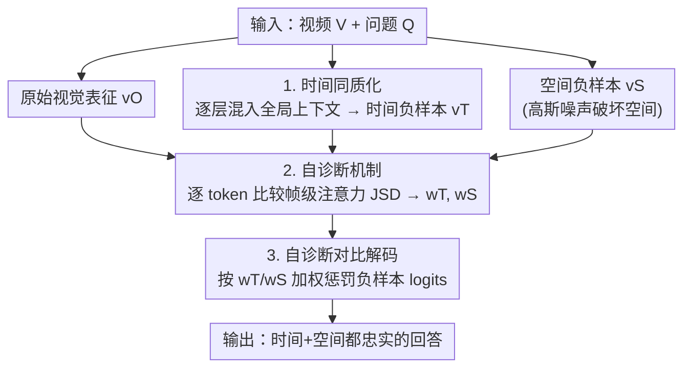

# SEASON: Mitigating Temporal Hallucination in Video Large Language Models via Self-Diagnostic Contrastive Decoding

**会议**: CVPR 2026  
**论文**: [CVF Open Access](https://openaccess.thecvf.com/content/CVPR2026/html/Wu_SEASON_Mitigating_Temporal_Hallucination_in_Video_Large_Language_Models_via_CVPR_2026_paper.html)  
**代码**: https://chriswu018.github.io/season/ （项目页）  
**领域**: 视频理解 / 多模态VLM  
**关键词**: 视频幻觉, 时间幻觉, 对比解码, 训练无关, 逐token诊断

## 一句话总结
SEASON 是一种**训练无关**的视频大模型解码方法：通过"时间同质化"构造只破坏时间、保留空间的硬负样本，再用一个逐 token 的自诊断机制判断当前词更可能犯时间还是空间幻觉，自适应地对相应负样本做对比解码，在三个幻觉基准上超过所有训练无关方法，同时不损伤通用视频理解能力。

## 研究背景与动机

**领域现状**：视频大模型（VideoLLM）在视频理解上进展显著，但仍常生成与画面不符的文本，即"幻觉"。早期工作主要研究**空间幻觉**（描述不存在的物体/属性），主流缓解手段是对比解码（contrastive decoding）：把"原始视觉输入"和"被破坏的视觉输入"两条 logits 相减，抵消语言先验带来的虚假关联。

**现有痛点**：视频比静态图多了**时间结构**。把图像端的对比解码直接搬到视频，即使压住了空间幻觉，模型仍会**搞错事件的顺序与因果**——这就是**时间幻觉**（temporal hallucination），是可靠视频理解的关键障碍。现有训练无关方法各有短板：DINO-HEAL 用 DINOv2 的显著图重加权视觉特征，关注空间显著性却忽略时间顺序；TCD 对比"原视频"与"抽帧后的视频"，但抽帧只是削弱信息量，无法暴露因果错乱。训练类方法（ArrowRL、TPO、RRPO）靠强化学习或偏好优化提升时间忠实度，但要昂贵重训和高质量偏好数据。

**核心矛盾**：要在**不重训**的前提下同时压住时间和空间幻觉，需要两个东西现有方法都没给到——① 一个能**只暴露时间错乱、不顺带破坏空间**的负样本（否则模型靠"明显的空间损坏"就轻易否定了负样本，对比信号变弱、变"易"）；② 一个能**逐 token** 判断"这个词到底在冒时间幻觉还是空间幻觉"的机制，因为一句话里有的词靠时间线索（"先""然后"），有的词靠静态物体线索（"黄油""碗"），不该用同一种惩罚一刀切。

**本文目标**：拆成两步——先造出"时间难负样本"，再造一个逐 token 的诊断器，把两者接进对比解码。

**切入角度**：作者观察到，**一个 token 是否依赖时间线索，会反映在它对各视频帧的注意力分布上**——当视频被时间同质化后，依赖时间一致性的 token 注意力会剧烈漂移，而依赖静态物体的 token 注意力几乎不变。这个注意力漂移就是天然的"自诊断信号"。

**核心 idea**：用"时间同质化"造时间硬负样本，用"逐 token 注意力散度"自诊断每个词的幻觉倾向，再据此自适应地对时间/空间负样本做对比解码。

## 方法详解

### 整体框架

给定视频 $V=\{f_1,\dots,f_{|V|}\}$ 和问题 $Q$，VideoLLM（视觉编码器 $E_\theta$ + 文本解码器 $D_\phi$）逐词生成回答 $y=\{y_1,\dots,y_N\}$。SEASON 在**推理时**插入三件事：① 用**时间同质化**把原始视觉表征 $v^O$ 加工成"时间负样本"$v^T$（时间错乱但空间保留），并额外用高斯噪声造一个"空间负样本"$v^S$（空间损坏）；② 对每个待生成 token，用**自诊断机制**比较原始与两种负样本下的帧级注意力分布，算出该 token 偏向时间幻觉还是空间幻觉的权重 $w_T, w_S$；③ **自诊断对比解码**按 $w_T, w_S$ 对两条负样本 logits 加权后从原始 logits 里减掉，得到时空都被净化的输出分布。整套流程零训练、可挂到任意 VideoLLM。

### 关键设计

**1. 时间同质化：造一个"只错时间、不错空间"的硬负样本**

直接照搬图像端做法（给帧加高斯噪声得到 $v^S$）会**同时破坏空间和时间**，结果是一个"时间易负样本"——模型靠那一眼可见的空间损坏就能否定它，根本不需要去关注时间不一致，对比信号被浪费。SEASON 想要相反的东西：一个空间完整、唯独时间被抹平的负样本，逼模型在对比时只能盯着时间一致性。

做法是在视觉编码器内部逐层把"全局时间上下文"回灌进每一帧。先对 $V$ 做一次标准前向，在第 $l$ 层得到所有帧特征的均值 $d_l=\frac{1}{|V|}\sum_t h'_{l,t}$（即该层的全局上下文）；然后在每层每帧把帧自身特征 $h'_{l,t}$ 与全局上下文做线性混合：$h_{l,t}=(1-\beta)h'_{l,t}+\beta d_l$，其中 $h'_{l,t}=E_\theta^{(l)}(h_{l-1,t})$ 来自上一层已被混合过的输出，$\beta\in[0,1]$ 控制同质化程度。这样混合是**渐进、逐层累积**的：越往深层，每帧越接近"所有帧的平均"，帧间时间差异被中和，但每帧的空间结构（patch 级）仍保留。取最后一层 $v^T=\{h_{L,t}\}_{t=1}^{|V|}$ 作为时间负样本。消融（Table 3）显示它显著优于 Average / Shuffled / Reverse 这些"时间易负样本"。

**2. 自诊断机制：用帧级注意力散度逐 token 判断幻觉类型**

一句话里不同词依赖的线索不同，不该统一惩罚。作者的洞察是：token 的生成高度依赖其前文，而**前一个 token $y_{i-1}$ 对各视频帧的注意力分布**，恰好暴露了当前 token $y_i$ 在依赖时间还是空间。于是从文本解码器 $D_\phi$ 第 $j$ 层多头注意力里抽出帧级注意力分布

$$\mathcal{A}_\text{frame}(v)=\text{softmax}_t\Big[\sum_k\big(\sum_{j\in J}A_j\big)(y_{i-1},v_{t,k})\Big],$$

即前一 token 分配给每帧的归一化注意力（对所有头、层集合 $J$、帧内视觉 token $k$ 求和）。然后比较原始 $v^O$ 与两种负样本下的注意力分布漂移，用 Jensen-Shannon 散度（JSD）量化：

$$D_T=\text{JSD}(\mathcal{A}_\text{frame}(v^O),\mathcal{A}_\text{frame}(v^T)),\quad D_S=\text{JSD}(\mathcal{A}_\text{frame}(v^O),\mathcal{A}_\text{frame}(v^S)),$$

再归一化成倾向权重 $w_T=\frac{D_T}{D_S+D_T}$、$w_S=\frac{D_S}{D_S+D_T}$。直觉很清楚：$D_T$ 大说明该 token 严重依赖时间线索（时间被抹平后注意力剧烈漂移），即时间幻觉倾向高；$D_S$ 大则是空间幻觉倾向高。实验（Fig. 5）证实"先""A""B"这类排序词拿到高 $w_T$，"黄油""碗"这类物体词拿到高 $w_S$。该机制对所选注意力层 $J$（默认 $[20,21,22,23]$）很鲁棒。

**3. 自诊断对比解码：按诊断权重自适应惩罚**

有了逐 token 的 $w_T, w_S$，就把它们接进对比解码动态分配惩罚。先把文本上下文 $(y_{<i},Q)$ 分别在 $v^O, v^S, v^T$ 条件下喂给 $D_\phi$，得三条 logits，最终分布为

$$p_\text{SEASON}(y_i)=\text{softmax}\Big[(1+\alpha)\,\text{logits}(y_i|v^O)-\alpha\big(w_S\,\text{logits}(y_i|v^S)+w_T\,\text{logits}(y_i|v^T)\big)\Big],$$

其中 $\alpha$ 控制对比强度（$\alpha=0$ 退化为普通解码）。当 $w_T$ 大时，时间负样本的 logits 被更多减去——压住潜在时间幻觉；$w_S$ 大时则更多惩罚空间幻觉。只针对时间维度的简化版（Eq. 3）为 $p_{\text{SEASON}^T}=\text{softmax}[(1+\alpha)\,\text{logits}(y_i|v^O)-\alpha\,\text{logits}(y_i|v^T)]$，用于验证时间负样本单独的作用。这样每个 token 都做了一次"自我体检 + 对症下药"，在不重训的前提下同时保证时间与空间忠实。

### 损失函数 / 训练策略

无训练、无微调，纯推理期方法。统一用 8 帧推理；自诊断取文本解码器第 $J=[20,21,22,23]$ 层注意力（经验选取）；对比强度 $\alpha$ 与同质化程度 $\beta$ 由网格搜索确定。可直接挂到 LLaVA-OV-7B、Qwen2.5-VL-7B、LLaVA-Video-7B 等开源模型。

## 实验关键数据

### 主实验

在三个幻觉检测基准（VidHalluc、VideoHallucer、EventHallusion）+ 两个时间理解基准（TempCompass、TVBench）+ 两个常规视频理解基准（VideoMME、MVBench）上评测，三个 backbone 全部测试。下表为各组平均分（AVG，越高越好）：

| Backbone | 方法 | 幻觉检测 AVG | 时间理解 AVG | 常规理解 AVG |
|----------|------|------|------|------|
| LLaVA-OV-7B | 基线 | 60.2 | 55.6 | 52.5 |
| LLaVA-OV-7B | +TCD（训练无关） | 62.6 | 55.7 | 52.4 |
| LLaVA-OV-7B | **+SEASON** | **64.3** | **56.1** | **52.7** |
| Qwen2.5-VL-7B | 基线 | 63.3 | 59.8 | 55.8 |
| Qwen2.5-VL-7B | +ArrowRL（**需训练**） | 65.5 | 61.0 | 54.7 |
| Qwen2.5-VL-7B | **+SEASON** | **66.5** | 60.7 | **56.4** |
| LLaVA-Video-7B | 基线 | 59.6 | 57.5 | 55.7 |
| LLaVA-Video-7B | +RRPO（**需训练**） | 61.1 | 57.8 | **56.0** |
| LLaVA-Video-7B | **+SEASON** | **61.6** | **58.8** | 55.6 |

> 说明：SEASON 是唯一在三个 backbone 上都拿到最佳/次佳幻觉检测分的**训练无关**方法，且常超过需要重训的 ArrowRL/RRPO；同时时间/常规理解不掉点甚至小涨，说明诊断机制没有"过度压制"正确 token。时间幻觉子任务提升尤为明显：VidHalluc 的 TSH 子任务上三个 backbone 分别提升 +24.5% / +18.7% / +12.3%。规模化验证：挂到 LLaVA-OV-72B，VidHalluc 总分 +2.05%，TSH 子任务 +8.67%。

### 消融实验

**(a) 时间负样本设计（Table 3，时间幻觉 + 时间理解综合 AVG）**：

| 负样本类型 | LLaVA-OV-7B AVG | Qwen2.5-VL-7B AVG |
|------------|------|------|
| 基线（无） | 54.2 | 56.3 |
| Average | 59.9 | 58.6 |
| Shuffled | 55.0 | 59.7 |
| Reverse | 57.6 | 58.8 |
| **Homogenized（本文）** | **61.4** | **62.0** |

**(b) 关键组件（Table 4，幻觉检测 AVG）**：

| 配置 | LLaVA-OV-7B | Qwen2.5-VL-7B |
|------|------|------|
| 基线 | 59.0 | 63.3 |
| + 空间负样本 $v^S$ | 63.7 | 64.7 |
| + 时间负样本 $v^T$ | 63.9 | 66.2 |
| **+ SEASON（两者+自诊断）** | **64.4** | **66.5** |

### 关键发现
- **"硬负样本"是关键**：同质化负样本比 Average/Shuffled/Reverse 这些朴素打乱都好（LLaVA-OV 上 +7.2%），印证"只破坏时间、保留空间"才能逼模型聚焦时间一致性。
- **两种负样本互补**：单用 $v^S$ 或 $v^T$ 都涨，但只有"两者 + 逐 token 自诊断加权"取得最高 AVG，说明诊断机制让每个 token 用对了惩罚。
- **对超参鲁棒**：自诊断所选注意力层 $J$ 取早/中/晚层性能都稳定（Fig. 6），不需精细调层。
- **不伤通用能力**：时间/常规理解基准不掉点，避免了对比解码常见的"过度抑制"副作用。
- ⚠️ Table 5 显示单用 $v^T$ 在 VidHalluc 时间子任务上甚至略高于完整 SEASON，作者归因于 VideoHallucer 的 Yes/No 格式存在"偏好 Yes"的顺从偏置；完整 SEASON 仍在整体（时空综合）幻觉缓解上最优。

## 亮点与洞察
- **"时间硬负样本"这个概念很巧**：以往对比解码的负样本越破坏越好，本文反其道——刻意**只破坏一个维度**，让对比信号"提纯"，这是把对比解码从图像迁到视频的关键缺口补全。该思路可迁移到任何多维度幻觉场景（如音频-视觉对齐）：想压哪一维，就造一个"只错那一维"的负样本。
- **注意力散度当幻觉探针**：用"前一 token 的帧级注意力在视觉被扰动后漂移多少"来逐 token 判断幻觉类型，是个零成本、可解释的诊断信号，Fig. 5 的可视化让"哪些词靠时间、哪些词靠空间"一目了然。
- **逐 token 自适应**而非整句一刀切，避免对静态描述词施加时间惩罚（反之亦然），这是它不损伤通用理解的根本原因。
- 全程零训练、可即插即用到任意 VideoLLM 乃至 72B 规模，落地成本极低。

## 局限与展望
- **依赖可访问的内部注意力**：自诊断要读文本解码器的多头注意力分布，对纯黑盒/仅 API 的模型不可用。
- **多次前向开销**：每步要在 $v^O, v^S, v^T$ 三种表征下各跑一次 logits，外加视觉编码器内的同质化前向，推理成本约为基线的数倍（论文未给出精确加速比，⚠️ 以原文为准）。
- **超参需网格搜索**：$\alpha$（对比强度）、$\beta$（同质化程度）需逐基准调；虽对层 $J$ 鲁棒，但跨数据集是否需重调未充分讨论。
- **评测取确定性子任务**：为避免依赖第三方 LLM 评测器，EventHallusion/TempCompass 只复现确定性子任务，可能低估了在开放式生成上的表现。
- 改进方向：把三条前向蒸馏进单次前向以降本；把"只错一维负样本"扩展到更多幻觉维度（如计数、空间关系）。

## 相关工作与启发
- **vs VCD / MARINE（图像端对比解码）**：它们针对静态图抵消语言先验，无法刻画时间依赖；SEASON 引入时间负样本与逐 token 诊断，专攻视频特有的时间幻觉。
- **vs TCD**：TCD 对比"原视频 vs 抽帧视频"，只是削弱信息量、无法暴露因果错乱；SEASON 的时间同质化保留全部帧但抹平帧间差异，是更"硬"的时间负样本。
- **vs DINO-HEAL**：DINO-HEAL 用 DINOv2 显著图重加权空间特征，关注空间显著性、忽略时间顺序；SEASON 直接以时间一致性为对比目标。
- **vs ArrowRL / TPO / RRPO（训练类）**：它们靠强化学习/偏好优化提升时间忠实度，需重训和偏好数据；SEASON 训练无关、即插即用，且多项指标已可比甚至反超。

## 评分
- 新颖性: ⭐⭐⭐⭐⭐ "时间硬负样本 + 逐 token 注意力自诊断"是对视频对比解码缺口的精准补全，概念清晰且可迁移。
- 实验充分度: ⭐⭐⭐⭐ 三 backbone × 7 基准 + 负样本/组件/层/规模化多重消融充分；扣分在多次前向的开销未给精确量化。
- 写作质量: ⭐⭐⭐⭐ 动机推导（为何要"硬负样本"）讲得透彻，图示直观；公式排版在原文 OCR 中略乱。
- 价值: ⭐⭐⭐⭐⭐ 训练无关、可挂任意 VideoLLM 直至 72B，对自动驾驶/医疗等高可靠场景的视频理解落地价值高。

<!-- RELATED:START -->

## 相关论文

- [\[CVPR 2026\] MAD: Modality-Adaptive Decoding for Mitigating Cross-Modal Hallucinations in Multimodal Large Language Models](mad_modality-adaptive_decoding_for_mitigating_cross-modal_hallucinations_in_mult.md)
- [\[CVPR 2026\] Envision, Attend, Then Respond: Counterfactual Hallucination Mitigation in Large Vision-Language Models](envision_attend_then_respond_counterfactual_hallucination_mitigation_in_large_vi.md)
- [\[CVPR 2026\] First Logit Boosting: Visual Grounding Method to Mitigate Object Hallucination in Large Vision-Language Models](first_logit_boosting_visual_grounding_method_to_mitigate_object_hallucination_in.md)
- [\[CVPR 2026\] HulluEdit: Single-Pass Evidence-Consistent Subspace Editing for Mitigating Hallucinations in Large Vision-Language Models](hulluedit_single-pass_evidence-consistent_subspace_editing_for_mitigating_halluc.md)
- [\[CVPR 2026\] Prefill-Time Intervention for Mitigating Hallucination in Large Vision-Language Models](prefill-time_intervention_for_mitigating_hallucination_in_large_vision-language_.md)

<!-- RELATED:END -->
