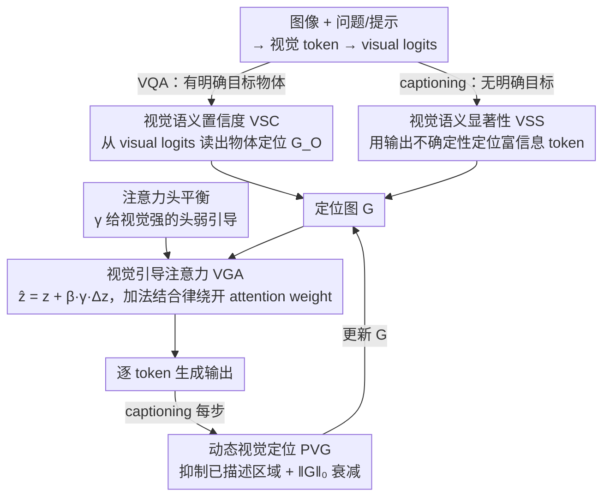

# Tell Model Where to Look: Mitigating Hallucinations in MLLMs by Vision-Guided Attention

**会议**: CVPR2026  
**arXiv**: [2511.20032](https://arxiv.org/abs/2511.20032)  
**代码**: [github.com/beta-nlp/VGA](https://github.com/beta-nlp/VGA)  
**领域**: 幻觉检测  
**关键词**: 多模态幻觉, 视觉注意力, 视觉语义置信度, 免训练, FlashAttention兼容

## 一句话总结
提出Vision-Guided Attention (VGA)，一种免训练的方法，通过利用视觉token的语义特征构建精确的视觉定位，引导模型注意力聚焦于相关视觉区域，有效缓解MLLM幻觉，且兼容FlashAttention。

## 研究背景与动机
MLLM虽然在视觉理解上取得显著进展，但经常产生与实际视觉内容矛盾的幻觉输出。现有去幻觉方法主要分为训练方法和免训练方法：
- **训练方法**：构建数据集或设计损失函数，但模型架构迭代太快导致边际递减
- **免训练方法**：更具实用价值，尤其是优化视觉注意力的方向

当前视觉注意力优化方法的核心问题：
1. 过度依赖注意力本身的质量，但视觉注意力的定位能力本质上有限（受attention sink现象影响）
2. 使用外部工具或额外前向传播引入计算开销
3. 依赖attention weight的方法与FlashAttention不兼容

关键发现：模型能准确提取视觉token的语义特征并转化为条件概率（visual logits），但推理阶段未能充分利用这一优势。这意味着MLLM的视觉理解被低估了。

## 方法详解

### 整体框架
VGA 的出发点是一个观察：MLLM 其实能从视觉 token 里准确提取物体的语义特征并转成条件概率（visual logits），但推理时没把这份能力用起来，视觉理解被低估了。于是 VGA 走「先定位、再引导」两步，且全程免训练。第一步**构建视觉定位**：要看的目标明确时（如 VQA）用视觉语义置信度（VSC）从 visual logits 里读出物体在图上的分布，目标不明确时（如图像描述）改用视觉语义显著性（VSS）找出富含视觉信息的 token。第二步**引导注意力**：把定位图 $G$ 作为引导信号叠加到注意力输出上，并用注意力头平衡避免破坏本就擅长看图的头；图像描述场景再用动态视觉定位（PVG）让引导焦点随已生成内容移动。关键在于这套注入借助加法结合律改写，每个 token 只需一次前向传播、全程不显式计算 attention weight，因此天然兼容 FlashAttention。

### 关键设计

**1. 视觉语义置信度（VSC）：从 visual logits 里读出物体定位**

视觉注意力本身的定位能力受 attention sink 影响、并不可靠，VGA 改从语义置信度入手。对物体 $O$，视觉 token $v_i$ 的语义置信度为 $c_{v_i}(O) = \text{softmax}[\text{logit}_{v_i}(O)]$，用 $O$ 的第一个 token 化 token $o_0$ 近似；物体对整图的置信度用最大池化 $c(O) = \max c_{v_i}(o_0)$，定位图则是 $G_O = \text{Norm}[\{c_{v_i}(o_0)\}_{i=1}^m]$。实验验证 VSC 的定位显著强于视觉注意力，在大物体上尤其明显，因为它不受 attention sink 干扰。

**2. 视觉语义显著性（VSS）：给 captioning 这类无目标任务定位**

VSC 需要一个明确的目标物体，可像图像描述这种任务事先并没有特定目标。VSS 改用输出不确定性来衡量视觉 token 的语义显著性：$c_{v_i} = -\sum_k \log c_{v_i}(w_k) / \log K$（Top-K token 的熵）。高 VSS 的 token 对应有意义的物体区域，低 VSS 对应语义不显著的背景。

**3. 视觉引导注意力（VGA）：用加法结合律绕开 attention weight**

有了定位，怎么把它注入注意力又不破坏 FlashAttention 兼容？VGA 不去改 attention weight，而是直接在输出上加一个引导信号：$\hat{z} = z + \beta \cdot \gamma \cdot \Delta z$，其中 $\Delta z$ 是引导信号、$\beta$ 是引导强度、$\gamma$ 是注意力头平衡系数。它利用加法结合律 $\hat{z} = (\alpha + \beta \cdot G)V = z + \beta \cdot \Delta z$，全程不需要显式算 attention weight，于是天然兼容 FlashAttention。

**4. 注意力头平衡（Attention Heads Balancing）：别把本来就擅长看图的头搞坏**

不同注意力头的视觉功能强弱不一，一刀切地引导会破坏那些原本就擅长视觉的头。VGA 给视觉功能强的头较弱引导、给非视觉头较强引导，用 $z$ 和 $\Delta z$ 的余弦相似度近似头的视觉功能差异，再以 $\gamma = \text{ReLU}(2 - H \cdot \gamma')$ 调节引导强度。

**5. 动态视觉定位（PVG）：随生成动态挪动引导焦点**

captioning 是逐步生成的，已经描述过的区域不该再被反复引导。PVG 让定位随生成动态更新 $G_{t+1} = (1+\lambda)G_t - \lambda G_w$，抑制已描述区域、引导关注待描述区域；随着生成内容增多，用 $\|G\|_0$ 当衰减因子让引导强度自动减弱，避免越描越偏。

### 损失函数 / 训练策略
完全免训练方法，仅在推理时应用。超参数包括引导强度 $\beta$ 和衰减参数 $\lambda$。

## 实验关键数据

### 主实验

| 数据集 | 指标 | VGA | 之前SOTA | 提升 |
|--------|------|-----|----------|------|
| POPE (Acc, 平均) | Accuracy | SOTA | 多个基线 | 在LLaVA-7B/13B/Next和Qwen2.5-VL上全面领先 |
| POPE (F1, 平均) | F1 | SOTA | PAI/PAICD等 | 跨模型一致性提升 |

### 消融实验

| 配置 | 关键指标 | 说明 |
|------|---------|------|
| 仅PSP | 提升 | 验证位置-时间步惩罚效果 |
| VGA在不同MLLM上 | 一致性提升 | 方法的通用性强 |
| VSC定位 vs 注意力定位 | Dice系数大幅领先 | 尤其在大物体上优势明显 |

### 关键发现
- VSC的判断准确率虽低于模型本身回答，但展示了正确的偏好性（显著超过50%）
- VSC与模型回答存在一定偏好差异，证明模型的视觉理解未被充分利用
- VGA在不新增前向传播的前提下（每个token仅一次），实现了去幻觉SOTA

## 亮点与洞察
- 核心洞察极为精彩：MLLM的视觉logits蕴含丰富的语义定位信息，但推理时未被充分利用
- 方法设计优雅：利用加法结合律绕过attention weight计算，实现FlashAttention兼容
- Attention Heads Balancing是实用的设计，避免破坏模型原有的视觉功能头
- PVG为captioning场景提供了动态attention引导的有效范式

## 局限与展望
- VSC使用第一个token近似物体语义可能不够精确，尤其对多音节/多token物体
- 超参数β需要手动设置，不同模型/任务可能需要调整
- 未与训练方法结合，可能存在互补提升空间
- PVG的衰减策略较为启发式，可能对长描述不够稳定

## 相关工作与启发
- 对比解码方法(VCD, ICD等)通常需要额外前向传播来激活幻觉特征
- Attention编辑方法(PAI, OPERA等)依赖attention weight，不兼容FlashAttention
- VGA成功将视觉语义置信度作为一种新型视觉先验引入注意力引导，这一思路可推广到其他需要精确视觉定位的任务

## 评分
- 新颖性: ⭐⭐⭐⭐⭐ VSC是全新的概念，FlashAttention兼容的设计非常实用
- 实验充分度: ⭐⭐⭐⭐ 多模型多基准验证，定量+定性分析
- 写作质量: ⭐⭐⭐⭐⭐ 逻辑清晰，从观察到方法推导自然流畅
- 价值: ⭐⭐⭐⭐⭐ 免训练+FlashAttention兼容，落地价值极高

<!-- RELATED:START -->

## 相关论文

- [\[CVPR 2025\] Seeing Far and Clearly: Mitigating Hallucinations in MLLMs with Attention Causal Decoding](../../CVPR2025/hallucination/seeing_far_and_clearly_mitigating_hallucinations_in_mllms_with_attention_causal_.md)
- [\[ACL 2026\] Spotlight and Shadow: Attention-Guided Dual-Anchor Introspective Decoding for MLLM Hallucination Mitigation](../../ACL2026/hallucination/spotlight_and_shadow_attention-guided_dual-anchor_introspective_decoding_for_mll.md)
- [\[CVPR 2026\] COPO: Causal-Oriented Policy Optimization for Hallucinations of MLLMs](copo_causal-oriented_policy_optimization_for_hallucinations_of_mllms.md)
- [\[CVPR 2026\] PAS: Prelim Attention Score for Detecting Object Hallucinations in Large Vision-Language Models](pas_prelim_attention_score_for_detecting_object_hallucinations_in_large_vision-l.md)
- [\[CVPR 2026\] Fighting Hallucinations with Counterfactuals: Diffusion-Guided Perturbations for LVLM Hallucination Suppression](fighting_hallucinations_with_counterfactuals_diffusion-guided_perturbations_for_.md)

<!-- RELATED:END -->
