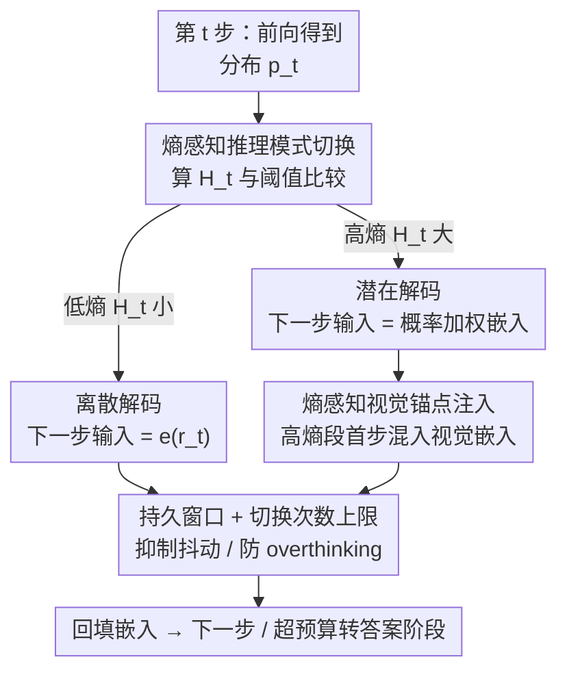

# Thinking in Uncertainty: Mitigating Hallucinations in MLRMs with Latent Entropy-Aware Decoding

**会议**: CVPR 2026  
**论文**: [CVF Open Access](https://openaccess.thecvf.com/content/CVPR2026/html/Xu_Thinking_in_Uncertainty_Mitigating_Hallucinations_in_MLRMs_with_Latent_Entropy-Aware_CVPR_2026_paper.html)  
**代码**: https://mlrm-LEAD.github.io/ (项目页)  
**领域**: 多模态VLM / 幻觉缓解  
**关键词**: 多模态推理模型, 幻觉缓解, 熵感知解码, 潜在叠加推理, 视觉锚点注入

## 一句话总结
本文发现多模态推理模型（MLRM）的幻觉高度集中在 `because/however/wait` 这类转折词附近、而这些位置恰好是高熵（高不确定）步，于是提出免训练的 LEAD 解码策略：高熵步把采样得到的单个 token 换成「按概率加权的连续嵌入」以保留多条推理假设、并注入视觉锚点强化看图，低熵步回到常规离散解码，从而在多个 MLRM 与多个基准上稳定降低幻觉。

## 研究背景与动机
**领域现状**：多模态大推理模型（MLRM）靠 test-time scaling 在回答前先生成一长串显式推理链（因果、对比、自反思），通过可验证奖励的强化学习训练，在视觉问答上推理能力显著增强。

**现有痛点**：尽管推理更强，MLRM 仍极易产生幻觉。现有缓解手段要么改视觉奖励、要么做数据增强，都需要额外训练成本；免训练的对比解码（contrastive decoding）虽便宜，但只是在 token 级扰动输出分布，**没有针对推理模型本身的行为特性做分析**。

**核心矛盾**：作者的关键观察是——MLRM 在生成中会高频使用转折词（because、however、wait）来组织推理链的语义关系，而这些转折词**恰好是 token 熵最高的位置**（图 2），紧随其后的内容又最容易出现幻觉（图 1 显示幻觉案例大量集中在转折词后 10 个 token 内）。换句话说，幻觉与「高不确定的推理岔路口」强相关。作者进一步做 token masking 消融验证：遮蔽高熵 token 会让推理性能大幅下降、遮蔽低熵 token 几乎没影响（图 3a），且越靠前的高熵 token 影响越大（图 3b）——说明高熵 token 是推理链上真正的「关键决策节点」。

**本文目标**：在不重训模型的前提下，让 MLRM 在高熵推理步既保留多条候选语义（别过早坍缩）、又把注意力拉回图像（别脱离视觉），从而压住幻觉。

**核心 idea**：问题根源在于离散解码每步把整个预测分布 $p_t$ 坍缩成一个采样 token，丢掉了在不确定时刻最需要的分布信息，逼着模型在岔路口过早地做单线程显式推理。受**叠加表示理论（superposed representation）**启发，作者主张「在高熵步用 token 概率分布构造更丰富的语义表示」，让模型把多条候选推理假设以连续嵌入的形式同时往下传——这就是 Latent Entropy-Aware Decoding (LEAD) 的出发点。

## 方法详解

### 整体框架
LEAD 是一个即插即用、免训练的解码策略，套在任意 MLRM 的自回归生成循环外面。它的核心机制是**熵感知的推理模式切换**：每生成一步，先用 token 级熵 $H_t$ 度量当前不确定度，与一个动态参考阈值 $\hat{H}$ 比较——

- **低熵（确定）步**：走常规**离散解码**，用采样 token 的 one-hot 嵌入 $e(r_t)$ 作为下一步输入，保证推理链收敛、输出稳定；
- **高熵（不确定）步**：切到**潜在解码（latent decoding）**，把下一步输入换成整个分布的概率加权嵌入 $E_{v\sim p_t}[e(v)]$，让多条候选语义同时保留、不过早坍缩；同时在进入高熵段的第一步注入**视觉锚点**，把模型注意力拉回图像。

为防止两种模式之间高频抖动，还加了**持久窗口（persistence window）**约束 D→L 切换、以及**切换次数上限 $C_{max}$** 防止 overthinking。最终输出阶段仍用离散采样产生答案。整体是一个「逐步判熵 → 选模式 → 构造下一步嵌入」的解码循环：

### 关键设计

**1. 熵感知推理模式切换：在高熵岔路口用「叠加嵌入」代替单 token，保留多条推理假设**

这一设计直击「离散采样把分布坍缩成单 token、在不确定时丢信息」这个痛点。token 级熵定义为 $H_t = -\sum_v p_t[v]\log p_t[v]$：当多个候选 token 概率接近（$p_t[v_1]\approx p_t[v_2]\approx\cdots$）时熵高，说明模型在多条推理路径间竞争；当单个 token 主导（$p_t[v^\*]\gg p_t[v]$）时熵低、推理收敛。LEAD 据此定义下一步输入嵌入：

$$\tilde{e}_t = \begin{cases} e(r_t), & H_t < \hat{H}\ (\text{不确定度下降}) \\ E_{v\sim p_t}[e(v)], & \text{otherwise}\ (\text{不确定度上升}) \end{cases}$$

其中 $E_{v\sim p_t}[e(v)]=\sum_v p_t[v]\,e(v)$ 是按预测概率对全词表嵌入加权得到的连续「叠加嵌入」，它把所有可能 token 的语义混在一起喂回模型，等价于让多条推理假设并行往下传播，而不是在岔路口提前赌一条。参考阈值 $\hat{H}$ 不是固定值：每次切换模式时更新为当前熵 $\hat{H}\leftarrow H_t$，因此模型是按熵的**局部变化趋势**自适应切换，而非卡死一个全局门限。这正是后面消融里「动态阈值（∆）优于任何固定阈值」的原因——固定大阈值会把模型锁死在离散 CoT、固定小阈值会让它在潜在模式停太久而难收敛。

**2. 持久窗口与切换次数上限：让模式切换稳定、避免抖动和过度思考**

光有熵阈值会带来两个工程问题：熵在阈值附近抖动时模型会在离散/潜在两模式间反复横跳；以及推理已收敛后仍不断切换、陷入 overthinking。作者用两个门控量解决。设 $m_t\in\{D,L\}$ 为当前模式、$\rho_t$ 为已在当前模式停留的连续步数，定义 $g^D_t=\mathbb{1}[H_t<\hat{H}]$、$g^L_t=\mathbb{1}[(H_t>\hat{H})\wedge(\rho_t\ge W_{D\to L})]$，转移规则为 $m_{t+1}=g^D_t D+g^L_t L+(1-g^D_t-g^L_t)m_t$。关键是这个设计**不对称**：只对 D→L 设持久窗口 $W_{D\to L}>0$（必须在离散模式待够 $W_{D\to L}$ 步、把一段连贯推理夯实后，才允许重新进入潜在探索），而 L→D（一旦置信度回升）可以立刻发生。此外引入全局切换计数 $C_t$ 与上限 $C_{max}$（默认 5），一旦超限就停止推理直接进入答案阶段，避免无谓地反复切换。消融显示窗口大小到 128 最佳、过大则退化回标准 CoT。

**3. 熵感知视觉锚点注入：在高熵段首步把注意力强行拉回图像**

作者发现「带幻觉的高熵 token」普遍对视觉的注意力更低（图 3d），即模型在高不确定时反而更少看图、更依赖语言先验，这是多模态幻觉的直接诱因。LEAD 的对策是只在**每个高熵段的第一个 token**（即潜在推理刚开始那一步 $t^\star$）做一次性视觉锚点注入，给模型一个朝向视觉语义空间的初始化线索，而不持续干扰后续自适应推理。设 $e_{vis}$ 为预训练视觉特殊 token（`<|vision_start|>`、`<|image_pad|>`、`<|vision_end|>`）嵌入的平均，注入公式为：

$$\tilde{e}_{t^\star} = (1-\lambda)\,E_{v\sim p_{t^\star}}[e(v)] + \lambda\, e_{vis}$$

$\lambda\in[0,1]$ 控制视觉引导强度。消融（表 1）显示 $\lambda$ 增大时性能上升、$\lambda=0.4$ 时在所有数据集达到峰值，再大则视觉嵌入开始压过语言上下文、性能略降——所以是「适量」而非越强越好。这个一次性、段首注入的设计既稳定了推理轨迹的视觉 grounding，又不会让视觉信号淹没语义推理。

### 损失函数 / 训练策略
LEAD **完全免训练**，是即插即用的解码期策略，不修改任何模型参数。输出答案阶段仍用常规离散采样（示例用 greedy）。默认超参：切换次数上限 $C_{max}=5$、持久窗口 128、视觉注入强度 $\lambda=0.4$。

## 实验关键数据

### 主实验
在 5 个代表性 MLRM（R1-Onevision-7B、Vision-R1-7B、VL-Rethinker-7B、VL-Cogito-7B、OpenVLThinker-7B）上作为插件接入，评测覆盖通用推理、幻觉、数学与科学推理基准。以 R1-Onevision-7B 为例，与 VCD / MemVR / SID 等解码方法对比（表 2，节选）：

| 方法 (R1-Onevision-7B) | VStar↑ | MMEval-Pro↑ | MMHalu↑ (0–6) | Bingo↑ (1–5) | POPE-R↑ |
|--------|------|------|------|------|------|
| Base | 66.5 | 69.4 | 3.52 | 3.65 | 84.6 |
| + VCD | 67.1 | 69.8 | 3.55 | 3.61 | 84.4 |
| + MemVR | 69.6 | 71.3 | 3.69 | 3.68 | 82.3 |
| + SID | 70.2 | 71.0 | 3.70 | 3.65 | 85.0 |
| **+ LEAD** | **71.2 (+4.7)** | **73.9 (+4.5)** | **3.80 (+4.7)** | **3.84 (+3.8)** | **85.9 (+1.3)** |

通用推理与理解平均提升 +3.6%，幻觉指标 MMHalu/Bingo 分别 +4.7% / +3.8%。在域专项任务上（表 3），数学基准平均准确率 +2.0%、科学基准 +3.2%（如 MMK12-Bio 从 40.8 → 44.8，+4.0）。增益在其余 4 个 MLRM 上同样成立（如 Vision-R1-7B 的 POPE-R 88.0 → 91.4，+3.4）。

### 消融实验
| 配置 | 关键指标 | 说明 |
|------|---------|------|
| 动态阈值 ∆（完整） | MMHalu +4.7% / +4.1% | LEAD 默认，优于任何固定阈值 |
| 阈值 → ∞ | 退化到标准 CoT | 锁死离散推理，无法用潜在探索 |
| 阈值 → 0 | 幻觉风险上升 | 长期停在潜在推理，难收敛 |
| 持久窗口 = 64/256/∞ | 均低于 128 | 窗口=128 最佳；过大退化回 CoT |
| 视觉注入 λ=0 / 0.2 / 0.6 | 均低于 0.4 | λ=0.4 峰值；过大视觉压过语义 |

### 关键发现
- **熵的动态阈值是性能主因**：固定阈值（无论大小）都打不过按局部熵趋势自适应切换的动态策略，说明「何时进入潜在探索」必须随上下文不确定度走。
- **视觉注入有甜区**：$\lambda=0.4$ 最优，再大会让视觉嵌入主导、削弱语言上下文，是典型的 grounding 与推理的平衡点。
- **推理更短还更准**：在 MathVision 上 LEAD 的平均推理长度短于所有 baseline 但准确率最高（图 9）——潜在推理在岔路口一次性融合多假设，省去了离散链上的反复试探。
- **文本质量未受损**：用 GPT-5 评 grammar/fluency/naturalness 与 PPL，LEAD 在降幻觉的同时保持了生成文本质量（图 8）。

## 亮点与洞察
- **把幻觉定位到「转折词 = 高熵步」是很漂亮的诊断**：先用相关性（图 1）+ 熵可视化（图 2）+ token masking 因果消融（图 3a/b）三连，扎实地证明高熵 token 是推理链关键节点，再对症下药，动机非常具体而非空谈。
- **「叠加嵌入」是核心 trick**：高熵步不采样、直接把概率加权的全词表嵌入喂回去，等于让多条推理假设以连续向量并行传播，避免离散坍缩丢信息——这个思路可迁移到任何自回归推理模型的不确定步。
- **不对称持久窗口很务实**：D→L 设门槛、L→D 立刻放行，体现「探索要谨慎、收敛要果断」的工程直觉，配合切换上限治 overthinking。
- 免训练、即插即用、对 5 个不同 MLRM 都涨点，落地友好。

## 局限与展望
- 切换阈值、持久窗口、$\lambda$、$C_{max}$ 均为人工设定的超参，虽给了默认值，但跨模型/任务是否需要重调、敏感度如何，正文未充分展开。
- 概率加权嵌入需要在每个高熵步对全词表嵌入做加权求和，⚠️ 论文主打「轻量」，但这一步的实际显存/时延开销未给出量化对比（仅给了推理长度更短的间接证据）。
- 视觉锚点用的是预训练视觉特殊 token 的平均嵌入，是一种较粗的全局视觉先验，未利用与当前 query 相关的局部视觉区域，可能仍有 grounding 上限。
- 评测集中在 7B 量级模型，更大/更小尺度的规律（附录 A 有部分）以及对非推理型 MLLM 是否同样有效，值得进一步验证。

## 相关工作与启发
- **vs 对比解码（VCD / SID）**: 它们在 token 级扰动输出分布来抑制语言先验偏置，但不区分推理状态、对每一步一视同仁；LEAD 专门针对推理模型的「高熵岔路口」做模式切换，且实验中全面优于二者。
- **vs MemVR（视觉记忆/重注入类）**: MemVR 强化视觉信息回注，但不感知熵；LEAD 把视觉锚点注入限定在高熵段首步、且与潜在推理耦合，定性可视化（图 7a）显示 LEAD 对 query 相关区域分配了更高视觉注意力。
- **vs 训练类幻觉缓解（视觉奖励 / 数据增强）**: 那些方法需额外训练成本；LEAD 完全免训练、即插即用，是更轻的替代方案。

## 评分
- 新颖性: ⭐⭐⭐⭐⭐ 「转折词=高熵=幻觉」的诊断 + 叠加嵌入潜在推理，视角新且自洽
- 实验充分度: ⭐⭐⭐⭐ 5 个 MLRM × 多类基准 + 完整消融，缺显存/时延量化
- 写作质量: ⭐⭐⭐⭐⭐ 动机—诊断—方法逻辑链清晰，公式与可视化到位
- 价值: ⭐⭐⭐⭐⭐ 免训练即插即用、稳定降幻觉，落地价值高

<!-- RELATED:START -->

## 相关论文

- [\[CVPR 2026\] Residual Decoding: Mitigating Hallucinations in Large Vision-Language Models via History-Aware Residual Guidance](residual_decoding_mitigating_hallucinations_in_large_vision-language_models_via_.md)
- [\[CVPR 2026\] MAD: Modality-Adaptive Decoding for Mitigating Cross-Modal Hallucinations in Multimodal Large Language Models](mad_modality-adaptive_decoding_for_mitigating_cross-modal_hallucinations_in_mult.md)
- [\[CVPR 2026\] HulluEdit: Single-Pass Evidence-Consistent Subspace Editing for Mitigating Hallucinations in LVLMs](hulluedit_subspace_editing_hallucination.md)
- [\[CVPR 2026\] HulluEdit: Single-Pass Evidence-Consistent Subspace Editing for Mitigating Hallucinations in Large Vision-Language Models](hulluedit_single-pass_evidence-consistent_subspace_editing_for_mitigating_halluc.md)
- [\[CVPR 2026\] SEASON: Mitigating Temporal Hallucination in Video Large Language Models via Self-Diagnostic Contrastive Decoding](season_mitigating_temporal_hallucination_in_video_large_language_models_via_self.md)

<!-- RELATED:END -->
