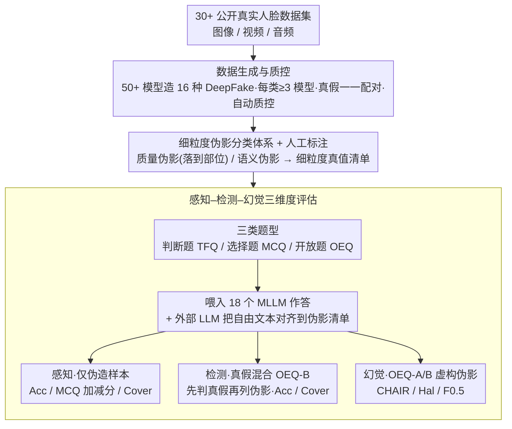

# TriDF: Evaluating Perception, Detection, and Hallucination for Interpretable DeepFake Detection

**会议**: CVPR 2026  
**arXiv**: [2512.10652](https://arxiv.org/abs/2512.10652)  
**代码**: [https://j1anglin.github.io/TriDF/](https://j1anglin.github.io/TriDF/)  
**领域**: 幻觉检测  
**关键词**: 深度伪造检测, 可解释检测, 多模态大模型, 幻觉评估, 伪影分类体系

## 一句话总结
提出TriDF——首个从感知 (Perception)、检测 (Detection) 和幻觉 (Hallucination) 三个维度综合评估可解释深度伪造检测的基准，包含55K高质量样本覆盖16种DeepFake类型和3种模态，揭示了准确感知是可靠检测的基础但幻觉会严重破坏决策的三方耦合关系。

## 研究背景与动机

1. **领域现状**：随着生成模型的快速发展，DeepFake检测已从单纯的二分类发展到需要可解释性——不仅要判断真假，还要给出为什么判定为假的理由。多模态大语言模型 (MLLM) 越来越多地被用于可解释DeepFake检测。

2. **现有痛点**：
    - **现有数据集标注粗粒度**：FF++、DFDC等只有二分类标签，无法评估可解释性。
    - **现有基准覆盖不全**：DD-VQA只覆盖4种伪造类型、FakeBench只1种、LOKI仅3种；多数只支持图像模态，缺乏跨模态覆盖。
    - **缺乏幻觉评估**：MLLM生成解释时可能出现"幻觉"——给出不存在的伪影的理由。这在DeepFake检测中尤为危险，因为虚假的解释可能误导判断。现有benchmark完全没有评估这一方面。
    - **依赖MLLM判评MLLM**：许多benchmark用GPT-4o来评判其他模型的输出，引入自我偏好偏差。

3. **核心矛盾**：可解释DeepFake检测需要模型同时具备三种能力——感知伪影、正确检测、可靠解释——但目前没有统一框架来评估这三者及其相互依赖关系。

4. **本文目标** 构建一个全面的可解释DeepFake检测基准，统一评估感知、检测和幻觉三个维度，揭示它们之间的耦合关系。

5. **切入角度**：从人类标注的细粒度伪影分类体系出发，建立可量化的感知评估；将真假样本配对以支持幻觉检测；覆盖图像/视频/音频三种模态和16种DeepFake类型。

6. **核心 idea**：Perception-Detection-Hallucination构成可解释DeepFake检测的不可分割三元组，TriDF是第一个同时评估这三者的统一基准。

## 方法详解

### 整体框架
TriDF 把"评估一个 MLLM 能不能可信地解释 DeepFake"这件事拆成可测的三件事：它能不能看见伪影（感知）、看见之后能不能下对真假判断（检测）、解释里有没有编造不存在的伪影（幻觉）。为支撑这三项测量，整条流水线分两段：先**造数据**——从公开数据集收人脸素材，用 16 种 DeepFake 技术生成真假成对样本，自动质控后由人工按一套**细粒度伪影分类体系**标注，得到可靠的真值清单；再**出题评测**——把每个样本包装成三类问题（判断题 / 选择题 / 开放题）丢给 MLLM 作答，最后用一套针对性指标分别打出感知、检测、幻觉三个分数。整套基准最终覆盖 16 种 DeepFake 类型、3 种模态、55K 样本，评估了 18 个 MLLM。

### 关键设计

**1. 成对真假样本的数据生成与质控：让标注更准、也让幻觉可测**

整条流水线的第一步是把数据造扎实。TriDF 从 30+ 公开数据集收集真实人脸，再用 50+ 专门生成模型（GAN、SD、DiT、商业 API 等）造伪造样本，每种伪造类型至少由 3 个不同模型生成以保证生成器多样性，并用真实性和一致性指标做自动质量筛选。16 种 DeepFake 类型分两大族：**部分篡改**（换脸、属性修改、唇形同步、面部重演、全身操纵、主体驱动编辑、语音转换）和**完全合成**（音频驱动说话人头、身份保持生成、文本到人类图/视频等）。真假一一配对不是凑数——有了对应的真实样本，标注者能对比着定位伪影、标得更精确；更重要的是它直接撑起了幻觉评估：把真实样本喂给模型，看它会不会在一张本无破绽的图上"看出"伪影，这正是幻觉最危险的形态。

**2. 细粒度伪影分类体系：给"感知"一个客观的标尺**

有了成对数据，接下来要解决"模型说看到了某个破绽该如何判分"——如果拿另一个 MLLM 生成的解释当真值，就会陷入循环偏差。TriDF 的做法是让人工把伪影按性质分成两层：**质量伪影**（模糊、噪声、闪烁等，本质是低层图像退化，传统图像处理也能查）和**语义伪影**（解剖学不一致、物体完整性缺陷、不自然韵律等，必须靠常识推理才能发现）。质量伪影还进一步落到具体部位（鼻部、四肢、背景……），从而能单独考查模型的定位能力而不只是"有没有看出问题"。因为这套标注完全由人工产出，感知维度就有了一个不依赖 MLLM 自评的客观基准，模型答得对不对可以直接和人工伪影清单对照。

**3. 感知–检测–幻觉三维度评估：把三种能力分开测，再用题型对应到指标**

数据和真值齐备后，评测段把三种能力拆开测。这三者是不可分割的链条——看不准伪影谈不上可靠检测，但即便看准了，解释里的幻觉照样会污染最终决策——所以只测其中一两项无法反映真实能力。TriDF 用不同的样本子集和题型把它们解耦：**感知**只喂伪造样本，用 TFQ/MCQ/OEQ-A 考查模型识别伪影及其位置的能力，其中 MCQ 特意加入"以上都不是"和多选来抬高难度；**检测**改用真假混合样本，通过 OEQ-B 要求模型先给真假判断、再列出依据的伪影，用 Accuracy 和 Cover（正确命中伪影的覆盖率）评分；**幻觉**则从 OEQ-A、OEQ-B 的回答里挑出模型虚构的、真值清单中并不存在的伪影来量化。

为了客观打分，每个维度都配了明确指标。感知/检测侧用 Accuracy（TFQ）、Cover，以及对 MCQ 的加减分制——设正确选项 $K$ 个、错误选项 $M-K$ 个，选对一项得 $+1/K$、选错一项扣 $-1/(M-K)$，从而惩罚乱猜。幻觉侧用三个指标刻画：CHAIR（回答中虚构伪影所占比例）、Hal（含至少一个幻觉的回答比例）、以及偏重精确率（取 $\beta=0.5$）的 $F_{0.5}$ 综合分。这里有个关键的惩罚规则：当模型答案映射出的伪影列表长度为 0、或者把伪造样本判成了真，CHAIR 直接置 1，避免"少说话/不表态"来规避幻觉惩罚。把模型自由文本里的伪影对齐到标注清单这一步，用的是外部轻量 LLM（Gemini 2.5 Flash-Lite）做映射，刻意绕开"用 MLLM 评 MLLM"的自我偏好偏差。

## 实验关键数据

### 主实验 - 感知评估（TFQ）

| MLLM | 图像TFQ Avg | 视频TFQ Avg | 总Avg | 排名 |
|------|-------------|-------------|-------|------|
| GPT-5 | 63.36% | 57.02% | 60.19% | 1 |
| Gemini 2.5-Pro | 61.69% | 57.58% | 59.63% | 3 |
| Qwen3-VL-30B | 61.04% | 58.65% | 59.85% | 2 |
| Claude Sonnet 4.5 | 53.57% | 51.05% | 52.31% | 14 |
| InternVL3_5-8B | 53.69% | 54.03% | 53.86% | 7 |

### 主实验 - 检测+幻觉评估（Type-B OEQ）

| MLLM | 图像Acc | 图像Cover↑ | 图像CHAIR↓ | 图像F0.5↑ |
|------|---------|-----------|-----------|-----------|
| Qwen3-Omni-30B | 0.6942 | 0.4143 | 0.6701 | 0.3381 |
| Qwen3-VL-30B | 0.6894 | 0.3661 | 0.7137 | 0.2388 |
| InternVL2_5-38B | 0.5747 | 0.2306 | 0.8066 | 0.1971 |
| GPT-5 | - | - | - | - |

### 关键发现
- **感知是检测的基础**：感知能力（TFQ/MCQ排名）高的模型通常检测性能也更好，但不是充分条件。
- **幻觉严重破坏决策**：即使感知能力强，如果幻觉率高，检测性能也会不稳定。大多数MLLM的CHAIR > 0.5，即超过一半的回答包含虚构伪影。
- **开源vs闭源差距**：GPT-5在感知上排名第一，但在开源模型中Qwen3-VL-30B表现最好。Claude Sonnet 4.5虽然感知排名低（14），但在MCQ上得分最高（0.21），说明它的推理"精度"较高。
- **视频比图像更难**：几乎所有模型在视频模态上表现更差，说明时序伪影识别仍是挑战。
- **幻觉普遍严重**：大部分模型Type-A OEQ的Hal > 0.9，即90%以上的回答都包含至少一个幻觉伪影。这对可解释检测的可信度构成严重威胁。

## 亮点与洞察
- **三元组框架的完整性**：之前的benchmark只看检测准确率或只看解释质量，TriDF首次将感知-检测-幻觉统一到一个框架中，揭示了三者不可分割的关系。这个框架设计可以迁移到其他需要可解释AI的领域。
- **人工标注的伪影分类体系**：避免了MLLM自评估的循环偏差，建立了客观的感知评估基准。分为质量伪影和语义伪影两层的设计很有条理。
- **幻觉评估的引入非常及时**：MLLM在DeepFake检测中的幻觉问题之前被完全忽视，但实际上Hal > 0.9的结果说明目前的可解释检测远不可靠。

## 局限与展望
- 伪影标注依赖人工，成本高且可能存在标注者间一致性问题。
- 55K样本虽然规模不小，但每种DeepFake类型的分配可能不均匀，某些罕见类型样本不足。
- 评估框架主要面向静态检测，未考虑交互式检测场景（如追问细节）。
- Cover指标只评估覆盖率，不评估描述的精确度和详细程度。
- 未提供针对幻觉的改善建议或方法。

## 相关工作与启发
- **vs FakeBench**：FakeBench只覆盖1种DeepFake类型且无幻觉评估，TriDF覆盖16种且有完整的幻觉评估。
- **vs LOKI**：LOKI支持多模态但只有3种DeepFake类型，且无人工标注的伪影分类体系。
- **vs Forensics-Bench**：覆盖了10种DeepFake类型但63K样本无感知和幻觉评估。
- **vs DD-VQA**：开创了VQA形式的检测评估但只有4种类型，TriDF更全面。

## 评分
- 新颖性: ⭐⭐⭐⭐ 三维度评估框架和幻觉评估是新贡献，但核心是benchmark而非方法
- 实验充分度: ⭐⭐⭐⭐⭐ 覆盖16种类型51个生成器，评估18个MLLM
- 写作质量: ⭐⭐⭐⭐ 结构清晰但表格过多，核心洞察可以更突出
- 价值: ⭐⭐⭐⭐⭐ 填补了可解释DeepFake检测评估的重要空白

<!-- RELATED:START -->

## 相关论文

- [\[CVPR 2026\] Evaluating and Easing Hallucinations for GUI Grounding](exposing_and_evaluating_hallucinations_for_gui_grounding.md)
- [\[CVPR 2026\] Lyapunov Probes for Hallucination Detection in Large Foundation Models](lyapunov_probes_for_hallucination_detection_in_large_foundation_models.md)
- [\[CVPR 2026\] Zina: Multimodal Fine-grained Hallucination Detection and Editing](zina_multimodal_fine-grained_hallucination_detection_and_editing.md)
- [\[ICML 2026\] From Out-of-Distribution Detection to Hallucination Detection: A Geometric View](../../ICML2026/hallucination/from_out-of-distribution_detection_to_hallucination_detection_a_geometric_view.md)
- [\[ICML 2026\] Automatic Layer Selection for Hallucination Detection](../../ICML2026/hallucination/automatic_layer_selection_for_hallucination_detection.md)

<!-- RELATED:END -->
