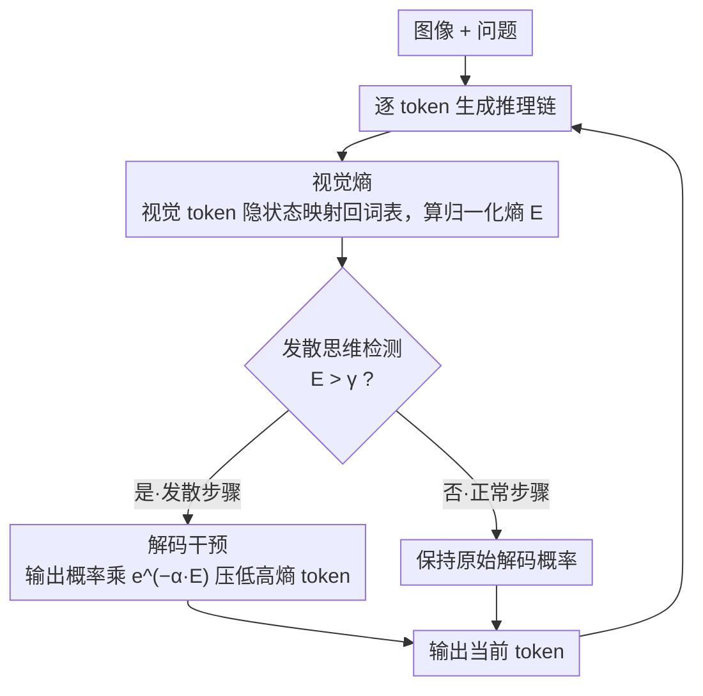

# Understanding and Mitigating Hallucinations in Multimodal Chain-of-Thought Models

**会议**: CVPR 2026  
**arXiv**: [2603.27201](https://arxiv.org/abs/2603.27201)  
**代码**: [https://github.com/ASGO-MM/MCoT-hallucination](https://github.com/ASGO-MM/MCoT-hallucination)  
**领域**: 幻觉检测  
**关键词**: 多模态幻觉、链式思维推理、发散思维、视觉熵、解码干预

## 一句话总结

本文系统分析了多模态 CoT 模型中幻觉的成因，发现模型在凭联想自由发挥的推理步骤（论文称之为"发散思维" divergent thinking）中最易产生幻觉，并提出基于视觉熵的免训练检测+解码干预策略，在 Object HalBench 上将 CHAIRS 降低超过 30%，同时保持甚至提升通用推理能力。

## 研究背景与动机

1. **领域现状**：多模态链式思维（MCoT）模型（如 R1-Onevision、PixelReasoner、GRIT）通过显式推理链大幅提升了复杂视觉推理能力，已成为多模态推理的主流范式。
2. **现有痛点**：MCoT 模型在生成推理链时会产生严重的幻觉——生成与视觉内容矛盾的文本描述。现有研究（Liu et al., Tian et al.）将原因归结为"推理链变长导致视觉注意力衰减"，但视觉注意力衰减是传统 LVLM 的老问题，并非 MCoT 独有。
3. **核心矛盾**：传统 LVLM 采用隐式推理（直接回答），而 MCoT 采用显式推理（先思考再回答），两者的推理过程存在本质差异。那么 MCoT 模型是否有独特的幻觉成因？
4. **本文目标**：(1) 找到 MCoT 模型特有的幻觉根源；(2) 设计免训练方法定位并缓解这些幻觉。
5. **切入角度**：借鉴认知科学中"发散思维 vs 正常思维"的概念，把模型凭联想发挥的推理步骤（associative reasoning steps）统称为发散思维；将推理链分段标注后，发现幻觉集中出现在发散思维步骤中（约 5 倍于正常思维）。
6. **核心 idea**：用视觉熵量化模型对视觉输入的内部置信度，高熵步骤即为发散思维，在解码时动态惩罚高熵 token。

## 方法详解

### 整体框架

本文要解决的是 MCoT 模型在生成推理链时"越想越离谱"的幻觉问题：模型一旦进入凭联想自由发挥的步骤，就容易写出与图像矛盾的内容。整套方法的思路是在推理过程中实时给每一步"测谎"——给定图像和问题，模型照常逐 token 生成推理链，但每生成一个 token 都顺手算一个**视觉熵**来判断这一步是不是脱离了视觉证据；一旦视觉熵超过阈值 $\gamma$ 就判定为发散思维步骤，立刻在解码概率上惩罚那些高熵 token，把模型从联想拉回到图像上。整个流程不动模型权重、只作用于推理阶段，且视觉 token 概率在 prefill 阶段就一次算完，几乎不增加额外延迟。

### 关键设计

**1. 视觉熵：用一个标量量化"这一步还看不看图"**

幻觉的根子在于发散思维步骤里模型更依赖内部联想而非视觉证据，所以需要一个能逐 token 反映"模型此刻对视觉输入有多大把握"的信号。视觉熵的做法是把视觉 token 的隐藏状态通过语言头映射回词表，得到当前预测 token $y_t$ 的视觉激活概率分布 $\mathbf{p}_v(y_t) \in \mathbb{R}^m$（$m$ 为视觉 token 数），再算它的归一化熵 $E(y_t, v) = -\frac{\sum_{i=1}^m p_{v,i}(y_t) \log p_{v,i}(y_t)}{\log m}$，除以 $\log m$ 把结果压到 $[0,1]$。熵越高说明视觉证据越发散、模型越拿不准。这个信号的可靠性有据可依：用视觉熵做发散/正常思维的逻辑回归分类，McFadden pseudo-$R^2$ 超过 0.9，说明它确实抓住了两类步骤的本质差异。

**2. 发散思维检测：复用已有表示，零额外前向**

有了视觉熵，检测就只是一道阈值判断——为每个推理步算出 $E(y_t, v)$，当它超过 $\gamma$（默认 $0.5$）就把这一步标为发散思维步骤。关键在于它不像传统做法那样要靠外部标注或多跑一遍前向，而是直接用模型生成时已经存在的视觉 token 表示，检测本身不带来任何额外推理开销。

**3. 解码干预：对高熵 token 做指数惩罚**

检测到发散思维后，要做的是把模型从联想拉回视觉证据，但又不能像对比解码那样付出双倍前向的代价。这里的处理是直接在解码概率上动手：对发散步骤的输出概率乘一个随视觉熵衰减的因子，

$$\hat{p}_t(\cdot \mid v, q, y_{<t}) = p_t(\cdot \mid v, q, y_{<t}) \cdot e^{-\alpha \cdot E(\cdot, v)}$$

其中 $\alpha = 0.75$ 控制惩罚强度。视觉熵越高的 token 被指数级压低概率，模型自然倾向于选那些更扎根于图像的输出。因为视觉 token 概率在 prefill 阶段已预计算好，这一步几乎零开销，也不需要任何隐藏状态编辑。

### 损失函数 / 训练策略

本方法完全免训练，不引入任何额外训练阶段。仅有的两个超参数 $\gamma = 0.5$ 和 $\alpha = 0.75$ 经实验验证可跨模型通用，换新模型时无需重新调参。

## 实验关键数据

### 主实验

| 模型 | 方法 | CHAIRS↓ | CHAIRI↓ | POPE Random Acc↑ | POPE Adv Acc↑ | POPE Pop Acc↑ |
|------|------|---------|---------|------------------|---------------|---------------|
| GRIT-3B | Baseline | 23.8 | 10.5 | 78.1 | 77.5 | 78.6 |
| GRIT-3B | +FlexAC | 19.2 | 7.4 | 79.8 | 79.0 | 79.6 |
| GRIT-3B | **+Ours** | **16.0** | **5.5** | **81.0** | **79.8** | **80.6** |
| PixelReasoner-7B | Baseline | 22.0 | 7.8 | 85.5 | 82.3 | 84.3 |
| PixelReasoner-7B | **+Ours** | **15.4** | **5.3** | **87.3** | **84.3** | **86.5** |
| R1-Onevision-7B | Baseline | 23.2 | 9.4 | 81.2 | 78.5 | 80.4 |
| R1-Onevision-7B | **+Ours** | **15.8** | **5.7** | **83.5** | **81.6** | **82.2** |

### 消融实验

| 配置 | CHAIRS↓ | POPE Adv Acc↑ | 说明 |
|------|---------|---------------|------|
| Full（$\gamma$=0.5, $\alpha$=0.75） | 15.8 | 81.6 | 完整模型 |
| w/o 检测（全局干预） | ~18.0 | ~80.0 | 不区分发散/正常步骤 |
| w/o 干预（仅检测） | 23.2 | 78.5 | 只检测不修正 |
| + DoLa | ~14.5 | ~82.0 | 可与现有方法叠加 |
| + VCD  | ~14.8 | ~82.5 | 兼容对比解码 |

### 关键发现

- **发散思维是核心问题**：幻觉率约为正常思维的 5 倍，且思考阶段和回答阶段的幻觉比高度正相关（$\rho > 0.96$, $R^2 > 0.92$）
- **注意力偏倚严重**：回答生成时模型仅将不到 0.04 的注意力分配给图像 token，其余全部偏向思考链
- **方法的即插即用性**：可以与 DoLa、VCD、MemVR、FlexAC 等现有方法无缝叠加，进一步提升效果
- **超参数跨模型通用**：$\gamma = 0.5$ 和 $\alpha = 0.75$ 在 GRIT-3B、PixelReasoner-7B、R1-Onevision-7B 上均有效，无需针对性调参

## 亮点与洞察

- **从认知科学视角切入**：借用"发散思维 vs 收敛思维"的概念框架来分析 MCoT 模型行为，这种跨学科映射让问题分析更清晰，也为后续工作提供了理论锚点
- **视觉熵一石三鸟**：同一个指标既能检测发散思维、又能指导解码干预、还能与其他方法叠加使用——设计极为简洁优雅
- **免训练+低开销**：视觉 token 概率在 prefill 阶段预计算完毕，推理阶段几乎零额外延迟，远优于需要双倍前向传播的对比解码方法
- **可迁移思路**：视觉熵的思路可迁移到其他模态（如音频-语言模型），只要能计算模态条件不确定性即可做类似的"发散检测+干预"

## 局限与展望

- 发散思维的标注依赖 GPT-5 + 人工校验，标注标准仍有主观性，且扩展到新模型时需要重新标注
- $\gamma$ 和 $\alpha$ 虽然实验证明跨模型通用，但在极端场景（如医学影像推理）下可能需要重新调整
- 仅在3个MCoT模型上验证，对更大规模模型（如70B+）的效果未知
- 视觉熵度量依赖视觉 token 数量 $m$，不同分辨率/token化策略可能影响度量稳定性
- 后续可探索将视觉熵作为训练信号（而非仅推理信号），在 SFT/RLHF 阶段直接优化模型减少发散思维倾向

## 相关工作与启发

- **vs DoLa/VCD（对比解码）**: 这些方法通过对比不同层/模态的 logits 来抑制幻觉，但需要额外前向传播。本文方法利用预计算的视觉概率，无额外开销，且可以叠加使用
- **vs MemVR（记忆增强）**: MemVR 通过增强视觉记忆来缓解注意力衰减，与本文关注的"发散思维"是不同层面的问题，两者互补
- **vs FlexAC（注意力控制）**: FlexAC 直接操作注意力权重以增加视觉关注，本文从概率分布层面干预，更轻量且效果更好

## 评分

- 新颖性: ⭐⭐⭐⭐ 发散思维+视觉熵的理论框架新颖，但解码干预手段本身比较直接
- 实验充分度: ⭐⭐⭐⭐⭐ 3个模型、多个benchmark、与5种现有方法对比和叠加验证，非常全面
- 写作质量: ⭐⭐⭐⭐ 从发现问题→分析原因→提出方法的逻辑链清晰流畅
- 价值: ⭐⭐⭐⭐ 为MCoT幻觉研究提供了新的理论视角和实用工具，即插即用特性有利于推广

<!-- RELATED:START -->

## 相关论文

- [\[CVPR 2026\] Grounded Chain-of-Thought for Multimodal Large Language Models](grounded_chain-of-thought_for_multimodal_large_language_models.md)
- [\[CVPR 2026\] Understanding the Role of Hallucination in Reinforcement Post-Training of Multimodal Reasoning Models](understanding_the_role_of_hallucination_in_reinforcement_post-training_of_multim.md)
- [\[CVPR 2026\] HulluEdit: Single-Pass Evidence-Consistent Subspace Editing for Mitigating Hallucinations in Large Vision-Language Models](hulluedit_single-pass_evidence-consistent_subspace_editing_for_mitigating_halluc.md)
- [\[CVPR 2026\] Mitigating Multimodal Hallucinations via Gradient-based Self-Reflection](mitigating_multimodal_hallucinations_via_gradient-based_self-reflection.md)
- [\[CVPR 2026\] MAD: Modality-Adaptive Decoding for Mitigating Cross-Modal Hallucinations in Multimodal Large Language Models](mad_modality-adaptive_decoding_for_mitigating_cross-modal_hallucinations_in_mult.md)

<!-- RELATED:END -->
