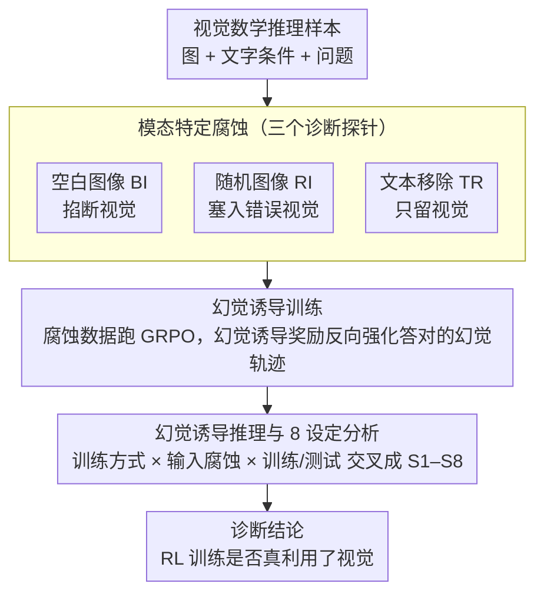

# Understanding the Role of Hallucination in Reinforcement Post-Training of Multimodal Reasoning Models

**会议**: CVPR 2026  
**arXiv**: [2604.03179](https://arxiv.org/abs/2604.03179)  
**代码**: 无  
**领域**: 幻觉检测  
**关键词**: 多模态推理、强化学习后训练、幻觉分析、GRPO、模态腐蚀

## 一句话总结

本文提出 Hallucination-as-Cue 分析框架，通过三种模态特定腐蚀策略（空白图像、随机图像、文本移除）系统研究 RL 后训练对多模态推理模型的真实作用机制，发现即使在 100% 腐蚀视觉输入下 GRPO 训练仍能显著提升推理性能，挑战了"RL 训练能有效利用视觉信息"的主流假设。

## 研究背景与动机

1. **领域现状**：受 DeepSeek-R1 等文本推理 LLM 的成功启发，大量工作将 GRPO 等 RL 后训练方法应用到多模态 LLM（如 Qwen2.5-VL）上，在视觉数学推理等任务上取得显著提升。
2. **现有痛点**：虽然 RL 后训练能提升 benchmark 分数，但目前没有工作系统研究过"这些提升到底来自真正的视觉理解，还是仅仅强化了文本推理能力"。当前 RL 奖励仅基于最终答案的对错，与模型是否正确使用了视觉信息无关。
3. **核心矛盾**：如果 RL 训练主要强化的是文本推理模式而非视觉感知，那么当前方向的投入可能事倍功半——模型只是在学"猜答案"而不是"看图推理"。
4. **本文目标**：设计系统的诊断框架，定量回答"RL 后训练是否真正利用了视觉信息"。
5. **切入角度**：把幻觉当作"诊断线索"而非需要消除的缺陷，通过故意诱导幻觉来暴露训练的真实机制。
6. **核心 idea**：设计三种模态特定腐蚀（空白图像/随机图像/文本移除），分别在训练和推理阶段施加，通过 8 种设定组合全面分析 RL 训练动态。

## 方法详解

### 整体框架

这篇论文的目标不是训练一个更强的多模态推理模型，而是回答一个诊断性问题：当我们用 GRPO 对 Qwen2.5-VL 这类模型做 RL 后训练、benchmark 分数上去了，这些提升到底来自"真正看懂了图"还是"强化了文本里的推理套路"。作者把幻觉从一个需要消除的缺陷反过来当成探针（Hallucination-as-Cue）：故意往输入里注入特定模态的"假信息"，看模型还能不能照样涨分——如果视觉被破坏了模型却照涨，那说明它本来就没怎么靠视觉。

整个框架对应论文 Figure 2 的三个阶段：先设计**模态特定腐蚀**（三个探针）→ 把腐蚀数据喂给 GRPO 做**幻觉诱导训练**（hallucination-inductive training）→ 把"是否经幻觉诱导训练 × 评估输入是否腐蚀 × 训练集/测试集"交叉成 **8 种设定（S1–S8）**做评估，对照出 RL 训练真正在强化什么。三种腐蚀分别打击不同的模态通道，互为对照，构成诊断的核心。

### 关键设计

**1. 模态特定腐蚀：三个打击不同模态通道的诊断探针**

这是整个框架的入口，针对的痛点很直接——既然怀疑模型没在用视觉，那就故意往输入里注入"假信息"，看模型还能不能照常涨分。作者设计了三种正交的腐蚀，分别破坏不同的信息通道、承担不同的诊断角色：

- **空白图像替换（Blank Image, BI）**：把训练/测试的所有图像换成空白图，彻底掐断视觉通道，逼模型只能从纯文本条件出发推理。诊断逻辑最硬：若在完全没有视觉的条件下 RL 训练仍能提升性能，就直接证明这些提升根本不需要视觉，RL 强化的是文本推理而非视觉感知。
- **随机图像替换（Random Image, RI）**：把每张图换成数据集里随机另一张图，构造文图完全不匹配的训练对。比 BI 更苛刻——模型不仅缺正确视觉，还要面对一张无关图的干扰。若带干扰仍有效，说明模型已学会主动忽略视觉、退守文本推理，是比 BI 更强的"视觉无用"证据。
- **文本信息移除（Textual Removal, TR）**：反向破坏文本，用规则匹配删掉题目里的变量条件和问题描述，只留模板化指令（如"逐步作答"）和图像。它是反证探针——若 RL 真能用视觉，TR 训练应表现最好，因为图里还残留着条件值、箭头/问号等线索，视觉成了唯一信息源。

**2. 幻觉诱导训练：用腐蚀数据跑 GRPO，靠"幻觉诱导奖励"反向强化**

这一步解释了全文最反直觉的现象——为什么把输入破坏掉、模型却照样涨分。机制在于 GRPO 的奖励是 rule-based 的、只看最终答案对错，与模型有没有真用上视觉无关。当输入被腐蚀后，模型采样出的 $n$ 条 rollout 大多充满幻觉内容，但其中**总有一小撮幻觉轨迹碰巧（或因模型固有偏置）答对**，照样领到正向奖励——作者称之为**幻觉诱导奖励（hallucination-inductive reward）**。GRPO 于是抬高这些轨迹的概率，模型逐步学会"从腐蚀输入＋自身幻觉推理链得出答案"的模式。正因为正向幻觉轨迹里有一部分确实是正确的文本推理，强化它们就等于在教模型有效的推理套路，所以即便视觉被毁，性能仍能稳步上升。

**3. 幻觉诱导推理与 8 设定分析矩阵：交叉对照，定位 RL 到底强化了什么**

光看"腐蚀训练能涨分"还不够，要定位 RL 强化的究竟是文本还是视觉，需要一张系统的对照矩阵。作者把"模型是否经幻觉诱导训练 × 评估输入是否腐蚀 × 用训练集还是测试集"交叉成 8 种设定 S1–S8：S1–S2 是基座/正常 GRPO 在干净数据上的基线，S3–S4 看正常训练的模型遇到腐蚀输入会怎样，S5–S6 看幻觉诱导训练的模型在干净数据上还行不行，S7–S8 看它在腐蚀输入下能否比正常模型多答对。推理阶段模型仍被要求生成完整推理链和答案——腐蚀后准确率会降但不会归零（靠幻觉或运气）。正是靠 S1–S8 的横向对比，作者才能把"涨分来自视觉还是文本"这个含混问题拆成一组可测量、可证伪的对照。

### 损失函数 / 训练策略

三种腐蚀都套在标准 GRPO 上，唯一变量就是输入数据是否被腐蚀，训练管线本身不变。GRPO 用组归一化优势 $A_i = \frac{R_i - \mu_{group}}{\sigma_{group} + \epsilon}$ 替代价值网络，再走 PPO-style clipped surrogate 加 KL 惩罚。训练 15 个 episode，rollout size 5，温度 0.7，KL 权重 0.01，学习率 $1 \times 10^{-6}$。奖励只看最终答案对错——这恰恰是问题所在：奖励信号与模型是否真的用了视觉无关，所以才会出现"破坏视觉照样涨分"的现象。

## 实验关键数据

### 主实验

| 模型 | 训练方式 | MathVision | MathVerse | MathVista | WeMath | AVG |
|------|----------|------------|-----------|-----------|--------|-----|
| Qwen2.5-VL-3B | Base | 18.19 | 34.82 | 51.40 | 54.48 | 39.72 |
| Qwen2.5-VL-3B | +GRPO | 22.73 | 37.72 | 58.40 | 60.11 | 44.74 |
| Qwen2.5-VL-3B | +GRPO-BI | 20.95 | 35.10 | 56.40 | 56.55 | 42.25 |
| Qwen2.5-VL-3B | +GRPO-RI | 20.86 | 35.76 | 58.00 | 55.17 | 42.45 |
| Qwen2.5-VL-7B | Base | 27.70 | 45.20 | 67.00 | 63.68 | 50.89 |
| Qwen2.5-VL-7B | +GRPO | 28.13 | 47.56 | 70.00 | 68.39 | 53.52 |
| Qwen2.5-VL-7B | +GRPO-BI | 28.39 | 48.86 | 68.50 | 66.84 | 53.15 |
| Qwen2.5-VL-7B | **+GRPO-RI** | **27.27** | **49.90** | **71.40** | **68.33** | **54.23** |

### 消融实验

| 设定 | 训练数据 | MathVision | MathVerse | MathVista | WeMath | AVG |
|------|----------|------------|-----------|-----------|--------|-----|
| GRPO | Geometry3K | 22.73 | 37.72 | 58.40 | 60.11 | 44.74 |
| GRPO | MMR1-V0 | 26.18 | 39.26 | 65.00 | 62.47 | 48.23 |
| GRPO | CLEVR | 23.06 | 35.96 | 58.20 | 55.75 | 43.24 |
| GRPO-BI | Geometry3K | 20.95 | 35.10 | 56.40 | 56.55 | 42.25 |
| GRPO-BI | MMR1-V0 | 24.28 | 40.03 | 61.20 | 61.61 | 46.78 |
| GRPO-BI | CLEVR | 21.51 | 35.05 | 58.20 | 54.20 | 42.24 |

### 关键发现

- **最震撼的发现**：7B 模型在随机图像（GRPO-RI）训练下 AVG 达到 54.23%，**超过正常 GRPO 训练的 53.52%**。这意味着用完全错误的图片训练反而更好
- **BI 训练在 MathVision 上的反常**：3B 基座模型在 BI 推理下准确率从 18.19% 升到 18.91%（+0.72%），说明视觉信息甚至可能干扰小模型的推理
- **模型规模效应**：大模型从幻觉轨迹中受益更多——7B 的 GRPO-BI/RI 与正常 GRPO 的差距远小于 3B
- **TR 未优于 BI/RI**：即使 TR 保留了图像中的视觉线索，训练效果与完全无视觉的 BI 差距不大，进一步证实当前 RL 训练未有效利用视觉信息
- **视觉密集型问题受损最大**：BI 推理下 Vision Intensive 问题准确率下降 20-26%，但 Text Dominant 问题仅下降 4-7%

## 亮点与洞察

- **反直觉的核心发现极具冲击力**：用错误图片训练比正确图片效果更好，这不仅是一个有趣的实验观察，更是对整个多模态 RL 训练范式的深刻质疑
- **Hallucination-as-Cue 的诊断思路可广泛复用**：把"缺陷"转化为"诊断信号"的思路可以迁移到其他场景，如用噪声音频训练来诊断语音模型的文本依赖程度
- **8 种评估设定的交叉矩阵设计非常系统**：训练×推理×腐蚀的组合覆盖全面，确保结论的可靠性

## 局限与展望

- 仅研究了 GRPO 算法，PPO、DPO 等其他 RL 方法的行为可能不同
- 实验限于 Qwen2.5-VL 的 3B 和 7B 规模，更大规模（72B）模型是否仍然依赖文本先验？
- 训练数据主要是视觉数学推理（Geometry3K、MMR1-V0），结论能否推广到自然图像 VQA、视频推理等场景尚不清楚
- 文章侧重诊断和分析，未提出具体的改进方案来让 RL 训练真正利用视觉信息
- 后续可探索模态感知的奖励函数设计（如基于 visual grounding 质量的额外奖励）以弥补当前最终答案奖励的不足

## 相关工作与启发

- **vs DeepSeek-R1 / OpenAI-o1**: 这些纯文本推理模型的成功本身就暗示了"推理能力可能主要来自语言模块"，本文在多模态场景下验证了这一猜想
- **vs Ma et al. (2603.27201)**: 该并行工作聚焦于 MCoT 模型推理阶段的幻觉缓解，本文则聚焦于训练阶段的幻觉角色，两者互补——一个管"推理时怎么减少幻觉"，一个管"训练时幻觉为何反而有用"
- **vs concurrent work (models retaining accuracy without images)**: 该工作在推理时去除图像评估，本文进一步在训练时也去除图像，发现训练阶段的影响更深远

## 评分

- 新颖性: ⭐⭐⭐⭐⭐ 将幻觉从"需要消除的问题"重新定义为"诊断工具"的视角极具创新性
- 实验充分度: ⭐⭐⭐⭐⭐ 2个模型规模×3种腐蚀×3个数据集×8种设定×5个benchmark，实验矩阵极为全面
- 写作质量: ⭐⭐⭐⭐ 逻辑清晰，但部分图表信息量过于密集
- 价值: ⭐⭐⭐⭐⭐ 对多模态RL训练的"皇帝的新衣"式揭示具有重要警示意义，可能深刻影响后续研究方向

<!-- RELATED:START -->

## 相关论文

- [\[CVPR 2026\] Understanding and Mitigating Hallucinations in Multimodal Chain-of-Thought Models](understanding_and_mitigating_hallucinations_in_multimodal_chain-of-thought_model.md)
- [\[NeurIPS 2025\] Reasoning Models Hallucinate More: Factuality-Aware Reinforcement Learning for Large Reasoning Models](../../NeurIPS2025/hallucination/reasoning_models_hallucinate_more_factuality-aware_reinforcement_learning_for_la.md)
- [\[NeurIPS 2025\] Generalization or Hallucination? Understanding Out-of-Context Reasoning in Transformers](../../NeurIPS2025/hallucination/generalization_or_hallucination_understanding_out-of-context_reasoning_in_transf.md)
- [\[CVPR 2026\] Zina: Multimodal Fine-grained Hallucination Detection and Editing](zina_multimodal_fine-grained_hallucination_detection_and_editing.md)
- [\[CVPR 2026\] Reallocating Attention Across Layers to Reduce Multimodal Hallucination](reallocating_attention_across_layers_to_reduce_multimodal_hallucination.md)

<!-- RELATED:END -->
