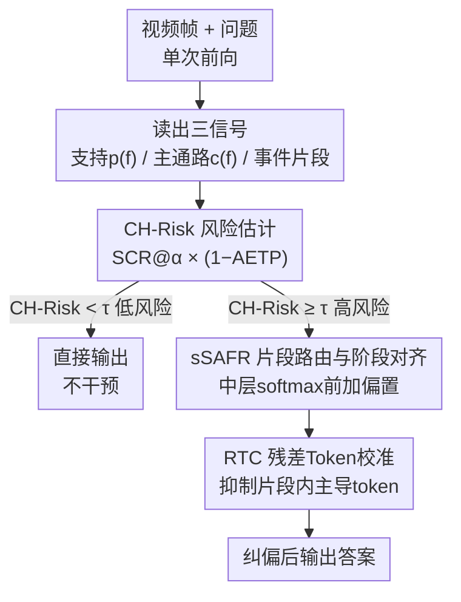

# Unstitching the Chimera: Frame-Level Risk and Train-Free Mitigation for Video Hallucination

**会议**: CVPR 2026  
**论文**: [CVF Open Access](https://openaccess.thecvf.com/content/CVPR2026/html/Yang_Unstitching_the_Chimera_Frame-Level_Risk_and_Train-Free_Mitigation_for_Video_CVPR_2026_paper.html)  
**领域**: 视频理解 / 多模态VLM / 幻觉缓解  
**关键词**: 视频幻觉、奇美拉幻觉、免训练干预、注意力路由、风险估计

## 一句话总结
本文从「帧」而非「token」的视角刻画了一种被忽视的视频幻觉——**奇美拉幻觉（Chimera Hallucination）**：模型把视频里真实存在但不属于同一事件链的片段拼成一个虚假的连续叙事；为此提出单次前向、无需参考的风险指标 CH-Risk 来量化这种风险，并用免训练的两阶段干预 CH-M（片段路由 sSAFR + 残差 token 校准 RTC）在高风险样本上纠偏，在 9 个 benchmark、6 个 VideoLLM 上以 <5% 延迟、<2.5% 显存、≈1% FLOPs 的代价稳定降低幻觉、提升准确率。

## 研究背景与动机
**领域现状**：多模态大模型（MLLM）的幻觉研究高度「图像中心」，主流分类法围绕**物体幻觉**（object，看到不存在的实体）、关系幻觉、解码相关幻觉展开，缓解手段分两路——靠额外监督/对齐的重训练方法，和在推理时干预、对部署友好的免训练方法。但这些诊断与方法都建立在「单帧 + token 级」的视角上。

**现有痛点**：视频不是图像的简单堆叠。视频里的错误往往表现为**叙事失真**，比单帧错误更隐蔽、更有害。而很多 VideoLLM 继承自图文预训练，存在「静态→动态」的分布失配，削弱了对真实帧序和跨帧因果结构的建模——可现有的 token 级、物体中心的诊断工具根本捕捉不到这种「跨帧错配」。

**核心矛盾**：存在一类幻觉，模型**并没有凭空捏造任何实体**（所以物体幻觉的检测器全部失效），它引用的每一帧证据都真实存在于视频里，但它把分属不同事件链的证据**强行缝合**成一个看似连贯、实则错误的故事。作者通过对 3 个代表性 VideoLLM 的 600 个失败案例做大规模审计发现：这种「奇美拉幻觉」占坏案例的 **34%**，仅次于物体幻觉的 52%——是一个普遍却从未被正式刻画的失败模式。

**本文目标**：(1) 把奇美拉幻觉**定义清楚、可度量、可复现**；(2) 设计一个不需要参考答案、单次前向就能算出的风险指标；(3) 把风险信号转成**免训练**的推理期纠偏。

**切入角度**：近期研究发现 VideoLLM 内部存在**分阶段的时序信息流**——浅中层先聚合跨帧时序关系形成「时序主通路」，中层与时间词融合，中后层综合产生答案。正确答案应当沿着早期形成的时序主通路取证，而不是在解码时到处采样远端锚点。作者由此提炼两条可操作规律：**(R1) 事件一致性**——回答所依据的主要证据不应散落在大量与问题语义无关的事件片段上；**(R2) 阶段对齐**——回答时刻的帧级证据应与浅中层形成的时序主通路对齐。

**核心 idea**：用「证据有多散（片段覆盖）× 证据有多偏离主通路（阶段错配）」两个互补信号合成一个风险分数，并据此**只在高风险样本上**做最小侵入的注意力重路由与 token 校准。

## 方法详解

### 整体框架
方法在**一次前向传播**里同时读出三样东西：中层的「文本→帧」支持分布 $p(f)$、浅中层的时序主通路中心性 $c(f)$、以及由无监督边界切出的事件片段 $\{S_m\}_{m=1}^{M}$（边界来自相邻帧特征相似度骤降 + 跨帧注意力断裂的融合信号）。基于这三者算出风险分 $\text{CH-Risk}=\text{SCR}@\alpha\cdot(1-\text{AETP})$。若 $\text{CH-Risk}\ge\tau$，就触发免训练的两阶段干预 CH-M：第一步 sSAFR 在中层 softmax **之前**给帧级 logits 加偏置，把注意力重路由到少数与主通路对齐的关键片段；第二步 RTC 在这些片段内部裁剪并重归一化过度主导的 token。低风险样本直接跳过，几乎不付代价。

### 关键设计

**1. 奇美拉幻觉的形式化定义与审计：把「拼接式叙事错误」变成可标注的对象**

奇美拉幻觉最棘手的地方在于「无中生有」的检测器对它无效——它引用的证据全是真的。作者给出严格的判定：设视频 $V=\{f_t\}_{t=1}^{T}$、答案 $y$，把时间轴切成事件片段 $\mathcal{S}=\{S_m\}$，定义支撑 $y$ 的**最小证据覆盖** $\mathcal{E}(y)$（人工按问题语义核验），并用关系矩阵 $R\in\{0,1\}^{M\times M}$ 编码片段间是否同属一条事件链（$R_{ij}=1$ 表示有显式因果/时序连续）。当且仅当满足三条时判为奇美拉：(i) 无物体捏造——$y$ 引用的所有实体/动作都在 $V$ 中出现；(ii) 错配——存在 $i\neq j\in\mathcal{E}(y)$ 使 $R_{ij}=0$，但 $y$ 却断言 $S_i,S_j$ 之间有连续/因果；(iii) 叙事必要性——这条被断言的联系是 $y$ 正确性所必需的（不是可删的措辞）。基于此，作者在 3 个 benchmark、3 个 VideoLLM 上各取 200 个错误共 600 例做双标注审计，Cohen's $\kappa=0.76$，得到 OH 52% / CH 34% / Others 14% 的分布，证明这是一个真实且高频的失败模式。

**2. CH-Risk：单次前向、无参考的奇美拉风险分数**

要在没有标注答案、不额外跑前向的前提下度量风险，作者用两个**互补**信号合成。第一个是**跨片段覆盖** $\text{SCR}@\alpha$：把每个片段的文本→帧支持 $q_m=\sum_{f\in S_m}p(f)$ 降序排列，累计质量 $S_k=\sum_{i=1}^{k}q_{(i)}$，则

$$\text{SCR}@\alpha=\frac{1}{M}\min\{k\in[M]:S_k\ge\alpha\},\quad\alpha\in(0,1).$$

它度量「要覆盖 $\alpha$ 比例的证据需要用到多少个片段」——值越大说明证据越分散，长程拼接倾向越强。第二个是**早期时序通路对齐** $\text{AETP}$：在浅中层为每帧累积「跨帧流入/中心性」$c(f)$（跨层跨头求和后 L1 归一），再用秩相关衡量它和支持分布的一致性

$$\text{AETP}=\frac{1+\text{Spearman}\big(p(f),c(f)\big)}{2}\in[0,1].$$

值越低说明证据越偏离主通路、阶段错配越严重。最终风险分把两者相乘：$\text{CH-Risk}=\text{SCR}@\alpha\cdot(1-\text{AETP})\in[0,1]$，即「又散 × 又偏」才高风险。审计统计验证：奇美拉案例在 SCR@α 上明显右移、在 AETP 上明显左移，「高 SCR / 低 AETP」象限集中了 **81%** 的奇美拉错误。作者按开发集 70–75 分位保守取全局阈值 $\tau=0.28$，强调它是**校准的风险信号**而非硬判定。

**3. sSAFR：片段级路由 + 阶段对齐，把注意力收拢到主通路上的少数关键片段**

针对「证据散 + 偏主通路」，第一阶段在选定的某个中层、softmax **之前**对帧级 logits $z_f$ 加一个小偏置。先解最小覆盖 $\mathcal{S}^\star=\arg\min_{\mathcal{A}\subseteq\mathcal{S}}|\mathcal{A}|\ \text{s.t.}\ \sum_{S\in\mathcal{A}}\sum_{f\in S}p(f)\ge\alpha$，再令

$$\tilde z_f=z_f+\lambda\,\hat c(f)+\gamma\,\mathbf{1}\Big\{f\in\textstyle\bigcup_{k=1}^{K_\alpha}S_{m_k}\Big\},$$

其中 $\hat c(f)$ 是主通路中心性的零均值单位方差归一，$\lambda=0.3,\gamma=0.4$。第一项 $\lambda\hat c(f)$ 把注意力**拉向时序主通路**（提升 AETP），第二项 $\gamma\mathbf{1}\{\cdot\}$ 把概率质量**集中到最小覆盖的几个语义连贯片段**（降低 SCR@α）。作者证明：当 $\lambda,\gamma$ 足够小时，一阶变化满足 $\Delta\text{AETP}\ge0$、$\Delta\text{SCR}@\alpha\le0$，且 softmax 保证总质量守恒——既纠偏又不破坏归一。它只作用于单个中层、不改任何参数。

**4. RTC：片段内残差 token 校准，压平脆弱的单 token 锚点**

把注意力收拢到对的片段后，片段**内部**可能仍有个别 token 吸走过多权重，形成脆弱的单点锚定。RTC 在选中的片段 $S\in\mathcal{S}^\star$ 内做裁剪重归一：设帧内 token 份额 $u_{f,i}=w_{f,i}/p(f)$（$\sum_i u_{f,i}=1$），给每帧设上限 $s_f=\rho\cdot\frac{1}{N_f}$（$\rho\ge1$，默认 3），然后

$$\bar u_{f,i}=\frac{\min(u_{f,i},s_f)}{\sum_j\min(u_{f,j},s_f)},\quad w'_{f,i}=p(f)\,\bar u_{f,i}.$$

关键是它**保持帧级质量 $p(f)$ 不变**，只削掉帧内尖峰。等价的残差视角写成 $w'_{f,i}=w_{f,i}-\eta[w_{f,i}-p(f)s_f]_+ +\xi_f$，其中 $[x]_+=\max(x,0)$，$\xi_f$ 是保证 $\sum_i w'_{f,i}=p(f)$ 的逐帧标量。顺序上必须 sSAFR→RTC：先在片段级搭好连贯的时序支撑，再做帧内校准才有效且不破坏结构。

### 损失函数 / 训练策略
本方法**完全免训练、不改参数与架构、不需额外前向**。CH-Risk 与 CH-M 所需的全部信号（事件边界、中层支持、浅中层通路中心性）都从一次前向里读出；片段覆盖（贪心）与秩对齐（Spearman）对帧数近似线性，RTC 对选中片段内 token 数线性。CH-Risk 充当门控，只在 $\text{CH-Risk}\ge\tau$ 时激活 CH-M。对计数、导航、重复等本就需要多片段的任务，开发期对 SCR@α 加一个小先验 $K_{\text{prior}}\in\{2,3\}$，用 $\max(K_\alpha,K_{\text{prior}})$ 重归一做基线校正。

## 实验关键数据

### 主实验
在 9 个视频 benchmark、6 个 7B 级 VideoLLM 上评测，除 MLVU 用官方 M-Avg 外均报 Accuracy(%)。CH-M 在**所有模型、所有 benchmark** 上一致提升，幻觉导向的 VidHalluc 提升最显著。

| 模型 | NExT-QA | TempCompass | ActivityNet-QA | VidHalluc | MVBench | Video-MME |
|------|---------|-------------|----------------|-----------|---------|-----------|
| Video-LLaVA-7B | 61.3 | 49.9 | 45.3 | 40.3 | 42.5 | 39.9 |
| + CH-M | 63.9 (+2.6) | 52.5 (+2.6) | 47.7 (+2.4) | 45.9 (+5.6) | 45.2 (+2.7) | 42.0 (+2.1) |
| Qwen2.5-VL-7B | 73.5 | 71.7 | 59.4 | 64.2 | 68.4 | 65.1 |
| + CH-M | 75.1 (+1.6) | 73.5 (+1.8) | 60.9 (+1.5) | 67.4 (+3.2) | 70.1 (+1.7) | 66.4 (+1.3) |
| VideoLLaMA3-7B | 79.5 | 68.1 | 61.3 | 78.1 | 69.7 | 66.2 |
| + CH-M | 80.8 (+1.3) | 69.9 (+1.8) | 62.4 (+1.1) | 81.0 (+2.9) | 71.1 (+1.4) | 67.3 (+1.1) |

风险诊断（9 benchmark 平均，$\alpha=0.8,\tau=0.28$）显示 CH-M 同时压低 SCR@0.8、抬高 AETP，使高风险样本比例明显下降：

| 模型 | CH-Risk↓ | SCR@0.8↓ | AETP↑ | HighRisk@τ(%)↓ |
|------|----------|----------|-------|----------------|
| Video-LLaVA-7B | 0.33 | 0.52 | 0.42 | 38 |
| + CH-M | 0.23 (−0.10) | 0.43 (−0.09) | 0.53 (+0.11) | 24 (−14) |
| Qwen2.5-VL-7B | 0.27 | 0.47 | 0.47 | 28 |
| + CH-M | 0.20 (−0.07) | 0.41 (−0.06) | 0.54 (+0.07) | 18 (−10) |
| VideoLLaMA3-7B | 0.26 | 0.46 | 0.48 | 25 |
| + CH-M | 0.19 (−0.07) | 0.40 (−0.06) | 0.55 (+0.07) | 16 (−9) |

值得注意：基线 AETP≤0.43 的弱模型（Video-LLaVA、VideoChat2）天然更频繁触发门控（36–38%），而 Qwen2.5-VL、VideoLLaMA3 这类强模型基线高风险比例接近 25–28%——印证 $\tau=0.28$（75 分位）的校准合理性。

### 消融实验
在 LLaVA-Video-7B 上，对组件与顺序消融（NExT-QA / VidHalluc 准确率 + 平均风险增量）：

| 配置 | NExT-QA | VidHalluc | ΔCH-Risk↓ | ΔSCR@0.8↓ | ΔAETP↑ |
|------|---------|-----------|-----------|-----------|--------|
| Baseline（无干预） | 73.2 | 76.6 | 0.00 | 0.00 | 0.00 |
| sSAFR-only（完整 λ,γ） | 74.7 | 79.3 | −0.05 | −0.05 | +0.03 |
| sSAFR w/o 对齐（λ=0） | 74.2 | 78.6 | −0.03 | −0.04 | +0.00 |
| sSAFR w/o 片段先验（γ=0） | 73.9 | 78.0 | −0.02 | −0.02 | +0.02 |
| sSAFR 均匀窗先验 | 73.5 | 77.4 | −0.01 | −0.01 | +0.01 |
| RTC-only（硬上限 ρ=3） | 73.6 | 77.5 | −0.02 | −0.01 | +0.02 |
| RTC→sSAFR（反序） | 74.7 | 79.7 | −0.06 | −0.05 | +0.03 |
| **sSAFR→RTC（本文）** | **75.1** | **80.2** | **−0.07** | **−0.06** | **+0.05** |

### 关键发现
- **sSAFR 是主要增益来源**：贡献了大部分准确率提升和最大的 SCR@0.8 下降，说明「把证据路由到少数语义连贯片段」对时序问题和幻觉抑制最关键；去掉对齐项（λ=0）会削弱 AETP 提升，去掉片段先验（γ=0）会削弱片段收拢。
- **均匀窗先验明显更差**，证明必须用**学到的事件片段**而非固定窗口，才能避免长程拼接。
- **顺序重要**：sSAFR→RTC 在两个数据集上都优于反序——先在片段级搭好连贯支撑，帧内校准才有效且非破坏性。
- **CH-Risk 是有效的失败预测器**：ROC AUROC≈0.74，单阈值门控即可；准确率随风险分桶单调下降、而 ΔAccuracy 随风险单调上升，干预集中在最该改的地方，低风险桶几乎不动。门控在 τ≈0.28 出现明显拐点（召回 >0.7 同时精度显著高于基线错误率）。
- **超参鲁棒**：(λ,γ) 在 [0.3,0.4]×0.4 附近有宽平台，α=0.8（0.7 欠覆盖、0.9 过约束）、ρ=3 均为甜点；调参负担低。
- **开销可忽略**：在门控下延迟 ≈3–5%、峰值显存 ≈1.7–2.4%、FLOPs ≤1.2%，因为操作是逐元素且复用已有注意力图，低风险样本几乎零成本。

## 亮点与洞察
- **「奇美拉幻觉」这个命名与刻画本身就是最大贡献**：它精准点出一类「证据全真、拼接全假」的失败——传统物体幻觉检测器对它完全失效，却占了视频坏案例的 1/3，等于在地图上画出一块以前没人标的区域。
- **风险分解极优雅**：把抽象的「叙事缝合」拆成两个可单次前向算出的物理量——证据有多散（SCR@α，片段覆盖）× 证据有多偏（1−AETP，与主通路的秩相关），相乘即风险。这种「散×偏」的乘法结构很有迁移价值，可用于任何「内部信息流 vs. 外部证据分布」是否一致的诊断。
- **风险即门控，干预最小侵入**：CH-Risk 既是诊断也是开关，让免训练干预只在 34% 该管的样本上动手，避免了一刀切干预对正常样本的伤害——这也是开销近乎为零的根因。
- **沿「内部时序主通路」纠偏的思路可迁移**：sSAFR 的「softmax 前加偏置把注意力拉回主通路」是一种通用的、可证一阶单调改善的注意力重路由手段，对其他需要尊重模型内部信息流的免训练干预（如长文本、长程推理）都有借鉴意义。

## 局限与展望
- **依赖人工标注做定义验证**：奇美拉的形式化判定（最小证据覆盖 $\mathcal{E}(y)$、关系矩阵 $R$）在审计阶段靠人工核验，规模化自动检测仍是开放问题；600 例审计虽双标注但样本量有限。
- **阈值 τ 与超参需按模型/任务校准**：作者明确 τ=0.28 是开发集分位数的统计规律而非通用常数，跨域部署需重新标定；对「天然需要多片段」的任务还要打 $K_{\text{prior}}$ 补丁，说明 SCR@α 对这类任务有系统偏差。
- **只在单个中层干预**：sSAFR/RTC 选在「某个中层」操作，层的选择策略文中未充分展开，跨架构的最优层可能不同。
- **一阶单调性是局部近似**：$\Delta\text{AETP}\ge0,\Delta\text{SCR}@\alpha\le0$ 只在 λ,γ 足够小时成立，较大偏置下的行为缺乏保证。
- 可改进方向：把事件边界检测与风险估计联合学习、用 CH-Risk 作训练期信号做轻量对齐、把两阶段干预扩展到多层协同。

## 相关工作与启发
- **vs 图像幻觉（物体/关系/解码相关）**：它们刻画「看到不存在的东西」或单帧 token 级偏差；本文刻画「东西都真、但拼错了事件链」的跨帧叙事错配，是从 token 级、物体中心转向帧级、叙事结构的视角迁移。
- **vs 免训练解码干预（如对比解码类）**：同属推理期、对部署友好，但它们多在 logits/解码分布上做通用对比；本文针对视频特有的时序主通路，做**有针对性**的片段路由与片段内校准，并用风险门控只在高风险样本上触发。
- **vs 重训练/对齐类视频幻觉缓解**：那类需要额外监督或微调；本文不改参数、不需训练、单次前向，开销 <5% 延迟即可落地。
- **借鉴的机制研究**：建立在「VideoLLM 浅中层先形成时序主通路、帧序至关重要」的最新发现之上，把这一内部机制转化为可操作的对齐约束（AETP）和干预手段（sSAFR 的 $\lambda\hat c(f)$ 项）。

## 评分
- 新颖性: ⭐⭐⭐⭐⭐ 首次正式定义并量化「证据全真、拼接全假」的奇美拉幻觉，填补了视频幻觉刻画的空白。
- 实验充分度: ⭐⭐⭐⭐⭐ 9 benchmark × 6 VideoLLM 主实验 + 风险诊断 + 组件/顺序/超参/开销/校准多维消融，AUROC 等证据链完整。
- 写作质量: ⭐⭐⭐⭐ 定义形式化严谨、公式与图配合清晰；个别符号（如 $\mathcal{S}^\star$ 的求解、$K_\alpha$）需结合图才好理解。
- 价值: ⭐⭐⭐⭐⭐ 既提出可复用的诊断框架（散×偏的风险分解），又给出近零成本、即插即用的免训练缓解，部署价值高。

<!-- RELATED:START -->

## 相关论文

- [\[CVPR 2026\] ELV-Halluc: Benchmarking Semantic Aggregation Hallucinations in Video Understanding](elv-halluc_benchmarking_semantic_aggregation_hallucinations_in_video_understandi.md)
- [\[CVPR 2026\] SEASON: Mitigating Temporal Hallucination in Video Large Language Models via Self-Diagnostic Contrastive Decoding](season_mitigating_temporal_hallucination_in_video_large_language_models_via_self.md)
- [\[ACL 2026\] Distorted or Fabricated? A Survey on Hallucination in Video LLMs](../../ACL2026/hallucination/distorted_or_fabricated_a_survey_on_hallucination_in_video_llms.md)
- [\[CVPR 2026\] Cross-Modal Attention Calibration for LVLM Hallucination Mitigation](cross-modal_attention_calibration_for_lvlm_hallucination_mitigation.md)
- [\[ACL 2026\] Through the Magnifying Glass: Adaptive Perception Magnification for Hallucination-Free VLM Decoding](../../ACL2026/hallucination/through_the_magnifying_glass_adaptive_perception_magnification_for_hallucination.md)

<!-- RELATED:END -->
