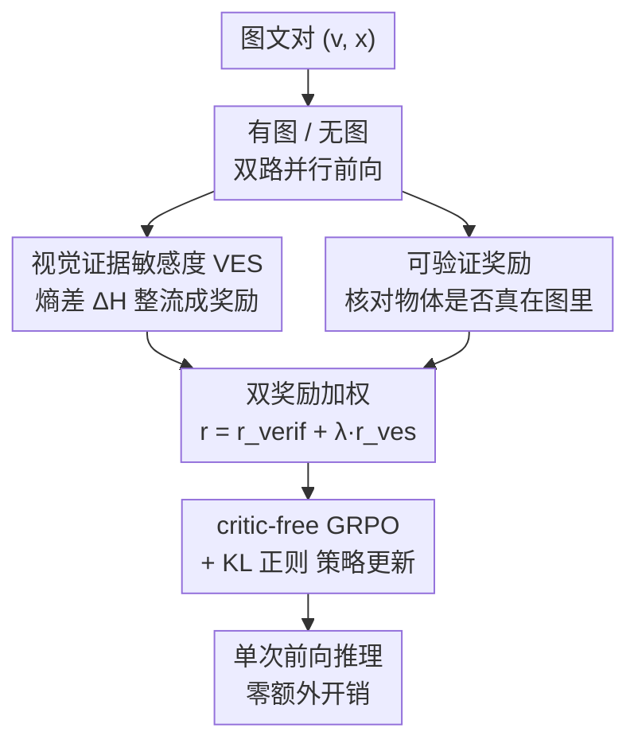

# VES-RFT: Rewarding Visual Evidence Sensitivity to Mitigate Hallucinations in Large Vision-Language Models

**会议**: CVPR 2026  
**论文**: [CVF Open Access](https://openaccess.thecvf.com/content/CVPR2026/html/Hou_VES-RFT_Rewarding_Visual_Evidence_Sensitivity_to_Mitigate_Hallucinations_in_Large_CVPR_2026_paper.html)  
**领域**: 多模态VLM / 幻觉缓解 / 强化微调  
**关键词**: 物体幻觉、视觉证据敏感度、强化微调、GRPO、可验证奖励

## 一句话总结
VES-RFT 把"给图前后模型决策熵的变化"定义成一个免标注的视觉证据敏感度（VES）奖励，再配上一个自动核对生成物体是否真在图里的可验证奖励，用 critic-free 的 GRPO 联合优化，让 VLM 学会"因为看了图而自信"而不是"靠语言先验瞎自信"，在 POPE / CHAIR / AMBER 上用极少训练数据显著压低物体幻觉、且推理不增开销。

## 研究背景与动机
**领域现状**：大型视觉语言模型（VLM，如 LLaVA-1.5、Qwen2.5-VL）虽然能联合看图和读文本，但物体幻觉（confidently 说出图里根本不存在的物体）始终是顽疾。现有缓解手段大致分两派：一派是**重训/微调**，用带幻觉标注的监督信号或在解码后期把视觉特征重新注入（feature re-injection），训练代价高；另一派是**推理时干预**，保持模型冻结，靠对比解码（VCD）、互信息重加权（M3ID）等手段在测试时压低无视觉支撑的 token，缺点是每次推理都要额外前向、且不改模型本身。

**现有痛点**：作者点出一个被忽视的本质——模型的"自信"和"是否真用了图"之间是脱节的。两个经验现象很说明问题：① 预训练语料里不同物体共现频率高度倾斜，模型由此学到很强的纯文本先验；② "请详细描述这张图"这类引导性提示会进一步把模型推向这些先验，导致序列后段的 token 越来越被语言先验主导，编出图里没有的物体。一个直接的诊断是：**即便把图去掉（$v=\emptyset$），模型对答案的预测分布往往依然又尖又自信**——说明它的确定性来自文本共现统计，而非视觉证据。

**核心矛盾**：推理时干预派"会诊断"低视觉支撑状态、却不更新参数去主动避免它，还得额外前向；重训派把视觉忠实度"烤进"模型，但奖励通常是离散的、离线的偏好标签，和模型自身的预测不确定性脱钩。两派都没有把"图到底有没有降低决策不确定性"这个量变成**可训练**的目标。

**切入角度**：作者用一个反事实视角问——如果模型真在用图，它的不确定性该怎么变？固定 query、解码、参数，对比"有图"和"无图"两种条件：一个理想的 grounded 模型，在图提供有效证据时加图应当**降低**任务相关的决策不确定性；图与语言先验冲突或无信息时则不变或升高。换言之，自信应该是"因为图"而非"因为文本共现"。

**核心 idea**：把"有图/无图"的熵差从一个诊断量变成一个**可学习的奖励**——视觉证据敏感度 VES，再配一个自动核对物体是否真存在的**可验证奖励**，在训练时用 GRPO 联合优化，从源头重塑模型"何时该自信"的决策习惯，而推理时保持单次前向不变。

## 方法详解

### 整体框架
VES-RFT 是一个**模型无关、推理零额外开销**的训练时强化微调框架，挂在监督好的 checkpoint 之上。对每个图文对 $(v, x)$，训练时跑两次前向：一次带图、一次把图 token 掩掉（无图对照）。从两次的预测分布算出 VES 奖励（图带来的熵下降）；同时用一个冻结的验证器核对生成的物体提及是否真在图里，得到可验证奖励；两者加权成总奖励，喂给 critic-free 的 GRPO 做策略更新。推理时只走带图的单次前向，不引入任何额外模块或前向。

### 关键设计

**1. 视觉证据敏感度 VES：把"有图前后的熵差"变成可训练信号**

针对"模型自信但不一定真用图"这个核心痛点，作者定义了一个任务相关的低维决策变量 $z$（POPE 里是 yes/no，CHAIR/AMBER 里是固定词表上各物体是否出现的 Bernoulli 集合），然后度量有图与无图两种条件下 $z$ 的预测熵之差：

$$\Delta H(x, v) \triangleq H\big(p_\theta(z \mid x, v=\emptyset)\big) - H\big(p_\theta(z \mid x, v)\big)$$

其中 $H(p) = -\sum_i p_i \log p_i$ 是香农熵。$\Delta H > 0$ 意味着加图后分布更尖，说明确定性增益归功于视觉证据而非语言先验。作者进一步给出信息论解读：理想贝叶斯设定下，看图带来的信息量是条件互信息 $I(Z; V \mid X=x) = H(Z \mid X=x) - H(Z \mid X=x, V)$；最大化它等价于最大化带图后验与纯文本先验之间的 KL 散度，但对大标签空间算全 KL 太贵，**$\Delta H$ 正是这个互信息的一个计算廉价的对称代理**——这一步把抽象的"是否依赖视觉"落成了可优化的标量，是全文的根基。

**2. VES 奖励：整流后只奖励"图带来的确定性"**

直接拿 $\Delta H$ 当奖励会有尺度不稳、出现负值、扰乱策略优化的问题。作者用一个单调整形函数 $\phi: \mathbb{R} \to \mathbb{R}_{\geq 0}$，默认取整流形式：

$$r_{\mathrm{ves}}(v, x, y) = \max\{0, \Delta H(x, v)\}$$

它保留熵增益的序关系、同时把负值裁到零——只有"图收紧了决策分布"才拿正分，其余中性。直觉上，这相当于条件互信息的单样本代理：当观察 $v$ 让 $Z$ 在给定 $X=x$ 时显著更可预测，奖励就大。这个奖励**免标注**（不需要人工幻觉标签），只需多跑一次无图前向即可计算。

**3. 可验证奖励：堵住"自信地答错"的退化解**

光有 VES 奖励还不够——模型完全可能变得"自信地错"（confidently wrong），靠降熵刷分却答错。作者配上一个互补的可验证奖励，直接给答案的语义正确性打分。给定 $(x, v, y)$，一个任务相关的**冻结**验证器 $V$ 把答案映到 $[0,1]$：

$$r_{\mathrm{verif}}(v, x, y) = V(x, v, y), \quad r_{\mathrm{verif}} \in [0, 1]$$

闭式 QA 用归一化精确/软匹配，多选题用金选项指示，开放式 caption 用把抽取的物体提及和参考标注做物体级一致性打分。验证器在训练和评估间共享且冻结，防止 reward hacking、让目标确定。框架是**验证器无关**的：标准 benchmark 用闭集物体匹配，开放生成场景可换成开放词表检测器或小型冻结 VLM 判别器；并对验证分做 $[0,1]$ 校准、用 margin 阈值丢弃低置信监督，保证视觉退化时训练仍稳。

**4. 双奖励 + critic-free GRPO：训练时把幻觉缓解烤进模型**

两个奖励缺一不可，作者用一个加权目标把它们绑在一起：

$$r(v, x, y) = r_{\mathrm{verif}}(v, x, y) + \lambda \, r_{\mathrm{ves}}(v, x, y)$$

其中 $\lambda \geq 0$（实验取 $\lambda=1$）平衡语义正确与视觉敏感度。两者互相牵制：$r_{\mathrm{verif}}$ 防止模型靠"自信地答错"来降熵刷分，$r_{\mathrm{ves}}$ 防止模型靠"无视图、过拟合语言先验"来答对——合起来强制"自信既要 grounded 又要 factually valid"。由于 $r_{\mathrm{verif}}$ 近乎二值、$r_{\mathrm{ves}}$ 样本间方差大、两者都不够平滑当监督目标，作者采用 critic-free 的 GRPO（组相对策略优化）+ KL 正则，在监督 checkpoint 上做轻量 RFT，不引入 value 网络就把幻觉感知奖励变成稳定梯度；训练只需带图/无图两路并行前向，推理保持单次、单图前向不变。

### 损失函数 / 训练策略
总奖励为 $r = r_{\mathrm{verif}} + \lambda\, r_{\mathrm{ves}}$（$\lambda=1$），用 critic-free GRPO + KL 正则优化。VES 直接从 token 级分布算，不改 backbone 架构；每个样本在相同解码设置下跑带图和图 token 掩掉两次前向，两路并行、复用文本编码与 KV cache 以降开销。在 LLaVA-7B 与 Qwen2.5-VL-7B 官方 checkpoint 上实例化，仅用约 2.8k 偏好对。

## 实验关键数据

### 主实验
POPE（物体级二分类幻觉，Random/Popular/Adversarial 三档），报告 Accuracy↑、F1↑、Yes 比例↓（越低幻觉越少）：

| 类型 | 方法 | 数据量 | 平均 Acc↑ | 平均 F1↑ | 平均 Yes%↓ |
|------|------|--------|-----------|----------|------------|
| — | LLaVA-1.5 baseline | — | 82.04 | 80.43 | 41.64 |
| 解码 | +M3ID | — | 85.79 | 84.71 | 42.74 |
| 混合 | +HIO | 5.7k | 87.55 | 87.37 | — |
| 训练 | +SFT | 220k | 83.10 | 82.70 | 47.10 |
| 训练 | +LLaVA-RLHF | 122k | 82.90 | 81.50 | 41.80 |
| 训练 | **+VES-RFT** | **2.8k** | **86.96** | **85.61** | 45.20 |
| — | Qwen2.5-VL baseline | — | 84.84 | 70.86 | 39.67 |
| 训练 | +SFT | 90k | 88.44 | 87.47 | 42.13 |
| 训练 | **+VES-RFT** | **2.8k** | **88.93** | **87.97** | 42.77 |

VES-RFT 在训练类方法里拿到最佳平均 F1，且仅用 2.8k 偏好对（比 SFT/RLHF 少 25–100×），在 Adversarial 子集（故意选高共现物体）上增益尤其明显，说明 VES 奖励确实在对抗语言共现先验。

CHAIR（MS-COCO 长 caption）与 AMBER 生成轨，CHAIRS/CHAIRI/CHAIR/HalRate/Cog 越低越好、Cover 越高越好：

| 方法 | CHAIRS↓ | CHAIRI↓ | CHAIR↓ | Cover↑ | HalRate↓ | Cog↓ |
|------|---------|---------|--------|--------|----------|------|
| LLaVA-1.5 | 55.6 | 15.8 | 7.7 | 51.6 | 34.7 | 4.2 |
| +M3ID | 57.0 | 15.2 | 6.0 | 48.9 | 26.0 | 1.5 |
| **+VES-RFT** | **42.8** | **14.0** | **5.2** | 50.6 | **18.9** | 1.8 |
| Qwen2.5-VL | 37.0 | 9.4 | 6.3 | 52.3 | 26.4 | 1.9 |
| **+VES-RFT** | **28.7** | **7.3** | 4.9 | 50.3 | **22.8** | **1.4** |

VES-RFT 拿到最低 CHAIR 分和最低 AMBER 幻觉率，且 Cover 基本保住——不是靠缩短/激进过滤物体来降幻觉，而是在保留描述细节的同时减少编造。

### 消融实验
POPE / CHAIR 平均设定下逐项剥离：

| 模型 | 配置 | POPE Acc↑ | POPE F1↑ | CHAIRS↓ | CHAIRI↓ |
|------|------|-----------|----------|---------|---------|
| LLaVA-1.5 | VES-RFT | 86.96 | 85.61 | 42.8 | 14.0 |
| | w/o VES | 86.03 | 84.98 | 47.6 | 14.6 |
| | w/o verified reward | 84.86 | 84.15 | 51.0 | 15.2 |
| | baseline | 82.04 | 80.43 | 55.6 | 15.8 |
| Qwen2.5-VL | VES-RFT | 88.93 | 87.97 | 28.7 | 7.3 |
| | w/o verified reward | 86.23 | 85.57 | 32.9 | 8.2 |

### 关键发现
- **两个奖励各有不可替代的贡献**：去掉 VES 奖励，CHAIRS 从 42.8 退到 47.6；去掉可验证奖励退到 51.0、POPE Acc 掉到 84.86——可验证奖励掉点更猛，说明语义正确性是底线，但 VES 在 caption 类任务上对压低幻觉很关键，二者合用才最好。
- **数据效率极高**：两个 backbone 上只用 2.8k 偏好对，就追平甚至超过用 90k–220k 监督样本的训练基线。
- **与解码方法互补、Pareto 更优**：对比 DPO 系（表 3），OPA-DPO 虽把 CHAIRS 压到 2.4 却让 POPE Acc 暴跌到 82.60（有害 trade-off）；VES-RFT 在 CHAIRS 5.2 的同时保住 POPE Acc 86.96，且训练数据更少。
- **强基座增益更大**：Qwen2.5-VL 这类更强模型上，后续训练能更好"激活"其能力，而朴素 SFT/解码法帮助有限。
- **开销可控**：VES 只需每样本多一次无图前向，带图/无图两路并行、复用文本编码与 KV cache，额外成本不大。

## 亮点与洞察
- **把诊断量变成训练奖励**：以往"有图/无图熵差"只被当作分析幻觉的诊断信号，本文第一次把它整流成可训练奖励并给出"它是条件互信息的廉价代理"的信息论支撑——这是最让人"啊哈"的一步，把"是否真用图"从可观测变成可优化。
- **双奖励互锁防退化**：VES 防"无视图答对"、可验证奖励防"自信地答错"，两个失败模式被对方堵死，思路干净且可迁移到其他"自信 vs 正确"脱节的对齐场景。
- **推理零成本**：所有代价都付在训练时（多一次无图前向），推理仍是单次单图，部署友好——比推理时干预派（每次额外前向）有工程优势。
- **验证器无关 + 免人工标注**：奖励可计算、不需人工幻觉标签，闭集换开放词表检测器即可扩展到开放生成，scalability 好。

## 局限与展望
- **决策变量需任务定制**：$z$ 在 POPE/CHAIR/AMBER 上分别手工实例化（yes/no、词表 Bernoulli），verbalizer 与 token→物体映射放在附录；换新任务时如何自动构造决策变量与验证器没有给出通用方案。
- **依赖验证器质量**：可验证奖励的好坏受限于物体匹配/检测器的覆盖与精度，闭集词表外的物体、细粒度属性幻觉可能照顾不到；作者靠校准 + margin 阈值缓解但未根治。
- **熵代理的近似性**：$\Delta H$ 只是条件互信息的单样本对称代理，完整 KL↔熵代理的推导放在补充材料，正文未给误差界，代理偏差在何种分布下会失效尚不清楚。
- **规模与多样性**：实验集中在 7B 级 LLaVA/Qwen 与物体幻觉，更大模型、属性/关系/计数类幻觉、以及多图/视频场景的有效性待验证。

## 相关工作与启发
- **vs 推理时干预（VCD / M3ID / MARINE / AGLA）**：它们在测试时对比视觉条件或重加权 token 来压无视觉支撑的输出，但只"会诊断"不更新参数、且每次额外前向；VES-RFT 把同样的"图带来的确定性"信号挪到训练时变成奖励、烤进参数，推理零额外开销。
- **vs 训练时偏好优化（V-DPO / OPA-DPO / HA-DPO）**：它们用离散/离线偏好对监督"偏好 grounded 回答"，奖励和模型自身预测不确定性脱钩；本文直接把 token 级熵当奖励、并与可验证正确性绑定，避免 OPA-DPO 那种"压幻觉却伤 POPE 正确率"的有害 trade-off。
- **vs RFT/GRPO 可验证奖励范式**：本文与"用任务检查器自动算可验证奖励、无需人工标签"的 RFT 路线一脉相承，但引入了一个**新的可验证信号——视觉证据敏感度**，把奖励从纯正确性扩展到"确定性归因于视觉"。

## 评分
- 新颖性: ⭐⭐⭐⭐⭐ 把诊断性的有图/无图熵差整流成可训练 VES 奖励、并配可验证奖励互锁，视角新且有信息论支撑。
- 实验充分度: ⭐⭐⭐⭐ POPE/CHAIR/AMBER 三基准 + 两 backbone + 消融 + DPO 对比，覆盖到位；但缺更大模型与属性/关系类幻觉验证。
- 写作质量: ⭐⭐⭐⭐ 三范式对比图清晰、动机推导顺，公式与方法自洽；部分关键细节（决策变量构造、KL 推导）压在附录。
- 价值: ⭐⭐⭐⭐⭐ 数据效率高（2.8k 对）、推理零开销、模型无关、即插即用，对落地幻觉缓解很有吸引力。

<!-- RELATED:START -->

## 相关论文

- [\[CVPR 2026\] First Logit Boosting: Visual Grounding Method to Mitigate Object Hallucination in Large Vision-Language Models](first_logit_boosting_visual_grounding_method_to_mitigate_object_hallucination_in.md)
- [\[CVPR 2026\] HulluEdit: Single-Pass Evidence-Consistent Subspace Editing for Mitigating Hallucinations in Large Vision-Language Models](hulluedit_single-pass_evidence-consistent_subspace_editing_for_mitigating_halluc.md)
- [\[CVPR 2026\] CausalLens: Sensitivity-Guided Multi-Head Causal Intervention for Hallucination Mitigation in Large Vision-Language Models](causallens_sensitivity-guided_multi-head_causal_intervention_for_hallucination_m.md)
- [\[ACL 2025\] Visual Evidence Prompting Mitigates Hallucinations in Large Vision-Language Models](../../ACL2025/hallucination/visual_evidence_prompting.md)
- [\[CVPR 2026\] Same Attention, Different Truths: Put Logit-Lens over Visual Attention to Detect and Mitigate LVLM Object Hallucination](same_attention_different_truths_put_logit-lens_over_visual_attention_to_detect_a.md)

<!-- RELATED:END -->
